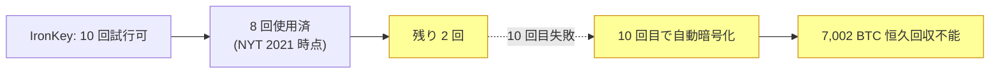

2011 年初頭、プログラマで IRC 文化に熱心だった **ステファン・トーマス** は、ビットコイン解説アニメ動画『What is Bitcoin?』を制作した報酬として、初期ビットコイン利用者からおよそ 7,002 BTC を受け取った。そのウォレットの秘密鍵を、トーマスは **IronKey** 暗号化 USB ドライブに保管した。 IronKey は法人向けの高保証鍵保管デバイスで、 **パスワードを連続 10 回間違えるとデバイス内蔵のコントローラが保護領域を自動消去する** 性質を持つ。一度消去されれば、中身は暗号学的に取り戻せない。

トーマスは IronKey のマスターパスワードを紙に書き留めた。その紙を、後年なくした。

**2021 年 NYT による公表。** 2021 年 1 月 12 日、ニューヨーク・タイムズの記者ナサニエル・ポッパーが「失われたパスワードが何百万人ものビットコイン資産家を締め出している」と題する記事でトーマスの状況を取り上げた。その時点でトーマスは **10 回の試行のうち 8 回を使い切っていた**。残り 2 回。当時の BTC 価格は 3 万 3,000 ドル前後で、ロックされた資産の時価はおよそ 2 億 2,000 万ドル超。その後の BTC 高騰でこの数字は数億ドル、時期によっては 7 億ドル超にまで膨らんだ。

**トーマス本人の職業上の立場。** ロックアウト期間を通じて、トーマスは暗号通貨エンジニアリングの世界で第一線に立ち続けている。[リップル・ラボ](/BitcoinArchive/ja/entries/currency/2026-07-27-xrp-currency-overview/)の初期エンジニアとして 2018 年まで CTO を務め、後にマイクロペイメント / ウェブ収益化のスタートアップ Coil を創業した。 IronKey の件が彼のキャリアを傷つけたわけではない。本人の語り口でも、これは金銭的危機ではなく個人的な人生上の出来事として位置づけられている。

**復旧の公開提案。** 2023 年後半、サイバーセキュリティ企業の Unciphered がトーマスの IronKey と同系列モデルを解読する手法を編み出したと公表し、復旧を公的に提案した。トーマスはこの提案を公に断り、先行する 2 つの復旧チームと既に契約上の取り決めがあり、一存で 3 つ目を割り込ませられない、と説明した。 2026 年中盤の時点でも、デバイスはロックされたまま、復旧成功を伝える公開報告はない。トーマス本人は IronKey を「安全な場所」に保管し、これ以上パスワードを試みないと明言している。

**この話が語り継がれる理由。** トーマスの件は、 **ビットコインの不可逆性** を具体的に示す事例として頻繁に引用される。復旧代理人もいない、サポートによるリセットもない、秘密鍵が失われた UTXO を動かせる裁判所命令も存在しない。 IronKey の側は「保護対象を、正規所有者であっても明け渡さない」という法人向けセキュリティ設計をそのまま実行しているにすぎず、ビットコインのプロトコルも「未使用出力は秘密鍵にだけ不変に縛られる」というサトシの設計をそのまま実行しているにすぎない。結果として、きちんと働いた工学的システムが、およそ 7,002 BTC を恒久的に手の届かない場所へ置いたことになる。

この物語は[ジェームズ・ハウエルズが廃棄したハードディスク](/BitcoinArchive/ja/entries/aftermath/2024-12-03-james-howells-7500-btc-newport-landfill/)や[ジェラルド・コットンの死去に伴う QuadrigaCX 崩壊](/BitcoinArchive/ja/entries/aftermath/2019-04-08-quadrigacx-gerald-cotten-death/)とあわせて「失われたビットコイン」のまとめ記事で登場することが多い。ただし 3 件は機構的にまったく別物 (パスワード忘却 / 物理廃棄 / 取引所側の鍵管理崩壊)。 [失われたビットコイン横断ページ](/BitcoinArchive/ja/entries/analysis/2026-06-02-bitcoin-iconic-losses-overview/)は、この 3 件を他の記録済み損失事例と並べて、根底にある不可逆性の論点と一緒に整理している。
