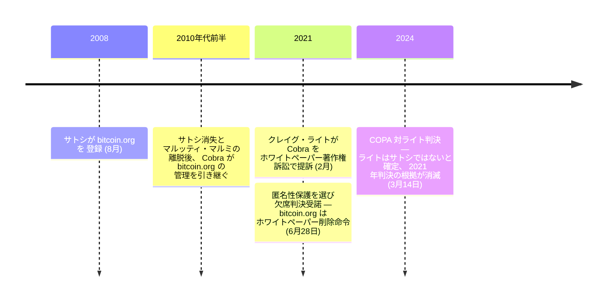

2021 年 6 月、bitcoin.org の匿名運営者は、本名を明かすよりも英国高等法院での敗訴を選んだ。[クレイグ・ライト](/BitcoinArchive/ja/participants/craig-wright/)がサイト上のビットコインホワイトペーパーを著作権侵害で[提訴](/BitcoinArchive/ja/entries/aftermath/2021-06-28-wright-v-cobra-whitepaper-lawsuit/)していた。裁判所はライト側の匿名提訴を認めたが、手続規則上、Cobra が防御するには身元を明かす必要があった。Cobra は欠席判決を選んだ。2 年半後の 2024 年 3 月 14 日、同じ裁判所が [COPA 対ライト裁判](/BitcoinArchive/ja/entries/aftermath/2024-03-14-copa-v-wright-ruling/)でライトはサトシではなく大規模な文書偽造を行ったと認定 —— 2021 年の欠席判決を遡及的に無意味にした。ビットコインホワイトペーパーは bitcoin.org で引き続き公開されている。

Cobra（Cøbra とも表記）は、2008 年 8 月に[サトシ・ナカモト](/BitcoinArchive/ja/participants/satoshi-nakamoto/)が登録したウェブサイトの管理者である。本名は不明。

### 役割
サトシの消失と[マルッティ・マルミ](/BitcoinArchive/ja/participants/martti-malmi/)の離脱後、Cobra は bitcoin.org の管理者となった——サイトの維持、ビットコインホワイトペーパーのホスティング、ビットコインの主要な公開窓口であるドメインの管理を行っている。この立場はビットコインプロトコルに対する公式な権限を持たないが、サトシのオリジナルウェブサイトの管理人として象徴的な意義を持つ。

### ライト対 Cobra 訴訟（2021年）
2021年2月、[クレイグ・ライト](/BitcoinArchive/ja/participants/craig-wright/)はビットコインホワイトペーパーの著作権を主張し、bitcoin.org からの削除を求めて [Cobra を提訴した](/BitcoinArchive/ja/entries/aftermath/2021-06-28-wright-v-cobra-whitepaper-lawsuit/)。ロンドン高等法院はライトが匿名で Cobra を提訴することを認めたが、手続き上のルールにより Cobra は身元を明かさずに自らを弁護することができなかった。

Cobra は不可能な選択を迫られた——身元を明かして匿名性を失うか、欠席判決を受け入れるか。2021年6月28日、彼は匿名性の保護を選び、裁判所はライトに有利な欠席判決を下した。bitcoin.org はホワイトペーパーの削除を命じられた。

### 名誉回復（2024年）
2024年3月14日、英国高等法院は [COPA 対ライト裁判](/BitcoinArchive/ja/entries/aftermath/2024-03-14-copa-v-wright-ruling/)で、クレイグ・ライトはサトシ・ナカモトではなく、大規模な証拠捏造を行ったと裁定した。この判決により、2021年の Cobra に対する欠席判決は無意味なものとなった——ライトにはホワイトペーパーに対する正当な著作権の主張がなかったのである。ビットコインホワイトペーパーは bitcoin.org および世界中の多数のウェブサイトで自由に閲覧可能である。
