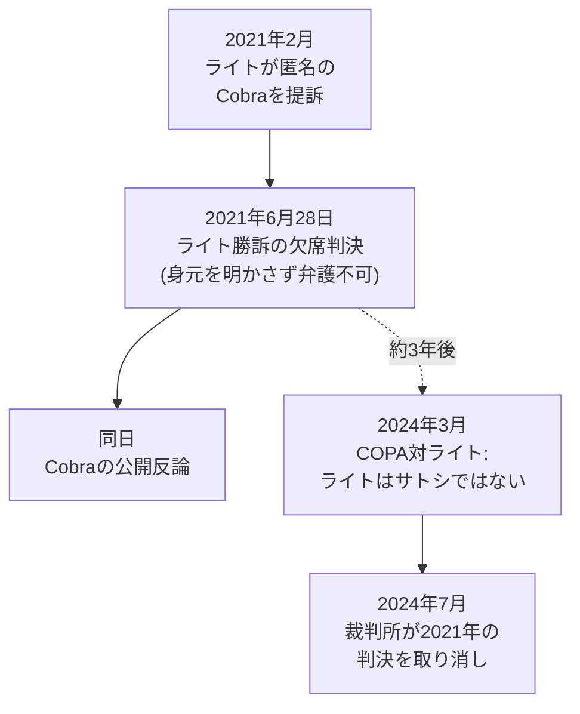

2021年2月、クレイグ・ライトは bitcoin.org の匿名運営者「Cobra」に対し、ビットコインホワイトペーパーの著作権侵害を主張する訴訟を起こした。

2021年6月28日、ロンドン高等法院はライト有利の欠席判決を下した。bitcoin.org はウェブサイトからビットコインホワイトペーパーを削除し、裁判所の判決に言及する通知を掲載するよう命じられた。

Cobra が敗訴したのは、主張に根拠があったからではない。身元を明かさずに自らを弁護できなかったからだ。裁判所はライトが Cobra を匿名のまま訴えることを認めたが、Cobra が匿名のまま弁護することは認めなかった。

Cobra は、身元を明かして匿名性を失うか、欠席判決を受け入れるかという不可能な選択を迫られた。

彼は匿名性を守ることを選んだ。

[Cobra は同日に公に反応し](/BitcoinArchive/ja/entries/aftermath/2021-06-28-cobra-response-to-whitepaper-ruling/)、暗号によって執行される規則は、法廷で相手より多く金を使える者が決める規則より優れていると論じた。

この判決は、2024 年 3 月の英国高等法院による COPA 対ライト判決で事実上無効となった。クレイグ・ライトはサトシ・ナカモトではなく、ビットコインホワイトペーパーの著作権を主張する根拠がないと判断された。ビットコインホワイトペーパーは世界中の多数のウェブサイトで引き続き自由に入手可能である。
