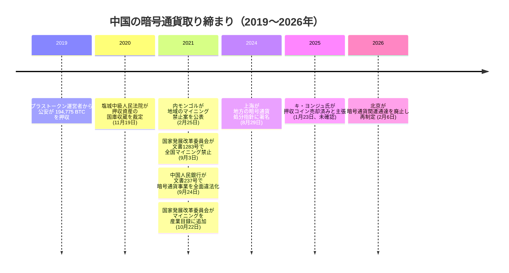

2021年9月3日、国家発展改革委員会を筆頭とする中国政府の十一機関が、文書 1283 号を発した。国内でのあらゆる新規ビットコインマイニング事業を禁止する通達だ。その二年前、中国の公安はすでに、史上最大級の暗号通貨詐欺事件の一つであるプラストークン詐欺の運営者から押収した 194,775 BTC を恒久的に国家管理下に置いていた。民間のマイニングを禁じることと、押収したコインを国家が保管し続けること。同じ政府が同時に取りうる二つの立場だった。

## 2021年の激化：内モンゴルの草案から全国禁止へ

先に動いたのは内モンゴルだった。2021年2月25日、内モンゴル自治区発展改革委員会がオンラインでドラフト規則を公表し、3月3日までパブリックコメントを募集した。命じたのは、区内の暗号通貨マイニング事業を「2021年4月末までにすべて一掃する」ことだった。

七カ月後、禁止は全国へ広がった。十一機関が連名で発した文書 1283 号は、新規マイニング事業を禁止し、既存事業には秩序だった退出を命じ、それでも続ける事業者には電力への懲罰的な加算料金を課し、銀行にはマイニング業界向け融資の回収を指示した。

<!-- audit:quote-skip -->
> 「新規の暗号通貨マイニング事業を厳禁する……既存事業については秩序だった退出を加速する……電力の加算料金基準は 1 キロワット時あたり 0.30元とする」

— 国家発展改革委員会ほか十一機関、文書 1283 号〔2021〕、2021年9月3日

その三週間後の 2021年9月24日、中国人民銀行は国家インターネット情報弁公室・最高人民法院・最高人民検察院・工業情報化部・公安部・国家市場監督管理総局・中国銀行保険監督管理委員会・中国証券監督管理委員会・国家外貨管理局の九機関と連名で文書 237 号を公表した。文書自体の日付は 9月15日、公表はその九日後だった。暗号通貨関連の主要な事業活動を違法な金融活動そのものと断定し、その分類をインターネット経由で中国国内居住者にサービスを提供する海外取引所にまで及ぼした。文書 1283 号だけでは届かなかった領域である。

手続き上の最後の一手は、2021年10月22日に打たれた。国家発展改革委員会は、その年唯一の見直しとなった産業構造調整指導目録の改訂で、暗号通貨マイニングを放棄すべき産業活動のブラックリストに加えると発表した。パブリックコメントの期限は 11月21日までだった。

## 押収コインの国家管理という、もう一つの姿勢

禁止が及んだのは民間のマイニングと民間の取引だった。国家がすでに保有していたコインには及ばなかった。2019年、中国の公安はプラストークン詐欺の運営者から、194,775 BTC のほか、833,083 ETH、140 万 LTC、2,760 万 EOS、74,167 DASH、4 億 8,700 万 XRP、60 億 DOGE、79,581 BCH、213,724 USDT を押収した。

2020年11月19日、江蘇省塩城中級人民法院はプラストークン事件の判決を下した。懲役二年から十一年の実刑、そして当時の価値で約 40 億ドル相当にのぼる押収資産の国庫没収である。

<!-- audit:quote-skip -->
> 「押収されたデジタル通貨は法律に従って処分し、その収益及び利得は国庫に没収する」

— 江蘇省塩城中級人民法院、2020年11月19日判決

その後に中国が公表してこなかったのは、これらのコインがその後動いたのか、動いたとすればどう動いたのかについての明快な説明である。代わりに公表されてきたのは、刑事事件を通じて国家の手に渡った暗号資産の処理手順を定めた、断片的な地方規則にとどまる。2022年4月の蘇州、2023年8月の山東、2023年12月の福建、そして 2024年8月29日の上海徐匯区検察院・公安局による共同指針がその例だ。民間の暗号通貨事業がすべて全国で違法のままである一方で、司法により押収された暗号資産を処分する仕組みだけは整備が進んだ。

2025年1月23日、CryptoQuant の CEO キ・ヨンジュは、プラストークンの保有分はすでにすべて売却済みだとの見方を公に示した。Huobi のような取引所を通じて段階的に処分されたとみられ、その額はおよそ 197 億ドルにのぼると述べた。

<!-- audit:quote-skip -->
> 「中国はすでに 194,000 BTC を売却済みだというのが私の見立てだ。［中略］中国共産党は『国庫に移管した』と述べただけで、売却したかどうかは明らかにしていない」

— キ・ヨンジュ、CryptoQuant CEO、2025年1月23日

中国当局はこの主張を肯定も否定もしていない。あくまでキ本人の見解であって、裏付けのある取引記録ではない。

文書 237 号から五年後、北京は同じ地面に戻ってきた。2026年2月6日、八つの中央機関が 2021年の通達を廃止したうえで再制定し、暗号通貨関連事業が違法であることを改めて確認するとともに、未承認の人民元連動ステーブルコインの海外発行と、実物資産のトークン化に新たな制限を加えた。同じ一手の中で廃止と再制定を行ったこの一件を、このアーカイブの[国家によるビットコイン政策の調査](/BitcoinArchive/ja/entries/analysis/2026-07-28-bitcoin-nation-state-policy-history/)は方針転換の枠外ではなく、その一件として数えている。

## ビットコインにとっての意義

文書 1283 号は、中国国内のマイニングリグを一台残らず止めることができた。だが国境の外側の同じ活動に届く条項は、そこには存在しなかった。このアーカイブの[中国 ICO 禁止のエントリー](/BitcoinArchive/ja/entries/aftermath/2017-09-04-china-ico-ban/)は、この限界を一度すでに記録している。取引所閉鎖命令が取引を止めたのではなく、他所へ移しただけだった、その時と同じ限界である。政府は自国の管轄内で活動を禁止できる。国境の外を走るプロトコルそのものを禁止することはできない。

押収コインは同じ台帳の反対側にある。ある資産の私的な保有を禁じながら、自らが作った金庫の中にその 194,775 単位を保管し続ける政府は、その資産を拒絶しているのではなく、誰にそれを保有させるかを選んでいるだけだ。このアーカイブの[ビットコイン最大保有者の一覧](/BitcoinArchive/ja/entries/analysis/2026-07-09-bitcoin-ownership-map/)は、同じ保有分をおよそ 194,000 BTC として記載し、保管・清算の状況を係争中と注記しているが、これはここで記録した不確実性と同一のものだ。ビットコインの台帳は、ある出力がポンジ詐欺のウォレットにあるのか、警察の証拠保管口座にあるのか、それとも普通の保有者の鍵にあるのかを気にしない。いずれ、公にその出力が再び動くかどうかを示すだけだ。法律は通貨を違法と宣言できる。だが、それを誰が保有しているかの記録を消すことはできない。
