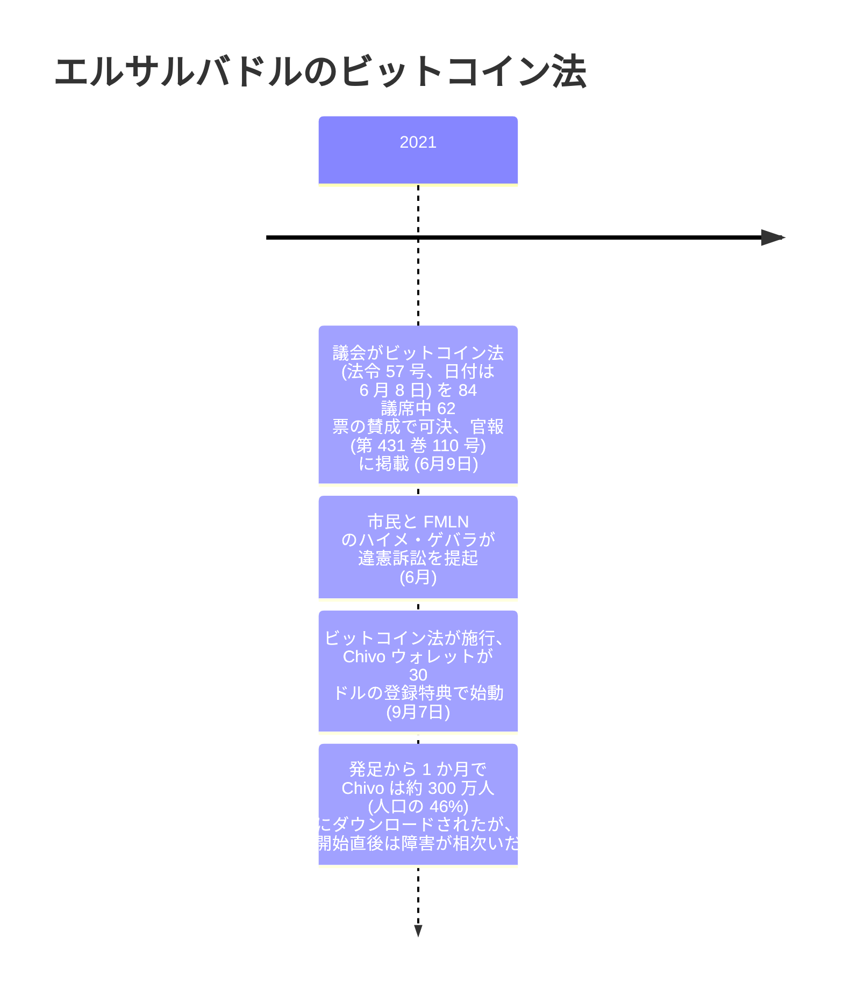

2021 年 9 月 7 日、ビットコインはエルサルバドルの法定通貨になった。市場に受け入れられたのではない。法律がそう定めたのだ。ビットコイン法第 7 条は受領を義務とした。この国のあらゆる経済主体は、客がビットコインでの支払いを申し出た瞬間から、それを受け取らなければならなくなった。こんな国はそれまで一つもなかった。のちに[国家によるビットコインの方針転換・押収・準備宣言のはるかに長い記録](/BitcoinArchive/ja/entries/analysis/2026-07-28-bitcoin-nation-state-policy-history/)となる系譜の中で、これが最初の一件である。

## 賛成 62 票、84 議席中で可決

ビットコイン法を推し進めたのは大統領ナジブ・ブケレだったが、票を投じたのは立法議会である。2021 年 6 月 9 日未明、議会は法令 57 号「ビットコイン法」（日付は 6 月 8 日）を、84 議席中 62 の賛成で可決した。同じ 6 月 9 日付の官報（第 431 巻 110 号）に法令が掲載された。

## 施行前から始まった異議

法がまだ効力を持つ前から、反対はすでに表に出ていた。2021 年 6 月、市民のグループが、政党ファラブンド・マルティ民族解放戦線（FMLN）所属の議員ハイメ・ゲバラと共同で、エルサルバドルの憲法法廷にビットコイン法への違憲訴訟を提起した。Cointelegraph はこの提訴をこう報じている。

<!-- audit:quote-skip -->
> 市民のグループが政党ファラブンド・マルティ民族解放戦線（FMLN）と共同で、ブケレ大統領のビットコイン導入政策を違憲だとする訴訟を提起した。

## 90 日後、世界初の日

法は自らの末尾に、施行までの秒読みを書き込んでいた。経過規定により、官報掲載から 90 日後に施行するという一文である。その期限が満了したのが 2021 年 9 月 7 日だった。CoinDesk はこの朝、こう報じた。

<!-- audit:quote-skip -->
> ビットコインは今、エルサルバドルで正式に法定通貨となった。同国議会がビットコイン法を可決してから 3 か月後のことだ。

## 法が定めたこと

| 条項 | 規定内容 |
|---|---|
| 第 1 条 | 法の目的を定め、ビットコインを「無制限の法定通貨」とし、いかなる取引においても無制限の弁済力を持つと規定する |
| 第 4 条 | 税の支払いをビットコインで行うことを認める |
| 第 5 条 | ビットコインの両替を、他の法定通貨と同様にキャピタルゲイン課税の対象外とする |
| 第 7 条 | 受領を義務化する。客からビットコインでの支払いを申し出られた場合、あらゆる経済主体はこれを受け取らなければならない |

法的な効力の大半を担っていたのは、第 1 条と第 7 条の 2 か条だった。

<!-- audit:quote-skip -->
> **第 1 条**：「本法の目的は、ビットコインを無制限の法定通貨として、いかなる取引においても無制限の弁済力を持つものと規定し、公私を問わずあらゆる自然人・法人が履行を求めるいかなる名目にもそれを適用することにある。」
>
> **第 7 条**：「財・サービスの提供を受ける者からビットコインでの支払いを申し出られた場合、あらゆる経済主体はこれを受領しなければならない。」

この受領義務は、2025 年 1 月までに法文から姿を消していた。1 月 30 日、立法議会は賛成 55、反対 2 でこれを削除している。

第 4 条と第 5 条は、同じ「対等」の原則の税制側を担っていた。ビットコインも、既存の法定通貨とまったく同じように課税され、同じように免除される。

<!-- audit:quote-skip -->
> **第 4 条**：「税の支払いはビットコインで行うことができる。」
>
> **第 5 条**：「ビットコインでの両替は、他の法定通貨と同様、キャピタルゲイン課税の対象としない。」

## Chivo：30 ドルの特典と波乱の船出

政府自身のウォレット Chivo は、法の施行と同じ日に始動した。登録したすべてのエルサルバドル人の新規口座に、政府自らが用意した普及への誘因として 30 ドル相当のビットコインが直接入金された。船出は穏やかではなかった。ビットコイン法についての Wikipedia の記述は、その後に起きたことをこう記している。

<!-- audit:quote-skip -->
> 政府は過負荷のため、ビットコインの電子ウォレット Chivo をオフラインにせざるを得なかった

それでも発足から 1 か月のうちに、Chivo は「人口の 46% に相当する」約 300 万人にダウンロードされていた。

## ビットコインにとっての意義

ビットコインの設計は、使われるためにどの機関の許可も必要としない。同時に、拒まれるためにも許可を必要としない。政府が一つのスイッチを倒せば使用を許可も禁止もできるような、そんな中央の仕組みは存在しないからだ。エルサルバドルのビットコイン法は、この前提の半分をひっくり返した。ビットコインを使うかどうかは、無許可のネットワーク設計が与える選択肢ではなくなり、法律による保証に変わったのだ。そして政府は、その保証を受け取る口座を開いた一人ひとりに 30 ドルを支払った。誰の手も借りずに済むよう作られたプロトコルは、使用を止められないものにする代わりに、不使用を違法にすることによって、結局は政府の手を借りることになった。
