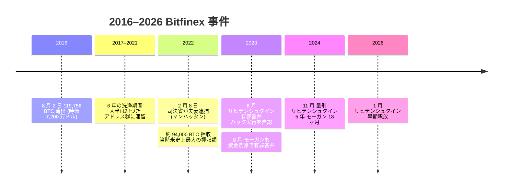

2016 年 8 月 2 日、香港拠点の暗号通貨取引所 **Bitfinex** のホットウォレットから 119,756 BTC が、 2,072 件の不正な取引で抜き取られた。盗まれた時点での時価は約 7,200 万ドル、後の逮捕時点では約 45 億ドルにまで値上がりしていた。流出資金は 6 年もの間、ハックに紐づく一群のアドレスにほぼそのまま留まっていた。ミキサーを経由してわずかに分散・現金化された分はあるが、大半はまったく動かないままだった。

**逮捕 (2022 年 2 月 8 日)。** 米司法省がマンハッタンで **イリヤ・リヒテンシュタイン** (1989 年生まれ) と妻の **ヘザー・R・モーガン** (1991 年生まれ) を逮捕した。連邦捜査官は同時に 94,000 BTC 前後 ― 当時の時価で約 36 億ドル ― の押収を発表した。当時としては、米国史上最大の押収額だった。起訴はコロンビア特別区連邦地裁で、罪状は盗難暗号通貨の洗浄共謀、および合衆国に対する詐欺共謀。ハックそのものの実行については、この時点では問われていない。

**ラズルカーンという表の顔。** モーガンは逮捕前から、ごく一部のネット利用者には **ラズルカーン (Razzlekhan)** という前衛ラッパー名で知られていた。その名が広まったのは、ロウアー・マンハッタン界隈で撮ったセルフプロデュースの音楽動画や、雑誌『Forbes』で連載していた起業・説得術コラムを通じてだった。逮捕の報に接した世間は、「ラズルカーン」と「45 億ドル規模の洗浄共謀」という落差をうまく飲み込めず、動画は急速に拡散した。『Forbes』はコラムを取り下げたが、動画自体は残り、起訴から数週間のうちに視聴数が数百万に達した。

**6 年がかりの細かな洗浄。** 公開された捜査資料からは、数年をかけて少しずつ手口を変えていく洗浄の様子が浮かび上がる ― プライバシー重視のサービスを経由するチェーン跨ぎ、架空の身分を使って取引所から少額ずつ引き出す手口、金貨の購入、ダークウェブ市場の口座を経由した送金など。ただし動かした量は盗難総額に比べれば控えめで、大部分は 2016 年 8 月のハックに紐づくアドレス群に置かれたままだった。一気に投げ売りせず、細く長く流し続けたこの慎重さがあったからこそ、当局が最後に回収できる余地が残った。

**有罪答弁と量刑。** 2023 年 8 月、リヒテンシュタインは資金洗浄共謀で有罪を認めるとともに、 **2016 年の Bitfinex ハックそのものを自分が実行した**と認めた。モーガンも資金洗浄と合衆国に対する詐欺共謀で有罪を認めた。量刑は 2024 年 11 月に下りる ― リヒテンシュタインに **連邦刑務所 5 年 (60 ヶ月)** および保護観察 3 年、モーガンに **18 ヶ月**および保護観察 3 年。リヒテンシュタインは First Step Act の適用により、 2026 年 1 月には早期釈放されたと報じられている。

**意味するもの。** Bitfinex 事件は、これまでの暗号通貨関連の法執行案件として最大規模の回収となり、取引所侵害の発覚から関係者逮捕までの間隔も、暗号通貨関連では最も長い部類に入る。オンチェーンのフォレンジクスに、取引所への召喚状・ダークウェブ口座の監視・マスターキーリストを保管したクラウドストレージへの捜索差し押さえといった従来型の金融捜査を組み合わせれば、数年がかりの資金洗浄もたどり直せる。一時は「回収不能」とみなされた資金が、最後には取り戻された。 Bitfinex 事件は、そのことを何より物語っている。 [失われたビットコイン横断総括](/BitcoinArchive/ja/entries/analysis/2026-06-02-bitcoin-iconic-losses-overview/)では、 2016 年 Bitfinex ハックを「不可逆性原則に対する例外的回収」の対照事例として位置付け、 Mt. Gox・QuadrigaCX・FTX、そしてパスワード忘却型・物理喪失型 (ステファン・トーマス、ハウエルズ) と並べて読む。

