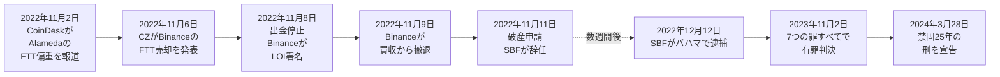

2022年11月11日、FTX Trading Ltd.は、Alameda Research および 130 以上の関連会社と共に、米国破産裁判所に連邦破産法第 11 章の適用を申請した。創業者サム・バンクマン＝フリード（SBF）は CEO を辞任した。

約 **80 億ドル** の顧客資金が流用されていた。連邦検察はこれを「アメリカ史上最大級の金融詐欺」と呼んだ。破産手続きを監督する新 CEO に任命された John J. Ray III は、これまで見た中で最悪のコーポレートガバナンスの失敗、それも Enron よりも酷いと表現した。

再びメディアは暗号通貨の死を宣告した。再びビットコインのプロトコルは影響を受けなかった。FTX は中央集権型の仲介者だった。ビットコインが排除するために設計された、まさにそのタイプの信頼される第三者である。この崩壊はビットコインの設計に組み込まれた原則を改めて強化した：「Don't trust, verify.」 [失われたビットコイン横断総括](/BitcoinArchive/ja/entries/analysis/2026-06-02-bitcoin-iconic-losses-overview/)では、 FTX を不正流用による保管崩壊事例として QuadrigaCX (単独保管者詐欺) や Mt. Gox (運用失敗 + 盗難) と並べて読み、パスワード忘却型・物理喪失型 (ステファン・トーマス、ハウエルズ) と対置する。

本 FTX 崩壊は[サトシ設計対現状分析](/BitcoinArchive/ja/entries/analysis/2026-05-24-satoshi-design-vs-current-reality/)によって、中核的な保管軸の例として扱われる。同分析は FTX を [Mt. Gox 倒産](/BitcoinArchive/ja/entries/aftermath/2014-02-28-mt-gox-bankruptcy/)と並べて、プロトコルが防ぐよう設計された銀行型破綻モードの代表例として用いる。影響を受けた利用者はいかなるコインに対するプロトコル層の請求権も持たず、倒産企業に対する契約上の請求権しか持たなかった。
