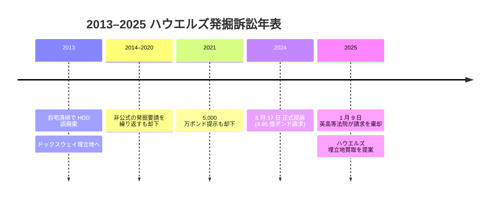

2013 年半ば、英ウェールズ・ニューポート在住の IT 技術者 **ジェームズ・ハウエルズ** は、ビットコイン最初期に採掘して得たおよそ 7,500 BTC の秘密鍵を、デルのノート PC の HDD 1 台に保管していた。 2013 年の自宅清掃中、ハウエルズはその HDD を誤って廃棄してしまう。 HDD は一般廃棄物として回収され、ニューポート市議会が運営する街東端の **ドックスウェイ埋立地** に運び込まれた。

数週間後、ハウエルズは紛失に気付く。市議会に連絡を取った時点で、 HDD は数ヶ月分の後続廃棄物の下に深く埋まっていた。発掘作業なしには取り戻せない。ハウエルズの発掘要請は却下された。以後 12 年にわたり、形を変えながら毎年のように要請を続け、そのたびに却下されてきた。

**段階的に上がる提示条件。** 12 年の間にハウエルズが市議会に提示した補償条件はじわじわ上がっていった。報じられている提示には、回収できた場合のコインの一定割合、発掘許可と引き換えの 5,000 万ポンド (2021 年)、自費で専門業者を雇って実施、そして 2025 年には**埋立地そのものを買い取る**案まで含まれる。市議会は毎回、同じ理由で拒否してきた。発掘は埋立地の環境許可条件に違反する、市の廃棄物処理運用への影響が大きすぎる、そして仮に HDD が見つかっても、使える状態で読み出せる保証はない、というものだ。

**2024-2025 年の訴訟。** 2024 年 5 月、ハウエルズはニューポート市議会を相手取って正式に提訴した。求めたのは発掘許可、もしくはそれが認められない場合 **4 億 9,500 万ポンド**の損害賠償。提訴時点の BTC 価格で、 HDD 内のコインの時価はおよそ **6 億ポンド** (約 7 億 6,000 万ドル)。 **2025 年 1 月 9 日**、英高等法院 (カーディフ支部) は、アンドリュー・カイザー地区判事のもとで本件の審理開始を拒否した。「請求は現実的な勝訴見込みがない」との判断。裁判所は、埋立地の環境許可と運用上の現実を踏まえれば発掘は成立しないとする市議会の立場を支持した。

**継続される追跡。** ハウエルズは引き続き本件を諦めない方針を公言しており、現在の運用が数年内に終了する予定の埋立地そのものを取得する方向も視野に入れている。 BTC 価格が大きく動くたびに英国・国際メディアが再訪する事案で、 HDD 内残高の額面が価格に直結して上下することが繰り返し報道されている。

**「失われたビットコイン」史における位置。** ハウエルズ事案は、ビットコイン破壊の **物理喪失型** の代表例である。 [ステファン・トーマスの IronKey ロックアウト](/BitcoinArchive/ja/entries/aftermath/2021-01-12-stefan-thomas-7002-btc-ironkey-lockout/)のようなパスワード忘却型とも、 [QuadrigaCX における CEO 死去に伴う鍵喪失](/BitcoinArchive/ja/entries/aftermath/2019-04-08-quadrigacx-gerald-cotten-death/)のような保管崩壊型とも別物。秘密鍵は存在している (ウェールズの圧縮廃棄物 50 万トンのどこかに)、ただ運用上アクセスできない。ビットコイン側から見れば破壊されたわけではなく、単に動かない UTXO であり、他の長期休眠 UTXO と区別がつかない。 [失われたビットコイン横断ページ](/BitcoinArchive/ja/entries/analysis/2026-06-02-bitcoin-iconic-losses-overview/)では、本件を他の記録済み損失事例とあわせて、根底にある不可逆性原理と一緒に整理している。
