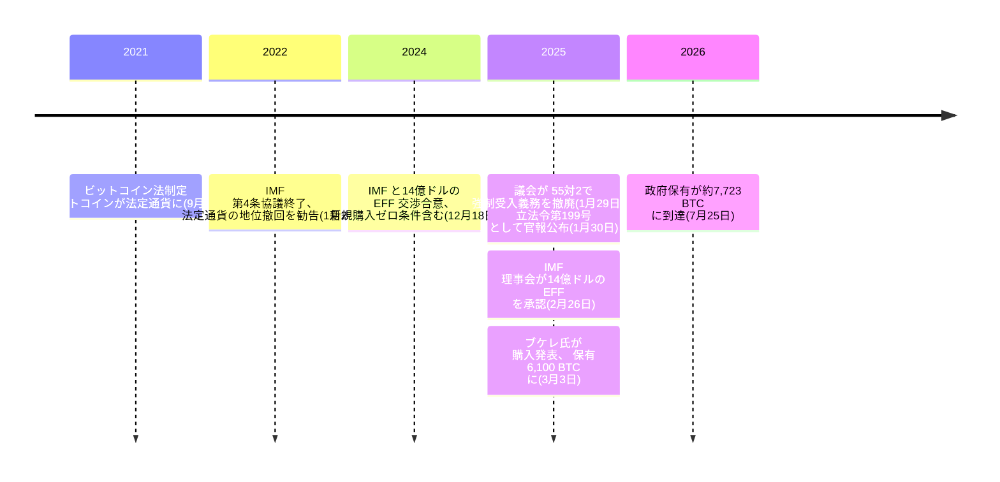

55 対 2――これが、2025年1月29日にエルサルバドル議会が[ビットコイン法](/BitcoinArchive/ja/entries/aftermath/2021-09-07-el-salvador-bitcoin-law/)から強制受け入れの条項を削り取った採決の票差である。IMF が 2022年以来求め続け、4 週間後に理事会が承認する 14 億ドル融資の前提条件でもあった。義務を手放したはずの政府は、同じ融資条件が公共部門の新規購入をゼロに据え置くビットコインを、そのまま買い増し続けていた――[およそ 30 の政府にわたるビットコイン政策転換をこのアーカイブが追う中の一件](/BitcoinArchive/ja/entries/analysis/2026-07-28-bitcoin-nation-state-policy-history/)である。

## 三年間放置された勧告

IMF の理事会は 2022年1月24日、エルサルバドルとの 2021年第 4 条協議を終了した。翌 25日に出されたプレスリリースは要求を明確に記していた。

<!-- audit:quote-skip -->
> 当局に対し、ビットコインの法定通貨としての地位を撤回することで、ビットコイン法の適用範囲を狭めるよう強く求めた。

理事会が挙げた理由は、金融の安定、消費者保護、金融の健全性、そして法が生む財政上の偶発債務へのリスクだった。エルサルバドルがこの勧告に動いたのは、それから 3年後、融資が現実の交渉として浮上してからだった。

## 14 億ドルの代償

2024年12月18日、IMF はエルサルバドルとの間で 14 億ドル・40 か月の拡大信用供与措置(EFF)についてスタッフレベルで合意したと発表した。合意文書自体が、何が引き換えになるかを明記していた。

<!-- audit:quote-skip -->
> 民間部門によるビットコインの受け入れは任意とし、公共部門のビットコイン関連活動への関与は限定する……政府による暗号資産ウォレット（Chivo）への関与は段階的に縮小する……税は米ドルでのみ支払うものとする。

条件の全体は Chivo ウォレットにとどまらなかった。公共部門による新規購入について「プログラム期間を通じて公共部門事業体による新規ビットコイン取得の上限をゼロとする」という継続的パフォーマンス基準が課され、「ビットコインに連動または建てされたあらゆる種類の債務・トークン化商品」の発行も禁じられた。

| EFF 条件(2024年12月) | 内容 |
|---|---|
| 民間部門の受け入れ | 義務から任意へ |
| Chivo ウォレット | 政府の関与を段階的に縮小、2025年7月までに公金投入を停止 |
| Fidebitcoin 信託 | 2025年7月までに清算 |
| 透明性 | 政府保有の全ウォレットアドレスを公表、Chivo ユーザー資金を分離 |
| 監査 | ビットコイン関連の公共部門事業体について監査済み財務諸表を提出 |
| 新規購入 | 継続的パフォーマンス基準として公共部門の新規購入上限をゼロに |
| 債務 | ビットコインに連動・建てされた債務やトークン化商品を禁止 |

## 改正が実際に変えたもの

議会は 2025年1月29日、55 対 2 の賛成多数で改正法を可決した。翌 1月30日付の官報に、立法令第 199 号として掲載された。Bloomberg Tax が伝えた官報の文言は次の通りだ。

<!-- audit:quote-skip -->
> いかなる価格もビットコインで表示することを認める……完全に民間の参加による自然人・法人にのみビットコインの受け入れを認める……中央準備銀行および金融システム監督庁に関連規則の発行を指示する……政府の国内外の金銭債務は、契約時の通貨で支払うことを義務づける。

同じ法令を扱った別の法律分析は、旧法の 3 つの条文が明確に削除されたと付け加える。

<!-- audit:quote-skip -->
> 第 4 条・第 8 条・第 9 条は廃止され、米ドルへの自動的・即時の交換手段の提供など、ビットコイン取引の仕組みを整備する国家の義務が取り除かれた。同様に、国家が税の支払いをビットコインで受け付けることも認められなくなった。

改正がビットコインの法定通貨としての地位そのものに触れたかどうかは、どの報道がその論点自体を扱っているかによる。融資条件を報じた Decrypt は、この変更を「公共部門・民間部門がビットコインでの取引を受け入れる義務の撤廃」とのみ表現し、受け入れが任意になったと述べるにとどまる――法定通貨という呼称そのものには触れていない。中米の法律解説メディアはその呼称の問題を直接扱い、ビットコインを法定通貨とする言及は削除され、その使用は任意となったと報じる。二つの報道を並べれば、実は対立していない――受け入れの義務は消え、その論点を扱った側の情報源によれば、ビットコインを法定通貨たらしめていた正式な呼称もまた消えている。

## 理事会の承認

2025年2月26日、IMF 理事会は新たな拡大信用供与措置を承認した。

<!-- audit:quote-skip -->
> 14 億米ドル相当の融資枠……SDR 8,616 万（約 1 億 1,300 万米ドル相当）の即時支払い……プログラム期間を通じて 35 億米ドルを超える総合的な資金パッケージ。

約 1 億 1,300 万ドルはただちに実行された。IMF は、この措置がプログラム期間を通じて他の多国間・二国間の資金源から 35 億ドルを超える資金パッケージを呼び込むと見込んでいると述べた――融資そのものよりはるかに大きい金額であり、公共部門の新規購入をゼロに据え置く条項を含め、政府が署名したばかりの条件を守り続けることが前提だった。

## それでも続いた購入

ナジブ・ブケレ大統領は、その上限をインクが乾かないうちに試した。

<!-- audit:quote-skip -->
> 3 月 3 日、ブケレは新たな購入を発表し、同国の保有総額は 6,100 BTC に達した。

試されたのは一度きりではない。2026年の前半から中盤にかけて、エルサルバドル政府は戦略的ビットコイン準備に 1日あたりおよそ 1 ビットコインを加え続けた。その間も、公共部門の新規購入に関する継続的パフォーマンス基準は正式には効力を保ったままだった。

<!-- audit:quote-skip -->
> 複雑なのは、プログラム開始以降もエルサルバドルの報告保有高が増加している点だ……IMF の説明では……この増加は……公共部門による市場での新規購入ではなく……複数の政府保有ウォレット間での BTC の集約を反映したものだという。

保有高の増加とゼロ購入の上限は、IMF 自身の説明によれば、「購入」と「集約」の区別で両立する――国がすでに保有していたコインを政府の別のウォレットへ移すことは、プログラムの定義上、新規の取得にはあたらないというものだ。2026年7月下旬までに、[アーカイブの保有マップ](/BitcoinArchive/ja/entries/analysis/2026-07-09-bitcoin-ownership-map/)が追う各国政府・企業・ETF の残高と並んで、エルサルバドルの準備高はそれでも増え続けていた。BitcoinTreasuries.net はその数字を直接示す。

<!-- audit:quote-skip -->
> エルサルバドルは ₿7,723 を保有……評価額はおよそ 4 億 9,320 万米ドル……ビットコインを保有する政府機関の中で 5 位にランクされている。

14 億ドルの融資を引き出した契約がゼロにとどめるはずだった残高で、世界の政府保有ビットコインの中で 5 位。

## ビットコインにとっての意義

議会は 2021 年、法律に「法定通貨」という言葉を書き込んだ。そして――その呼称の問題を直接扱った側の報道によれば――2025 年、法令によってその言葉を取り消した。どちらの報道も争わないのは残高そのものだ。IMF 自身の条件が公にさせたウォレットアドレスは、誰でも確認できる状態にある。台帳は融資契約を参照してから送金を記録するわけではない――エルサルバドルが 2021年の法律で法令によって解決しようとした、[使える通貨と保有される資産の間の設計上の緊張](/BitcoinArchive/ja/entries/analysis/2008-10-31-bitcoin-electronic-cash-vs-digital-gold/)は、3年と一度の法改正を経てもなお、誰も大きさを争わない準備高をめぐって争われ続けている。
