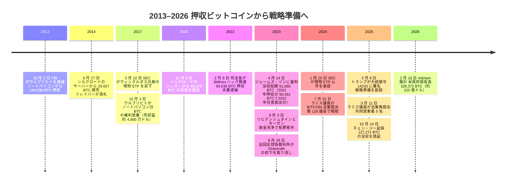

2025 年 3 月 6 日、ドナルド・トランプは大統領令 14233 に署名し、戦略ビットコイン準備を創設した — 米国政府が「売却しない」と初めて宣言したビットコイン保有である。その中身はすべて購入ではなく押収によって集まったものだ。10 年に及ぶ刑事・民事の没収の積み重ねを、この国はその大半の期間、蓄えるべき準備ではなく売り払う在庫として扱ってきた。

## 大統領令 14233

命令の中核となる一文は、その日まで政府の既定路線だった扱いを逆転させる。

<!-- audit:quote-skip -->
> 戦略ビットコイン準備に預託された政府保有 BTC は、売却してはならず、米国の準備資産として維持される……財務省が刑事・民事の資産没収手続きにより最終的に没収したすべての BTC を原資として資本化される……予算中立であり、米国の納税者に追加的な費用を課さない

各省庁の長には、政府が保有するあらゆるデジタル資産を 30 日以内に報告する義務が課された。同時に、準備が次に何を取り込みうるかにも厳格な線が引かれた。

<!-- audit:quote-skip -->
> 命令の日付から 30 日以内に、各省庁の長は財務長官および大統領デジタル資産市場ワーキンググループに対し、政府保有デジタル資産の全容を報告しなければならない……米国政府は、いずれかの省庁が科した刑事・民事の資産没収手続きまたは民事制裁金に関連する場合を除き、さらなる行政・立法上の措置なしに追加の備蓄資産を取得してはならない

財務省は納税者の資金でビットコインを買うことができず、ビットコイン以外のデジタル資産もいっさい取得できない — 没収・制裁金・議会の今後の立法の副産物としてでない限り。準備が増える経路は、それが築かれてきたのと同じ道筋、すなわち法執行に限られ、市場の買い注文では増えない。

## 10 年に及ぶ没収、蓄えではなく在庫として売られた歳月

命令が覆した慣行は、ロス・ウルブリヒトから始まっている。FBI 捜査官は 2013 年 10 月 1 日、サンフランシスコで彼を逮捕し、ノートパソコンから約 144,336 BTC を押収した — シルクロードの運営者が、マーケットプレイス自身の準備金を自らの端末に抱えていたのである。政府は押収したものを保持しなかった。2014 年 6 月 27 日、米連邦保安官局はシルクロードのサーバーから回収した 29,657 BTC を 10 ブロックに分けて競売にかけ、ベンチャーキャピタリストのティム・ドレイパーがおよそ 1,700 万〜1,800 万ドルでこれを落札した。ウルブリヒトは、自身のノートパソコンから見つかった別枠のビットコインに対する政府の権利主張を何年も争い続け、2017 年 10 月 3 日にその主張を放棄する書面に署名した。

<!-- audit:quote-skip -->
> ロス・ウルブリヒトの署名は……「同意し承諾する」という見出しの下に記されており……これにより連邦政府へおよそ 5,000 万ドル近くを実質的に譲り渡すことになった

大統領令 14233 が売却を禁じる 10 年前、没収されたシルクロードのビットコインが行き着く先は、売却だけだった。

シルクロード関連のビットコインは、その後もウルブリヒト以外の人物から押収されるかたちで再び姿を現したが、今度は政府はそれを売らなかった。2020 年 11 月 3 日、司法省は「個人 X」としか名指されていないシルクロードのハッカーから回収した 69,370 BTC — 当時の時価で 10 億ドル超 — の没収を申し立て、これを史上最大の暗号資産押収と呼んだ。2012 年、シルクロードの出金機構の欠陥を突く電信詐欺の手口で約 5 万 BTC を抜き取ったジェームズ・ゾンは、2023 年 4 月 14 日に禁錮 1 年 1 日の判決を受けた。2021 年 11 月 9 日の家宅捜索でジョージア州ゲインズビルの自宅からおよそ 50,491 BTC が押収され、2022 年に彼が任意で提出した分を合わせた政府の最終的な没収命令は 51,680.32473733 BTC に達した。個人 X とゾンは別々の事件で有罪となった別人であり、Arkham Intelligence は 2026 年に準備の中身を出所別に集計した際、両者の回収分をまとめて「シルクロード回収分」として約 94,679 BTC と示している――これは二つの事件それぞれの報告総額を単純に足し合わせた数より小さく、Arkham の追跡データ自体がその差を説明してはいない。いずれにせよ、ウルブリヒト自身の蓄え（ドルに戻された）とは違い、政府が手元に残したビットコインである。

## Bitfinex ハックと Prince Group の没収

[2016 年 Bitfinex ハック](/BitcoinArchive/ja/entries/aftermath/2022-02-08-bitfinex-hack-morgan-lichtenstein-arrest/)は、準備にとって次に大きな追加分をもたらした。2022 年 2 月 8 日、司法省はイリヤ・リヒテンシュタインとヘザー・モーガンを逮捕し、ハックに紐づく約 94,636 BTC を回収した。

<!-- audit:quote-skip -->
> Bitfinex から盗まれた 94,000 ビットコイン超を合法的に押収・回収した……同省始まって以来、最大の金融関連押収

リヒテンシュタインとモーガンは 2023 年 8 月、資金洗浄共謀で有罪を認めた — 2025 年 3 月の命令がこの資金に売却ではなく恒久的な居場所を与えるよりも十分前に、コインの法的地位はすでに定まっていたことになる。

単独最大の追加分は、準備が発足してから 7 か月後に生じた。2025 年 10 月 14 日、司法省はカンボジアの Prince Holding Group 創業者・会長のチェン・ジーを起訴したことを公表し、約 127,271 BTC に対する民事没収手続きを申し立てた。

<!-- audit:quote-skip -->
> 米司法省（DOJ）は、Prince Holding Group の創業者・会長であるカンボジア国籍のチェン・ジーを、電信詐欺共謀・資金洗浄共謀の容疑で起訴したことを公表した……ニューヨーク東部地区連邦検事局と司法省は、約 127,271 ビットコイン、およそ 150 億ドル相当の民事没収の申立てを行った — 司法省史上最大の没収手続きである

2025 年のこの一件だけで、Bitfinex ハックとシルクロード回収分のどちらよりも多くの没収ビットコインが生まれた — 大統領令 14233 の「売却しない」という規定が、準備の発足時にあった分だけでなく、その後に裁判所が送り込んでくるものにも変わらず適用され続けている証拠である。

## SEC の転換と頓挫した法案

この一連の出来事は、規制の真空地帯で起きたのではない。証券取引委員会（SEC）は 2017 年 3 月 10 日、ウィンクルボス兄弟の現物ビットコイン ETF を却下し、ビットコイン市場は詐欺や相場操縦への脆弱性が高すぎて ETF を支えられないと判断した。同種の申請の却下は、その後 6 年にわたって続いた。コロンビア特別区巡回区控訴裁判所が 2023 年 8 月 29 日、Grayscale の申請却下を取り消し、先物型と現物型のビットコインファンドを異なる扱いにしたことを恣意的かつ気まぐれと認定するまでのことである。2024 年 1 月 10 日、SEC は現物ビットコイン ETP 11 件を一斉に承認した。

<!-- audit:quote-skip -->
> 本日、委員会は複数の現物ビットコイン ETP 株式の上場・取引を承認した……我々はビットコインを承認または推奨したわけではない……委員会の立場はメリット中立である……2018 年のジェイ・クレイトン委員長時代に始まり 2023 年 3 月までの間、委員会は現物ビットコイン ETP に関する取引所規則申請を 20 件超却下してきた

6 年間で 20 件超を却下してきた機関が、たった 1 日で 11 件を承認した — その 1 年余り後に大統領令 14233 が政府自身のビットコインに対して行うことになる転換を、先取りする形で映し出している。

議会はより直接的な道を先に試み、それは頓挫した。シンシア・ラミス上院議員は 2024 年 7 月 31 日、財務省に 5 年間で最大 100 万 BTC を購入させる BITCOIN 法案を提出したが、第 118 議会ではシェロッド・ブラウン上院議員の反対に阻まれ前進しなかった。ラミスは 2025 年 3 月 11 日 — トランプの命令から 5 日後 — 共同提案者 5 名を伴って法案を再提出したが、いまだ成立していない。両者を並べると対照が際立つ。議会が通せなかった法案は、財務省に公開市場で 100 万ビットコインを買わせるものだった。トランプが署名した命令は、購入をいっさい指示していない — すでに没収によって生まれていたものを、売らないという約束だけである。

## 2026 年 2 月時点の準備

Arkham Intelligence は、2026 年 2 月中旬時点の米国政府のビットコイン保有高を出所別に次のように集計した。

| ビットコインの出所 | BTC（2026 年 2 月） |
|---|---|
| Prince Group（チェン・ジー事件） | 約 127,271 |
| Bitfinex ハック（リヒテンシュタイン・モーガン事件） | 約 94,643 |
| シルクロード回収分 | 約 94,679 |
| その他の司法省・国税庁案件 | 約 11,779 |
| **合計** | **約 328,372** |

<!-- audit:quote-skip -->
> 米国政府は 225 億ドル相当のビットコインを保有している……約 328,372 BTC……約 127,271 BTC は Prince Holding Group に紐づく……約 94,643 BTC は Bitfinex ハック事件から没収されたもの……94,679 BTC はシルクロード回収分に連なる……11,779 BTC は司法省・国税庁のさまざまな案件に由来する

この表のどの行も、財務省の買い注文ではなく、法執行の帰結である。最大の行である Prince Group は、命令が没収ビットコインの売却を禁じたその日には、政府保有分としてまだ存在していなかった。

## ビットコインにとっての意義

UTXO は、それを最後に保有していた手がマーケットメイカーのものだったか検察官のものだったかを記録しない。ビットコインの台帳は、押収されたコインも購入されたコインも、まったく同じように決済する。2025 年 3 月 6 日に変わったのはプロトコルではなく、自国の裁判所がすでに没収していたコインに対する政府の姿勢だった――[およそ 30 の政府にわたる転換・押収・準備宣言を追う、より広い調査](/BitcoinArchive/ja/entries/analysis/2026-07-28-bitcoin-nation-state-policy-history/)の一項目である。10 年もの間、没収されたビットコインはドルに戻すべき在庫として扱われてきた — 2014 年に競売にかけられた 29,657 BTC、2017 年までに約 4,800 万ドルで売られたウルブリヒトのノートパソコン分。大統領令 14233 は、その換金を止めた。そこに生まれた準備には、米国が自ら選んで買ったビットコインは一枚もない。シルクロードから Bitfinex、Prince Group に至るまで、収められているのはすべて、誰か他の者が先に失ったコインである。
