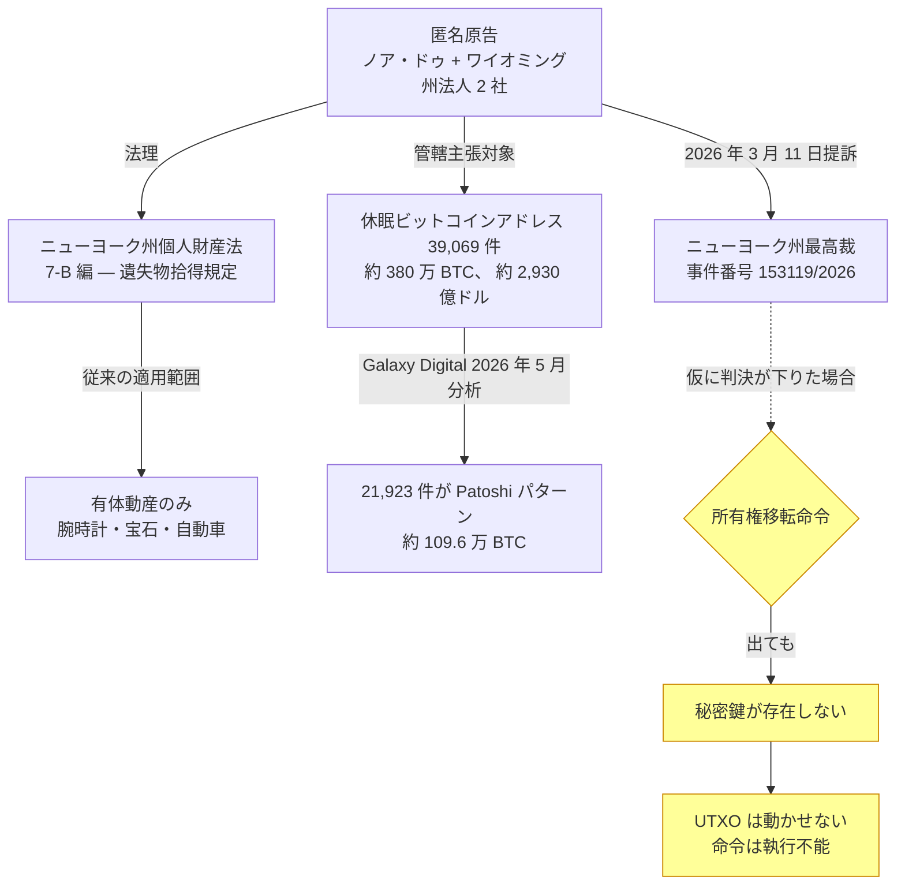

2026 年 3 月 11 日、「ノア・ドゥ」を名乗る匿名の原告と、ワイオミング州法人 2 社 (ABC Company・XYZ Company) が、ニューヨーク州最高裁判所に訴訟を起こした (事件番号 153119/2026)。被告は 39,069 件の休眠ビットコインアドレスそのもの。訴額はそこに眠る約 380 万 BTC ― 提訴時点で 2,930 億ドル相当 ― の所有権である。

代理人は Lewis & Lin LLC。訴訟の核は **ニューヨーク州個人財産法 7-B 編**、すなわち拾い物の所有権を扱う州の遺失物拾得規定にある。 7-B 編はこれまで腕時計・宝石・自動車といった有体物にしか使われてこなかったが、原告はこれを休眠ビットコインに広げる。論理はこうだ ― 動かない暗号通貨は法の定める「置き忘れ」または「放棄」された個人財産にあたり、ある未公表の方法でそれを「公然と保管してきた」拾得者は、裁判所の命令によって所有権の移転を受ける権利を持つ。

新規性は大きい。ニューヨーク州裁判所は 7-B 編を有体動産には適用してきたが、公開ブロックチェーン上のデジタル資産に当てはめた前例は一度もない。訴状はそこで初めて、法の言う「個人財産」が、制御鍵が失われ・忘れられ・破壊された UTXO の支配下にあるコインまで届くのか、という前例のない争点を提示する。

2026 年 5 月、 Galaxy Digital のリサーチ責任者アレックス・ソーンが、 [セルジオ・デミアン・ラーナーが特定した Patoshi ナンス指紋](/BitcoinArchive/ja/entries/aftermath/2013-04-17-sergio-lerner-patoshi-analysis/)を物差しに、被告 39,069 アドレスを分類した。 2016 年の Bitfinex ハック関連や既知の取引所ウォレットを除外したうえで、 **被告の 56% にあたる 21,923 件が Patoshi の特徴を備える**と判定 ― およそ 109.6 万 BTC。ラーナーが従来から提示してきた「約 110 万 BTC を単独の初期マイナー (サトシ・ナカモト本人と広く理解されている人物) が掘った」という推定とちょうど噛み合う数字だ。この同じ Patoshi パターン残高が、フィニー家にもサッサマン家にも渡っていないという事実は、共作説への反証として[『Finding Satoshi』](/BitcoinArchive/ja/entries/aftermath/2026-04-22-finding-satoshi-finney-sassaman-documentary/)でも取り上げられている。

残る 17,146 件は他の初期マイナーのものか、分類不能。いずれの被告アドレスも、訴状が定める休眠期間が始まって以降、一度もコインを動かしていない。

裁判は係争中。アドレスそのものを被告に据えるという形式は、そもそも応答不能の相手をどう扱うかから問題になる。原告がどう当事者適格を示し、不明な保有者にどう書類を届け、判決が出たとしてどう執行するのか ― 手続きの一段一段が前例のない論点だ。ビットコイン側の反応は冷ややかで、批判の多くは同じ点を突く。元の保有者が暗号学的な支配を手放したわけではないコインを、州裁判所に「拾った者勝ち」と宣言させる訴訟であり、仮に移転命令が出ても秘密鍵がなければ動かしようがない、と。

それでも本件は、米国の裁判所が初めて、遺失物拾得法理を UTXO 集合に届かせ得るかを試す場になる。原告が勝てば ― 一部勝訴であっても ― その判決はサトシ時代の備蓄を含む、すべての長期休眠ビットコインに及ぶ先例を残すことになる。
