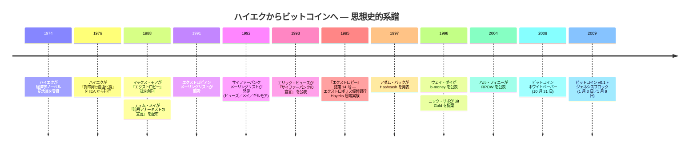

<!-- audit:quote-skip -->
> 「貨幣を発行する政府の独占が現在の地位にあることに、 歴史的な正当化はない。 政府が誰よりも良い貨幣を提供するという根拠で提唱されたことは一度もない。 貨幣発行の特権が王権として初めて明示的に語られて以来、 それは常に、 貨幣発行の権限が政府の財政に不可欠であるという理由で擁護されてきたのである」
>
> ― F. A. ハイエク 『貨幣発行自由化論』 (1976 年)、 第 III 節

ビットコインの 2009 年公開は、 ただひとつの直近原因 ― 2008 年 9 月の金融危機と[ジェネシスブロック](/BitcoinArchive/ja/entries/aftermath/2009-01-03-genesis-block/)に埋め込まれた『タイムズ』 紙の「銀行救済第二弾の瀬戸際にある財務大臣」 という見出し ― と並べて読まれることが多い。 この読解は直近の象徴は捉えているが、 ビットコインが置かれていたより長い思想史的射程は捉えていない。 別の知的系譜 ― フリードリヒ・ハイエクの 1976 年『貨幣発行自由化論』、 ハイエクの競合通貨論を生かし続けた 1990 年代のエクストロピアンおよびサイファーパンクの人脈、 そして 2009 年のビットコインによる実現 ― は危機より 30 年以上先行しており、 独立した複数の二次資料に記録されている。

本エントリーはその系譜を慎重に辿る。 **思想史的伝播**（二次文献で十分に支持されている）と、 **個人から個人への直接影響**（一次資料の制約は格段に強い）を区別する。 姉妹エントリー[サトシ・ナカモトはサイファーパンクではなかった](/BitcoinArchive/ja/entries/analysis/2008-10-31-cypherpunk-independent-arrival/)はサトシの知的立ち位置をサイファーパンク経路に対して扱う。 本エントリーは、 その経路よりも一段早くに位置する「ハイエクからエクストロピアンへ」 の脚を補う。

## 1. ハイエク 1976 年 ― 競合通貨論

フリードリヒ・アウグスト・フォン・ハイエクは『貨幣発行自由化論 ― 競合通貨の理論と実践の分析』 を 1976 年 10 月 25 日にロンドンの経済問題研究所 (IEA) から刊行した。 その 2 年前 (1974 年) には経済学のノーベル記念賞を受賞している。 本書は 3 版 (1976 年、 1978 年、 1990 年) を重ね、 現在も流通している。 [Satoshi Nakamoto Institute は本書全文を常設の参考資料として掲載している](https://nakamotoinstitute.org/library/denationalisation/)。

### 1.1 中心的な主張

ハイエクの主張は、 本書全体にまたがる相互に連関する 5 つの命題に集約できる：

| # | ハイエクの主張 | 提案される機構 |
|---|---|---|
| 1 | 政府による貨幣発行独占には貨幣の質という観点からは歴史的な正当化がない | 競合する民間発行体に通貨発行を開放する |
| 2 | 利用者を奪い合う民間発行体は、 利用者の選択により購買力の保持を強いられる | 利用者は最も価値が保たれる通貨を保有し、 質の低い発行体は利用者を失う |
| 3 | インフレは独占的な貨幣発行が生む人工物であり、 貨幣経済そのものに内在する性質ではない | 競合発行はインフレを起こす政治的誘因を取り除く |
| 4 | 通貨の安定は単一の国家単位を必要としない。 複数の通貨が並行して流通しうる | 国内・国境を越えて並行通貨が共存する |
| 5 | 会計単位は発行単位と一致する必要がない | 利用者は実際の決済に使う通貨と独立に、 安定したバスケットで口座を管理しうる |

この 5 つの主張は、 2024 年の『Modern American History』 査読論文が「脱国営化」 命題と呼ぶもの ― 貨幣は他の財と同じ生産物であり、 その生産における国家独占は必然ではなく偶発的である ― を構成する。

### 1.2 本書が扱っていないこと

本書はデジタルキャッシュより 10 年以上先行している。 以下は本書では扱われていない：

- 暗号学的決済。
- ネットワーク上での貨幣状態の伝播。
- アルゴリズム的な供給スケジュール（ハイエクの想定する競合発行体は通常の銀行業判断で各自の供給政策を決める）。
- 仮名での保有。

一方で本書に含まれているのは、 非国家的な貨幣発行の規範的根拠 ― 政治的論証が技術的手段に追いつくのを待っていた、 その骨格 ― であり、 後年のデジタルキャッシュ設計者が直接に踏襲することになる。

## 2. 1990 年代の中継 ― エクストロピアンと「Hayeks」 の思考実験

### 2.1 エクストロピアンの環境

エクストロピアン運動はマックス・モアの『エクストロピー』 誌（1988 年創刊）とエクストロピアンメーリングリスト（1991 年開設）のまわりに形成された。 1992 年に立ち上がるサイファーパンク運動と相当の重なりを持つが、 制度的には別物だった（詳しくは[サトシ・ナカモトはサイファーパンクではなかった](/BitcoinArchive/ja/entries/analysis/2008-10-31-cypherpunk-independent-arrival/) §1.1 を参照）。 サイファーパンクが暗号学的プライバシーと「コードを書く」 ことを核としたのに対し、 エクストロピアンはハイエクを基礎経済学的参照として明示的に掲げる、 より広範なトランスヒューマニズムとリバタリアニズムの計画を核とした。

[ハル・フィニー](/BitcoinArchive/ja/participants/hal-finney/) ― 後にビットコインネットワーク上でサトシ以外の最初のノード運営者となり、 [最初のビットコイントランザクション](/BitcoinArchive/ja/entries/aftermath/2009-01-12-first-bitcoin-transaction/)を受け取った人物 ― は、 この期間にエクストロピアンメーリングリストの活発な参加者だった。 これは、 エクストロピアンの環境とその後のビットコインネットワークの間で一次資料により裏付けられている、 数少ない個人レベルの接続のひとつである（この接続が何を支えるかの境界は §4 で扱う）。

### 2.2 「Hayeks」 思考実験 (『エクストロピー』 誌、 1995 年)

『エクストロピー』 誌第 14 号（1995 年）において、 マックス・モアとエクストロピアン共同体は「エクストロポリス仮想銀行」 がハイエクの名を冠した民間デジタル通貨 ― 単位は「Hayeks」、 ハイエクの肖像入り ― を発行するという思考実験を共有した。 これは稼働するシステムではなく、 公表上それまで結合されていなかった 2 つの観念を明示的に接続する試みだった：

1. ハイエクの 1976 年競合通貨論（民間発行の規範的根拠）。
2. ほどなく [Hashcash (1997 年)](/BitcoinArchive/ja/entries/aftermath/1997-03-28-adam-back-hashcash-announcement/)、 [`b-money` (1998 年)](/BitcoinArchive/ja/entries/aftermath/1998-11-26-wei-dai-pipenet-b-money-announcement/)、 Bit Gold、 `RPOW` を生むことになるサイファーパンク隣接のデジタルキャッシュ議論。

2024 年の『Modern American History』 査読論文、 2024 年の Reason 誌回顧、 そして Bitcoin Magazine の文化史記事は、 ハイエクの枠組みがデジタルキャッシュ設計空間と明示的に結合された最初期の公表事例が、 このエクストロピアンによる「Hayeks」 の議論であることを独立に確認している。 先行するデジタルキャッシュ研究（チャウムの `DigiCash`、 1980 年代後半の電子マネー方式）はハイエク的枠組みを前景化していなかったし、 先行するハイエク研究はデジタルキャッシュ設計空間に踏み込んでいなかった。

## 3. ビットコインへの思想史的系譜

### 3.1 時系列

ハイエクの本書からビットコインの公開までの知的連鎖は 33 年、 3 つの環境にまたがる。 一次資料または査読二次資料に記録された出来事：

### 3.2 ビットコインがハイエク命題から実現したもの

ビットコインの設計判断は、 ハイエクの 5 つの主張 (§1.1) に対して一様ではないかたちで対応する ― 直接実現されたもの、 別の機構に置き換えられたもの、 含まれていないものが混在する。 この対応は後付けで組み立てられたものではなく、 ビットコイン自身の設計文書のなかに見える。

| ハイエク 1976 の主張 | ビットコイン 2009 の実現 | 適合度 |
|---|---|---|
| ❶ 国家発行独占は必然ではなく偶発的 | 発行はネットワークによりプルーフ・オブ・ワーク採掘で行われ、 国家発行体は存在しない | **直接** |
| ❷ 発行体間の競争が価値を保つ | ビットコインは「競合する民間発行体のひとつ」 ではなく、 単一のアルゴリズム的発行体である。 競争は暗号通貨間で起き、 ビットコイン内では起きない | **置換** ― ハイエクの機構（発行体間の競争）はアルゴリズム的なコミットメントに置き換えられている |
| ❸ インフレは独占的発行の人工物 | ビットコインの貨幣政策は半減期スケジュールと 2,100 万枚上限の固定であり、 インフレを起こす政治的誘因を取り除く ([固定供給と調整可能貨幣の対比分析](/BitcoinArchive/ja/entries/analysis/2008-10-31-fixed-supply-vs-adjustable-money/)を参照) | 政策効果は**直接**、 機構は**別系統** |
| ❹ 並行通貨は国内・国境を越えて共存しうる | ビットコインは国家の協力なしに国境を越える P2P ネットワークとして稼働する | **直接** |
| ❺ 会計単位は発行単位と一致する必要がない | ビットコイン保有者は法定通貨や安定したバスケットで口座を管理しつつ、 BTC で取引することが日常的に行われる | 実践として**直接**、 プロトコルで強制はされない |

最も直接的に実現されているのは、 国家発行独占の否定 (❶) と国境横断の並行運用 (❹) である。 競争 (❷) の置換が最も特徴的な分岐である ― ハイエクは競合する**民間銀行**を想定したが、 ビットコインは銀行業判断をアルゴリズム的コミットメントに置き換えた。 姉妹エントリー[固定供給と調整可能貨幣の対比](/BitcoinArchive/ja/entries/analysis/2008-10-31-fixed-supply-vs-adjustable-money/)はこの分岐を詳しく扱う。 [ウェイ・ダイの `b-money`](/BitcoinArchive/ja/entries/aftermath/1998-11-26-wei-dai-pipenet-b-money-announcement/) や[アダム・バックの 1998 年 `b-money` 批評](/BitcoinArchive/ja/entries/aftermath/1998-12-06-adam-back-b-money-monetary-critique/)は、 より直接にハイエク的な（供給を調整しうる）別案を既に探索していたが、 ビットコインはそちらを採らなかった。

### 3.3 ジェネシスブロックの見出しを長い視野で読み直す

[ビットコインのジェネシスブロック](/BitcoinArchive/ja/entries/aftermath/2009-01-03-genesis-block/)に有名なコインベースメッセージ ― *「タイムズ、 2009 年 1 月 3 日、 銀行救済第二弾の瀬戸際にある財務大臣」* ― は、 2008 年危機に特化した抗議として読まれることが多い。 ハイエク的系譜の上で読むなら、 これはより古い議論の継続でもある ― 国家による貨幣仲介が、 ハイエクが 1976 年の本書で発行独占の必然的帰結として既に名指していた銀行救済を生む。 2008 年の見出しは議論を直近で具体的なものにしたが、 議論そのものを発明したわけではない。

## 4. 直接影響と思想史的系譜の区別 ― 証拠はどちらを支えるか

知的系譜を辿るときの誘惑は、 「思想史的伝播」 を「個人レベルの影響」 に短絡させることである。 一次資料の記録はこの系譜を 2 つの主張に区別する。 証拠が強く支えるのはそのうち一方だけである。

| 主張 | 証拠の状態 | 注記 |
|---|---|---|
| ハイエク (1976 年) からエクストロピアン／サイファーパンクのリバタリアニズムを通じてビットコイン設計に至る**思想史的系譜**は存在し、 複数の独立した二次資料に記録されている | **十分に支持** | 査読論文『Modern American History』 (2024)、 Reason (2024)、 Bitcoin Magazine の文化史記事、 ハイエク本書全文を常設掲載するという Satoshi Nakamoto Institute の編集判断 |
| **個別のビットコイン初期貢献者がエクストロピアンメーリングリストに参加していた** | **部分的に支持** | [ハル・フィニー](/BitcoinArchive/ja/participants/hal-finney/) ― 該当時期のエクストロピアンメーリングリスト参加は確認されている |
| **ほぼすべての初期ビットコイン貢献者がエクストロピアンだった** | **支持されない** | この強度の主張は一部の二次論説で提示されてきたが、 一次資料の記録はそれを確立しない。 [サトシ自身の発言](/BitcoinArchive/ja/entries/aftermath/2008-08-21-satoshi-to-adam-back-b-money/)は彼を可視のサイファーパンク共同体の外側に置く ([サトシ・ナカモトはサイファーパンクではなかった分析](/BitcoinArchive/ja/entries/analysis/2008-10-31-cypherpunk-independent-arrival/))。 [ウェイ・ダイ](/BitcoinArchive/ja/participants/wei-dai/)、 [アダム・バック](/BitcoinArchive/ja/participants/adam-back/)、 [ニック・サボ](/BitcoinArchive/ja/participants/nick-szabo/)について類似のエクストロピアン参加主張は本アーカイブの一次資料では支持されない |
| **サトシはビットコイン開発期にハイエクの本書を個人的に読んでいた** | **未決** | 公的記録にはサトシのハイエクに関する発言はどちらの方向にも存在しない。 サトシの設計はハイエク命題の要素を実現しているが、 本書を引用していない |

この区別が重要なのは、 強い個人参加主張こそが、 ハイエク－エクストロピアン－ビットコインの系譜が大衆向けの解説で最もよく流通する形態だからである。 査読資料と一次資料が支えるのはより弱い「思想史的系譜」 の主張であり、 強い「個人参加」 の主張までは支えない。

## 5. 限界と反対の読み

- **本系譜はビットコインの思想史的位置づけのなかでありうる複数の枠組みのひとつに過ぎない**。 隣接する枠組みには、 より広範なオーストリア学派の貨幣経済学 (ミーゼス、 ロスバード)、 モンペルラン協会の人脈、 フリードマンの『貨幣安定の計画』、 そしてサイファーパンクの技術・政治的伝統がある。 ハイエク固有の経路はより大きなリバタリアン貨幣思想の環境のなかの一本の糸であり、 唯一でも支配的でもない。
- **エクストロピアンの「Hayeks」 は思考実験であって稼働するシステムではない**。 これはハイエクの枠組みが 1995 年までにデジタルキャッシュ議論に入っていたことを記録するが、 エクストロピアン共同体そのものが稼働実装を生んだことを示すわけではない。 続く実装作業 (Hashcash、 `b-money`、 Bit Gold、 `RPOW`、 ビットコイン) は、 重なる隣接の共同体で行われた。
- **「2008 年危機がビットコインを生んだ」 という読みは反証されるのではなく文脈化される**。 サトシ自身の[同時代の発言](/BitcoinArchive/ja/entries/aftermath/2008-08-20-satoshi-to-adam-back/)はビットコイン開発の開始を 2007 年中ごろ ― 2008 年 9 月のリーマン破綻より前、 しかし展開中の 2007 年サブプライム危機の最中 ― に置く。 危機の影響は実在する。 ハイエク的系譜はそれを置き換えるのではなく、 深さを与える。
- **本エントリーから身元の主張は導かれない**。 [サイファーパンク独立到達分析](/BitcoinArchive/ja/entries/analysis/2008-10-31-cypherpunk-independent-arrival/)と同様、 思想的立場とビットコイン設計の構造的対応関係は、 サトシの身元を国・職業・特定個人のいずれにも絞り込まない。

## 6. まとめ

- ハイエクの 1976 年『貨幣発行自由化論』 は、 国家による貨幣発行独占に対する持続的な反論と、 競合する民間通貨への支持を、 デジタルキャッシュ設計空間に長く先行する根拠の上に組み立てる。
- 1990 年代のエクストロピアンの環境 ― とりわけ 1995 年『エクストロピー』 誌の「エクストロポリス仮想銀行」 ／「Hayeks」 思考実験 ― は、 ハイエクの枠組みがデジタルキャッシュ議論に明示的に接合された最初期の公表事例である。
- ビットコインの 2009 年設計は、 国家発行独占の否定 (ハイエク ❶) と国境横断の並行運用 (ハイエク ❹) を直接実現する。 ハイエクの発行体間競争 (❷) はアルゴリズム的コミットメントに置き換える。
- ハイエクからエクストロピアン／サイファーパンクの経路を通じてビットコインに至る思想史的系譜は、 査読資料と独立した二次資料に記録されている。 ビットコイン初期貢献者がエクストロピアン人脈の構成員だったというより強い主張は、 [ハル・フィニー](/BitcoinArchive/ja/participants/hal-finney/)についてのみ支持され、 より広い個人参加主張は一次資料では支持されない。
- ジェネシスブロックの「銀行救済第二弾の瀬戸際にある財務大臣」 という見出しは、 直近の 2008 年危機の読みとも、 より長いハイエク的系譜の読みとも整合する。 両者は互いを排除するのではなく補強しあう。

*[編者注：本エントリーは[サトシ・ナカモトはサイファーパンクではなかった](/BitcoinArchive/ja/entries/analysis/2008-10-31-cypherpunk-independent-arrival/)の姉妹編である。 当該エントリーは思想史的伝播のサイファーパンク経路を扱う。 本エントリーは、 それより一段早くに位置する「ハイエクからエクストロピアンへ」 の脚を補う。 両者を併せて、 一次資料が支持しない身元主張に踏み込むことなく、 ビットコインが置かれていた思想史的空間を記述する。]*
