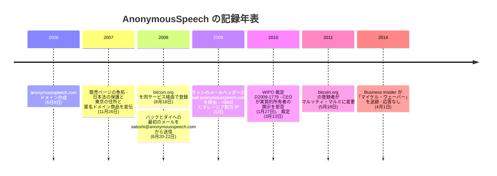

サトシ・ナカモトが世界に向けて踏み出した最初の一歩は、記録が残る限り、一つの商業事業者を経由している。`bitcoin.org` は 2008 年 8 月 18 日、匿名ドメイン登録と匿名メールのサービス AnonymousSpeech.com を通じて登録された。既知の最初の送信メール、8 月 20 日の[アダム・バック宛](/BitcoinArchive/ja/entries/correspondence/adam-back/2008-08-20-satoshi-to-adam-back-hashcash-citation/)と 8 月 22 日の[ウェイ・ダイ宛](/BitcoinArchive/ja/entries/correspondence/wei-dai/2008-08-22-satoshi-to-wei-dai/)も、`satoshi@anonymousspeech.com` から送られた。有料サービスは、サトシが後に使ったどのメーリングリストともフォーラムとも立場が違う。顧客との間に支払いの関係を持つ。では、このサービスと運営者について、公開記録は実際に何を立証できるのか。そして追跡はどこで途切れるのか。後者への短い答えはこうだ。あらゆる場所で、意図された形で途切れており、その途切れ方こそが読むに値する。

## 1. 確認できる記録

| 日付 | 記録 | 現存する場所 |
|---|---|---|
| 2006 年 6 月 9 日 | `anonymousspeech.com` ドメイン作成 | 現在も参照できる WHOIS 記録 |
| 2007 年 11 月 26 日 | 販売ページ: 匿名メールと匿名ドメイン登録、日本法の保護を売りにした宣伝、東京の住所、「1996 年から」という自己紹介 | インターネット・アーカイブの魚拓（本エントリーの参照元） |
| 2008 年 8 月 18 日 | `bitcoin.org` 登録。過去の WHOIS には登録者「ANONYMOUSSPEECH ANONYMOUSSPEECH」、組織 Anonymousspeech LLC、販売ページと同じ東京の住所 | DomainTools の WHOIS 履歴（whoissatoshi ブログが転載） |
| 2008 年 8 月 20〜22 日 | 既知の最初のサトシのメール（[アダム・バック宛](/BitcoinArchive/ja/entries/correspondence/adam-back/2008-08-20-satoshi-to-adam-back-hashcash-citation/)・[ウェイ・ダイ宛](/BitcoinArchive/ja/entries/correspondence/wei-dai/2008-08-22-satoshi-to-wei-dai/)）を `satoshi@anonymousspeech.com` から送信 | 本アーカイブ収録の公開書簡 |
| 2009 年 1 月 | [ハル・フィニー宛メール](/BitcoinArchive/ja/entries/aftermath/2020-11-26-coindesk-unpublished-satoshi-finney-emails/)のヘッダーが `mail.anonymousspeech.com`（IP `124.217.253.42`）を経由、Date ヘッダーは +0800 | CoinDesk が 2020 年に公開したヘッダー、Chain Bulletin の分析 |
| 2010 年 3 月 13 日 | WIPO 裁定 D2009-1779（名義貸しされたドメインの登録者としての AnonymousSpeech LLC）。手続き中の 2010 年 1 月 27 日、CEO は「当社は実質的所有者ではない」とセンターに伝えたうえで、所有者が誰かは開示しなかった | WIPO 裁定文 |
| 2011 年 5 月 18 日 | `bitcoin.org` の WHOIS 登録者がマルッティ・マルミに変更（フィンランドの事業者 Louhi Net Oy 経由） | DomainTools の WHOIS 履歴（whoissatoshi ブログが転載） |
| 2014 年 4 月 1 日 | Business Insider がサイトの背後の人物として「マイケル・ウェーバー」を追跡。日本とメキシコの電話番号・複数のメールアドレスへの連絡はすべて応答なし | Business Insider の記事（魚拓） |

この表について、二つのことをはっきり書いておく。第一に、表の中の「東京」は、販売ページも、bitcoin.org の WHOIS も、WIPO の記録上の住所も、すべて会社自身の自己申告に遡る。東京に実体があったことを裏付ける独立の記録はない。第二に、この表のどこにも運営者の身元はない。最有力の手がかり（2014 年の Business Insider の調査）は、誰も出ない電話で終わっている。

## 2. 法域を売る宣伝

このサービスの商品はソフトウェアではなく、法的な立ち位置だった。2007 年 11 月の販売ページの魚拓にはこうある。

<!-- audit:quote-skip -->
> AnonymousSpeech.com は、加入者が送信したメールについて、外国政府や民間の当事者からの照会には応じない。加入者の身元に関する問い合わせは無視する。一切、返答しない。日本に所在する AnonymousSpeech は日本法に準拠しており、顧客データをサーバーから合法的に削除できる。法律上、AnonymousSpeech.com が報告する相手は日本の公的な政府機関のみである。

同じページには、会社の自己紹介（「1996 年から東京・日本を拠点とする」、住所は「AnonymousSpeech LLC, 1-3-3 Nakanosakaue Sakura House #206, 164-0011, Tokyo, Japan」）と、比較表が載っている。表の見出し行は「オフショア法域（サーバーと登記会社）: 日本」で、主要ウェブメールの米国・英国と並べる作りだ。「匿名ドメイン」の商品（「完全に匿名でドメイン名を購入」）は 2007 年 8 月の日付でページに現れる。`bitcoin.org` がここを通って登録される 1 年前である。

この宣伝は、法域の選択そのものを購読料で売る商売だった。顧客が買うのは、自分の身元と「それを尋ねてくる者」との間の距離である。AnonymousSpeech について不確かなことは多いが、この宣伝が単なる売り文句でなく運用実態だったことは WIPO の記録が示している。正式な UDRP 手続き（D2009-1779、2010 年 3 月裁定）で、同社の CEO は 2010 年 1 月、「当社は係争ドメインの実質的所有者ではない」とセンターに伝えながら、所有者が誰かは言わなかった。パネルは記録から真の当事者（ドミニカ登記の Global House, Inc.）を推認するしかなかった。WIPO の仲裁の場でも沈黙を通す秘匿の盾は、強い盾である。

*[編者注：「1996 年から」は会社の自己紹介としての引用であり、検証済みの沿革ではない。ドメインは 2006 年作成で、それ以前の会社の存在を示す独立の記録は本エントリーの調査では見つからなかった。販売ページの「加入者 60 万人超」という数字にも同じ留保が付く。]*

## 3. 東京の看板とマレーシアの中継サーバー

サトシが 2009 年 1 月にハル・フィニーへ送ったメールのヘッダーに残る UTC+8 は、一時、所在地の信号に見えた。CoinDesk はこれを「サトシは UTC+8 圏に住んでいた」と読んだ。Chain Bulletin のドンチョ・カライヴァノフは、より簡潔な読みを示した。このオフセットは AnonymousSpeech のウェブメール中継サーバー（`mail.anonymousspeech.com`）のもので、Date ヘッダーが映すのはサーバーの時計であって顧客の時計ではない。この点について本アーカイブの[フィニー宛ヘッダーの読み](/BitcoinArchive/ja/entries/aftermath/2020-11-26-coindesk-unpublished-satoshi-finney-emails/)はカライヴァノフに従う。+0800 はサーバー側の雑音であり、身元の手がかりを一つ増やすのではなく、一つ消す。

看板の下の設備は、宣伝ほど整っていない。ヘッダーに残った中継サーバーの IP `124.217.253.42` は、マレーシアのホスティング事業者 Piradius Net に割り当てられたアドレス帯にある。東京のデータセンターではない。両者は見かけほど正面衝突はしない（マレーシアの標準時も UTC+8 であり、時計の設定も IP の割当も、会社の人間がどこにいるかまでは証明しない）。それでも、このサービスの実際の設備を示す唯一の技術的痕跡が、販売ページが一度も触れない場所を指していることは動かない。東京の住所は会社が言ったこと。マレーシアの割当はパケットのヘッダーが示すこと。両者をつなぐ一次資料は見つかっていない。

看板そのものも動いている。Business Insider の 2014 年の調査記事は、2009 年までに同じサイトが自己紹介を「スイス所在・スイス法準拠」へ変えていたと報じている。

| 層 | 何と言っているか | 何の証拠か |
|---|---|---|
| 販売ページ（2007 年の魚拓） | 「日本に所在」「1996 年から東京・日本を拠点」 | 会社の自己紹介 |
| bitcoin.org の WHOIS（2008 年） | 登録者 Anonymousspeech LLC、東京都中野区 | 同じ自己紹介が登録データベースに記入されたもの |
| WIPO の記録上の住所（2010 年） | 東京都中野区 | 同じ自己紹介が法的手続きに持ち込まれたもの |
| 中継サーバーの IP（2009 年 1 月のヘッダー） | `124.217.253.42`、マレーシアの Piradius Net に割当 | 設備水準の唯一の痕跡。日本ではない |
| Date ヘッダーのオフセット（同じヘッダー） | +0800 | 中継サーバーの時計設定。マレーシアと整合し、東京（+0900）とは整合しないが、いずれにせよ設定値 |

## 4. 運営者の追跡

運営者につながる名前のある手がかりは、登記や法廷記録からではなく、報道から来ている。2014 年 4 月、Business Insider（ハンター・ウォーカーとロブ・ワイル）は AnonymousSpeech の背後にいる人物の調査記事を出し、マイケル・ウェーバーという名前と、本人のものとされる写真を掲載した。記者は日本とメキシコの電話番号、複数のメールアドレスに繰り返し連絡したが、応答は一度もなかった。ビットコインに関して記事中で唯一実質のある証言は、当時すでに `bitcoin.org` の登録者になっていたマルッティ・マルミのものだ。マルミは Business Insider に、ウェーバーはドメイン登録サービスの窓口だった人物で、それ以外にビットコインとの関わりはない、と述べた。

人物名まで届く記録は、これで全部である。仲裁の場でも実質的所有者を明かさなかった秘匿サービス。誰も出ない電話で終わった調査報道。そして、このサービスと直接やり取りした唯一のビットコイン関係者による、関与を小さく見積もる人物評。名前の周りには、いくつかの細部が繰り返し現れる。ウェーバーはスイス人で 2008 年当時は日本在住だったこと、送金先はメキシコシティだったこと、サトシのもう一つのメールアドレスの vistomail.com も同一人物の運営だったこと。出どころはいずれも同じ Business Insider の調査である。同誌は、ウェーバー本人が「日本在住のスイス人ソフトウェア開発者」と名乗るプロフィールページ、サービス自身のサイトにあったメキシコシティの「Michael Niklaus Weber」宛の送金案内、そして vistomail.com の WHOIS が同じ名前・同じ連絡先メール・同じ Sakura House の住所につながることを、オンライン上の痕跡として報じた。これらは報じられた痕跡であって、身元の検証ではない。位置づけは § 6 に書く。

## 5. 運営者側の帳簿に何がありうるか

登録代行業者はメーリングリストではない。サトシがドメインとメールアカウントに支払った代金は 2008 年、つまりビットコインが存在する前に支払われている。ということは、通常の決済手段のどれかを通ったはずだ。news.bitcoin.com が 2021 年に引用した Reddit のコメント（アカウントは削除済み）は、その含意をはっきり言葉にしていた。支払いは電信送金か、PayPal か、銀行振込か、小切手のはずで、「だから彼らはサトシが誰か知っているかもしれない」。これは削除済みの匿名アカウントによる伝聞であり、本エントリーもそれ以上の重みでは扱わない。ただし、その下にある構造的な指摘はコメントの真偽に依存しない。有料の匿名サービスは、公開アーカイブのどこにもない種類の記録を持ちうる立場にあった。その記録とは、決済経路であり、アカウントの付帯情報であり、「保存しない」と宣伝しながら実際にどうしていたかは誰も知らないログである。そうした記録は、現存するどの記録の上でも一言も発したことのない運営者の手元にあった。

[六層の匿名化構造](/BitcoinArchive/ja/entries/analysis/2008-10-31-satoshi-anonymity-architecture/)に照らせば、これは経路層の外壁にあたる。そして[識別の非対称性](/BitcoinArchive/ja/entries/analysis/2008-10-31-satoshi-identification-asymmetry/)を、サトシ本人の一歩外側まで延長する。身元につながる記録を最も持ちうる立場にいた唯一の取引相手が、それ自体仮名であり、設計として法域の盾をまとい、いまや連絡がつかない。これがサトシの幸運だったのか、それともサトシの選定基準だったのかは、記録が答えられない種類の意図の問いである。

もう一つ、静かな符合が脚注として残る。サトシが選んだ唯一の商業サービスは、仮名がそうであったように、日本法・東京の住所という旗をまとっていた。[名前のテクノオリエンタリズム読解](/BitcoinArchive/ja/entries/analysis/2008-10-31-satoshi-name-techno-orientalism/)がそのままここにも当てはまる。符合は観察できるが、意図は観察できない。これを「サトシ日本人説」の証拠として扱えば、同じカテゴリーの誤りを二か所で犯すことになる。

## 6. 限界・反対の読み

- **「東京」はすべて自己申告である。** WHOIS の登録者欄も WIPO の記録上の住所も、登録者が申告した内容を繰り返しているだけで、裏付けるのは会社がその時々に何を名乗ったかであって、地理ではない。東京の実体を示す登記・賃貸借・独立の記録は、本エントリーの調査では見つからなかった。しかも名乗り自体が後に動いている（Business Insider が報じた 2009 年のサイトのスイスの自己紹介）。
- **運営者の特定は「報道あり・検証なし」の段階である。** 「マイケル・ウェーバー」は、本人からの返答を得られなかった 2014 年の一本の調査報道に立脚する。スイス・日本・メキシコの細部は本人のオンライン上の自己紹介とサービスの送金案内として、vistomail.com とのつながりは WHOIS 記録として、いずれも同じ記事が報じたものだが、登記・法廷記録・記録に残る本人の発言のいずれによっても確認されていない。
- **サイファーパンクとの接点は記録がない。** 運営者とサイファーパンクのメーリングリスト、リメイラー運営者のコミュニティ、その周辺とを結ぶ記録は、どちらの向きにも見つからなかった。これは記録の不在であって、距離の証明ではない。
- **決済経路の議論は、唯一の具体的な点が伝聞である。** 「運営者はサトシが誰か知っているかもしれない」は、削除済みの匿名コメントからの推論にすぎない。前提そのもの（ビットコイン以前の 2008 年の支払いに使えたのは通常の決済手段だけだった）は覆しにくいが、どんな記録が存在するか・していたかの具体はすべて不明である。
- **身元の主張は何も導かれない。** 日本を看板にする匿名サービスを使ったことは、サトシが日本人だったことの証拠でも、日本にいたことの証拠でもなく、旗を理由に選んだことの証拠ですらない。このサービスは、自身の宣伝を信じるなら、当時最も目立つ匿名メール事業者の一つだったからだ。

## 7. まとめ

確認できる記録が支えるのは、狭いが堅い像である。サトシの最初の公開基盤は、日本の法域そのものを商品として売る有料の匿名代行業者を経由していた。その業者は東京から自己紹介し、実際にはマレーシア割当の設備でメールを中継し、WIPO のパネルの前でも実質的所有者を明かさず、その運営者は、ビットコインが自社の最も有名な顧客を 15 年越しの探索の対象に変えた後でさえ、現存するどの記録の上でも一言も発していない。身元研究にとっての本エントリーの収穫は、一方向には冷却であり、もう一方向には警告である。UTC+8 のヘッダーはサービス側の雑音であってサトシの信号ではない。そして、本物の信号を含みうる唯一の帳簿は、誰よりも長く沈黙を守り続けている当事者の手元にある。
