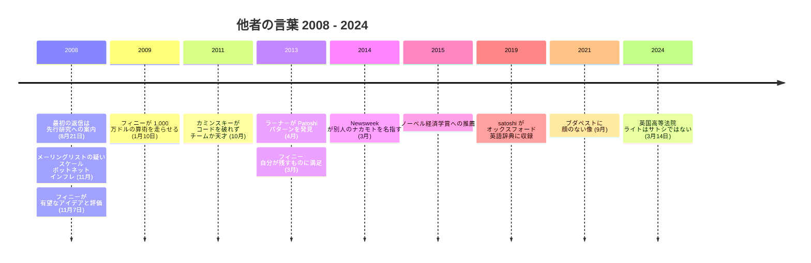

2011 年、セキュリティ研究者ダン・カミンスキーがビットコインを破りに来た。インターネットの DNS 基盤に潜む欠陥を発見し、世界中のベンダーが秘密裏に一斉パッチを当てる事態を招いたことで知られる研究者である。用意した攻撃ベクトルは 9 つ。すべて失敗した。「美しいバグを見つけた」と彼は言った。「だがコードを攻撃するたびに、問題に対処する一行があった」。会ったこともない作者への、彼の評決:

<!-- audit:quote-skip -->
> 「チームで作ったか、天才の仕業だ」

技術的な詳細は[カミンスキーの検証のエントリー](/BitcoinArchive/ja/entries/aftermath/2011-10-10-dan-kaminsky-bitcoin-security/)が記録している。本エントリーが集めるのは、この評決を含むより広い記録、すなわち他者がサトシ・ナカモトについて語った言葉である。2008 年には本人へ向けて、2011 年以降は本人のいない場所で、2024 年には宣誓の場で語られてきた。本アーカイブには、[サトシが自分について語ったこと](/BitcoinArchive/ja/entries/analysis/2008-08-20-satoshi-self-statements/)（ほとんど何もない）と、[サトシが答えなかったこと](/BitcoinArchive/ja/entries/analysis/2010-12-27-satoshi-non-technical-silence/)（個人的なことすべて）を、すでにひとつずつ整理してある。これは第三の軸、他者が語った言葉である。

一箇所に並べて読むと、これらの言葉は、発言した本人たちの誰にも見えていなかった一つの筋道をたどっている。疑いに始まり、賭け、検証、撤回、法廷、辞書を経て、顔のない二体の像へと至る。

## 1. 最初期の反応（2008〜2009）

サトシに宛てられた記録上最初の言葉は、先行研究への案内だった。2008 年 8 月 21 日、ホワイトペーパーが引用する Hashcash の作者アダム・バックは、見知らぬ差出人からの引用表記確認に短く答え、先行研究を指し示した:

<!-- quote: q1 -->
> ウェイ・ダイによる「B-money」提案は知っているかもしれないが、グーグルで見つかると思う。あなたの論文と関連がありそうだ。

10 月に論文が公開されると、暗号学メーリングリストではまず必要性を認める声が上がり、やがて疑念の声に変わっていった。最初に返信した[ジェームズ・A・ドナルド](/BitcoinArchive/ja/participants/james-donald/):

<!-- quote: q2 -->
> 「こういうシステムは切実に必要だ。だが、この方式では必要な規模にスケールしないんじゃないか？」

[ジョン・レヴィン](/BitcoinArchive/ja/participants/john-levine/)は迷惑メール対策の現場から答えた。そこでは正直な多数派という前提は、すでに崩れているように見えた:

<!-- quote: q3 -->
> 「悪者は日常的に 10 万台以上のマシンのゾンビファームを支配している。 ... 他の点についても疑問はあるが、これが致命的な問題だ」

[レイ・ディリンジャー](/BitcoinArchive/ja/participants/ray-dillinger/)は経済面を検算し、この通貨は保有に値しないと断じた:

<!-- quote: q4 -->
> 「プルーフ・オブ・ワークの計算には本源的価値が無い。 ... 人々は、可能であればこの高インフレ通貨で資産を保有しようとはしないだろう」

ただ一人、違う調子で応じた者がいる。プルーフ・オブ・ワーク型トークンシステムを自分の手で作り上げた経験を持つ唯一の読者、[ハル・フィニー](/BitcoinArchive/ja/participants/hal-finney/)が 11 月 7 日に返信した:

<!-- quote: q5 -->
> 「ビットコインはすごく有望なアイデアだと思うんだ。セキュリティを正直な参加者の CPU パワーが攻撃者のそれを上回るという仮定に基づかせるアイデアが気に入っているんだ」

2 か月後、ソフトウェアの稼働から 3 日目に、フィニーはこの発想を発展させ、ビットコイン初期記録で最も有名な計算を導き出した。ビットコインが世界の支配的な決済システムになると想像し、世界の家計資産の総額から計算する:

<!-- quote: q6 -->
> 「2000 万コインで割ると、各コインの価値は約 **1000 万ドル** になるんだ。つまり、今日わずか数セントの計算時間でコインを生成できる可能性は、 **1 億対 1 のリターンが見込める、かなり良い賭け** なんじゃないか！」

その後に続いた私的な通信相手たちも、同じ二つの反応を示した。経済への懐疑と、設計への別の何かである。[マイク・ハーン](/BitcoinArchive/ja/participants/mike-hearn/)の最初のメール、2009 年 4 月:

<!-- quote: q7 -->
> 「質問がたくさんだ :) しかし、真に革命的なアイデアに出会うことは稀だ」

翌月の[マルッティ・マルミの最初のメッセージ](/BitcoinArchive/ja/entries/correspondence/martti-malmi/2009-05-02-malmi-initial-contact/)はもっと簡素で、手伝わせてほしいという申し出だった。彼はやがて、記録に残る通信相手の中で誰よりも多くサトシとやり取りすることになる。

## 2. 検証した者たち

サトシは 2011 年 4 月に消えた。以後にサトシを研究した者たちは本人に何も聞けないので、残されたコード、コイン、文章を徹底的に調べ上げた。彼らの発見をまとめると、本人の証言によらない検証としては、この記録の中でもっとも独立性の高いものになっている。

| 検証者 | 検証対象 | 年 | 発見 |
|---|---|---|---|
| ダン・カミンスキー | コードベース、攻撃ベクトル 9 種 | 2011 | すべての攻撃がソース側で先回り済み。「チームか天才」（[エントリー](/BitcoinArchive/ja/entries/aftermath/2011-10-10-dan-kaminsky-bitcoin-security/)） |
| セルジオ・デミアン・ラーナー | 初期ブロックの採掘パターン | 2013 | [Patoshi パターン](/BitcoinArchive/ja/entries/aftermath/2013-04-17-sergio-lerner-patoshi-analysis/)。単一の協調パターンで約 110 万 BTC が採掘され、一度も使われていない |
| アストン大学（ジャック・グリーヴ） | 文体計量、候補 11 名 | 2014 | サボの文章が最も近い。[「際立った」類似](/BitcoinArchive/ja/entries/aftermath/2014-04-16-aston-university-szabo-stylometric-study/) |
| Whale Alert | 採掘記録の全量 | 2020 | [意図的に採掘能力を絞っていた](/BitcoinArchive/ja/entries/aftermath/2020-07-20-whale-alert-satoshi-fortune/)。蓄財ではなくネットワーク保護と整合 |
| ジェイムソン・ロップ | 「強欲なサトシ」説 | 2022 | 全力で掘れば約 2 倍のコインを得られた。[「サトシが欲張りだったと主張する人は、単に計算をしていないだけだ」](/BitcoinArchive/ja/entries/aftermath/2022-09-16-lopp-was-satoshi-greedy-miner/) |

法医学的な追跡に十年を費やしたラーナーは、サトシを研究する体験を [2013 年の一言](/BitcoinArchive/ja/entries/aftermath/2013-09-03-sergio-lerner-nonce-lsb-discovery/)にまとめている:

<!-- audit:quote-skip -->
> 「我々は LOST の映画の中にいる：一つの謎が解けたように見えるたびに、別の謎が現れる。」

このうち二つの検証については、それぞれに一文を割いて詳しく見ておきたい。カミンスキーの失敗した攻撃は能力の検証で、コードそのものが攻撃をはね返し続けた。ラーナーの Patoshi 発見（Whale Alert とロップが拡張）は人格の検証で、倍を掘れた人物が自分を絞り、実際に掘った約 110 万 BTC は一度も動いていない。引用された先行者本人さえ、設計上の前進を認めている。文体計量が繰り返し指し示したビットゴールドの作者ニック・サボは、[2011 年に自身のブログで](/BitcoinArchive/ja/entries/aftermath/2011-05-28-nick-szabo-bitcoin-what-took-ye-so-long/)「ナカモトは、私の設計にあった重大なセキュリティ上の欠陥を改善したのだ」と書いた。ビットコインがすり抜けてきた暗号学上の危機一髪を調べたヴィタリック・ブテリンは、より率直に「サトシは人々が思っているよりずっと幸運か、賢明だった」と述べている。

## 3. 直接知る者たちの回顧

サトシと実際に協力した人々は、その後の十年間「彼はどんな人物だったか」と聞かれ続けた。彼らの答えは二点で一致する。力量と、壁である。

最初のメールを受け取り、論文を流し読みした[アダム・バック](/BitcoinArchive/ja/participants/adam-back/)は、[COPA 裁判前後の取材に](/BitcoinArchive/ja/entries/aftermath/2024-02-21-adam-back-retrospective-testimony/)こう語った:

<!-- audit:quote-skip -->
> 「ビットコインホワイトペーパーを最初に注意深く読まなかった。あれが、おそらく私の最大の失敗だった」

この通貨は保有に値しないと書いたレビュアーのレイ・ディリンジャーは、回顧の中で率直な賛嘆と率直な悔しさを同時に語り続けた。[2018 年のインタビュー](/BitcoinArchive/ja/entries/aftermath/2018-10-01-ray-dillinger-interview/)では、通貨コードに浮動小数点型を見つけた瞬間を「発見した時は、俺はパニックに陥った」と振り返る。検証すると丸め誤差はゼロだった。サトシが作ったものについての[後年の要約](/BitcoinArchive/ja/entries/aftermath/2017-09-20-ray-dillinger-if-id-known/)はこうだ。「サトシは料金所のない高速道路を作ったんだ。彼はコインを売っていたんじゃない。ハッシュを解いた者に与えていたんだよ。」

ホワイトペーパー参考文献の筆頭に引用された[ウェイ・ダイ](/BitcoinArchive/ja/participants/wei-dai/)は、[2014 年に動機の問いへ答えた](/BitcoinArchive/ja/entries/aftermath/2014-01-12-wei-dai-retrospective-on-satoshi/):

<!-- audit:quote-skip -->
> 「彼は主に個人的に金を稼ぐことに動機づけられているのではなく、世界を変え、興味深い技術的問題を解くことに動機づけられていると思います」

一年間、コード開発をともにした[ジェフ・ガージック](/BitcoinArchive/ja/participants/jeff-garzik/)は、サトシを[「ビューティフル・マインド」型の孤独な天才](/BitcoinArchive/ja/entries/aftermath/2024-10-28-jeff-garzik-satoshi-lone-genius/)と呼び、[先立つ回顧](/BitcoinArchive/ja/entries/aftermath/2018-10-29-jeff-garzik-retrospective/)では「実用的で正気であり、やり取りは非常に容易で快適だった」と述べた。これらの証言のすべてに欠けているのは、伝記的事実である。サトシに最も近かった人々が描写するのは気質だけで、人物は一度も描写されない。本アーカイブは、この[コミュニケーション規律](/BitcoinArchive/ja/entries/analysis/2010-12-27-satoshi-non-technical-silence/)を通信記録の側からすでに跡づけている。ここにあるのは、それを協力者側から見た姿である。

この節の最後の言葉は、ハル・フィニーのものだ。誰もが疑ったときに支持した通信相手について、[ALS と診断された後の 2013 年に](/BitcoinArchive/ja/entries/aftermath/2013-03-19-bitcoin-and-me-hal-finney/)こう書いている:

<!-- audit:quote-skip -->
> 「人生で多くの優秀な人々と知り合う幸運に恵まれてきたので、その兆候は分かるんだよね」

## 4. 制度が語ったこと

2010 年代に入ると、サトシへの問いはメーリングリストの外まで広がった。まず著名な個人が評価を口にし、続いて制度そのものが答えを返し始めた。

UCLA の金融学教授バグワン・チョードリーは 2015 年、サトシをノーベル経済学賞に正式推薦し、その理由を「ここ数十年の経済・金融のイノベーションで、これほどの影響を持つものは他にほとんど思いつかない」と書いた。ビル・ゲイツはビットコインを「技術的な離れ業（technical tour de force）」と呼んだ。設計への最も激しい批判者でさえ、同じ一句だけは譲っている。ビットコインの経済性を長年退け続けたノーベル賞経済学者ポール・クルーグマンは、これが「ある問題への技術的に甘美な解法」であることは認めた。オッペンハイマーが原爆に使ったのと同じ言い回しである。

制度の証言でもっとも奇妙なのは、何も語らないという証言そのものだった。ジャーナリストたちがサトシ・ナカモト関連記録の情報公開を請求したとき、CIA は「請求された文書の存在を肯定も否定もできない」と回答した。肯定でも否定でも何かが漏れてしまう場合に政府機関が使う定型、グロマー回答である。FBI も 2024 年の請求に同じ形で答えた。一方でオックスフォード英語辞典は 2019 年、「satoshi」を英単語として収録した。1 ビットコインの 1 億分の 1。誰も名指せない人物の名を冠した通貨単位である。

そして 2024 年、サトシの正体について法的効力を持つ唯一の言葉を、司法が言い渡した。本アーカイブの通信者たち自身が証言した裁判である。[マルミ](/BitcoinArchive/ja/entries/aftermath/2024-02-21-copa-trial-malmi-testimony/)は「僕はサトシとコミュニケーションを取りましたが、ライト博士とは別の人物だと信じています」と、[ハーン](/BitcoinArchive/ja/entries/aftermath/2024-02-22-mike-hearn-copa-trial-testimony/)は「正直、サトシと話しているという印象は受けなかった」と述べ、英国高等法院のメラー判事は [COPA 対ライト判決](/BitcoinArchive/ja/entries/aftermath/2024-03-14-copa-v-wright-ruling/)でこう認定した:

<!-- quote: q8 -->
> 「ライト博士は 2008年から 2011年の期間にサトシ・ナカモトという偽名を採用または使用して活動した人物ではない」

十年にわたる「私がサトシだ」という主張は、意見が拘束力を持つ唯一の機関の前で退けられた。法廷はサトシが誰でないかを確定できたが、誰であるかについては何の認定もしていない。

## 5. 讃えるかたち

言葉を必要としない証言が、二体の像である。2021 年にブダペストで除幕された最初の像は、顔の部分を鏡面に磨き上げたブロンズ胸像だ。共同制作者の彫刻家タマス・ギリーは、その選択をこう説明した。「彫刻の言語を通じて、ビットコインの基本的な考え、つまりそれが皆のものであると同時に誰のものでもないことを伝えられたと願っている。」覗き込んだ者は、サトシの顔があるべき場所に自分の顔を見る。2024 年にはルガーノが続いた。横から見れば人の姿がはっきり読め、正面からはほとんど消える像である。彫刻家ヴァレンティーナ・ピコッツィが込めたのは「発明者は行間にとどまっている、という感覚」だった。

マイケル・セイラーは同じ読みを一文に凝縮した。「サトシは道を作り、無償で与え、立ち去った。」そして、この謎を十五年にわたり取材した作家ベンジャミン・ウォレスは、二体の像がとらえようとしている歴史的な異常事態を言い当てている:

<!-- audit:quote-skip -->
> 「革命的な技術を構想し、それを世に送り出しながら、その功績を名乗り出なかった人物の前例を、近代科学史は持ち合わせていない」

他者がサトシについて語った言葉の記録は、現在ここまで来ている。本人は[自分についてほとんど語らず](/BitcoinArchive/ja/entries/analysis/2008-08-20-satoshi-self-statements/)、[個人的な問いには何も答えなかった](/BitcoinArchive/ja/entries/analysis/2010-12-27-satoshi-non-technical-silence/)。疑った者たちは反論を書き残し、のちに撤回をその隣に書き足した。検証した者たちは、攻撃をはね返し続けたコードと、一度も動かない資産を見つけた。法廷は誰でないかを確定した。そして、後世に残る公共の記念碑は、鏡と輪郭である。顔は、そのとき覗き込んだ者が映す。

*[補足：これらの最初の返信が応えた 2008 年 10 月 31 日の告知は、小説『[ジェネシス ― 創設者の消失と約束](/BitcoinArchive/ja/novel/)』の物語が始まる瞬間として描かれる。小説は、まさにこの他者の言葉の記録を読み解きながら、その向こうにいる人物を探す、現代東京の一人の会社員を追う。]*
