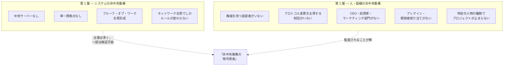

公開から 17 年が経ち、後発のチェーンは決済速度やプログラマビリティなど、個々の技術軸でビットコインを追い越した。それでもビットコインは「デジタルゴールド」と呼ばれ続けている。これは単に先行者利益なのか。17 年の連続稼働は驚異的な記録だ。それでも、その時間だけでは、なぜその呼び名が定着したのかは分からない。

ホワイトペーパーが掲げたのは電子キャッシュであり、サトシは後に、通信チャネルを通じて運べる金のように希少なものを思考実験に使った。では、ここで効いているのは金の比喩なのか、固定された供給なのか、それとも設計を誰が変えられて誰が変えられないかという制度の形なのか。その答えは、公正な配分、上限、創設者の撤退、そしていま誰がルールを変えられるのかという論点のなかに埋まっている。

## 価値はどこから生まれるのか

そもそも、なぜ何かに金銭的価値が生まれるのか。1 ドル紙幣はただの紙であり、金貨はただの刻印入り金属にすぎない。だがこの二つは、ある決定的な点で正反対だ。中央銀行や政府は、通貨の供給量を拡大すると決定できる。金にはこれに相当する存在がない。世界の金の供給量を独占的に握る主体は存在せず、どの権威も命令一つで金を新たに作り出すことはできない。

この「支配者の不在」こそが、資産が長期の価値保存手段として選ばれてきた理由の一つだ。そこには、誰にも指揮されない[希少性](/BitcoinArchive/ja/entries/analysis/2008-10-31-fixed-supply-vs-adjustable-money/)、偽造への耐性、そして誰も一存で拡大できない供給量がある。金が数千年にわたってこの役割を担ってきたのは、一部にはまさにこの理由による。地中からさらに金を掘り出すのは時間もコストもかかり、地質学的な制約を受ける。それは政策の制約ではなく、自然の制約だ。

ビットコインは、金属という物質を使わずとも、ソフトウェアで同じ性質を再現できると掲げた。その中身は、[固定され検証可能な供給量](/BitcoinArchive/ja/entries/design/2009-01-03-bitcoin-monetary-design/)、中央発行者の不在、そして[誰も一方的に書き換えられないルール](/BitcoinArchive/ja/entries/design/2009-01-03-bitcoin-consensus-design/)である。その主張が実際に成り立っているのか、そして同じような主張を掲げる後発のプロジェクトよりもビットコインの方が説得力を持ってそれを実現しているのか。

サトシはこの点に何度も立ち返っているが、一つの答えに決めたことは一度もない。2009 年 2 月、ビットコインの供給量を需要に合わせて調整せず固定にした理由を [P2P Foundation のフォーラム](/BitcoinArchive/ja/entries/forum/p2pfoundation/bitcoin-open-source/2009-02-18-bitcoin-open-source-implementation-of-p2p-currency/)で説明した際、こう書いている。

<!-- quote: q2 -->
> そのためには、価値を決める信頼できる第三者が必要になっただろう。ソフトウェアに物の現実世界での価値を判断させる方法を、私は知らないからだ。

その 3 か月後、[2009 年 5 月の手紙](/BitcoinArchive/ja/entries/correspondence/martti-malmi/2009-05-03-bitcoin-003/)で初期の貢献者マルッティ・マルミに宛て、同じ手紙のなかで二つの異なる説明を出している。まず、生産コストに基づく説明。

<!-- quote: q3 -->
> ビットコインの価値は、それを生成するために消費された電力に応じたものになるだろう。

そして数段落後、金を手本にした社会的合意による説明。

<!-- speaker: Satoshi Nakamoto -->
> 歴史的に、人々は希少な商品を貨幣として採用してきた……価値の大部分は、他者がそれに置く価値から来ている。金もその一例であり、美しく、耐食性があり、加工しやすいが、その価値の大部分は明らかにそこから来ているのではない。

2010 年 8 月になると、金属との類似性を明示的に語った[フォーラムへの返信](/BitcoinArchive/ja/entries/forum/bitcointalk/topic-583/2010-08-27-re-bitcoin-does-not-violate-mises-regression-theorem/)でこう書いている。

<!-- quote: q1 -->
> 思考実験として、金と同じくらい希少だが以下の性質を持つ卑金属があると想像してほしい……そして一つの特別で魔法のような性質：通信チャネルを通じて転送できる。

ここでもサトシは、一つに絞らず候補を並べるにとどめている。交換の役に立つと見込まれること、収集家の存在、「何らかのランダムな理由」。この 18 か月の記録に見えるのは複数の候補であり、価値がどこから始まるかについて一つに決着した説明ではない。だが、いったん価値が生まれれば、それを保ち続けるのは希少性だ。この希少性が後にビットコインの決済用途をどう変えていったかは、[電子キャッシュとデジタルゴールドの間](/BitcoinArchive/ja/entries/analysis/2008-10-31-bitcoin-electronic-cash-vs-digital-gold/)で論じている。

[後発の暗号資産](/BitcoinArchive/ja/entries/analysis/2026-07-26-altcoin-count-and-design-comparison/) ([イーサリアム](/BitcoinArchive/ja/entries/currency/2026-07-27-ethereum-currency-overview/)、[リップル](/BitcoinArchive/ja/entries/currency/2026-07-27-xrp-currency-overview/)、[カルダノ](/BitcoinArchive/ja/entries/currency/2026-07-27-cardano-currency-overview/)、[ソラナ](/BitcoinArchive/ja/entries/currency/2026-07-27-solana-currency-overview/)) は、より高機能な仮想マシン、より速い承認、より低い手数料、より豊富なプログラマビリティを備える。2009 年以降の継続稼働年数を除けば、どの単一の技術軸でもビットコインはもはや最前線ではない。それにもかかわらず市場は一貫して、長期保有の価値保存手段、準備資産、相手方のロードマップに依存しない保有として、ビットコインを金にもっとも近い資産と評価し続けている。

<!-- chart: assets-race -->

通説の説明は「先行者利益」である。この読みでは、ビットコインの価値は経路依存の偶然になる。最初に到着し、ネットワーク効果を蓄積し、現在は設計に本来そなわった性質ではなく慣性で維持されている。

だが、本質はもっと構造的なところにある。ビットコインのデジタルゴールド性は単一の性質ではなく、**二層の非中央集権**と、それを支える 6 つの具体的な構造的特徴を**同時に組み合わせた結果**である。個別の特徴は他のプロジェクトにも見られる。その全てを揃えたプロジェクトは存在せず、揃わないことは偶然でもない。いくつかの特徴は同時に満たすことが原理的に難しいからである。

## 二層の区別

暗号資産における「非中央集権」の議論は、別の次元で動き別の証拠を持つ二つの層をしばしば混同する:

第 1 層は技術的である。合意形成コードを読み、独立したフルノードの数を数え、正規クライアントのリリースを支配する主体がいないことを確認する、といった形で検証できる。主要な暗号資産の大半は何らかの形で第 1 層を満たしており、非中央集権についての公開議論の大半は第 1 層についてである。

第 2 層は社会学的である。特定の人物または組織がプロトコルの方向を決め、開発を支配し、鍵を保有し、組織として代弁しているかを問う。第 2 層は合意形成コードからは検証できない。プロジェクトのガバナンス記録、プレマイン会計、財団構造、原設計者の表立った活動と照らし合わせる必要がある。

二層は重複しない。プロジェクトは第 1 層では高度に非中央集権 (多数のノード、オープンソースクライアント、単一サーバーなし) でありながら、第 2 層では高度に中央集権 (発言がロードマップを動かす名指しできる創設者、開発を資金支援する財団の財務、初期供給の 30% を保有する投資家集団) でありうる。2014 年以降の暗号資産の大半はまさにこの位置にある。そして、この位置こそがビットコインを際立たせている。

## 6 つの構造的特徴

以下の特徴は、組み合わさってビットコインの第 2 層非中央集権を成り立たせ、第 1 層の物語を完成させる具体的な柱である。単独で見ればどれもビットコイン固有ではない。組み合わせが固有なのだ。

| # | 特徴 | ビットコインでの形 | 他のプロジェクトでの存在 |
|---|---|---|---|
| 1 | システムの非中央集権 | PoW + オープンソースクライアント + 数千の独立フルノード | 主要チェーンの大半に程度の差はあるが存在 |
| 2 | 人・組織の非中央集権 | 創設者の権威なし、プロトコル権限を持つ財団なし、CEO なし | 稀。小規模プロジェクトに部分的にあり |
| 3 | 公正な配分 (プレマインなし) | ジェネシスブロック後、ブロック 1 から誰でも参加可能な通常のマイニング | 小規模チェーンに一部 ([ライトコイン](/BitcoinArchive/ja/entries/currency/2026-07-27-litecoin-currency-overview/)、[モネロ](/BitcoinArchive/ja/entries/currency/2026-07-27-monero-currency-overview/))。時価上位では稀 |
| 4 | 創設者の撤退 | サトシは 2011 年以降不在、公的再登場なし | 時価が同等のチェーンには存在しない |
| 5 | 固定供給 | 2,100 万枚上限、実質的に変更不能 | 上限を持つチェーンはあるが、ガバナンスで変更可能なものが多い |
| 6 | ネットワーク効果 / 先行者 | 17 年の歴史、最も深い流動性、最も長いブランド認知 | 同義反復的にビットコイン固有 |

各特徴は以下の節で扱う。順序はおおむね各特徴が表に出てきた順で、ローンチ時 (2009) のシステム層非中央集権、同時の公正な配分、コードに書き込まれた固定供給、2011 年の創設者撤退、2014 年までに目に見えてきた支配的財団の不在、積み重なった結果としてのネットワーク効果、という流れである。

### 1. システムの非中央集権

ビットコインの[合意形成設計](/BitcoinArchive/ja/entries/design/2009-01-03-bitcoin-consensus-design/)は、無許可型でプルーフ・オブ・ワークに基づく合意形成の教科書的な例である。独立したノードがすべてのブロックを同一の決定論的ルールで検証し、正規チェーンは最多ワークチェーンであり、いかなる主体もこの選択を覆す権限を持たない。中央サーバー、運用者、キルスイッチは存在しない。地球上のどこかにいるノード運用者は、ネットワークの他の部分が受理したブロックを拒否できる。そのルールがハッシュレートの多数派にも支持されているなら、その見方が通る。

この層は十分に文書化されており、後続の暗号資産の大半に近い仕組みがある (プルーフ・オブ・ステークの変種、BFT 系のファイナリティ等)。要点は、ビットコインが第 1 層の非中央集権を発明したことではなく、第 1 層だけではデジタルゴールド性の主張を説明できない、という点にある。「第 1 層: 満たす」と言えるプロジェクトはあまりにも多い。違いを生む層はその下にある。

### 2. 人・組織の非中央集権

ここが、ビットコインが他のすべての主要チェーンと分かれる場所だ。第 2 層で主要な暗号資産を比較すると、構図は次のようになる:

| プロジェクト | 活動中の創設者 | プロトコル権限を持つ財団 | 表に立つ CEO | プレマイン / 開発者割り当て |
|---|---|---|---|---|
| **ビットコイン** | 2011 年離脱、連絡なし | Bitcoin Foundation は存在したが、プロトコル権限を持ったことは一度もない | なし | なし |
| **[イーサリアム](/BitcoinArchive/ja/entries/currency/2026-07-27-ethereum-currency-overview/)** | [ヴィタリック・ブテリン](/BitcoinArchive/ja/participants/vitalik-buterin/) (活発、ロードマップに公的な影響力) | イーサリアム財団 (財務、助成金、EIP 指針) | 財団の事務局長 | 2014 年 ICO、創設者 + 初期貢献者割り当て |
| **[リップル](/BitcoinArchive/ja/entries/currency/2026-07-27-xrp-currency-overview/)** | [クリス・ラーセン](/BitcoinArchive/ja/participants/chris-larsen/) / [ブラッド・ガーリングハウス](/BitcoinArchive/ja/participants/brad-garlinghouse/) | リップル・ラボ (プロトコルを支配する私企業) | ブラッド・ガーリングハウス (CEO) | ローンチ時リップル・ラボが約 80% を保有 |
| **[カルダノ](/BitcoinArchive/ja/entries/currency/2026-07-27-cardano-currency-overview/)** | [チャールズ・ホスキンソン](/BitcoinArchive/ja/participants/charles-hoskinson/) (公的に活発) | カルダノ財団 + IOG + Emurgo (3 つの調整体) | チャールズ・ホスキンソン (IOG CEO) | 2017 年 ICO、財団割り当て |
| **[ソラナ](/BitcoinArchive/ja/entries/currency/2026-07-27-solana-currency-overview/)** | [アナトリー・ヤコベンコ](/BitcoinArchive/ja/participants/anatoly-yakovenko/) (活発) | Solana Foundation | アナトリー・ヤコベンコ (Labs CEO) | プレマイン、財団 + 投資家割り当て |

違いは一目で分かる。比較表のビットコイン以外のすべてのプロジェクトについて、関心のある読み手は次を名指しできる: 発言が価格を動かす人物、プロトコル開発を資金支援する組織、企業判断がチェーンのロードマップを形作る会社。ビットコインの対応欄は空白で、その状態は 10 年以上、何度もの議論を呼んだアップグレードサイクルを通じて保たれてきた。

注記: 「Bitcoin Foundation」は存在した (2012 年設立、2015 年までに実質休眠)。それは 501(c)(6) の擁護・教育団体であり、プロトコルガバナンス組織ではなかった。Bitcoin Core 開発プロジェクトは、単一の企業スポンサーや形式的なガバナンス階層を持たない貢献者の緩い連合体であり、これは 2014 年のリブランドが露呈させた[権威パターン](/BitcoinArchive/ja/entries/analysis/2014-03-19-bitcoin-core-rebrand-authority-effects/)で、その後も続いている。

同じ制度的空白は、[フォーク戦争はオープンソースの話ではない、という考察](/BitcoinArchive/ja/entries/analysis/2015-08-15-bitcoin-fork-wars-as-not-oss/)が 2015〜2017 年のブロックサイズ戦争を読み解く前提でもあり、同分析は財団の 2015 年破綻を、規則をめぐる対立をアイデンティティ争奪戦に変えた真空の一角として位置づけている。

### 3. 公正な配分 — プレマインなし

ビットコインのローンチは[ジェネシスブロック](/BitcoinArchive/ja/entries/aftermath/2009-01-03-genesis-block/) (2009 年 1 月 3 日) の後に約 5 日のギャップを挟み、ブロック 1 は 2009 年 1 月 9 日に採掘された。チェーンが記録する最初の非サトシ送信は[サトシからハル・フィニーへ送られた 10 BTC (ブロック 170、2009 年 1 月 12 日)](/BitcoinArchive/ja/entries/aftermath/2009-01-12-first-bitcoin-transaction/)である。二者間のビットコインのやり取りが公的にアーカイブされた最初の事例だ。ブロック 1 以前の 5 日ギャップ、ブロック 0 以前のチェーン履歴の不在、[PoW 余裕分析](/BitcoinArchive/ja/entries/analysis/2009-01-03-genesis-block-hardcode-analysis/)はすべて同じ方向を指す: ネットワークが他者に同条件で開かれる前にサトシが私的にコインを蓄積した期間は存在しなかった。

経験的な裏付けは供給曲線にある。セルジオ・ラーナーの Patoshi パターン分析 (2013 年、以降の論文で拡張、[Patoshi 分析エントリー](/BitcoinArchive/ja/entries/aftermath/2013-04-17-sergio-lerner-patoshi-analysis/)参照) は、最初の約 14 か月に、単一の支配的マイナーと整合する初期マイニングの痕跡を特定した。本論で重要なのはそのパターンに該当するコインの正確な数値 (論文ごとに推定が異なる) ではなく、それらのコインが他のすべてのマイナーが直面したのと同じ難易度と報酬規則の下で採掘されており、事前割り当てや優先的なスケジュールが存在しないことだ。

後続の主要プロジェクトの公正な配分の構図は異なる。イーサリアムの 2014 年プレローンチクラウドセールはジェネシスブロック以前に初期供給のかなりの部分を初期貢献者と財団に配分した。リップルのローンチはプロトコル起動時に XRP の大きな部分をリップル・ラボに保有させた。ソラナのローンチは創設者・財団・初期投資家へのプレマインを含んだ。

正確な配分比率は資料ごとに異なり、本論の中心ではない。重要なのは性質の違いだ。これらのチェーンはいずれも、プロトコルと保有者の間に第三者を置く内部割り当てから始まった。その第三者の利害は長期保有者と一致しない。ビットコインの公正な配分性は、ジェネシス時にそのような第三者が一切存在しなかったことにある。

### 4. 創設者の撤退

サトシの公的活動は 2010 年半ばに止まり、[2010 年 12 月 12 日のギャビン・アンドレセンへの引き継ぎ](/BitcoinArchive/ja/entries/aftermath/2010-12-12-satoshi-handover-to-andresen/)、[2010 年 12 月 19 日のリードメンテナー就任発表](/BitcoinArchive/ja/entries/aftermath/2010-12-19-andresen-lead-maintainer-announcement/)、[2011 年 4 月 26 日の最後の既知メール](/BitcoinArchive/ja/entries/aftermath/2011-04-26-satoshi-final-known-email/)に至った。それ以降、検証可能な通信、プロトコル意見の表明、カンファレンスでの再登場、サトシの鍵による署名済みメッセージは存在しない。撤退は 15 年間にわたり、2013 年 Mt. Gox 崩壊、2017 年ブロックサイズ戦争、2024 年 ETF 承認など、再登場を促してもおかしくない複数の局面を通じて続いている。

撤退は単なる象徴にとどまらず、構造的な帰結を伴う:

- **「サトシならどうする」という訴え方が成立しない。** プロトコル議論は原設計者の解釈の引用では決着できない。文書はその文書のままで、現代の貢献者はその是非を自分たちの判断で論じなければならない。
- **委任的な重みを持つ創設者鍵が存在しない。** 動かせば是認の印になる個人ウォレットはなく、市場が権威ある署名と見なすような署名権限もない。
- **権威の人的継続が起きない。** 残った創設者は何もしなくても権威を蓄積する。その中身は、評判、ネットワーク関係、原システムを世に出したことから来る組織的な敬意である。撤退した創設者はその蓄積を放棄し、プロジェクトは代わりの仕組みを発展させなければならない。

このパターンは例外的である。時価が同等の暗号資産では、原設計者が表立って活動を続けているのが通例で、ビットコインの場合だけが例外である。[匿名性アーキテクチャ分析](/BitcoinArchive/ja/entries/analysis/2008-10-31-satoshi-anonymity-architecture/) (最終層が撤退そのものである 6 層モデル) は、撤退が偶発的ではなく事前に準備されていたことを示唆している。

### 5. 固定供給

2,100 万枚上限はビットコインの貨幣設計でもっとも引用される特徴であり、後発がもっとも模倣する特徴でもある。本質は数値ではなく不変性にある。

発行スケジュールに上限を書き込んだチェーンはいくつもある。問われているのは、その上限がどれほど容易に変更できるか、である。ビットコインの上限は複数のアップグレードサイクルを通じて触れてはならないものとして扱われてきた。上限を緩めることで貢献者が利益を得たであろう局面 (マイニング手数料セキュリティの議論、スケーリング議論) さえ例外ではない。このパターンは[固定供給 vs 自動調整通貨分析](/BitcoinArchive/ja/entries/analysis/2008-10-31-fixed-supply-vs-adjustable-money/)に整理されており、15 チェーンの貨幣設計を比較したうえで、「コード上に上限が書かれている」と「政治的に上限を変えられない」は別の性質であることを示している。

[貨幣設計](/BitcoinArchive/ja/entries/design/2009-01-03-bitcoin-monetary-design/)の幾何級数による半減、 1 期 210,000 ブロック、 33 回目の半減後の整数サトシ切り捨てという、上限を生む機械的な仕掛けは再現できる。各半減期のカードと供給曲線は、アーカイブの[ビットコインチャートページ](/BitcoinArchive/ja/chart/)にある。上限が政治的に維持されるという性質は模倣しにくい。その政治的な耐性は上記の第 2 層特徴に依存している。活動中の財団と表に立つ CEO を持つチェーンには、必要に応じて上限緩和を説得しうる名指しできる主体がいる。ビットコインにはそのような主体がいない。

### 6. ネットワーク効果 / 先行者

ビットコインは 2009 年 1 月 3 日にローンチした。17 年の継続稼働は、後続チェーンが設計の選択だけでは再現できない 4 つの蓄積を生んでいる:

- **もっとも厚い現物流動性を、中央集権・分散双方の場に持つ。** 2024 年以降の現物 ETF 流入は、機関投資家向け価格をあらためて固定した。
- **もっとも広いブランド認知度を持つ。** 専門外の報道では「暗号資産」と「ビットコイン」がほぼ同義語として扱われるほどの水準にある。
- **もっとも大きな累積プルーフ・オブ・ワークを持つ。** 最多ワークチェーン規則が実際に選ぶのはこれであり、17 年分の難易度を上回ってマイニングしない限り、いかなるフォークもこれを飛び越せない。
- **もっとも長い無中断稼働記録を持つ。** [2010 年 8 月のバリュー・オーバーフロー事件](/BitcoinArchive/ja/entries/analysis/2010-08-15-overflow-incident-structure-and-paradox/)とそれ以降のすべてのストレス事象を生き延びてきた。

ネットワーク効果は実在し、6 特徴の一つとして正しく数えるべきだ。ただし物語全体ではない。先行者論は、順序が違っていれば別のチェーンが現在のデジタルゴールド枠に入っていただろうという形で、しばしば「ビットコインの価値はネットワーク効果だけだ」と膨らまされる。上記の他の 5 特徴はこの読みに反する。先行者性を除いても、ビットコインは依然として、創設者の権威がなく、財団がなく、プレマインがなく、信頼できる形で不変な上限を持つプロジェクトであり続ける。先行者性はその効果を増幅する。土台ではない。

## 組み合わせが意味を持つ理由

6 特徴のいずれも、暗号資産の地形のどこかには何らかの形で個別に存在する。だが、**6 つすべてが同時に、ビットコインと同等に満たされているプロジェクトは他に存在しない**。そして特徴のいくつかの組は、同時に満たすことが原理的に難しい:

- **公正な配分 + 継続的な開発資金。** プレマイン・ICO・財団のいずれもないプロジェクトには、内部の開発資金源がない。ビットコインの答えは、中央の支払者を持たない貢献者連合である。これが成り立っているのは (a) プロトコルがローンチ時に意図的に最小限だったこと、(b) ボランティアと助成資金で薄い開発体制を維持するに足りたこと、による。スマートコントラクト、L1 DeFi、アプリケーションプラットフォームのような豊富な機能を狙うプロジェクトは、資金主体を改めて導入せずに同じトレードオフを選ぶことはできない。
- **創設者撤退 + ロードマップ主導。** 活動中の創設者を持つプロトコルには明確なロードマップ主導者がいる。それを持たないプロトコルは分散的な意思決定を発展させなければならない。ビットコインの経験は、これは機能するが遅いと示しており、その遅さ自体が、上限や他のルールが信頼できる形で不変であることの一部を支えている。素早い反復を優先するプロジェクトは、創設者の不在も同時に望むことはできない。
- **CEO なし + 機関認知。** CEO のないプロトコルにはスポークスパーソンも四半期決算もなく、機関側の交渉相手となる人物がいない。これは法人交渉に依存する採用経路にとって摩擦になり、ビットコインの第 2 層非中央集権が引き受けている代償である。

6 特徴が一貫するのは、根底にある設計選択を共有しているからだ: **プロトコルはプラットフォームではなく貨幣基盤として存在する**。貨幣基盤は素早い機能反復を必要とせず、CEO を必要とせず、財団財務を必要とせず、簡単に変更できないことがむしろ利点になる。

プログラマビリティ、スループット、アプリケーション支持など、それ以上を狙う後発の暗号資産はすべて、6 特徴とのトレードオフを受け入れている。それぞれが掲げる目的にとってトレードオフは合理的だ。だが同時に、なぜデジタルゴールドの枠が構造的にビットコインに残り続けるのかも、その同じトレードオフが説明している。

## この枠組みでの「デジタルゴールド」の中身

「デジタルゴールド」はスローガンではない。次のひとまとめを指す略語である。挙げられるのは、希少性が中央銀行ではなく数学によって強制される貨幣資産、保管仲介者なしに持ち運べる所有権、名指しできる主体の裁量で変更できないプロトコル、原設計者が継続的な権威の位置から目に見える形で身を退いた資産、の四つである。それぞれの性質が構造的な特徴であり、それらを束ねた組み合わせが「デジタルゴールド」という語の中身になっている。

この束ね方はまた、技術的な優秀さにかかわらず、この語が他の暗号資産には当てはめにくい理由でもある。豊富な命令セット、速い承認、低い手数料を持つチェーンはいろいろなものになりうる。だが同時に活動中の創設者、財団財務、CEO、プレマインを持つなら、(この枠組みでは) それはデジタルゴールドではない。別の何か、多くの用途にとってはより有用な何かかもしれないが、デジタルゴールドの枠はそうしたチェーンが構造的に座れる席ではない。

6 つの特徴はいま成り立っている。無条件に成り立ち続けるわけではない。6 特徴は必要条件であって、揃えば十分という条件ではないからだ。51% 攻撃の成功、暗号学的な破綻の発見、第 2 層のガバナンス乗っ取り、上限に対する協調的な政治行動。そのどれか一つでも、この組み合わせを崩しうる。

個別の特徴にも限界がある。第 2 層の非中央集権が示されているのは 2011〜2026 年という実績の範囲であって、この先も続く保証ではない。将来の貢献者集中はこれを浸食しうる。6 特徴のうち、外的ショックでもっとも置き換わりやすいのは、ネットワーク効果だ。

なぜこの呼び名がビットコインにだけ定着したかは、6 特徴が説明する。定着し続けるかどうかは別の話であり、まだ記録が答えを出していない。

企業財務・現物 ETF・国家準備がサトシの動かない約 110 万 BTC にどこまで迫ったか、そして保有の集中がなぜ第 2 層の言うプロトコルへの権威にならないかという、保有の側から見た 2026 年の現在地は、[誰がビットコインを握っているのか](/BitcoinArchive/ja/entries/analysis/2026-07-09-bitcoin-ownership-map/)が描いている。

上の 6 つの特徴を 12 チェーンに一度に当てはめたものは、[アルトコインの数と設計の比較](/BitcoinArchive/ja/entries/analysis/2026-07-26-altcoin-count-and-design-comparison/)にある。

個別に問われた 5 つの AI システムは、一つだけ選べと言われて全システムがビットコインに収束した。検証に耐えた主張は、この 6 特徴のような構造的な主張であり、最上級表現ではなかった。実験の全記録は AI 投資調査にある。

<!-- entry-closing -->

希少性は、単独で立っていたわけではない。固定上限は、誰一人として規則を単独で書き換えられないネットワークの内側にある。開始時にプレマインはなく、創設者は退き、その代わりとなる支配的な財団もなく、17 年の連続稼働が積み重なった。この組み合わせが、「デジタルゴールド」という呼び名を装飾ではなく構造にした。後発のチェーンは一つの機能で上回れても、すでに書き込まれた年月までは引き継げない。その約束を、これから担う人々が保てるか。それを問うのは、これから積み重なる記録だ。
