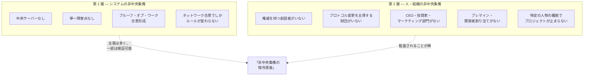

## なぜこの問いが意味を持つのか

後発の暗号資産 (イーサリアム、リップル、カルダノ、ソラナ) は、より高機能な仮想マシン、より速い承認、より低い手数料、より豊富なプログラマビリティを備える。2009 年以降の継続稼働年数を除けば、どの単一の技術軸でもビットコインはもはや最前線ではない。それにもかかわらず市場は一貫して、ビットコインを金に最も近い資産 — 長期保有の価値保存手段、準備資産、相手方のロードマップに依存しない保有 — として価格付けする。

通説の説明は「先行者利益」 である。この読みでは、ビットコインの価値は経路依存的な偶然になる。最初に到着し、ネットワーク効果を蓄積し、現在は設計の本質的な性質ではなく慣性によって維持されている、というものだ。

本ページの主張は、説明はもっと構造的であるというものだ。ビットコインのデジタルゴールド性は単一の性質ではなく、**二層の非中央集権**と、それを支える 6 つの具体的な構造的特徴の**同時組み合わせ**である。個別の特徴は他のプロジェクトのどこかには存在する。その全てを揃えたプロジェクトは存在せず、揃わないことは偶然ではない — いくつかの特徴は同時に満たすことが原理的に難しいからである。

## 二層の区別

暗号資産における「非中央集権」 の議論は、異なる平面で機能し異なる証拠を持つ二つの層を頻繁に混同する:

第 1 層は技術的である。合意形成コードを読み、独立したフルノードの数を数え、正規クライアントのリリースを支配する主体がいないことを確認する、という形で検査可能である。主要な暗号資産の大半は何らかの形で第 1 層を満たしており、非中央集権についての公開議論の大半は第 1 層についてである。

第 2 層は社会学的である。特定の人物または組織がプロトコルの方向を決め、開発を支配し、鍵を保有し、制度的に代弁しているか — という問いだ。第 2 層は合意形成コードからは検査できない。プロジェクトのガバナンス記録、プレマイン会計、財団構造、原設計者の可視的活動と照らし合わせる必要がある。

二層は冗長ではない。プロジェクトは第 1 層では高度に非中央集権 (多数のノード、オープンソースクライアント、単一サーバーなし) でありながら、第 2 層では高度に中央集権 (アナウンスがロードマップを動かす指名された創設者、開発を資金支援する財団の財務、初期供給の 30% を保有する投資家集団) でありうる。2014 年以降の暗号資産の大半は正にその位置にあり、本ページが主張するのは、その位置こそがビットコインを際立たせる、ということだ。

## 6 つの構造的特徴

以下の特徴は、組み合わさってビットコインの第 2 層非中央集権を供給し、第 1 層の物語を完成させる具体的な柱である。単独で見ればどれもビットコイン固有ではない。組み合わせが固有なのだ。

| # | 特徴 | ビットコインでの形 | 他のプロジェクトでの存在 |
|---|---|---|---|
| 1 | システムの非中央集権 | PoW + オープンソースクライアント + 数千の独立フルノード | 主要チェーンの大半が程度の差を伴って |
| 2 | 人・組織の非中央集権 | 創設者の権威なし、プロトコル権限を持つ財団なし、CEO なし | 稀。小規模プロジェクトに部分的にあり |
| 3 | 公正な配分 (プレマインなし) | ジェネシスブロック後、ブロック 1 から誰でも参加可能な通常のマイニング | 小規模チェーンに一部 (ライトコイン、モネロ)。時価上位では稀 |
| 4 | 創設者の撤退 | サトシは 2011 年以降不在、公的再登場なし | 時価が同等のチェーンには存在しない |
| 5 | 固定供給 | 2,100 万枚上限、実質的に変更不能 | 上限を持つチェーンはあるが、ガバナンスで変更可能なものが多い |
| 6 | ネットワーク効果 / 先行者 | 16 年の歴史、最も深い流動性、最も長いブランド認知 | 同義反復的にビットコイン固有 |

各特徴は以下の節で展開する。順序は概ね各特徴が顕在化した順 — ローンチ時 (2009) のシステム層非中央集権、同時の公正な配分、コードに書き込まれた固定供給、2011 年の創設者撤退、2014 年までに視認可能になった支配的財団の不在、累積結果としてのネットワーク効果。

### 1. システムの非中央集権

ビットコインの[合意形成設計](/BitcoinArchive/ja/entries/design/2009-01-03-bitcoin-consensus-design/)は、無許可・プルーフオブワークベースの合意の教科書例である。独立したノードがすべてのブロックを同一の決定論的ルールセットで検証し、正規チェーンは最多ワークチェーンであり、いかなる主体もこの選択を上書きする権限を持たない。中央サーバー、運用者、キルスイッチは存在しない。地球上のどこかにいるノード運用者は、ネットワークの他の部分が受理したブロックを拒否できる。そのルールセットがハッシュレートの多数派も強制するものであれば、その視点が勝つ。

この層は十分に文書化されており、後続の暗号資産の大半に弁護可能な類似物がある (プルーフ・オブ・ステークの変種、BFT ベースのファイナリティ等)。要点は、ビットコインが第 1 層の非中央集権を発明したことではない — 第 1 層だけではデジタルゴールド性の主張を説明できない、ということだ。「第 1 層: 満たす」 と言えるプロジェクトはあまりにも多い。区別を生む層はその下にある。

### 2. 人・組織の非中央集権

本ページの中心命題である。第 2 層で主要な暗号資産を比較すると、構図は次のようになる:

| プロジェクト | 活動中の創設者 | プロトコル権限を持つ財団 | 可視的な CEO | プレマイン / 開発者割り当て |
|---|---|---|---|---|
| **ビットコイン** | 2011 年離脱、連絡なし | Bitcoin Foundation は存在したが、プロトコル権限を持ったことは一度もない | なし | なし |
| **イーサリアム** | ヴィタリック・ブテリン (活発、公的ロードマップ影響力) | イーサリアム財団 (財務、助成金、EIP 指針) | 財団の事務局長 | 2014 年 ICO、創設者 + 初期貢献者割り当て |
| **リップル** | クリス・ラーセン / ブラッド・ガーリングハウス | リップル・ラボ (プロトコルを支配する私企業) | ブラッド・ガーリングハウス (CEO) | ローンチ時リップル・ラボが約 80% を保有 |
| **カルダノ** | チャールズ・ホスキンソン (公的に活発) | カルダノ財団 + IOG + Emurgo (3 つの調整体) | チャールズ・ホスキンソン (IOG CEO) | 2017 年 ICO、財団割り当て |
| **ソラナ** | アナトリー・ヤコフェンコ (活発) | Solana Foundation | アナトリー・ヤコフェンコ (Labs CEO) | プレマイン、財団 + 投資家割り当て |

対比はあからさまである。比較表のビットコイン以外のすべてのプロジェクトについて、関心ある読み手は次を名指しできる: アナウンスが価格を動かす人物、プロトコル開発を資金支援する組織、企業判断がチェーンのロードマップを形成する会社。ビットコインの対応欄は空白で、その状態は 10 年以上、複数の論争的なアップグレードサイクルを通じて維持されている。

注記: 「Bitcoin Foundation」 は存在した (2012 年設立、2015 年までに実質休眠)。それは 501(c)(6) の擁護・教育団体であり、プロトコルガバナンス組織ではなかった。Bitcoin Core 開発プロジェクトは単一の企業スポンサーや形式的なガバナンス階層を持たない貢献者の緩い連合体であり、これは 2014 年のリブランドが露呈した[権威パターン](/BitcoinArchive/ja/entries/analysis/2014-03-19-bitcoin-core-rebrand-authority-effects/)であり、以降も継続している。

### 3. 公正な配分 — プレマインなし

ビットコインのローンチは[ジェネシスブロック](/BitcoinArchive/ja/entries/aftermath/2009-01-03-genesis-block/) (2009 年 1 月 3 日) の後に約 5 日のギャップを挟み、ブロック 1 は 2009 年 1 月 9 日に採掘された。チェーンが記録する最初の非サトシ送信は[サトシからハル・フィニーへ送られた 10 BTC (ブロック 170、2009 年 1 月 12 日)](/BitcoinArchive/ja/entries/aftermath/2009-01-12-first-bitcoin-transaction/) — 二者間のビットコインのやり取りが公的にアーカイブされた最初の事例である。ブロック 1 以前の 5 日ギャップ、ブロック 0 以前のチェーン履歴の不在、[PoW 余裕分析](/BitcoinArchive/ja/entries/analysis/2009-01-03-genesis-block-hardcode-analysis/)はすべて同じ方向を指す: ネットワークが他者に同条件で開かれる前にサトシが私的にコインを蓄積した期間は存在しなかった。

経験的な裏付けは供給曲線にある。セルジオ・ラーナーの Patoshi パターン分析 (2013 年、以降の論文で拡張、[Patoshi 分析エントリー](/BitcoinArchive/ja/entries/aftermath/2013-04-17-sergio-lerner-patoshi-analysis/)参照) は、最初の約 14 か月における単一の支配的マイナーと整合する初期マイニング指紋を同定した。本論で重要なのはそのパターンに帰属するコインの正確な数値 (論文ごとに推定が異なる) ではなく、それらのコインが他のすべてのマイナーが直面したのと同じ難易度と報酬規則の下で採掘されており、事前割り当てや優先的スケジュールが存在しないことだ。

後続の主要プロジェクトの公正な配分の構図は異なる。イーサリアムの 2014 年プレローンチクラウドセールはジェネシスブロック以前に初期供給の意味ある部分を初期貢献者と財団に配分した。リップルのローンチはプロトコル起動時に XRP の大きな部分をリップル・ラボに保有させた。ソラナのローンチは創設者・財団・初期投資家へのプレマインを含んだ。正確な配分比率は資料ごとに異なり、本論の中心ではない — 重要なのはカテゴリー上の区別である: これらのチェーンはいずれも、プロトコルと保有者の間に相手方を置く内部割り当てから始まった。その相手方の利害は長期保有者と同一ではない。ビットコインの公正な配分性は、ジェネシス時にそのような相手方が一切存在しなかったことにある。

### 4. 創設者の撤退

サトシの公的活動は 2010 年半ばに止まり、[2010 年 12 月 12 日のギャビン・アンドレセンへの引き継ぎ](/BitcoinArchive/ja/entries/aftermath/2010-12-12-satoshi-handover-to-andresen/)、[2010 年 12 月 19 日のリードメンテナー就任発表](/BitcoinArchive/ja/entries/aftermath/2010-12-19-andresen-lead-maintainer-announcement/)、[2011 年 4 月 26 日の最後の既知メール](/BitcoinArchive/ja/entries/aftermath/2011-04-26-satoshi-final-known-email/)に至った。それ以降、検証可能な通信、プロトコル意見の表明、カンファレンスでの再登場、サトシの鍵による署名済みメッセージは存在しない。撤退は 15 年間にわたり、再登場を引き出してもおかしくない複数の局面 — 2013 年 Mt. Gox 崩壊、2017 年ブロックサイズ戦争、2024 年 ETF 承認 — を通じて維持されている。

撤退は象徴を超えた構造的帰結を持つ:

- **「サトシならどうする」 訴求が成立しない。** プロトコル議論は原設計者の解釈の引用では解決できない。文書はその文書のままで、現代の貢献者はその是非を独立に論じなければならない。
- **委任的重みを持つ創設者鍵が存在しない。** 動かせば是認を含意する個人ウォレットはなく、市場が権威ある署名と見なす署名力もない。
- **権威の人的継続が起きない。** 残った創設者は標準として権威を蓄積する — 評判、ネットワーク関係、原システムを出荷したことから来る制度的尊敬。撤退した創設者はその蓄積を放棄し、プロジェクトは代替メカニズムを開発しなければならない。

このパターンは異常である。時価が同等の暗号資産で、原設計者が可視的に活動を続けているのは普通であり、ビットコインの場合は例外である。[匿名性アーキテクチャ分析](/BitcoinArchive/ja/entries/analysis/2008-10-31-satoshi-anonymity-architecture/) (最終層が撤退そのものである 6 層モデル) は、撤退が偶発的ではなく準備されていたことを示唆している。

### 5. 固定供給

2,100 万枚上限はビットコインの貨幣設計の最も引用される特徴であり、後発が最も模倣する特徴でもある。本質は数値ではなく不変性にある。発行スケジュールに上限を書き込んだチェーンはいくつもある。問いは、その上限がどれほど容易に修正可能か、である。ビットコインの上限は複数のアップグレードサイクルを通じて触れることのできないものとして扱われてきた — それを緩めることで貢献者が利益を得たであろう局面 (マイニング手数料セキュリティの議論、スケーリング議論) を含めてである。このパターンは[固定供給 vs 自動調整通貨分析](/BitcoinArchive/ja/entries/analysis/2008-10-31-fixed-supply-vs-adjustable-money/)に文書化されており、15 チェーンの貨幣設計を比較し、「コード上に上限が存在する」 と「政治的に上限を修正できない」 は別の性質であることを示している。

上限を生む機械的設計 — [貨幣設計](/BitcoinArchive/ja/entries/design/2009-01-03-bitcoin-monetary-design/)の幾何級数による半減、 1 期 210,000 ブロック、 33 回目の半減後の整数サトシ切り捨て — は再現可能だ。上限が政治的に生き残るという性質は模倣しにくい。その政治的性質は上記の第 2 層特徴に依存している。活動中の財団と可視的な CEO を持つチェーンには、便宜的な局面で上限緩和を説得しうる指名された主体がいる。ビットコインにはそのような主体がいない。

### 6. ネットワーク効果 / 先行者

ビットコインは 2009 年 1 月 3 日にローンチした。16 年の継続稼働は、後続チェーンが設計選択だけでは複製できない 4 つを蓄積する:

- **最も深い現物流動性** — 中央集権・分散の双方の場で。 2024 年以降の現物 ETF 流入は機関価格を再固定した。
- **最も強いブランド認知度** — 専門外の報道で「暗号資産」 と「ビットコイン」 がほぼ同義語のレベル。
- **最大の累積プルーフ・オブ・ワーク** — 最多ワークチェーン規則が実際に選ぶのはこれであり、16 年の難易度を上回ってマイニングしない限りいかなるフォークも短絡できない性質。
- **最も長い無中断稼働記録** — [2010 年 8 月の値オーバーフロー事件](/BitcoinArchive/ja/entries/analysis/2010-08-15-overflow-incident-structure-and-paradox/)とそれ以降のすべてのストレス事象を生き延びてきた。

ネットワーク効果は実在し、6 特徴の一つとして正しく数える。ただし物語全体ではない。先行者論はしばしば「ビットコインの価値はネットワーク効果だけだ」 と膨らまされる — 順序が違っていれば別のチェーンが現在のデジタルゴールド枠にいただろう、という意味で。上記の他の 5 特徴はこの読みに反する。先行者性を剥がしても、ビットコインは依然として、創設者の権威がなく、財団がなく、プレマインがなく、信用できる形で不変な上限を持つプロジェクトであり続ける。先行者性は効果を増幅する。基盤ではない。

## 組み合わせが意味を持つ理由

6 特徴のいずれも、暗号資産の地形のどこかには何らかの形で個別に存在する。主張は、**6 つすべてが同時に、ビットコインが満たす程度で共存しているプロジェクトは他に存在しない**こと、そして特徴のいくつかの組は同時に満たすことが原理的に難しいことだ:

- **公正な配分 + 継続的な開発資金。** プレマイン・ICO・財団のいずれもないプロジェクトには、内部の開発資金源がない。ビットコインの解は、中央の支払人を持たない貢献者連合 — 可能なのは (a) プロトコルがローンチ時に意図的に最小限であったこと、(b) ボランティアと助成資金で薄い開発面を維持するに足りたことによる。スマートコントラクト、L1 DeFi、アプリケーションプラットフォームのような豊富な機能を狙うプロジェクトは、資金主体を再導入せずに同じトレードオフを取れない。
- **創設者撤退 + ロードマップ主導。** 活動中の創設者を持つプロトコルには明確なロードマップ主導者がいる。それを持たないプロトコルは分散的意思決定を発展させなければならない。ビットコインの経験は、これは機能するが遅いことを示唆しており、遅さそのものが上限や他のルールが信用できる形で不変であることの一部を構成する。素早い反復を優先するプロジェクトは、創設者がいないこともまた望めない。
- **CEO なし + 機関認知。** CEO のないプロトコルにはスポークスパーソンも四半期決算もなく、機関相手方が交渉する人物像がない。これは法人交渉に依存する採用経路にとって摩擦であり、ビットコインの第 2 層非中央集権が支払う代償である。

6 特徴が一貫するのは、共通の設計選択を共有しているからだ: **プロトコルはプラットフォームではなく貨幣基盤として存在する**。貨幣基盤は素早い機能反復を必要とせず、CEO を必要とせず、財団財務を必要とせず、素早く変更不可能であることが利点となる。それ以上 — プログラマビリティ、スループット、アプリケーション支持 — を狙う後発の暗号資産はすべて、6 特徴とのトレードオフを受け入れる。それらのトレードオフは表明された目的にとって合理的だ。しかし、なぜデジタルゴールドの枠が構造的にビットコインに残り続けるのかも、それらが説明している。

## このフレーミングにおける「デジタルゴールド」 の内容

この読みでは、「デジタルゴールド」 はスローガンではない。それは束ね方の略語だ — 希少性が中央銀行ではなく数学によって強制される貨幣資産、保管仲介者なしに可搬な所有権、指名された主体の裁量で修正できないプロトコル、原設計者が継続的権威の位置から可視的に身を退いた資産、という束ね方の略語。それぞれの性質は構造的特徴である。束ね方が句にその内容を与える。

束ね方はまた、技術的優秀性にかかわらず、この句が他の暗号資産に当てはめにくい理由でもある。豊富な命令セット、速い承認、低い手数料を持つチェーンは多くのものでありうる。同時に活動中の創設者、財団財務、CEO、プレマインを持つなら、(このフレーミングでは) それはデジタルゴールドではない。それは別の何かである — 多くの用途に対してより有用な何かかもしれない — が、デジタルゴールドの枠はそれが占めるための構造的な空席にはなっていない。

## この読みの限界

本エントリーは構造的特徴の編集的読みであり、価格予測や投資論ではない。いくつかの留保:

- 6 特徴はデジタルゴールド性が長期にわたって有効であり続けるための必要条件であって、十分条件の束ねではない。成功した 51% 攻撃、暗号学的破綻の発見、第 2 層のガバナンス捕獲、上限に対する協調的政治行動、それぞれが本フレーミングを覆しうる。
- 第 2 層非中央集権は 2011〜2026 年の窓では経験的に示されているが、将来の貢献者集中によって浸食されうる。
- ネットワーク効果成分は概念的には最も脆弱だ。外的ショックが最も置換しやすい特徴である。

本フレーミングは、なぜデジタルゴールドのラベルがビットコインに定着し、他には定着しなかったかの説明である。それが定着し続けることの保証ではない。
