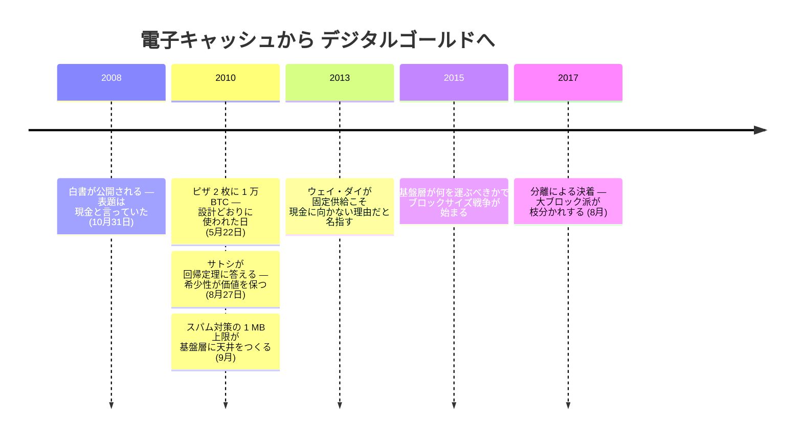

ホワイトペーパーには、互いに引っ張り合うように見える二つの像がある。[タイトル](/BitcoinArchive/ja/entries/emails/cryptography/2008-10-31-bitcoin-whitepaper-final/)は電子キャッシュを掲げ、第 6 節は新しいコインを流通へ加える行為を金の採掘になぞらえる。この緊張は、二つの記述が同じ軸を指しているのかを確かめると見え方が変わる。その答えは、設計が初めて現実の購入に使われた場面と、希少性とスケーリングの制約がビットコインをデジタルゴールドへ押し出した経緯のなかにある。

| 軸 | サトシの設計 | ホワイトペーパーのどこ |
|---|---|---|
| 発行（どう生まれるか） | 採掘で掘り出し、上限に達し、増刷できない | 第 6 節 |
| 使い方（どう使うか） | 二者が直接、じかに払い合う | タイトル・第 1 節 |

それなのに、いまのビットコインは「デジタルゴールド」と呼ばれ、日々の支払いにはほとんど使われず、ただ持たれている。設計を裏切ったわけではない。**設計の中の硬さ（希少性）が、設計の中の現金の使い方を、内側から蝕んだのだ。** 順に見ていく。

## なぜ価値を持つのか — サトシの答え

ビットコインのようなものが、そもそもなぜ価値を持つのか。その最も明快な言葉は、ホワイトペーパーではなく、[2010 年 8 月 27 日の BitcoinTalk 投稿](/BitcoinArchive/ja/entries/forum/bitcointalk/topic-583/2010-08-27-re-bitcoin-does-not-violate-mises-regression-theorem/)にある。ミーゼスの回帰定理は、貨幣の価値は元をたどれば、貨幣になる前の用途に行き着くと説く。金なら装飾や工業としての価値だ。その前史を持たないビットコインは、定理どおりなら貨幣になれない。それでも価値はついた。回帰定理に反するように見えるこのパラドックスをめぐるスレッドで、サトシは思考実験で答えた。

<!-- quote: q1 -->
> 思考実験として、金と同じくらい希少だが以下の性質を持つ卑金属があると想像してほしい……そして一つの特別で魔法のような性質：通信チャネルを通じて転送できる。

ここに、設計の両面がそろっている。金に似せているのは**希少性**（金と同じくらい掘り尽くせないこと）であり、それはいったん価値が生まれた後にその価値を保つ理由になる。現金に似せているのは**転送**（遠くの相手へ送れること）だ。サトシは、その金属がそもそもなぜ価値を持つに至るかを一つに決めていない——交換の役に立つと見込まれること、収集家の存在、「何らかのランダムな理由」。希少性について挙げているのは、それがその価値を目減りさせない、ということだけだ。金のように増やせず、現金のように動く。二つで一つだ。

## 現金として、ちゃんと動いた

その使い方は、絵空事ではなかった。[2010 年 5 月 22 日、ラズロ・ハニエツは 10,000 BTC を払って二枚の Papa John's のピザを買った](/BitcoinArchive/ja/entries/aftermath/2010-05-22-bitcoin-pizza-day/)。当時で約 41 ドル、ビットコインで実際の品物を買った最初の記録だ。これは「現金の夢が本物だった」ことの証拠ではない。サトシが設計した使い方が、そのまま動いた一例にすぎない。掘り出し方は金でも、使い方は現金。設計どおりだ。

## それが、金に寄っていった

ところが同じ取引が、いまでは「あのとき持っておけば」と語られる。一万枚は数億ドルになった。そして**ここに、設計が自分で蒔いた種がある**。明日もっと高くなるものを、今日のピザに払う人はいない。**ビットコインを金にする希少性は、そのまま、現金として使う理由を奪う。** 値上がりする資産は、使うものではなく持つものになる。

スケーリングの制約が、それを後押しした。サトシが 2010 年 9 月にスパム対策で入れた 1 MB の上限は、基盤層が一度に運べる取引の数に天井をつくり、[2015〜2017 年のブロックサイズ戦争](/BitcoinArchive/ja/entries/analysis/2015-08-15-block-size-war-2015-2017-overview/)の争点になった。決着は、分離だった。2017 年 8 月、大ブロック派は[ビットコインキャッシュとして枝分かれし](/BitcoinArchive/ja/entries/aftermath/2017-08-01-bitcoin-cash-fork/)、日々の支払いをオンチェーンに残す道を選んだ。メインチェーンは SegWit とライトニングへ進み、基盤層を決済の土台にした。日々の支払いはその上へ移るか、手数料に押し出されて使われなくなった。希少性が「持て」と言い、混雑が「ここでは払うな」と言う。使い方は、現金から保有へ滑っていった。

## 先駆者が、その仕組みを見抜いていた

これは後付けの説明ではない。ホワイトペーパーが参照 [1] に挙げた[ウェイ・ダイ](/BitcoinArchive/ja/participants/wei-dai/)が、[2013 年に同じことを言っている](/BitcoinArchive/ja/entries/analysis/2008-10-31-fixed-supply-vs-adjustable-money/)。固定供給は価格の振れを大きくし、利用者に重い負担を強いる。だから日々使う通貨には向かない、と。1998 年に生活費へ連動する弾力的な供給を構想した当人が、ビットコインの**硬さそのもの**を、現金に不向きにした原因として名指した。デジタルゴールドにする性質と、現金に向かなくする性質は、同じ一つだ。

## つまり、一枚の硬貨の表裏

[デジタルゴールドの構造的特徴の分析](/BitcoinArchive/ja/entries/analysis/2008-10-31-bitcoin-digital-gold-structural-features/)は、金としての地位が固定供給ほかの**設計**から来ると論じる。[設計意図と現状の分析](/BitcoinArchive/ja/entries/analysis/2026-05-24-satoshi-design-vs-current-reality/)は、使い方が現金から決済層へ**ずれていった**と記す。一次資料が結ぶのは、その二つの間だ。**ビットコインをデジタルゴールドにした希少性は、その現金の使い方をすり減らした希少性と、同じ一つの性質である。** サトシは「金にしよう」としたのではない。硬く作っただけだ。そしてその硬さは、表に金の顔を、裏に使われない現金を持っていた。「デジタルゴールド」は意図ではなく、その表が後年に勝った結果だ。

## では、なお現金を夢に見るか

だからこの疑問は、過去形ではなく現在形で立つ。金として持たれるようになったいま、ビットコインはなお、設計時に託された使い方、すなわち電子キャッシュを目指しているか。ライトニング、[エルサルバドルの法定通貨の試み](/BitcoinArchive/ja/entries/analysis/2026-07-28-bitcoin-nation-state-policy-history/)、オンチェーンで現金を目指す動き。手は、いまも伸びている。設計の片面（現金）は消えていない。ただ、もう片面（金）に覆われているだけだ。

## この読みの限界

- これは希薄な記録から設計を読む編集上の解釈であって、サトシの内心の断定ではない。
- 第 6 節の金は**発行**のたとえ（新しいコインが、採掘された金のように入ってくる）であって、「ビットコインは金だ、持て」という主張ではない。
- 「希少性が現金の使い方をすり減らす」は、デフレ的な資産は使われず退蔵される、という古典的な議論の延長にある。
- ライトニング、エルサルバドル等は現在進行中だ。日々の支払いが戻る未来は、この読みを覆さないが、その時制を変える。

[デジタルゴールドの構造的特徴の分析](/BitcoinArchive/ja/entries/analysis/2008-10-31-bitcoin-digital-gold-structural-features/)は金になった理由を、[設計意図と現状の分析](/BitcoinArchive/ja/entries/analysis/2026-05-24-satoshi-design-vs-current-reality/)は現金でなくなった経緯を、それぞれ別に論じている。一次資料を読むと、ビットコインを金にした性質と、その現金の使い道を奪った性質は、もとは一つだったのではないか。[十二のチェーンを並べた比較](/BitcoinArchive/ja/entries/analysis/2026-07-26-altcoin-count-and-design-comparison/)は、同じ論点を、他の十一チェーンの発行設計それぞれに当てはめている。

*[補足：一つの設計が持つ、金の顔と現金の顔。本記事が読み取るこの緊張は、小説『[ジェネシス ― 創設者の消失と約束](/BitcoinArchive/ja/novel/)』を貫いている。小説は、その設計の背後にいる創設者を想像する。]*

<!-- entry-closing -->

蓄えるために作られたのではない。硬く作られた結果、蓄えられるようになった。それでもなお、使われることを夢に見る。
