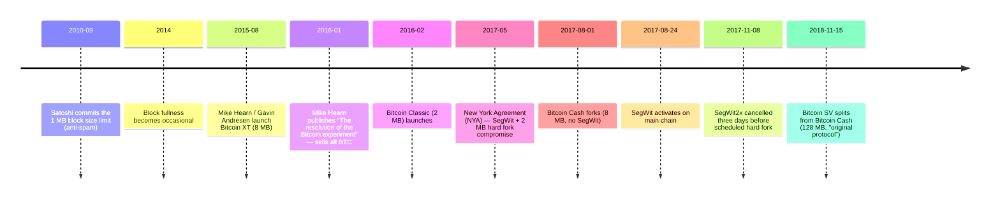

本エントリーは、(a) ビットコインのプロトコル分岐のうち、ローンチ時点で無視できないネットワーク占有率を持って生き残ったチェーンを残したものすべてと、(b) ビットコインのソースコードまたは設計から系譜が始まる隣接する暗号通貨を、まとめて記録する。対象外とするのは、ローンチに失敗した分岐 (生き残ったチェーンを残さなかったもの) と、技術的設計がビットコインとは独立に生まれたチェーン群。後者のカテゴリーは大きく、数千規模のチェーンが該当する (Ripple のフェデレーテッド合意、Monero の CryptoNote 系リング署名、IOTA の DAG、Cardano の Ouroboros PoS は本流言説で頻繁に引き合いに出される例だが、カテゴリーの境界ではなく代表例にすぎない)。

このリストは観察的なものであり、いずれかのチェーンを「真のビットコイン」 と認定するものではない。本アーカイブにおける正典のチェーンは、2009年1月3日に採掘されハッシュ値 `000000000019d6689c085ae165831e934ff763ae46a2a6c172b3f1b60a8ce26f` を持つジェネシスブロックから始まる連鎖である ([ジェネシスブロック分析](/BitcoinArchive/ja/entries/analysis/2009-01-03-genesis-block-hardcode-analysis/))。

本エントリー冒頭のインタラクティブチャートは、掲載される各チェーンを実時間軸の上に描画する ─ ローンチ日、分岐元の親チェーン、稼働期間、現在もブロックを生成しているか、ローンチ後数か月で停止したか。チャート内のチェーン行は対応するアーカイブエントリーが存在する場合にリンクされる。各チェーンの属性ごとの状態 (ブロックサイズ上限、ハッシュレート占有率、ガバナンス等) は §1・§2 の表に記録される。

## 1. ビットコインのプロトコル分岐

別のチェーンを生んだビットコインプロトコルのハードフォーク。本体チェーン上で有効化されたソフトフォーク (SegWit、Taproot) はここには載せない。

| 分岐日 | チェーン名 | 起点 | プロトコル変更 | 結果 (2026 年時点) |
|---|---|---|---|---|
| 2015-08-15 | [Bitcoin XT](/BitcoinArchive/ja/entries/aftermath/2015-08-15-bitcoin-xt-launch/) | [マイク・ハーン](/BitcoinArchive/ja/participants/mike-hearn/)、[ギャビン・アンドレセン](/BitcoinArchive/ja/participants/gavin-andresen/) | BIP 101: 8 MB ブロック、2 年ごとに倍増 | 2016 年 1 月までに事実上停止 ([ハーンの「ビットコイン実験の終結」](/BitcoinArchive/ja/entries/aftermath/2016-01-14-mike-hearn-resolution-bitcoin-experiment/)) |
| 2016-02-10 | Bitcoin Classic | ジョナサン・トゥーミン他 | ハードフォークで 2 MB ブロック | 2016 年末までに事実上停止 |
| 2016-10-13 | Bitcoin Unlimited | アンドリュー・ストーン他 | 可変ブロックサイズ、マイナー主導 | 2018 年までに無視できる占有率 |
| 2017-08-01 | [Bitcoin Cash (BCH)](/BitcoinArchive/ja/entries/aftermath/2017-08-01-bitcoin-cash-fork/) | ロジャー・ヴァー (初期のビットコイン投資家、bitcoin.com 運用者)、ジハン・ウー (Bitmain 共同創業者、ビットコイン採掘ハードウェア)、アモリー・セシェ (Bitcoin Core 寄稿者、Bitcoin ABC リード) | 8 MB ブロック、SegWit なし、ブロック 478558 で分岐 | 規模の小さい生存チェーン。2018 年にさらに分裂 |
| 2017-10-24 | Bitcoin Gold (BTG) | ジャック・リャオ (LightningASIC) | Equihash PoW (ASIC 耐性)、ブロック 491407 で分岐 | ニッチな生存チェーン。2018 年・2020 年に 51% 攻撃を受けた |
| 2017-11-08 | [SegWit2x — 中止](/BitcoinArchive/ja/entries/aftermath/2017-11-08-segwit2x-cancellation/) | マイク・ベルシェ (BitGo 共同創業者、ビットコイン保管事業) 他 (ニューヨーク合意の主要ビットコイン事業者の署名者) | ブロック 494784 での 2 MB ハードフォーク予定 | 有効化 3 日前に中止。分岐は発生せず |
| 2018-11-15 | [Bitcoin SV (BSV)](/BitcoinArchive/ja/entries/aftermath/2018-11-15-bitcoin-sv-fork/) | クレイグ・ライト、カルヴィン・エア (nChain) | 128 MB ブロック、「オリジナル」 オペコードを復活 | 2018 年の BCH ハッシュ戦争分裂を生き残る。COPA v Wright (2024) でライト敗訴後、占有率はさらに減少 |

2015 ~ 2017 年の項目群は **ブロックサイズ戦争** の章である。表面上の争点はブロックサイズだったが、より深い問いはプロトコルガバナンスにあった ─ 開発者・マイナー・事業者が合意できないとき、ビットコインのパラメーターを誰が決めるのか、という問いである。最終的な答えは、保守的な Bitcoin Core の開発文化が本体チェーンを保持し (ブロックサイズのハードフォークではなく SegWit を採用)、より大きなブロックを望んだ提案者たちが Bitcoin Cash として分裂する、という形になった。SegWit2x はニューヨーク合意の妥協案で、SegWit から 3 ヶ月後に本体チェーンで 2 MB のハードフォークを行う計画だった。[マイク・ベルシェ](https://lists.linuxfoundation.org/pipermail/bitcoin-segwit2x/2017-November/000685.html)による土壇場での中止が、本体チェーン側の論争を終わらせた。

2018 年の BSV による BCH からの分裂は BCH コミュニティ内部の別の戦争であり、最終的にハッシュレートで決着した (SV 側のチェーンが分かれて独立に継続)。[クレイグ・ライト](/BitcoinArchive/ja/participants/craig-wright/) によるサトシ主張は [COPA v Wright (2024)](/BitcoinArchive/ja/entries/aftermath/2024-03-14-copa-v-wright-ruling/) で否定されたが、BSV チェーンと一般的な受け止めの中では密接に結びつけられている。とはいえ、チェーンそのものは 2018 年のハッシュ戦争の技術的副産物であり、COPA 判決とは独立に動作し続けている。

## 2. 隣接する暗号通貨

ビットコインのソースコードまたは中核設計から系譜が始まる暗号通貨。設計起源がビットコインとは独立して生まれたチェーン (Ripple のフェデレーテッド合意、Monero の CryptoNote、IOTA の Tangle、その他数千規模のチェーン) は含まない ─ これらはビットコインより先に始まったか、別の暗号学・合意基盤の上に構築されたものである。

| ローンチ | コイン | 創設者 | ビットコインからの系譜 | 設計上の差異 |
|---|---|---|---|---|
| 2011-04-18 | [Namecoin](/BitcoinArchive/ja/entries/aftermath/2011-04-18-namecoin-launch/) | ヴィンセント・ダラム (BitcoinTalk のハンドル `vinced`) | ソースコードの直接フォーク (最初のアルトコイン)。[BitcoinTalk の BitDNS スレッド](/BitcoinArchive/ja/entries/forum/bitcointalk/topic-1790/2010-11-14-bitdns-and-generalizing-bitcoin/) を起点とする | 分散型 DNS / 名前登録。ビットコインとマージマイニング |
| 2011-10-13 | [Litecoin (LTC)](/BitcoinArchive/ja/entries/aftermath/2011-10-13-litecoin-launch/) | チャーリー・リー (Google エンジニア、BitcoinTalk のハンドル `coblee`) | ビットコインのソースコードフォーク | Scrypt PoW (ASIC 耐性を意図)、2.5 分ブロック、上限 8400 万 |
| 2013-12-06 | [Dogecoin (DOGE)](/BitcoinArchive/ja/entries/aftermath/2013-12-06-dogecoin-launch/) | ビリー・マーカス (IBM エンジニア、ビットコイン愛好家)、ジャクソン・パーマー (Adobe Sydney マーケティング) | Litecoin (ビットコインの派生) のソースコードフォーク | 当初はジョーク / ミーム。大規模なインフレ供給。文化的影響 |
| 2015-07-30 | Ethereum (ETH) | ヴィタリック・ブテリン他 ─ ブテリンは 2011 年 (17 歳) に Bitcoin Magazine を共同創設し、ビットコインソフトウェアに寄稿、ビットコインのスクリプト言語拡張を提案した後 Ethereum へ転向 | コードベースは独立、設計の出発点はビットコインコミュニティ | チューリング完全なスマートコントラクト、アカウントモデル (UTXO ではなく) |

Ethereum を本表に含めたのは、チェーンの起源そのものがビットコインを**経由している**ため。ヴィタリック・ブテリンは 2011 年 17 歳でビットコインに出会い、同年に *Bitcoin Magazine* を共同創設、ビットコインソフトウェアに寄稿し、ビットコインのスクリプト言語に汎用計算を載せる拡張提案を提出した。ビットコイン開発コミュニティがその方向を採用しないことが明らかになったとき、ブテリンは 2013 年末に Ethereum 白書を公開し、スクリプト構想を新規コードベースに持ち込む別チェーンの立ち上げに関わった。Ethereum のアカウントモデル・EVM 設計・ガス課金は独立したエンジニアリングだが、**動機** ─ ビットコインに似た合意機構に任意の計算を載せる ─ はブテリンの Bitcoin Magazine 期の思考から直接出ている。他の Ethereum 共同創業者 (ギャヴィン・ウッド、チャールズ・ホスキンソン、ジョセフ・ルビン、アンソニー・ディ・イオリオ、ミハイ・アリシエ、アミール・チェトリット) も、Ethereum 以前にビットコイン / サイファーパンク圏で活動していた。

本表に載せていないビットコインコードベース由来のフォークは多数 (Peercoin、Primecoin、ERC-20 時代のビットコイン由来アルトコイン等) 存在するが、それらは対象外とする。本表が記録するのは、ビットコイン本流の言説で文化的または技術的な意義が繰り返し参照される銘柄に限定される。

## 3. ブロックサイズ戦争の経緯 (2010 ~ 2017)

2017 年のハードフォーク決裂を生んだ重要な順序:

2018 年 11 月以降、新たなプロトコル分岐チェーンで継続的な占有率を獲得したものはない。Bitcoin Core の保守的なプロトコル進化モデル (ソフトフォークのみ、Taproot 2021) が本体チェーンを保持してきた。

## 4. 正典のチェーンが生き残った理由

分裂したいずれのチェーンもビットコインに取って代わらなかった理由として、構造的な要因が三つ挙げられる:

- **ハッシュレートにおけるネットワーク効果**。分裂したチェーン群は、相対的に小さいハッシュレートで開始した。これにより攻撃コストが低く、確認時間が遅くなる。Bitcoin Gold は二度の 51% 攻撃を受け (2018 年・2020 年)、BSV は反復的な再編成を受けた。
- **ブランドと取引所上場の慣性**。主要な取引所は本体チェーン上のビットコインのティッカーとアドレス形式を維持した。新しいティッカー (BCH、BSV、BTG) は別個の市場を形成したが、規模はずっと小さい。
- **保守的な進化文化**。Bitcoin Core のソフトフォーク限定の方針、緩慢なレビュー、政治的圧力下でハードフォークを急がないという明示的な姿勢は、2017 年以降の受け止めにおいて欠陥ではなく特徴として機能した。SegWit (ソフトフォーク、2017 年 8 月 24 日) と Taproot (ソフトフォーク、2021 年 11 月) はいずれもチェーンを分裂させずに展開された。

これらの観察は記述的なものであり、規範的なものではない。将来のいずれかの分岐が占有率を獲得する可能性を排除するものではなく、2009 ~ 2024 年の記録において何が起きたかを記録するに留まる。

## 5. 本エントリーの限界

- **取扱範囲**。本エントリーは、生き残ったチェーンを残したプロトコル分岐と、ビットコイン本流の言説で繰り返し参照される隣接する暗号通貨を記録する。出来高の薄いビットコインのコードベース由来のフォーク (Peercoin、Primecoin、Auroracoin 等) は数百あるが対象外。設計起源がビットコインに辿れない独立設計のチェーン (Ripple、Monero、IOTA、Cardano は本流言説でよく引き合いに出される代表例) は数千規模で存在し、それらも対象外。
- **生存状態**。生存チェーンの状態は、本エントリーの最終編集時点のもの。ここで「生存中」 と記録されたチェーンも任意の時点でブロック生成を停止する可能性がある。本系譜は史実であり、将来を保証する推奨ではない。
- **社会政治的な枠組み**。上記のブロックサイズ戦争の語りは、参加者たち自身が残した文書 ([ハーンの 2016 年 1 月のエッセイ](/BitcoinArchive/ja/entries/aftermath/2016-01-14-mike-hearn-resolution-bitcoin-experiment/)、[ベルシェの 2017 年 11 月の中止投稿](https://lists.linuxfoundation.org/pipermail/bitcoin-segwit2x/2017-November/000685.html)、GitHub PR スレッド等) に基づいている。技術的な是非についていずれの側が正しかったかを決着させるものではない。それは別個の規範的問いであり、本目録の対象外である。
