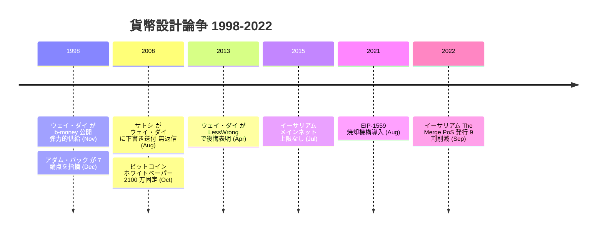
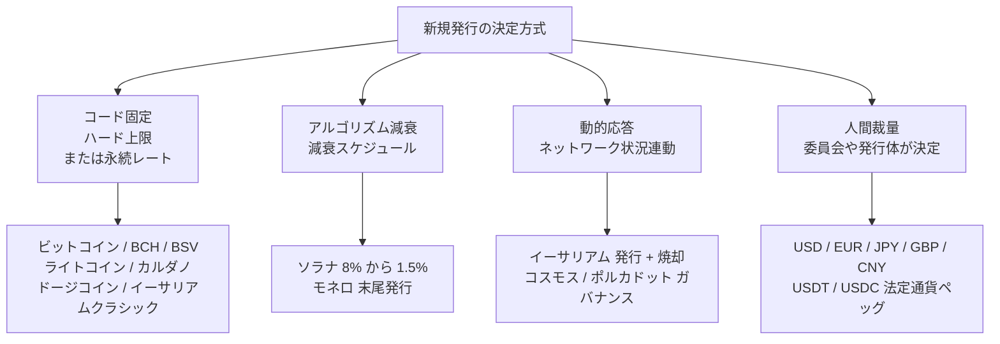
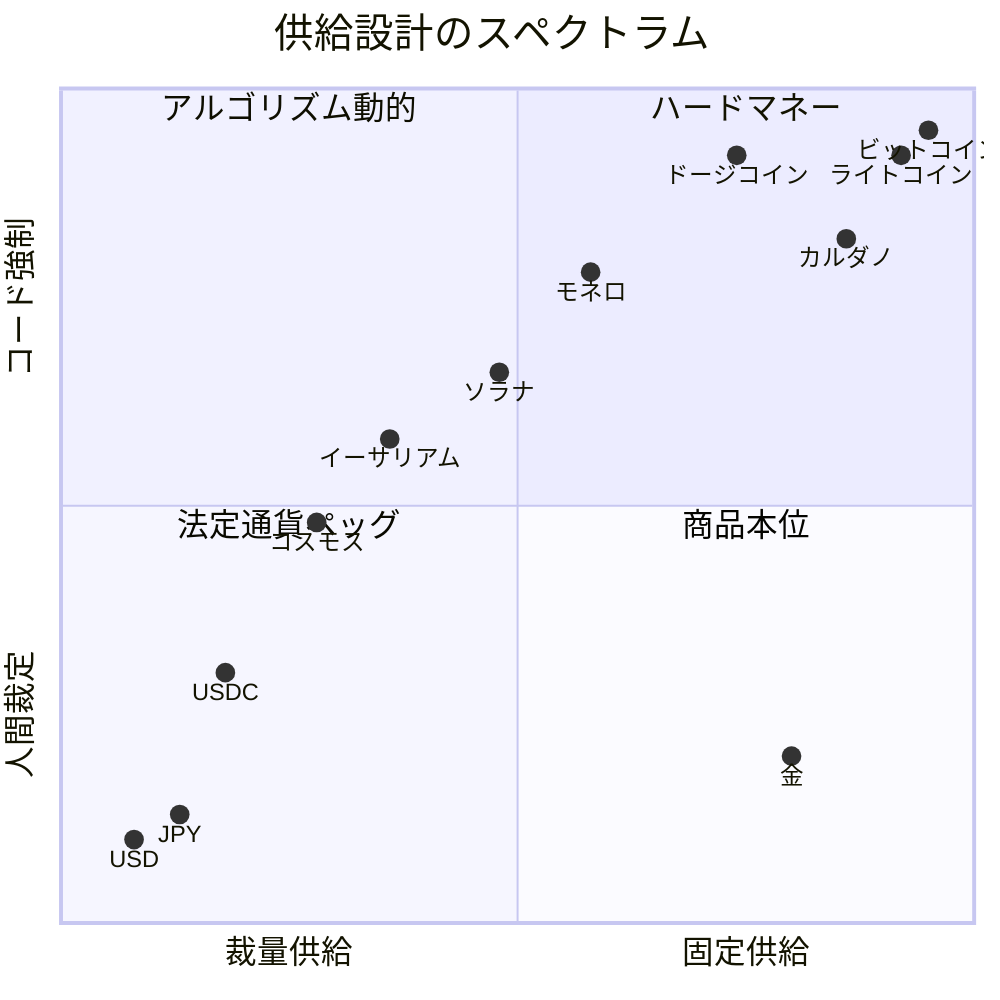

来年新しい通貨はいくら発行されるか、誰が決めるのか。ビットコインの答え ― 約 2100 万枚の固定上限、コンセンサスコードに書き込まれ、すべてのフルノードが強制する ― は、この問いに対する特定の一つの立場である。議論自体はビットコインに先行し、 1990 年代のサイファーパンク通貨設計の文献を貫き、仮想通貨と中央銀行の世界の両方で現在も続いている。
## 1. 問い: 通貨供給を誰がどう決めるのか

任意の通貨システムは 2 つの問いに答えなければならない:

- **誰が決めるか** ― 各時点で新しい通貨がいくら存在するか (個人、委員会、機関、プロトコル、アルゴリズム)。
- **どう決めるか** ― 経済状況に応答する裁量、固定スケジュール、連動式、ハード上限など。

2 つの問いは独立している。中央銀行が固定スケジュールを運用することもありうる。プロトコルが裁量的フィードバックループを実装することもありうる。ビットコインの特定の組み合わせ ― プロトコルが決定、固定スケジュール、ハード上限 ― は、内部整合性のある複数の答えのうちの一つであり、唯一の答えではない。

論争の時系列を、 1998 年の b-money 弾力的供給提案から[イーサリアム](/BitcoinArchive/ja/entries/analysis/2008-10-31-bitcoin-fork-and-altcoin-genealogy/)のマージまでに渡って示す:

## 2. サイファーパンクの基準線: b-money の自動調整供給 (1998)

ビットコインの系譜の出発点となる最初の詳細なサイファーパンク通貨設計提案は、 [ウェイ・ダイの b-money (1998 年 11 月)](/BitcoinArchive/ja/entries/aftermath/1998-11-26-wei-dai-pipenet-b-money-announcement/) である ― [ビットコインホワイトペーパー](/BitcoinArchive/ja/entries/emails/cryptography/2008-10-31-bitcoin-whitepaper-final/)の参考文献 [1] として引用された。「新しい通貨はいくら存在するか」の問いに対する b-money の答えは明示的に自動調整型だった: 新規発行は標準的な財のバスケットの費用に比例し、 b-money 一単位の購買力は固定コインスケジュールではなく実物価格に追従するよう設計されていた。

機構は分散コスト推定プロトコルだった: 参加者が生活費変動の推定値を公開し、プロトコルが集約し、新規発行はバスケット建ての b-money 一単位の価格を安定に保つよう調整される。設計は **物価安定** を通貨政策の第一目標として扱い、 **固定コイン供給** を第一目標とはしなかった。

[アダム・バックの 1998 年 12 月の返答](/BitcoinArchive/ja/entries/aftermath/1998-12-06-adam-back-b-money-monetary-critique/)は[サイファーパンクメーリングリスト上で](/BitcoinArchive/ja/entries/threads/emails/cypherpunks/b-money-protocol/)、この提案に対して 7 つの通貨設計上の論点を提示した ― そのなかにはコストバスケット推定を分散化することの技術的困難も含まれる。 [ウェイ・ダイの 1 日後の返答](/BitcoinArchive/ja/entries/aftermath/1998-12-07-wei-dai-re-b-money-protocol/)は未解決の問いを明示的に扱った: 物価安定、景気循環、最適なインフレ率はいずれも、より広く採用される通貨システムに対して開いた問題として列挙された。このやり取りは、自動調整供給型のアプローチが熟慮された設計であったことと、その実装上の困難が既知だったことの両方を記録している。

## 3. ビットコインの選択: ハード上限、固定スケジュール、裁量なし (2008–2009)

[ビットコインのホワイトペーパー](/BitcoinArchive/ja/entries/emails/cryptography/2008-10-31-bitcoin-whitepaper-final/)は両方の問いについて逆の立場をとった。供給スケジュールはプロトコル層で固定されている: ローンチ時はブロックあたり 50 BTC、 210,000 ブロックごとに半減する。総量は約 20,999,999.9769 BTC に近づくが超えない ― 有限の幾何級数の和で、コンセンサスルールが機械的に強制する。この総量がどう導かれるか（整数サトシ建ての新規発行分が 33 回の半減を経て 2140 年ごろにゼロへ切り捨てられる過程）は[ビットコインの貨幣設計](/BitcoinArchive/ja/entries/design/2009-01-03-bitcoin-monetary-design/)で詳述している。本エントリーではこのスケジュールを、供給設計のスペクトル上の一つの**固定**された立場としてのみ扱う。裁量的調整の機構は存在しない。スケジュール変更は互換性を壊すコンセンサス変更であり、広範なノード運用者・経済主体の協調を必要とする。

ホワイトペーパーのセクション 6「インセンティブ」は、新規発行が終了した後の政策変数として手数料市場を名指しているが、スケジュールの **固定** 形式そのものに対する論拠は述べていない。上限を派生的結果ではなく設計選択として扱っており、 [サトシ自己発言の記録](/BitcoinArchive/ja/entries/analysis/2008-08-20-satoshi-self-statements/)には、なぜ固定供給が代替案より優れるかについての長い擁護も含まれていない。

## 4. ウェイ・ダイの後悔 (2013 年 4 月)

[2013 年 4 月の LessWrong コメント](/BitcoinArchive/ja/entries/aftermath/2013-04-21-wei-dai-bitcoin-monetary-policy-critique/)で、ウェイ・ダイは本エントリーの問いに直接関わる 3 つの発言を行った:

<!-- audit:quote-skip -->
> 「ビットコインは通貨政策に関しては失敗したと私は考えている (その政策が高い価格変動を生み、通貨を使うために望ましくないリスクを取るか、高コストのヘッジを行うかを利用者に強いるという重い負担を課しているため)」

<!-- audit:quote-skip -->
> 「ビットコインが起こしうる影響の一つは、その不十分な通貨政策とそれに伴う価格変動のせいで非常に大きな規模には成長できず、仮想通貨というニッチを占有したことで、仮想通貨が非常に大きな規模に成長する未来を妨げてしまった、ということかもしれない」

<!-- audit:quote-skip -->
> 「これは部分的に私の責任かもしれない ― サトシが論文草稿への意見を求めて私にメールしてきたとき、私は返信しなかった。そうしていれば、おそらく彼 (または彼ら) を『固定供給』の発想から思いとどまらせることができたかもしれない」

3 番目の発言は史実記録の中で珍しいものだ: プロトコルが引用した先駆設計の作者本人が、固定供給という選択を「議論で覆せたかもしれない特定の設計決定」として名指している。もし [2008 年 8 月 22 日のサトシのメール](/BitcoinArchive/ja/entries/correspondence/wei-dai/2008-08-22-satoshi-to-wei-dai/) ― ホワイトペーパー公開前の草稿が同封されていた ― に返信していれば、という想定でこの発言は構成されている。個人的な回想であって結論ではない ― だが、この設計選択が 2008 年 8 月時点で到達可能だった、予定調和ではなかった、と位置づける材料にはなる。

## 5. 法定通貨の基準線: 中央銀行の裁量

世界で支配的な通貨供給設計パターンは、 b-money の自動調整アルゴリズムでもビットコインの固定上限でもなく、中央銀行の裁量である。主要な準備通貨とその発行枠組み:

| 通貨 | 発行主体 | 供給上限 | 発行ルール | 政策目標 |
|---|---|---|---|---|
| 米ドル (USD) | 連邦準備制度 (FRB) | なし | 公開市場操作、金利政策、バランスシートの拡張・縮小 | 約 2% インフレ、完全雇用 |
| ユーロ (EUR) | 欧州中央銀行 (ECB) | なし | 同等の手段 | 約 2% インフレ (HICP 中期) |
| 日本円 (JPY) | 日本銀行 | なし | 同等の手段、加えて大規模資産購入 | 2% インフレ (2013 年導入) |
| 英ポンド (GBP) | イングランド銀行 | なし | 同等の手段 | 2% インフレ (CPI) |
| 人民元 (CNY) | 中国人民銀行 | なし | 同等の手段、加えて資本規制と為替バンド管理 | 多目的 (成長、雇用、為替安定) |
| 金 (歴史的) | 採掘 | 実質的に上限あり | 採掘量は年約 1.5% 増加 | 採掘コストによるアルゴリズム的調整 |

1971 年以降の法定通貨制度の決定的特徴は **裁量** である ― 小さな委員会が、現在の経済状況に応答して、表明された長期目標の範囲内で、各政策ステップを決定する。ハード上限は存在しない。バランスシートは政策に応答して拡張・縮小する。

比較に情報を与える 2 つの境界事例:

- **1971 年以前の金本位制。** 主要通貨が金との固定平価で兌換可能だった時代、実質的な供給上限は世界の金在庫であり、採掘速度 (年約 1.5%) で増加した。このシステムはビットコインのハード上限が目指す性質 (裁量的拡張への制約) と、 b-money が目指した性質 (在庫フロー比による一定の物価安定) の両方を実現したが、別の方向で失敗した: 資本フローを通じて国家間でショックを伝播させ、能動的な反景気循環政策と両立せず、 1971 年の固定相場兌換性放棄に寄与した。

- **ハイパーインフレーション。** ワイマール期ドイツ (1922–23)、ジンバブエ (2007–09)、ベネズエラ (2016 年以降) は、裁量的供給拡張がその破壊的限界まで進んだ典型例である。ハードマネー陣営はこれらを「**任意の** 裁量システムが原理的に到達しうる失敗モード」として引く。裁量陣営は「これらは中央銀行の独立性に関する政治的失敗であり、裁量という手段自体の失敗ではない」と応答する。

法定通貨の基準線が重要なのは、ビットコインの設計選択が読まれる **対比** がここにあるからだ。「ハード上限、裁量なし」は、「上限なし、全裁量」が存在してこそ意味のある立場となる。両極端は世界で実在し稼働しており、仮想通貨の景観はその間のスペクトル上に分布する。

## 6. 2009 年以降の仮想通貨の景観

ビットコインのハード上限パターンが参照点として存在するようになって以降、後続の仮想通貨は明示的に立場をとった ― それを継承するか、修正するか、そこから分岐するか。以下の 15 通貨比較表はスペクトル全体にわたる最も引用される変種をカバーする:

供給政策の選択肢は 4 つの類型にまとまる。下の表はその類型ごとに具体例を示す:

| 通貨 | 供給上限 | 発行スケジュール | ガバナンス | 設計類型 |
|---|---|---|---|---|
| **ビットコイン** | 2100 万 (ハード上限) | 210K ブロックごとに半減、新規発行分 → 0 は 2140 年頃 | プロトコル、保守的コンセンサス | ハードマネー、固定 |
| **ライトコイン** | 8400 万 (ハード上限) | 半減 (ビットコインの 4 倍速) | プロトコル | ハードマネー、スケール変更 |
| **ビットコインキャッシュ** | 2100 万 (ハード上限) | ビットコインと同じ | プロトコル | ハードマネー、継承 |
| **ビットコイン SV** | 2100 万 (ハード上限) | ビットコインと同じ | プロトコル | ハードマネー、継承 |
| **カルダノ (ADA)** | 450 億 (ハード上限) | 指数減衰 | プロトコル + トレジャリー | ハードマネー、減衰発行 |
| **モネロ (XMR)** | 1840 万 + 永久発行 | スムーズ発行 → ブロックあたり 0.6 XMR を永久 (長期は穏やかなインフレ) | プロトコル | ハイブリッド: 上限 + 末尾 |
| **ドージコイン** | なし (2014 年に撤廃) | 永久に年 50 億固定発行 | プロトコル | 穏やかなインフレ、固定率 |
| **ソラナ (SOL)** | なし | インフレ 8% → 1.5% を 10 年で (年率 −15%) | プロトコル + 財団 | 減衰インフレ |
| **イーサリアム (ETH)** | なし | 発行 + EIP-1559 手数料焼却 (高利用期にはネットデフレ化) | プロトコル + EIP ガバナンス | 動的、市場媒介 |
| **イーサリアムクラシック (ETC)** | 約 2.107 億 (フォークで上限導入) | 固定供給スケジュール | プロトコル | ハードマネー (フォーク後) |
| **ポルカドット (DOT)** | なし | 年率約 10% のインフレ目標 | プロトコル + ガバナンス | 穏やかなインフレ、固定率 |
| **コスモス (ATOM)** | なし | ボンド比目標型インフレ (7–20% レンジ) | プロトコル + ガバナンス | インフレ、フィードバック目標 |
| **b-money (1998 提案)** | 動的 | 標準バスケット生活費連動 | 分散コスト推定 | 自動調整、バスケット連動 |
| **USDT (テザー)** | 担保で決定 | 法定通貨準備に対する発行・焼却 | 中央発行体 (Tether Ltd) | 法定通貨連動ステーブルコイン |
| **USDC (サークル)** | 担保で決定 | 同じ機構 | 中央発行体 (Circle) | 法定通貨連動ステーブルコイン |

この表の分布は、ある一つの設計をめぐる合意ではなく **スペクトル** として読める。ビットコインからのハード上限継承が一つのクラスター (ビットコイン / BCH / BSV / ライトコイン / カルダノ / ETC)、減衰発行型の変種がもう一つ (ソラナ、モネロの発行カーブ)、上限なしで裁量的フィードバックを持つ変種が三つ目 (イーサリアム、コスモス、ポルカドット)、法定通貨連動ステーブルコインが四つ目 ― これらは法定通貨発行体の裁量を機能的に継承する。

<!-- chart: supply-curve-comparison -->

## 7. イーサリアムの分岐した道

[ヴィタリック・ブテリン](/BitcoinArchive/ja/participants/vitalik-buterin/)のイーサリアム (メインネット 2015 年 7 月) は、ビットコインのハード上限モデルへの明示的な対案として最も引用される。現在のイーサリアム供給カーブを形作った 3 つの設計上の動き:

1. **当初発行 (2015–2022)**: プルーフ・オブ・ワーク下で年率約 4–5% のインフレ、ハード供給上限は定義されなかった。
2. **EIP-1559 (2021 年 8 月)**: 基本手数料の焼却を導入。各トランザクションの基本手数料はマイナー / バリデーターに支払われるのではなく破棄され、ネットワーク利用に比例したネットデフレ圧力を生む。活動が活発な期間中、 ETH 供給は縮小する。
3. **マージ (2022 年 9 月)**: プルーフ・オブ・ステークへの移行で新規発行を日量約 13K ETH から約 1.7K ETH へ約 90% 削減。 EIP-1559 焼却と組み合わせて、高利用期には ETH 供給が **ネットデフレ** になる期間が生じた。

組み合わせの効果 ― ハード上限なし、しかしネットワーク利用に応答する動的供給 ― は、ビットコインの **スケジュール固定** 原理よりも、 b-money の **状況応答** 原理に近い。ただし応答変数はネットワーク需要であり、バスケット価格の安定ではない。イーサリアムコミュニティ自身の語彙 (「Ultra Sound Money」、ビットコインの「Sound Money」枠組みへの掛詞) はこの対比を明示している。

## 8. なぜ固定か、なぜ可変か ― 各設計が賭けた貨幣観

供給設計の違いは、優劣ではない。「通貨は何のためにあるか」という問いへの、別々の答えだ。固定供給も、上限を置かない可変供給も、それぞれが恐れる失敗があり、その失敗を避けるために仕組みを選ぶ。全景を 2 軸に置くと ― 横軸は固定 vs 裁量供給、縦軸は人間 vs アルゴリズム強制:

この分布の背後には、互いに相容れないいくつかの貨幣観がある。

**固定上限＝健全通貨（ビットコイン、ライトコイン、カルダノ、ビットコインキャッシュ、イーサリアムクラシック）。** 恐れているのは裁量だ。発行を人間の判断に委ねれば、政治的な圧力のもとで遅かれ早かれインフレへ堕ちる ― その根拠として §5 の法定通貨史を引く。ハイパーインフレ、そして 1971 年以降に累積で約 85% に達したドルのインフレだ。だから増刷できない希少性をコードに焼き込み、それを価値毀損への唯一の永続的な防衛とする。サトシの 2100 万枚上限がこの賭けの原型で、後続の固定上限通貨はそれを継承するか、規模だけ変えて踏襲した。

**末尾発行＝セキュリティ予算（モネロ）。** 固定上限が恐れなかった失敗を、ここでは恐れる。新規発行がゼロになった後、ネットワークの安全を手数料だけで賄えるのか ― [マイニング報酬枯渇の分析](/BitcoinArchive/ja/entries/analysis/2026-05-18-mining-reward-exhaustion-fee-only-future/)が立てる問いだ（理論的な支柱は Carlsten 他、ACM CCS 2016 の「手数料のみの均衡は不安定」という議論）。モネロは「賄えない」に賭けた。2022 年 5 月以降、ブロックあたり 0.6 XMR を永久に発行し続け、マイナーの報酬を手数料頼みにしない。健全通貨が希少性のために手放した安全の予算を、緩やかな永久発行で買い続ける設計だ。

**動的応答＋焼却＝利用連動（イーサリアム）。** §7 のとおり、上限を定めず、発行はバリデーターの安全に充てる分へ絞り、EIP-1559 で手数料を焼却する。狙いは「利用が増えれば供給が縮む」という、固定上限とは逆向きの希少化だ。コミュニティ自身の語「超健全通貨（ウルトラサウンドマネー）」は、ビットコインの「健全通貨」への当てこすりであり、希少性を上限ではなく利用で作るという賭けの宣言でもある。

**定額インフレ＝退蔵を嫌う決済通貨（ドージコイン）。** 健全通貨が長所とみなす希少性を、ここでは欠陥とみなす。明日値上がりするものは使われず退蔵される ― 通貨としては死ぬ。だから 2014 年に上限を撤廃し、ブロックあたり 1 万 DOGE（年約 53 億枚）を永久に発行する。緩やかなインフレで退蔵より支出を促し、手数料を低く保つ。「持つ資産」ではなく「使う通貨」への賭けだ。

**弾力的供給＝物価安定（b-money）。** §2 のとおり、最初のサイファーパンク設計はそもそも固定供給を目標にしなかった。生活費に連動して発行を調整し、購買力を一定に保とうとした。ウェイ・ダイが 13 年後（§4）にビットコインの固定供給を通貨政策の失敗と名指したのは、この出発点に立っていたからだ。

見えてくるのは優劣の序列ではなく、互いの失敗に反応し合う賭けの連なりだ。健全通貨は法定通貨の裁量が起こした価値毀損に反応する。可変供給の各設計 ― 末尾発行・動的応答・定額インフレ・弾力的供給 ― は、固定上限が起こす別の失敗、すなわち退蔵、[現金としての使われなさ](/BitcoinArchive/ja/entries/analysis/2008-10-31-bitcoin-electronic-cash-vs-digital-gold/)、発行終了後のセキュリティ予算の細りに反応する。どの設計も、他の設計が記録の上で実際に払っている代償を見て、それを避けようとしている。15 年経っても、どれが正しいかの合意は生まれていない。だがそれは誰も真剣に問わなかったからではなく、各陣営が相手の払う代償を正確に見たうえで、別の代償を選んだからだ。

## 9. 記録が支える立場と、残る問い

記録が支えるのはここまでだ。供給をどう決めるかは、2008 年の時点で本当に開かれた分岐だった ― ビットコインが参考文献に挙げたウェイ・ダイ本人が、固定供給を「議論で覆せたかもしれない決定」と呼んでいる（§4）。そして分岐の各側は、空論ではなく相手の実害に反応している。固定供給は法定通貨の裁量が起こした価値毀損に反応し、可変供給の各設計 ― 動的応答・末尾発行・弾力的供給・定額インフレ ― は固定上限が起こす退蔵・現金利用の摩耗・発行終了後のセキュリティ予算の細りに反応する。どちらも相手が記録の上で払っている代償を見て、別の代償を選んだ。これは痛み分けの中立ではない。原理の異なる貨幣観が、それぞれ一貫して、別の失敗を避けている ― という構図だ。

そのうえで、閉じない問いが一つ残る。どの貨幣観が最後に残るかは、ここまでの記録からは出てこない。これは安全のために初めから「分からない」と言っているのではなく、各設計の代償を見比べた末に、それでも決まらない残余だ。固定上限のセキュリティ予算が発行終了後に保つか、イーサリアムの動的応答がもたらす希少化が利用の波に耐えるか、弾力的供給が現実に分散実装できるか ― いずれも 2140 年や、その手前の数十年が答える問いで、15 年の記録は答えを持たない。

範囲の断り書きを二点。**比較データ** ― §6 の供給数値は 2026 年半ば時点のプロトコルルールだ。複数（イーサリアム、ソラナ、コスモス、ポルカドット）は発行を変えうるガバナンスを持つ。表は現在の状態であって、固定された未来ではない。ビットコインの上限が最も信頼して固定なのは、変更が互換性を壊すコンセンサス変更を要し、その保守的な伝統がこれまで遥かに小さな変更すら退けてきたからだ。**ステーブルコイン**（USDT・USDC・DAI）は別カテゴリ ― 供給政策は裏付け資産の通貨政策の下流にあり、第一義的な設計選択ではない。完全性のため §6 の表には含めた。

ハードキャップ vs 調整可能の論争のハイエク的枠組み ― ハイエク 1976 年『貨幣発行自由化論』は*競合する調整可能な*私的発行を論じたが、ビットコインはそれを*単一のアルゴリズム固定*スケジュールで置き換えた ― は[ハイエク=エクストロピアン系譜エントリー](/BitcoinArchive/ja/entries/analysis/1976-10-25-hayek-extropians-bitcoin-lineage/)で、より長い思想史的系譜分析として扱う。

本固定供給分析は、二つの隣接する読解に支えられている。 [ハイエク=エクストロピアン系譜分析](/BitcoinArchive/ja/entries/analysis/1976-10-25-hayek-extropians-bitcoin-lineage/)は本エントリを、発行者間競争対アルゴリズム的確約というハイエク=ビットコイン分岐を詳説する「伴走エントリ」と名指し、 §3.2 で繰り返し戻ってくる。 [マイニング報酬枯渇分析](/BitcoinArchive/ja/entries/analysis/2026-05-18-mining-reward-exhaustion-fee-only-future/)は自らを本固定供給論証の発行終了後の対応物として明示的に位置付ける ― 新規発行が終わった後にネットワークに答えさせる 2,100 万枚上限の問いとして、である。
