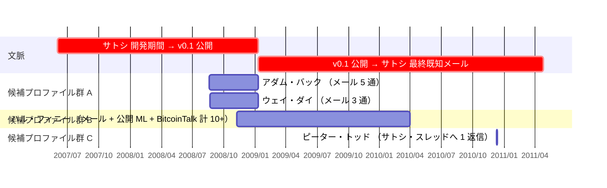
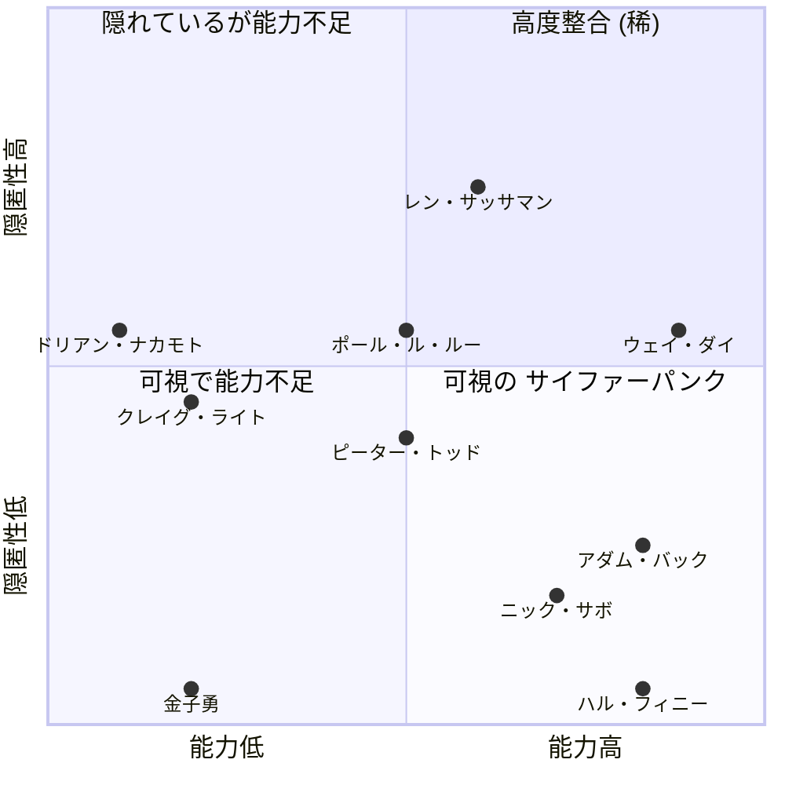

本エントリーは、公的議論で繰り返し取り上げられる、サトシ・ナカモトの正体候補を比較する。各候補は、サトシに関する公的記録から導出される輪郭に照らして測られる：

- ホワイトペーパーで明示的に引用された Hashcash と b-money
- 2008 年 8 月のアダム・バックとウェイ・ダイとの公開前通信
- 2014 年のウェイ・ダイの識別性論 — サトシは 2007〜2008 年の開発期間中、可視のサイファーパンクとして活動していなかった、という読み（[サイファーパンク独立到達分析](/BitcoinArchive/ja/entries/analysis/2008-10-31-cypherpunk-independent-arrival/) と整合）
- 19,901 行の v0.1 C++ コードベース
- ネイティブ水準の英語の文体
- 2007 年央から 2008 年 8 月までの 18 か月にわたる集中的な開発期間
- 2011 年 4 月の撤退

7 次元のプロファイル比較表（§1）は、候補をこの輪郭に照らして並列する。個別の仮説エントリーがある候補については、深い扱いはそちらに譲る (表の「個別」 列を参照)。それ以外の候補は本エントリー内で扱う。

本エントリーは「最も蓋然性の高いサトシ候補」 を指名しない。

## 1. 候補プロファイル比較表

| 候補 | 個別 | サイファーパンク | ビットコイン系譜 | 実装能力 | 貨幣設計 | 英語水準 | タイミング | 可視性低 | 外部的状況 |
|---|---|---|---|---|---|---|---|---|---|
| [アダム・バック](/BitcoinArchive/ja/participants/adam-back/) | [正体](/BitcoinArchive/ja/entries/analysis/2026-04-08-adam-back-satoshi-identity-hypothesis/) | 🟢 | 🟢 | 🟢 | 🟡 | 🟢 | 🔴 | 🟡 | 自己否定（NYT 2026 調査） |
| [ウェイ・ダイ](/BitcoinArchive/ja/participants/wei-dai/) | [正体](/BitcoinArchive/ja/entries/analysis/2008-08-22-wei-dai-satoshi-identity-hypothesis/) | 🟢 | 🟢 | 🟢 | 🟢 | 🟢 | 🔴 | 🟢 | 自己否定／公開前通信は第三者応答として読める |
| [ハル・フィニー](/BitcoinArchive/ja/participants/hal-finney/) | [正体](/BitcoinArchive/ja/entries/analysis/2014-03-25-hal-finney-satoshi-identity-hypothesis/) | 🟢 | 🟢 | 🟢 | 🟡 | 🟢 | 🔴 | 🔴 | 自己否定／Patoshi 不一致／レース日のアリバイ |
| [ニック・サボ](/BitcoinArchive/ja/participants/nick-szabo/) | [正体](/BitcoinArchive/ja/entries/analysis/2013-12-05-szabo-satoshi-identity-hypothesis/) | 🟢 | 🟢 | 🔴 | 🟢 | 🟢 | 🔴 | 🟡 | 自己否定 |
| [ドリアン・ナカモト](/BitcoinArchive/ja/participants/dorian-nakamoto/) | — | 🔴 | 🔴 | 🔴 | 🔴 | 🟡 | 🔴 | 🟢 | 自己否定／p2pfoundation 復帰 |
| [クレイグ・ライト](/BitcoinArchive/ja/participants/craig-wright/) | — | 🔴 | 🔴 | 🔴 | 🔴 | 🟢 | 🔴 | 🟢 | COPA 対ライト（2024）敗訴 |
| [ポール・ルルー](/BitcoinArchive/ja/participants/paul-le-roux/) | — | 🟡 | 🔴 | 🟢 | 🔴 | 🟢 | 🔴 | 🟢 | 未決着（2012 年〜服役中） |
| [レン・サッサマン](/BitcoinArchive/ja/participants/len-sassaman/) | [正体](/BitcoinArchive/ja/entries/analysis/2011-07-03-sassaman-satoshi-identity-hypothesis/) | 🟢 | 🔴 | 🟢 | 🔴 | 🟢 | 🟢 | 🟡 | 未決着 |
| [ピーター・トッド](/BitcoinArchive/ja/participants/peter-todd/) | [正体](/BitcoinArchive/ja/entries/analysis/2024-10-08-todd-satoshi-identity-hypothesis/) | 🔴 | 🔴 | 🟢 | 🟡 | 🟢 | 🔴 | 🟢 | 自己否定（HBO 2024 ドキュメンタリー） |
| [金子勇](/BitcoinArchive/ja/participants/isamu-kaneko/) | [正体](/BitcoinArchive/ja/entries/analysis/2013-07-06-kaneko-isamu-satoshi-identity-hypothesis/) | 🔴 | 🔴 | 🟢 | 🔴 | 🔴 | 🔴 | 🔴 | 未決着 |

**色の意味：** 🟢＝サトシの公的プロファイルと整合／🔴＝整合しない／🟡＝部分的または混在する整合（各列の判定基準は §2 方法論を参照）。

**表の読み方：**

- 次元は二つのグループに分かれて互いに引っ張り合う（背景・能力 vs 隠匿性）。**🟢 数を全列で単純合計して「サトシ度」 として扱うのは誤解を招く**。詳しくは §2 方法論を参照。
- プロファイル比較は *必要だが十分ではない* 条件。「外部的状況」 列は外部的証拠（自己否定、判決、技術的論破）を示し、プロファイル比較とは独立に候補を除外する場合がある。
- 本アーカイブに個別の仮説エントリーがない候補のセルは、公的記録の最も広く受け入れられた読みに基づく配置である。

### 文体計量による帰属の記録（別レイヤ、参考）

文体計量によるサトシ特定の研究は、上の構造的プロファイル比較表とは別の方法論的系譜である。最も多く引用される 4 件は、候補プールの設計・距離指標・コーパスの境界に応じて異なる首位候補を生んでいる。構造的比較表（英語水準・サイファーパンクフォーラム等）は前提条件を記述するもので、下の文体計量の記録は結果を記述するものである — 両者は同じレイヤではない。

| 候補 | [Skye Grey 2013](/BitcoinArchive/ja/entries/aftermath/2013-12-05-techcrunch-skye-grey-szabo-stylometric/)（単独仮説） | [アストン 2014](/BitcoinArchive/ja/entries/aftermath/2014-04-16-aston-university-szabo-stylometric-study/)（11 候補） | [ヴァン・ドルスト 2024](/BitcoinArchive/ja/entries/aftermath/2024-04-13-van-dorst-where-is-satoshi-stylometric-corpus/)（75,000+）／[再分析](/BitcoinArchive/ja/entries/analysis/2026-05-03-van-dorst-corpus-reanalysis-named-candidates/) | [カフィエロ／カレイロウ NYT 2026](/BitcoinArchive/ja/entries/aftermath/2026-04-08-nyt-carreyrou-adam-back-satoshi-investigation/)（12 候補、広範プール 620） |
|---|---|---|---|---|
| [アダム・バック](/BitcoinArchive/ja/participants/adam-back/) | — | 順位非公開 | 3 位 | **首位** |
| [ウェイ・ダイ](/BitcoinArchive/ja/participants/wei-dai/) | — | 順位非公開 | 4 位 | 順位非公開 |
| [ハル・フィニー](/BitcoinArchive/ja/participants/hal-finney/) | — | 順位非公開 | 2 位 | 2 位 |
| [ニック・サボ](/BitcoinArchive/ja/participants/nick-szabo/) | **首位** | **首位** | **首位** | 順位非公開 |
| [レン・サッサマン](/BitcoinArchive/ja/participants/len-sassaman/) | — | 候補集合に未収録 | 5 位 | 候補集合に未収録 |

**文体計量レイヤの読み方：** サボが最も高頻度で首位に位置づけられる候補として浮上する — 4 件のうち 3 件が名指し候補内でサボを最上位に置く：Skye Grey 2013（名指し）、アストン 2014（名指し）、[Bitcoin Institute による再分析](/BitcoinArchive/ja/entries/analysis/2026-05-03-van-dorst-corpus-reanalysis-named-candidates/)によるヴァン・ドルストの公開データ（5 名中サボが首位）。アダム・バックを名指したのはカフィエロ／カレイロウ 2026 のみであり、カフィエロ自身がその結果を「不確定」 と評している（ハル・フィニーがほぼ同点）。ただし収束は部分的である：[ヴァン・ドルストの 75,000 人著者コーパス全体](/BitcoinArchive/ja/entries/aftermath/2024-04-13-van-dorst-where-is-satoshi-stylometric-corpus/)では、サボより近い無名著者が 594 名存在し、ヴァン・ドルスト本人は首位候補の指名を避けている。文体計量は候補空間を絞り込むが、単一の人物を特定はしない。

### 直接通信の記録（別レイヤ、参考）

サトシが各候補と実際にどの程度通信したかは、能力プロファイルや文体計量とは独立した観察可能な事実として記録できる。アーカイブ収録の通信を候補ごとに集計すると、対比が明確になる：4 名の候補が何らかの形で記録された通信を持ち（うち 1 名はサトシ・スレッドへの返信のみ）、6 名の候補はサトシとの直接接触の記録が一切ない。

**名指し候補とサトシの直接通信記録（アーカイブ収録分）**

通信を**種別**で見ると構造が異なる：

| 種別 | 候補 | 性質 |
|---|---|---|
| **メール往復** | アダム・バック、ウェイ・ダイ | サトシがホワイトペーパー公開直前に「先行研究を引用したい」 旨で第三者として接触 |
| **メール＋公開言論** | ハル・フィニー | RPOW 経験者として技術応答を継続。メール＋暗号学メーリングリスト返信＋BitcoinTalk 投稿にわたる |
| **公開フォーラムスレッドへの返信** | ピーター・トッド | retep アカウントでサトシ提案スレッドに 1 返信。「直接接触」 ではないが [HBO ドキュメンタリー](/BitcoinArchive/ja/entries/aftermath/2024-10-08-hbo-money-electric-peter-todd/)が特定根拠とした |
| **通信記録なし** | ニック・サボ、レン・サッサマン、金子勇、ドリアン・ナカモト、クレイグ・ライト、ポール・ル・ルー | サトシは公開前に**バック → ウェイ・ダイ** 経由で先行研究系譜を確認したのみで、これら 6 名のいずれにも接触しなかった |

**直接通信レイヤの読み方：** 通信があったか否かは仮説評価に対して両刃である：
- **接触あり** はサトシが第三者として扱った証拠でもあり得る — バックとウェイ・ダイへの公開前メールは、両仮説（バック＝サトシ、ウェイ・ダイ＝サトシ）に対する主要な反証材料として機能する（[サトシ識別の非対称性](/BitcoinArchive/ja/entries/analysis/2008-10-31-satoshi-identification-asymmetry/) §2 参照）
- **接触なし** は隠匿成功または接触対象外の二通りの読みに分かれる — サボは公開言論で活動していたが直接通信なし、サッサマン・金子は活動領域が異なり通信なし、ドリアン・ライト・ル・ルーは身元主張または名前一致のみで実体的接触なし

通信の有無それ自体は仮説を選ばないが、能力プロファイル・文体計量と組み合わせて読むときに候補の構造的位置を補強する第三のレイヤとして機能する。

## 2. 方法論

**プロファイル整合の次元。** §1 の比較表で用いる 7 次元は、サトシに関する公的記録の輪郭から導出される：

- *サイファーパンクフォーラムへの参加*：サイファーパンクメーリングリスト、metzdowd Cryptography List、または関連フォーラムへの記録された参加。ウェイ・ダイの 2014 年の識別性論（LessWrong の AALWA スレッド）は、サトシが 2007〜2008 年の開発期間中、これらのフォーラムで *目に見えて* 活動してはいなかった、という読解を支持する。
- *ビットコインに隣接する知的系譜*：Hashcash、b-money、Bit Gold、RPOW、または関連するデジタルキャッシュ／プルーフ・オブ・ワーク提案に関する記録された仕事、もしくは詳細な引用。
- *実装能力*：ビットコイン v0.1 の 19,901 行 C++ コードベースに匹敵する規模 — 暗号ライブラリ、P2P システム、匿名ネットワーク、または同等の規模・エンジニアリング複雑度を持つ完成したアプリケーション — を書いて公開した、生涯にわたる記録。本次元は具体的に *ビットコインソースレベル* の実装能力を測るもので、一般的なプログラミング教養ではない。2008 年以前に厳密に限定しないのは、サトシ＝仮名の構造上、本人の 2008 年以前の実装記録は隠されているため：公開後の能力実証（Bitcoin Core への貢献、関連する暗号プロジェクト、主要なエンジニアリング職位など）も、根底にある能力の証拠として扱う。本次元は数千行規模の公開実績を持つ候補と、理論家・学者・小規模な貢献者を区別する。
- *貨幣設計*：デジタルキャッシュ／貨幣システムのメカニズム — プルーフ・オブ・ワーク・トークン、希少性メカニズム、手数料市場、マイニングインセンティブ、分散発行スキーム — に関する記録された思考。ビットコイン v0.1 は暗号工学・分散システム工学（実装能力でカバー）だけでなく、貨幣メカニズム設計に関する一貫した思考も必要とした。本次元はその側面を分離する。コードを公開せずに貨幣メカニズムを設計した理論家（例：Bit Gold のサボ）はここで 🟢、実装能力で 🔴 となる。逆に、貨幣システム関連の仕事が記録になく実装のみ持つ候補（Mixmaster のサッサマン、E4M のルルー、Winny の金子）は逆の組合せになる。
- *ネイティブ水準の英語の文体*：サトシのホワイトペーパー、BitcoinTalk 投稿、メール通信に見られる慣用句、文体切り替え、文学的な流暢さに比肩する英語水準。
- *サトシの沈黙に対する密なタイミング*：候補の記録された大きな人生の出来事（死、退職など）が、サトシの最後の既知の通信（2011 年 4 月 26 日のギャビン・アンドレセン宛てメール）にどの程度近いか。
- *2007〜2008 年開発期間中の公的可視性の低さ*：候補が、その時期の記録された活動に公的な痕跡を残さずに、18 か月の集中開発期を遂行できた蓋然性の度合い。

**両グループの対立構造。** 7 次元は二つのグループに分かれ、互いに引っ張り合う：

1. *背景と能力* — サイファーパンク、ビットコイン系譜、実装能力、貨幣設計、英語水準。ここでの 🟢 は、候補がビットコイン開発に必要なもの — サイファーパンク的な知的環境、デジタルキャッシュの思考、関連スケールでのコード公開能力、ほぼネイティブの英語文体 — を持っていたことを意味する。
2. *隠匿性* — タイミング、可視性低。ここでの 🟢 は、候補の記録されたプロファイルがウェイ・ダイ 2014 年の識別性論（サトシは 2007〜2008 年開発期間中、可視のサイファーパンクとして活動していなかった）と整合し、サトシの 2011 年 4 月の沈黙にいくらか人生上の出来事が一致することを意味する。

サイファーパンク思想家として可視に活動していた候補ほど（グループ 1）、識別を逃れて隠れ続けていた可能性は低い（グループ 2）。表を読む際は 🟢 数を合計するのではなく、両グループを別個に保持して読む必要がある。「両グループ全 🟢」 の候補は構造的に稀である：サイファーパンク能力に深く埋め込まれていながら *かつ* 開発期間中は完全に不可視だった、という像を同時に満たす人物。

**プロファイル整合は必要だが十分ではない。** プロファイル整合だけで仮説が決まることはない。「外部的状況」 列（自己否定、判決、技術的論破）は独立に作用し、いくつかの候補では決定的になる。プロファイル整合と外部的状況を組み合わせて見たときの個別候補の解釈は §4 横断的な観察を参照。

### 能力 × 隠匿性マップ

各候補を、能力スコア（x 軸、能力 5 次元の平均）と隠匿性スコア（y 軸、隠匿性 2 次元の平均）の 2 次元空間にプロット。🟢 = 1、🟡 = 0.5、🔴 = 0 で換算。マップは §4 の横断的観察を空間的に可視化する：サトシが引用したサイファーパンク候補（アダム・バック、ウェイ・ダイ、ハル・フィニー、サボ）は能力高・隠匿性低の帯に集中、サッサマンが能力高・隠匿性高の象限に唯一位置、ライト・ドリアン・金子勇は能力低の領域。

**候補プロファイル、能力 vs 隠匿性**

クラスタの形は §4 が文章で述べる観察と同じ：能力と隠匿性は引っ張り合うため、能力高・隠匿性高の象限は構造的に埋まりにくい。サッサマンがその象限に位置するのは専門領域分離（匿名性研究で可視、デジタルキャッシュで不可視）のため。ウェイ・ダイは専門領域シフトで近づく（1990 年代はメーリングリスト活動的、2007〜2008 年は Crypto++ 保守）。他の候補はこのトレードオフをそのまま受ける。

## 3. 候補プロファイル

候補は、サトシ正体問題の議論にどう登場したかで 3 群に分かれる：

- **A. サトシがホワイトペーパーで明示的に引用したサイファーパンク** — アダム・バック、ウェイ・ダイ
- **B. 能力整合の高いサイファーパンク** — ハル・フィニー、ニック・サボ、レン・サッサマン
- **C. 第三者発掘・自称・名前一致で浮上した候補** — ドリアン・プレンティス・サトシ・ナカモト、クレイグ・ライト、ピーター・トッド、金子勇、ポール・ルルー

各候補は同じ細部構造で扱う：経歴、仮説（提唱者と時期）、最も強い支持論点、最も強い反証、外部的状況。個別仮説エントリーがある候補（上記の「個別エントリー」 列にリンク）については、本 §3 のプロファイルは経歴と外部的状況のみ残し、主張・支持論点・反証・より広い記録の検討は個別エントリー側に委ねる。個別エントリーは同じテンプレート（§1 主張 → §2 支持論点 → §3 反証 → §4 より広い公開記録 → §5 限界）をより詳細に展開する。

### A. サトシがホワイトペーパーで明示的に引用したサイファーパンク

#### アダム・バック

**経歴。** イギリスの暗号学者（1970 年生まれ）、エクセター大学で計算機科学博士号、*Hashcash*（1997 年）の考案者。Blockstream の共同創業者・CEO（2014 年）。サトシがビットコインについて最初に接触した既知の人物（2008 年 8 月 20 日）。

**外部的状況。** 自己否定（最も顕著なのは [2024 年 2 月の COPA 対ライト裁判での証言](/BitcoinArchive/ja/entries/aftermath/2024-02-21-adam-back-retrospective-testimony/) で、サトシとの完全な通信記録を宣誓のもと証人証拠として提出）／公開前通信は第三者応答として読める。→ [アダム・バック＝サトシ正体仮説エントリー](/BitcoinArchive/ja/entries/analysis/2026-04-08-adam-back-satoshi-identity-hypothesis/) に Hashcash の作者相関論点、2008 年 8 月のメール構造による反証、[2026 年 4 月の NYT 文体計量調査](/BitcoinArchive/ja/entries/aftermath/2026-04-08-nyt-carreyrou-adam-back-satoshi-investigation/) の扱いを記載。

#### ウェイ・ダイ

**経歴。** 中国系米国人の暗号学者、Crypto++ ライブラリ（広く使われているオープンソース暗号ライブラリ）の作者、デジタルキャッシュ提案 *b-money*（1998 年）の設計者。b-money は Hashcash とともにビットコインのホワイトペーパーで引用された。1990 年代後半のサイファーパンクメーリングリスト参加者。

**外部的状況。** 自己否定（[2014 年 1 月の LessWrong AALWA 回顧](/BitcoinArchive/ja/entries/aftermath/2014-01-12-wei-dai-retrospective-on-satoshi/) で自身をサトシと明示的に区別）／2008 年 8 月の公開前通信は第三者応答として読める／2014 年回想の「サトシは以前から活動していた人物ではない」 という記述は自己作者と整合しない。 → [ウェイ・ダイ＝サトシ正体仮説エントリー](/BitcoinArchive/ja/entries/analysis/2008-08-22-wei-dai-satoshi-identity-hypothesis/) で、b-money 概念近接論点、Crypto++ コードベース依存論点、2008 年 8 月の通信構造による反証、文体計量での距離（広範コーパスで上位 22.99%）の検討を全文で扱う。

### B. 能力整合の高いサイファーパンク

#### ハル・フィニー

**経歴。** サイファーパンク（ハロルド・トーマス・フィニー二世、1956 年 5 月 4 日〜2014 年 8 月 28 日）、カリフォルニア工科大学工学卒、PGP 2.0 の主要開発者の一人、Reusable Proof-of-Work（RPOW）の考案者。2009 年 1 月 9 日（ビットコイン v0.1 のリリース日）にフィニーはソフトウェアをダウンロードし、サトシ以外で最初にビットコインノードを稼働させた人物となった。2009 年 1 月 11 日には「Running bitcoin」 とツイート。2009 年 1 月 12 日にはサトシからブロック 170 で 10 BTC を受け取った — 人類初のビットコイン取引。フィニーはカリフォルニア州テンプル市に約 10 年間居住しており — Newsweek が後にドリアン・プレンティス・サトシ・ナカモトを特定したのと同じ町で「数ブロック先」 だった。

**外部的状況。** 自己否定（2013 年 3 月の[「ビットコインと私」](/BitcoinArchive/ja/entries/aftermath/2013-03-19-bitcoin-and-me-hal-finney/) でサトシを別人として記述）／[Patoshi マイニングパターン](/BitcoinArchive/ja/entries/aftermath/2013-04-17-sergio-lerner-patoshi-analysis/) と記録された控えめな保有量の不整合／2009 年 4 月 18 日のレース当日アリバイの当時記録。 → [ハル・フィニー = サトシ仮説エントリー](/BitcoinArchive/ja/entries/analysis/2014-03-25-hal-finney-satoshi-identity-hypothesis/) で、RPOW 先駆論、レース当日アリバイ（[グリーンバーグ 2014 Forbes 記事](/BitcoinArchive/ja/entries/aftermath/2014-03-25-greenberg-forbes-nakamotos-neighbor/) が初出、[ロップ 2023](/BitcoinArchive/ja/entries/aftermath/2023-10-21-lopp-hal-finney-not-satoshi/) が構造化）、「ビットコインと私」 の第三者的記述、Patoshi 規模の不整合、2010 年 8 月の特異点サミット／ALS 進行のアリバイを全文の詳細で扱う。

#### ニック・サボ

**経歴。** 計算機科学者・法学者・暗号学者（1964 年生まれ）。「スマートコントラクト」 という用語を 1994 年に提唱。プルーフ・オブ・ワークに基づく分散型デジタル通貨提案 [*Bit Gold*](/BitcoinArchive/ja/entries/aftermath/2008-04-27-nick-szabo-bit-gold-implementation-request/) の設計者で、1998 年に構想、2005 年 12 月 29 日に Unenumerated ブログで完全な設計を公開。

**外部的状況。** 自己否定（複数回：2014 年フリスビー宛メール、2015 年 NYT ポッパー宛メール返信、2017 年ティム・フェリス・ショウほか）。→ [サボ＝サトシ仮説エントリー](/BitcoinArchive/ja/entries/analysis/2013-12-05-szabo-satoshi-identity-hypothesis/) に Bit Gold の概念的近接論点、文体計量分析（Skye Grey 2013、アストン大学 2014、NYT ポッパー 2015）、状況証拠的なパターン一致（4 月 5 日誕生日一致・ハンガリー系の系譜・ティム・フェリス・ショウ番組内の「I designed bitcoi…gold」 言い間違え）、反証（2008 年 4 月の Bit Gold 実装支援募集コメント、2011 年 5 月「Nakamoto improved my design」 ブログ、2007〜2008 年の継続的な Unenumerated 活動、C++ 公開コードの不在）の検討を記載。

#### レン・サッサマン

**経歴。** サイファーパンク暗号学者（1980–2011 年）、Mixmaster 匿名リメイラーのリード開発者、KU ルーヴェン大学の博士課程在籍者。サトシの最後の文書化されたメールから 3 か月後の 2011 年 7 月 3 日に自殺。

**外部的状況。** 未決着。→ [サッサマン＝サトシ仮説エントリー](/BitcoinArchive/ja/entries/analysis/2011-07-03-sassaman-satoshi-identity-hypothesis/) にタイミング論点・サイファーパンクとしての経歴論・反証（直接の文書接続なし、KU ルーヴェン博士課程の負荷、パターソンの正体問題への沈黙）の検討を記載。

### C. 第三者発掘・自称・名前一致で浮上した候補

#### ドリアン・プレンティス・サトシ・ナカモト

**経歴。** 日系米国人技術者（1949 年大分県別府市生まれ、1959 年に米国へ移住）、防衛システム関連の経歴を持つ。カリフォルニア州テンプル市、ハル・フィニーの数ブロック先に居住。

**仮説。** 2014 年 3 月 6 日、[Newsweek（リア・マグラス・グッドマン記者）が主に名前の一致を根拠にサトシ候補として特定](/BitcoinArchive/ja/entries/aftermath/2014-03-06-newsweek-dorian-nakamoto/)。

**支持論点。** 名前の一致（文字通り「サトシ・ナカモト」）。防衛システム工学の経歴。ハル・フィニーへの地理的近接性は仮名由来説を支える可能性がある。

**反証。** コードベースとの技術的接続は確認されていない。サイファーパンク経歴なし、ビットコインに隣接する知的系譜なし、ビットコイン v0.1 規模のプログラミング記録なし。ドリアン・ナカモトは Newsweek 記事後の取材で、ビットコインへの関与を強く繰り返し否定した（弁護士を立て、AP 通信に詳細なインタビューを行い否定を再確認した）。グッドマン記者の玄関先での質問を、自身が以前従事していた機密防衛関連の仕事についての質問だと誤解した、と述べている。Newsweek 記事の翌日、[サトシの p2pfoundation アカウントが短く復帰し「私はドリアン・ナカモトではない」と投稿](/BitcoinArchive/ja/entries/aftermath/2014-03-07-satoshi-p2p-foundation-return/)（投稿の真偽は議論あり、アカウントが乗っ取られた可能性も）。ビットコインコミュニティはドリアン・ナカモトに 67 BTC 以上の寄付を集めた。

**外部的状況。** 自己否定／p2pfoundation 復帰。

#### クレイグ・ライト

**経歴。** オーストラリアの計算機セキュリティ関係者。

**仮説。** ライトは 2015 年末から 2016 年にかけて、自身がサトシだと主張し始めた（[Wired と Gizmodo による初期の特定（2015 年 12 月）](/BitcoinArchive/ja/entries/aftermath/2015-12-08-wired-gizmodo-craig-wright-claims/)、[BBC・*The Economist* での自称（2016 年 5 月）](/BitcoinArchive/ja/entries/aftermath/2016-05-02-craig-wright-bbc-economist-claim/)）。本仮説は完全に自称に依拠する — 他に支持する証拠の系統はない。

**支持論点。** 自称（他に支持する証拠なし）。

**反証。** ライトが試みた[暗号「証明」（2016 年 5 月）](/BitcoinArchive/ja/entries/aftermath/2016-05-02-craig-wright-bbc-economist-claim/) は速やかに論破された — 新しい署名を生成するのではなく、2009 年のトランザクションの署名を再利用していた。[COPA 対ライト裁判（イングランド・ウェールズ高等法院、メラー裁判官の判決、2024 年 3 月 14 日）](/BitcoinArchive/ja/entries/aftermath/2024-03-14-copa-v-wright-ruling/) は 4 つの認定を行った：ライトはビットコインホワイトペーパーの著者ではなく、2008〜2011 年にサトシとして活動した人物でもなく、ビットコインシステムの創造者でもなく、初期のビットコインソフトウェアの作成者でもない。判決は、ライトが「自身がサトシ・ナカモトであるという虚偽の主張を支えるために、意図的かつ大規模な文書偽造に従事した」 と結論した。1990 年代のサイファーパンクメーリングリストへの記録された参加なし、2008 年以前のビットコインに隣接する知的仕事の公的記録なし。

**外部的状況。** COPA 対ライト（2024）4 認定で敗訴／意図的な文書偽造の法廷認定／論破された暗号証明。

#### ピーター・トッド

**経歴。** カナダ人のビットコインコア開発者（1985 年生まれ）、2012 年頃以降の主要な貢献者の一人で、Replace-by-Fee（RBF）などコアプロトコルの仕事で知られる。OCAD University 卒（Integrated Media 専攻、2011 年）。BitcoinTalk への登録は 2010 年 12 月 7 日、ユーザー名「retep」。

**外部的状況。** 自己否定（HBO 後）／コミュニティによる根拠の批判。→ [ピーター・トッド＝サトシ正体仮説エントリー](/BitcoinArchive/ja/entries/analysis/2024-10-08-todd-satoshi-identity-hypothesis/) に [HBO 2024 ドキュメンタリーの主張](/BitcoinArchive/ja/entries/aftermath/2024-10-08-hbo-money-electric-peter-todd/)の分析的扱いを記載。

#### 金子勇

**経歴。** 日本の研究者（1970–2013 年）、P2P ファイル共有ソフト *Winny*（2002 年公開）の開発者。2004–2011 年に著作権法違反幇助の刑事裁判の被告人だった（2011 年 12 月、最高裁で無罪確定）。2013 年 7 月 6 日に心筋梗塞で死去。

**外部的状況。** 未決着。→ [金子勇＝サトシ正体仮説エントリー](/BitcoinArchive/ja/entries/analysis/2013-07-06-kaneko-isamu-satoshi-identity-hypothesis/) に分析的扱いを記載。

#### ポール・ルルー

*[補足：本アーカイブには[ルルー伝記](/BitcoinArchive/ja/participants/paul-le-roux/) を保持しているが、それ以外のルルーの一次資料エントリー（E4M サイファーパンク告知・刑事事件文書・Mastermind 章抜粋）は保持していない。以下の概略は外部ソース — 主にジャーナリストのエヴァン・ラトリフの『The Mastermind』（Random House、2019 年）および Atavist の長編記事 — と公開記録に基づく。具体的な日付や記述はアーカイブ検証ではなく外部由来として扱われたい。]*

**経歴。** 南アフリカ／ジンバブエ出身の元暗号ソフトウェア開発者（1999 年に *E4M* というオープンソースのディスク暗号化ソフトウェアを開発、後の TrueCrypt の基盤）。2002 年頃から、オンライン薬局、武器密売、覚醒剤製造を含む国際的な犯罪組織の運営に転じた。2012 年 9 月に米国当局に逮捕、公的報道によれば長期の連邦刑期に服している。

**仮説。** ジャーナリストのエヴァン・ラトリフの取材と書籍『The Mastermind』（Random House、2019 年）と Atavist の長編記事を通じてサトシ候補として特定された。

**支持論点。** 技術力の整合：オープンソース暗号ソフトウェアの開発経験（E4M）。公的報道では、1999 年のサイファーパンクメーリングリストでの E4M 告知投稿、および 1990 年代後半の Usenet における暗号関連の技術的議論への参加が記録されている。開発期間中の低い公的可視性（隠密活動）— 2007〜2008 年「可視のサイファーパンクコミュニティの構造的に外側」 と整合する。可能な動機：犯罪現在から暗号過去を切り離す。

**反証。** 1999 年のサイファーパンクメーリングリスト参加は、アダム・バックやハル・フィニーなど長期サイファーパンクと比較すると限定的 — 単発の E4M 告知と数件の議論にとどまり、継続的参加ではない（公的報道による）。記録された貨幣設計の仕事なし。2002 年以降の犯罪事業は物流・運営に集中しており、暗号工学ではない — E4M 以降のビットコインソースレベルの公開記録はない。本仮説は能力 + 隠匿性 + 動機の整合に依拠し、すべて状況証拠。直接の文書接続なし、漏洩した通信もなし。

**外部的状況。** 未決着（服役中）。ルルーは獄中から本仮説について公的に発言していない。

## 4. 横断的な観察

- **ウェイ・ダイは「ほぼ全 🟢」 に最も近い候補 — それでも外部的状況で除外されている。** 7 次元中 🟢 が 6 つ、🔴 はタイミングのみ。1998 年の b-money 提案後、メーリングリスト投稿頻度が下がり 2007〜2008 年は Crypto++ メンテに専念したことで自然に「不可視」 領域に入った。しかしウェイ・ダイ自身は自己否定しており、2008 年 8 月のサトシ公開前通信の受信者でもある（同じ第三者通信の議論はアダム・バックと同様）。プロファイル整合だけでは、最高水準でも決定打にならない。
- **サッサマンは外部的論破がない唯一の高スコア候補 — そのパターンは専門領域分離の副産物。** 彼の 2007〜2008 年の公的活動は匿名性研究専門（Mixmaster、KU ルーヴェン、24C3 と Black Hat 2007 の匿名性関連の講演）にあり、ビットコインのデジタルキャッシュ専門とは隣接しつつ別物。彼は自分の領域では可視だが、ビットコイン領域では不可視でいられた。多くの候補はこの専門領域分離の恩恵を受けず、能力 vs 隠匿性のトレードオフをより直接受ける。
- **「全 🟢」 候補は構造的に稀。** 能力 vs 隠匿性の対立は、サイファーパンク能力に深く埋め込まれていながら *かつ* 開発期間中は完全に不可視だった、という像をほぼ不可能にする。ウェイ・ダイは専門領域の変遷で近づく（1990 年代後半の活発なメーリングリスト参加、2007〜2008 年の Crypto++ メンテへの撤退）。サッサマンは専門領域の分離で近づく（匿名性研究で可視、デジタルキャッシュで不可視）。
- **名前一致（ドリアン）と自称（ライト）は両方とも公的に論破された。** C 群で最も注目された二つの主張は構造的に同じパターンを共有する：両方とも単一の証拠系統（名前または自称）に依拠し、技術的・知的整合の裏付けがなかった。Newsweek の特定はドリアンの繰り返しの否定（弁護士・AP 通信インタビュー）、p2pfoundation アカウントの「私はドリアン・ナカモトではない」 投稿、ジャーナリズム手法への広範な批判によって粉砕された。ライトの自称は COPA 対ライト判決で粉砕された。C 群で未決着の候補（ルルー、金子、トッド）は、自称ではなく能力＋隠匿性の論点で議論される。
- **プロファイル整合は必要だが十分ではない。** プロファイル整合だけで肯定される候補も、否定される候補もない。プロファイル整合と外部的状況の組合せ（および低スコア候補については支持証拠の不在）が、現在の議論における各候補の位置を決める。

## 5. 本エントリーの限界

- 本エントリーは新しい証拠を提示するものではない。公的に利用可能な資料を一つの比較として整理したものである。
- 本エントリーは「最も蓋然性の高いサトシ候補」 を指名しない。プロファイル比較は必要だが十分ではない。外部的状況がいくつかの候補では決定的である。
- プロファイル比較のラベル（🟢、🔴、🟡）は定性的な要約であり、数値的な得点ではない。個別の仮説エントリー、または公的記録の最も広く受け入れられた読みに既に書かれている判定を視覚化したもの。読み手によって個別セルの配置は異なり得る。
- 本エントリーは公的記録を関連証拠基盤と仮定する。非公開の経路、検証不能と称される通信、出典未明な個人的回想に基づく仮説は、本エントリーでは扱わない。
- 固有名候補の集合は閉じていない。他の固有名人物やグループに関する仮説も公的議論には存在する。本エントリーは最も多く議論される十を扱う。
- 個別エントリーがある候補の詳細な扱いは、表の「個別」 列のリンクを参照されたい。他の候補は本アーカイブに個別の仮説エントリーを持たない。
