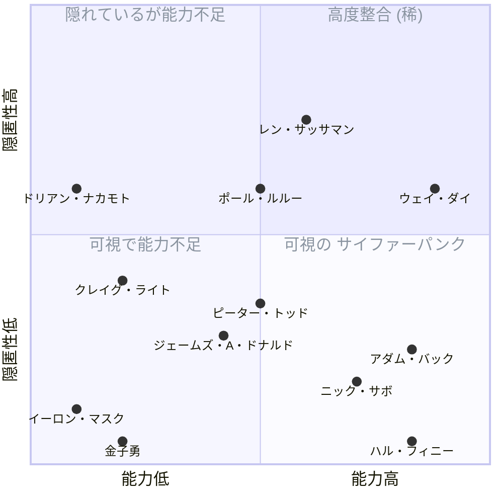
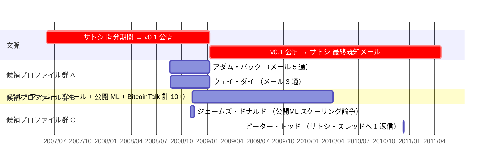

12 人の名指し候補、サトシの公的記録から導かれる 7 つの次元。どの候補も 7 つすべてに合致しない —— それぞれが少なくとも 1 つの次元で破綻する。本エントリーは名指し候補を 4 つの独立した構造的レイヤ —— プロファイル整合（§2）、文体計量による帰属（§3）、直接通信（§4）、開発環境（§5）—— に並列比較し、各プロフィールがどこで破綻するかを記す。各候補は、以下の[サトシ](/BitcoinArchive/ja/participants/satoshi-nakamoto/)に関する公的記録から導かれる輪郭に照らして比較する：

- ホワイトペーパーで明示的に引用された Hashcash と b-money
- 2008 年 8 月のアダム・バックとウェイ・ダイとの公開前通信
- 2014 年のウェイ・ダイの識別性論 — サトシは 2007〜2008 年の開発期間中、可視のサイファーパンクとして活動していなかった（[サイファーパンク独立到達分析](/BitcoinArchive/ja/entries/analysis/2008-10-31-cypherpunk-independent-arrival/)と整合）
- 19,901 行の v0.1 C++ コードベース
- ネイティブ水準の英語の文体
- 約 18 か月の集中的なコーディング期間 (2007 年半ばから v0.1 リリースの 2009 年 1 月まで、実装作業は 2008 年 8 月までに実質的に完了。ホワイトペーパーはコードが実質的に完了した後に書かれた ― サトシからハル・フィニーへの 2008 年 11 月 10 日のメールによる)。これは、サトシが後に「2007 年から」「リリース前に 2 年間の開発」と述べた約 2 年のリリース前作業の中にある
- 2011 年 4 月の撤退

4 つの構造的レイヤは互いに置換可能ではない。それぞれが候補空間を異なる方向で絞り込む。各名指し候補には個別の仮説エントリーがあり、深い扱いはそちらに譲る（各表の「個別」列を参照）。

**2024-2026 年のサトシ特定の波。** 2024 年後半以降、主要メディア / ドキュメンタリーによる特定が 4 件相次いだ。それぞれ依拠する根拠が違う ― [HBO『Money Electric』によるピーター・トッド特定](/BitcoinArchive/ja/entries/aftermath/2024-10-08-hbo-money-electric-peter-todd/) (2024 年 10 月、フォーラム投稿のタイミング論)、 [NYT カレイロウのアダム・バック調査](/BitcoinArchive/ja/entries/aftermath/2026-04-08-nyt-carreyrou-adam-back-satoshi-investigation/) (2026 年 4 月、文体計量による単独候補名指し)、 [サトシ複数人説 ― 『Finding Satoshi』ドキュメンタリー](/BitcoinArchive/ja/entries/aftermath/2026-04-22-finding-satoshi-finney-sassaman-documentary/) (2026 年 4 月、活動時刻と遺族証言にもとづく ― 共作者の同定・論拠・反証は §8.1)、そして他とは経路の違う[サトシ政府機関説 ― Murphy 対 DHS FOIA 訴訟](/BitcoinArchive/ja/entries/aftermath/2025-04-07-murphy-v-dhs-foia-lawsuit/) (2025 年 4 月、政府文書開示請求 ― 論拠・反証は §8.2)。いずれも暗号学的確認は得られていない。以下の比較表は、この波で出た証拠が候補の状況を動かす範囲で取り込んでいる。

## 1. 候補一覧

12 人の名指し候補は、サトシ正体問題の議論にどう登場したかで 3 群に分かれる：

- **A. サトシがホワイトペーパーで明示的に引用したサイファーパンク** — アダム・バック、ウェイ・ダイ
- **B. 能力整合の高いサイファーパンク** — ハル・フィニー、ニック・サボ、レン・サッサマン
- **C. 第三者発掘・自称・名前一致で浮上した候補** — ドリアン・プレンティス・サトシ・ナカモト、クレイグ・ライト、ピーター・トッド、金子勇、ポール・ルルー、イーロン・マスク、ジェームズ・A・ドナルド

<!-- chart: identity-suspect-map -->

候補ごとの経歴はバイオ（§2.1 表の人名リンク）、外部的状況は §2.1 表の「外部的状況」列にまとめる。各候補は同表「個別」列から専用の正体ページへリンクし、そこで論述が全面的に展開される。4 つのレイヤ（§2 〜 §5）は、サトシに関する公的記録の輪郭に対して各候補を独立した観点から比較する。4 レイヤを跨いだ横断的観察は §6、組み合わせた限界は §7 で扱う。

## 2. レイヤ 1 — プロファイル整合

### 2.1 比較表

| 候補 | 個別 | サイファーパンク | ビットコイン系譜 | 実装能力 | 貨幣設計 | 英語水準 | タイミング | 可視性低 | 外部的状況 |
|---|---|---|---|---|---|---|---|---|---|
| [アダム・バック](/BitcoinArchive/ja/participants/adam-back/) | [正体](/BitcoinArchive/ja/entries/analysis/2026-04-08-adam-back-satoshi-identity-hypothesis/) | 🟢 | 🟢 | 🟢 | 🟡 | 🟢 | 🔴 | 🟡 | 自己否定（NYT 2026 調査） |
| [ウェイ・ダイ](/BitcoinArchive/ja/participants/wei-dai/) | [正体](/BitcoinArchive/ja/entries/analysis/2008-08-22-wei-dai-satoshi-identity-hypothesis/) | 🟢 | 🟢 | 🟢 | 🟢 | 🟢 | 🔴 | 🟢 | 自己否定／公開前通信は第三者応答として読める |
| [ハル・フィニー](/BitcoinArchive/ja/participants/hal-finney/) | [正体](/BitcoinArchive/ja/entries/analysis/2014-03-25-hal-finney-satoshi-identity-hypothesis/) | 🟢 | 🟢 | 🟢 | 🟡 | 🟢 | 🔴 | 🔴 | 自己否定／Patoshi 不一致／レース日のアリバイ |
| [ジェームズ・A・ドナルド](/BitcoinArchive/ja/participants/james-donald/) | [正体](/BitcoinArchive/ja/entries/analysis/2008-11-02-james-donald-satoshi-identity-hypothesis/) | 🟢 | 🟡 | 🔴 | 🟡 | 🟢 | 🔴 | 🔴 | サトシが第三者扱い／ウォレス除外 |
| [ピーター・トッド](/BitcoinArchive/ja/participants/peter-todd/) | [正体](/BitcoinArchive/ja/entries/analysis/2024-10-08-todd-satoshi-identity-hypothesis/) | 🔴 | 🔴 | 🟢 | 🟡 | 🟢 | 🔴 | 🟢 | 自己否定（HBO 2024 ドキュメンタリー） |
| [ニック・サボ](/BitcoinArchive/ja/participants/nick-szabo/) | [正体](/BitcoinArchive/ja/entries/analysis/2013-12-05-szabo-satoshi-identity-hypothesis/) | 🟢 | 🟢 | 🔴 | 🟢 | 🟢 | 🔴 | 🟡 | 自己否定 |
| [レン・サッサマン](/BitcoinArchive/ja/participants/len-sassaman/) | [正体](/BitcoinArchive/ja/entries/analysis/2011-07-03-sassaman-satoshi-identity-hypothesis/) | 🟢 | 🔴 | 🟢 | 🔴 | 🟢 | 🟢 | 🟡 | 未決着 |
| [ドリアン・ナカモト](/BitcoinArchive/ja/participants/dorian-nakamoto/) | [正体](/BitcoinArchive/ja/entries/analysis/2014-03-06-dorian-nakamoto-satoshi-identity-hypothesis/) | 🔴 | 🔴 | 🔴 | 🔴 | 🟡 | 🔴 | 🟢 | 自己否定／p2pfoundation 復帰 |
| [クレイグ・ライト](/BitcoinArchive/ja/participants/craig-wright/) | [正体](/BitcoinArchive/ja/entries/analysis/2016-05-02-craig-wright-satoshi-identity-hypothesis/) | 🔴 | 🔴 | 🔴 | 🔴 | 🟢 | 🔴 | 🟢 | COPA 対ライト（2024）敗訴 |
| [ポール・ルルー](/BitcoinArchive/ja/participants/paul-le-roux/) | [正体](/BitcoinArchive/ja/entries/analysis/2019-02-19-paul-le-roux-satoshi-identity-hypothesis/) | 🟡 | 🔴 | 🟢 | 🔴 | 🟢 | 🔴 | 🟢 | 未決着（2012 年〜服役中） |
| [イーロン・マスク](/BitcoinArchive/ja/participants/elon-musk/) | [正体](/BitcoinArchive/ja/entries/analysis/2017-11-22-elon-musk-satoshi-identity-hypothesis/) | 🔴 | 🔴 | 🔴 | 🔴 | 🟢 | 🔴 | 🔴 | 本人否定（2017） |
| [金子勇](/BitcoinArchive/ja/participants/isamu-kaneko/) | [正体](/BitcoinArchive/ja/entries/analysis/2013-07-06-kaneko-isamu-satoshi-identity-hypothesis/) | 🔴 | 🔴 | 🟢 | 🔴 | 🔴 | 🔴 | 🔴 | 未決着 |

**色の意味（この表のみ）：** 🟢＝サトシの公的プロファイルと整合／🔴＝整合しない／🟡＝部分的または混在する整合。各列の判定基準は §2.2 を参照。§5 は同じ 3 つの絵文字を別の Phase 1 整合スケールで使用する。両スケールは互換ではない（§5.3 に §5 の凡例、§7 に全体的な注意がある）。

**表の読み方：**

- 次元は二つのグループに分かれて互いに引っ張り合う（背景・能力 vs 隠匿性）。**🟢 数を全列で単純合計して「サトシ度」として扱うのは誤解を招く**。詳しくは §2.2 を参照。
- プロファイル比較は *必要だが十分ではない* 条件。「外部的状況」列は外部的証拠（自己否定、判決、技術的論破）を示し、プロファイル比較とは独立に候補を除外する場合がある。
- セルの色の配置は公的記録の最も広く受け入れられた読みに基づく。各候補の専用の正体ページ（「個別」列のリンク）が、プロファイルを詳しく論じる。

### 2.2 方法論

**プロファイル整合の次元。** §2.1 の比較表で用いる 7 次元は、サトシに関する公的記録の輪郭から導出される：

- *サイファーパンクフォーラムへの参加*：サイファーパンクメーリングリスト、metzdowd Cryptography List、または関連フォーラムへの記録された参加。ウェイ・ダイの 2014 年の識別性論（LessWrong の AALWA スレッド）は、サトシが 2007〜2008 年の開発期間中、これらのフォーラムで *目に見えて* 活動してはいなかった、という読解を支持する。
- *ビットコインに隣接する知的系譜*：Hashcash、b-money、Bit Gold、RPOW、または関連するデジタルキャッシュ／プルーフ・オブ・ワーク提案に関する記録された仕事、もしくは詳細な引用（これらのうちビットコインが何を再利用し、何を借り、何を新たに統合したかについての構成要素単位の分析は[ビットコインの設計系譜分析](/BitcoinArchive/ja/entries/analysis/2008-10-31-bitcoin-design-lineage/)で扱う）。
- *実装能力*：ビットコイン v0.1 の 19,901 行 C++ コードベースに匹敵する規模 — 暗号ライブラリ、P2P システム、匿名ネットワーク、または同等の規模・エンジニアリング複雑度を持つ完成したアプリケーション — を書いて公開した、生涯にわたる記録。本次元は具体的に *ビットコインソースレベル* の実装能力を測るもので、一般的なプログラミング教養ではない。2008 年以前に厳密に限定しないのは、サトシ＝仮名の構造上、本人の 2008 年以前の実装記録は隠されているため：公開後の能力実証（Bitcoin Core への貢献、関連する暗号プロジェクト、主要なエンジニアリング職位など）も、根底にある能力の証拠として扱う。本次元は数千行規模の公開実績を持つ候補と、理論家・学者・小規模な貢献者を区別する。
- *貨幣設計*：デジタルキャッシュ／貨幣システムのメカニズム — プルーフ・オブ・ワーク・トークン、希少性メカニズム、手数料市場、マイニングインセンティブ、分散発行スキーム — に関する記録された思考。ビットコイン v0.1 は暗号工学・分散システム工学（実装能力でカバー）だけでなく、貨幣メカニズム設計に関する一貫した思考も必要とした。本次元はその側面を分離する。コードを公開せずに貨幣メカニズムを設計した理論家（例：Bit Gold のサボ）はここで 🟢、実装能力で 🔴 となる。逆に、貨幣システム関連の仕事が記録になく実装のみ持つ候補（Mixmaster のサッサマン、E4M のルルー、Winny の金子）は逆の組合せになる。
- *ネイティブ水準の英語の文体*：サトシのホワイトペーパー、BitcoinTalk 投稿、メール通信に見られる慣用句、文体切り替え、文学的な流暢さに比肩する英語水準。
- *サトシの沈黙に対する密なタイミング*：候補の記録された大きな人生の出来事（死、退職など）が、サトシの最後の既知の通信（2011 年 4 月 26 日のギャビン・アンドレセン宛てメール）にどの程度近いか。
- *2007〜2008 年開発期間中の公的可視性の低さ*: 候補が、その時期の記録された活動に公的な痕跡を残さずに、約 2 年のリリース前作業 (2007 年半ばからの約 18 か月の集中的コーディングを含む、サトシが後に「2007 年から」「リリース前に 2 年間の開発」と述べたリリース前作業の中で行われたもの) を遂行できた蓋然性の度合い。

**両グループの対立構造。** 7 次元は二つのグループに分かれ、互いに引っ張り合う：

1. *背景と能力* — サイファーパンク、ビットコイン系譜、実装能力、貨幣設計、英語水準。ここでの 🟢 は、候補がビットコイン開発に必要なもの — サイファーパンク的な知的環境、デジタルキャッシュの思考、関連スケールでのコード公開能力、ほぼネイティブの英語文体 — を持っていたことを意味する。
2. *隠匿性* — タイミング、可視性低。ここでの 🟢 は、候補の記録されたプロファイルがウェイ・ダイ 2014 年の識別性論（サトシは 2007〜2008 年開発期間中、可視のサイファーパンクとして活動していなかった）と整合し、サトシの 2011 年 4 月の沈黙にいくらか人生上の出来事が一致することを意味する。

サイファーパンク思想家として目に見える形で活動していた候補ほど（グループ 1）、識別を逃れて隠れ続けていた可能性は低い（グループ 2）。表を読む際は 🟢 数を合計するのではなく、両グループを別々に分けて読む必要がある。「両グループ全 🟢」の候補は構造的に稀である: サイファーパンクの活動に深く関わりながら *かつ* 開発期間中は完全に不可視だった、という像を同時に満たす人物。

**プロファイル整合は必要だが十分ではない。** プロファイル整合だけで仮説が決まることはない。「外部的状況」列（自己否定、判決、技術的論破）は独立に作用し、いくつかの候補では決定的になる。プロファイル整合と外部的状況を組み合わせて見たときの個別候補の解釈は §6 横断的な観察を参照。

### 2.3 能力 × 隠匿性マップ

各候補を、能力スコア（x 軸）と隠匿性スコア（y 軸）の 2 次元空間にプロット。**座標は §2.1 表の厳密な平均ではなく、視覚配置のための概略値**である ― 純粋な平均（🟢 = 1、🟡 = 0.5、🔴 = 0 で換算）だと、一部の候補が境界に張り付いたり（例：ウェイ・ダイの能力 = 1.0、ハル・フィニーと金子勇の隠匿性 = 0）、同じ点に重なったり（ポール・ルルーとピーター・トッドはどちらも [0.5, 0.5]）して、mermaid quadrantChart のレンダリングでラベルが軸タイトルや他のラベルと重なる。各点を内側に約 0.02 〜 0.12 ほどずらしてラベルの可読性を確保している。相対順序（誰が誰より右、誰が誰より上）は表と一致する。マップは §6 の横断的観察を空間的に可視化する：サトシが引用したサイファーパンク候補（アダム・バック、ウェイ・ダイ、ハル・フィニー、サボ）は能力高・隠匿性低の帯に集中、サッサマンが能力高・隠匿性高の象限に唯一位置、ライト・ドリアン・金子勇は能力低の領域。

**候補プロファイル、能力 vs 隠匿性**

```mermaid
%%{init: {'themeVariables': {'quadrant1TextFill': '#8a94a0', 'quadrant2TextFill': '#8a94a0', 'quadrant3TextFill': '#8a94a0', 'quadrant4TextFill': '#8a94a0', 'xAxisTitleFill': '#8a94a0', 'yAxisTitleFill': '#8a94a0'}}}%%
quadrantChart
    x-axis "能力低" --> "能力高"
    y-axis "隠匿性低" --> "隠匿性高"
    quadrant-1 "高度整合 (稀)"
    quadrant-2 "隠れているが能力不足"
    quadrant-3 "可視で能力不足"
    quadrant-4 "可視の サイファーパンク"
    "ウェイ・ダイ": [0.88, 0.6]
    "アダム・バック": [0.83, 0.25]
    "ハル・フィニー": [0.83, 0.05]
    "ニック・サボ": [0.71, 0.18]
    "レン・サッサマン": [0.6, 0.75]
    "ポール・ルルー": [0.5, 0.6]
    "ピーター・トッド": [0.5, 0.35]
    "クレイグ・ライト": [0.2, 0.4]
    "ドリアン・ナカモト": [0.1, 0.6]
    "金子勇": [0.2, 0.05]
    "イーロン・マスク": [0.1, 0.12]
    "ジェームズ・A・ドナルド": [0.42, 0.28]
```

クラスタの形は §6 が文章で述べる観察と同じ：能力と隠匿性は引っ張り合うため、能力高・隠匿性高の象限は構造的に埋まりにくい。サッサマンがその象限に位置するのは専門領域の分離（匿名性研究で可視、デジタルキャッシュで不可視）のため。ウェイ・ダイは専門領域の移行で近づく（1990 年代はメーリングリスト活動的、2007〜2008 年は Crypto++ 保守）。他の候補はこのトレードオフを直接受けることになる。

## 3. レイヤ 2 — 文体計量による帰属

文体計量によるサトシ特定の研究は、§2 の構造的プロファイル整合とは別の方法論的系譜である。最も多く引用される 4 件は、候補プールの設計・距離指標・コーパスの境界に応じて異なる首位候補を生んでいる。§2 のプロファイル整合は前提条件を記述するもので、下の文体計量の記録は結果を記述するものである — 両者は同じレイヤではない。

### 3.1 比較表

| 候補 | [Skye Grey 2013](/BitcoinArchive/ja/entries/aftermath/2013-12-05-techcrunch-skye-grey-szabo-stylometric/) （単独仮説） | [アストン 2014](/BitcoinArchive/ja/entries/aftermath/2014-04-16-aston-university-szabo-stylometric-study/) （11 候補） | [ヴァン・ドルスト 2024](/BitcoinArchive/ja/entries/aftermath/2024-04-13-van-dorst-where-is-satoshi-stylometric-corpus/) （75,000+）／[再分析](/BitcoinArchive/ja/entries/analysis/2026-05-03-van-dorst-corpus-reanalysis-named-candidates/) | [カフィエロ／カレイロウ NYT 2026](/BitcoinArchive/ja/entries/aftermath/2026-04-08-nyt-carreyrou-adam-back-satoshi-investigation/) （12 候補、広範プール 620） |
|---|---|---|---|---|
| [アダム・バック](/BitcoinArchive/ja/participants/adam-back/) | — | 順位非公開 | 3 位 🥉 | 1 位 🥇 |
| [ウェイ・ダイ](/BitcoinArchive/ja/participants/wei-dai/) | — | 順位非公開 | 4 位 | 順位非公開 |
| [ハル・フィニー](/BitcoinArchive/ja/participants/hal-finney/) | — | 順位非公開 | 2 位 🥈 | 2 位 🥈 |
| [ニック・サボ](/BitcoinArchive/ja/participants/nick-szabo/) | 1 位 🥇 | 1 位 🥇 | 1 位 🥇 | 順位非公開 |
| [レン・サッサマン](/BitcoinArchive/ja/participants/len-sassaman/) | — | 候補集合に未収録 | 5 位 | 候補集合に未収録 |

### 3.2 表の読み方

**文体計量レイヤの読み方：** サボが最も高頻度で首位に位置づけられる候補として浮上する — 4 件のうち 3 件が名指し候補内でサボを最上位に置く：Skye Grey 2013（名指し）、アストン 2014（名指し）、[Bitcoin Institute による再分析](/BitcoinArchive/ja/entries/analysis/2026-05-03-van-dorst-corpus-reanalysis-named-candidates/)によるヴァン・ドルストの公開データ（5 名中サボが首位）。アダム・バックを名指したのはカフィエロ／カレイロウ 2026 のみであり、カフィエロ自身がその結果を「不確定」と評している（ハル・フィニーがほぼ同点）。ただし収束は部分的である：[ヴァン・ドルストの 75,000 人著者コーパス全体](/BitcoinArchive/ja/entries/aftermath/2024-04-13-van-dorst-where-is-satoshi-stylometric-corpus/)では、サボより近い無名著者が 594 名存在し、ヴァン・ドルスト本人は首位候補の指名を避けている。

## 4. レイヤ 3 — 直接通信

サトシが各候補と実際にどの程度通信したかは、能力プロファイルや文体計量とは独立した観察可能な事実として記録できる。アーカイブ収録の通信を候補ごとに集計すると、対比が明確になる：5 名の候補が何らかの形で記録された通信を持ち（うち 1 名はサトシ・スレッドへの返信のみ）、7 名の候補はサトシとの直接接触の記録が一切ない。

### 4.1 通信記録タイムライン

**名指し候補とサトシの直接通信記録（アーカイブ収録分）**

```mermaid
gantt
    dateFormat YYYY-MM-DD
    axisFormat %Y/%m

    section 文脈
    サトシ 開発期間 → v0.1 公開 :crit, 2007-06-01, 2009-01-09
    %% link: /BitcoinArchive/ja/entries/analysis/2009-01-09-satoshi-windows-development-environment/
    v0.1 公開 → サトシ 最終既知メール :crit, 2009-01-09, 2011-04-26

    section 候補プロファイル群 A
    アダム・バック （メール 5 通） :2008-08-20, 2009-01-11
    %% link: /BitcoinArchive/ja/entries/correspondence/adam-back/2008-08-20-satoshi-to-adam-back-hashcash-citation/
    ウェイ・ダイ （メール 3 通） :2008-08-22, 2009-01-11
    %% link: /BitcoinArchive/ja/entries/correspondence/wei-dai/2008-08-22-satoshi-to-wei-dai/

    section 候補プロファイル群 B
    ハル・フィニー （メール + 公開 ML + BitcoinTalk 計 10+） :2008-11-07, 2010-03-31
    %% link: /BitcoinArchive/ja/entries/emails/cryptography/bitcoin-p2p-e-cash-paper/2008-11-07-re-bitcoin-p2p-e-cash-paper-finney/

    section 候補プロファイル群 C
    ジェームズ・ドナルド （公開ML スケーリング論争） :2008-11-02, 2008-11-15
    %% link: /BitcoinArchive/ja/entries/emails/cryptography/bitcoin-p2p-e-cash-paper/2008-11-01-re-bitcoin-p2p-e-cash-paper-donald/
    ピーター・トッド （サトシ・スレッドへ 1 返信） :2010-12-09, 2010-12-13
    %% link: /BitcoinArchive/ja/entries/forum/bitcointalk/topic-2181/2010-12-10-retep-re-fees-in-bitdns-confusion/
```

### 4.2 接触の種別ごとに

通信を**種別**で見ると構造が異なる：

| 種別 | 候補 | 性質 |
|---|---|---|
| **メール往復** | アダム・バック、ウェイ・ダイ | サトシがホワイトペーパー公開直前に「先行研究を引用したい」旨で第三者として接触 |
| **メール＋公開言論** | ハル・フィニー | RPOW 経験者として技術応答を継続。メール＋暗号学メーリングリスト返信＋BitcoinTalk 投稿にわたる |
| **公開フォーラム スレッドへの返信** | ピーター・トッド | retep アカウントでサトシ提案スレッドに 1 返信。「直接接触」ではないが [HBO ドキュメンタリー](/BitcoinArchive/ja/entries/aftermath/2024-10-08-hbo-money-electric-peter-todd/)が特定根拠とした |
| **公開メーリング リストでの往復** | ジェームズ・ドナルド | 白書告知に最初に応答し、サトシが暗号学リストで彼のスケーリング異議に逐一回答した公開の往復。サトシは彼を外部の質問者として扱った |
| **通信記録なし** | ニック・サボ、レン・サッサマン、金子勇、ドリアン・ナカモト、クレイグ・ライト、ポール・ルルー、イーロン・マスク | サトシは公開前に**バック → ウェイ・ダイ** 経由で先行研究系譜を確認したのみで、これら 7 名のいずれにも接触しなかった |

### 4.3 表の読み方

**直接通信レイヤの読み方：** 通信があったか否かは仮説評価に対して両刃である：
- **接触あり** はサトシが第三者として扱った証拠でもあり得る — バックとウェイ・ダイへの公開前メール、そしてジェームズ・ドナルドのスケーリング異議へのサトシの公開回答は、それぞれの仮説に対する主要な反証材料として機能する（[サトシ識別の非対称性](/BitcoinArchive/ja/entries/analysis/2008-10-31-satoshi-identification-asymmetry/) §2 参照）
- **接触なし** は[隠匿成功](/BitcoinArchive/ja/entries/analysis/2008-10-31-satoshi-anonymity-architecture/)または接触対象外の二通りの読みに分かれる — サボは公開言論で活動していたが直接通信なし、サッサマン・金子は活動領域が異なり通信なし、ドリアン、ライト、ルルーは身元主張または名前一致のみで実体的接触なし

通信記録は、§2 のプロファイル整合と §3 の文体計量と組み合わせて読むとき、候補の構造的位置を絞り込む第三のレイヤとして働く。

## 5. レイヤ 4 — 開発環境

### 5.1 サトシの三段階 OS ツールチェーン像

ビットコイン v0.1 は Windows 専用の `.rar` アーカイブとして配布され、Visual C++ 6.0 SP6 と MinGW GCC 3.4.5 でビルドされ、ハンガリアン記法の識別子（`nValue`、`strError`、`vtx`）を用い、wxWidgets、Boost、OpenSSL、Berkeley DB に依存していた。法医学的な全痕跡は[サトシの Windows 開発環境分析](/BitcoinArchive/ja/entries/analysis/2009-01-09-satoshi-windows-development-environment/)に記録されており、同分析はサトシの OS ツールチェーン像が三段階に遷移したことも記述している：

| 段階 | 期間 | OS 像 |
|---|---|---|
| **Phase 1**（約 27 か月） | 2007 年半ば → 2009-08-23 | Windows 専用、開発環境に Linux の痕跡なし |
| **Phase 2**（約 16 か月） | 2009-08-24 → 2010-12-02 | マルッティ・マルミの移植に押される形での受動的な Linux 対応 |
| **Phase 3**（約 5 か月） | 2010-12-03 → 2011-04-26 | 自己評価「ギャビンは私よりずっと Linux に長けている」 |

もっとも判別に役立つ比較対象は **Phase 1** ― 設計全体と 19,901 行の v0.1 コードベースが書かれた時期 ― である。各候補の記録された開発環境像を、この基準線に照らして整理できる。

### 5.2 比較表

| 候補 | Phase 1 との整合 | 主に使用した OS | 主要言語 | 公開実績のあるコードベース |
|---|---|---|---|---|
| [アダム・バック](/BitcoinArchive/ja/participants/adam-back/) | 🟡 中間 ― 言語は重なるが OS は特定されていない | アーカイブ記録なし（Microsoft 勤務歴あり） | Perl（短行記法で著名）、C / C++ | Hashcash 仕様と小規模な参考実装 |
| [ウェイ・ダイ](/BitcoinArchive/ja/participants/wei-dai/) | 🟢 高い整合 ― Windows-MSVC が重なり、数千行規模の暗号ライブラリ公開実績がある | Windows（Microsoft 勤務歴、MSVC 主体） | C++ | **Crypto++** ― 多プラットフォーム対応の C++ クラスライブラリ、当初は Windows-MSVC 起点 |
| [ハル・フィニー](/BitcoinArchive/ja/participants/hal-finney/) | 🔴 不整合 ― Mac 主体。公開コードはスネークケース＋タブで、サトシの空白インデント＋ハンガリアン記法のキャメルケースと異なる | Mac（長期、記録あり） | C / C++ | PGP 2.0、RPOW |
| [ジェームズ・A・ドナルド](/BitcoinArchive/ja/participants/james-donald/) | 🔴 v0.1 規模の公開コードベースの記録なし | アーカイブ記録なし | アーカイブ記録なし | jim.com での暗号・経済の執筆。公開コードベースの記録なし |
| [ピーター・トッド](/BitcoinArchive/ja/participants/peter-todd/) | 🔴 不整合 ― 全て Linux、Windows の痕跡なし | Linux（2008〜2011 の GitHub リポジトリは一貫して Linux：FHS パス、Unix シェバン、PyGTK） | C / Python | Linux ネイティブのハードウェア／ファームウェア開発ツール |
| [ニック・サボ](/BitcoinArchive/ja/participants/nick-szabo/) | 🔴 不整合 ― v0.1 規模の C++ 公開実績なし | アーカイブ記録なし | C++ 公開実績なし | Bit Gold 提案（紙のみ）。[2008 年 4 月に実装協力者を明示的に募集](/BitcoinArchive/ja/entries/aftermath/2008-04-27-nick-szabo-bit-gold-implementation-request/) |
| [レン・サッサマン](/BitcoinArchive/ja/participants/len-sassaman/) | 🔴 不整合 ― Unix 主体、Windows 第一の開発記録なし | Unix / Linux 主体（Mixmaster 保守者、KU Leuven の研究環境） | C | Mixmaster（C、*BSD / Linux 主体で Windows 移植版あり） |
| [ドリアン・ナカモト](/BitcoinArchive/ja/participants/dorian-nakamoto/) | 🔴 不整合 ― C++ 公開実績なし | アーカイブ記録なし（機密の防衛系統工学に従事） | 物理学・電子工学の背景 | 公開コードベースなし |
| [クレイグ・ライト](/BitcoinArchive/ja/participants/craig-wright/) | ― 該当せず（COPA 対ライト 2024 判決） | ― | ― | ― |
| [ポール・ルルー](/BitcoinArchive/ja/participants/paul-le-roux/) | 🟡 表層は整合 ― Windows + C++ + 暗号ソフト公開を満たすが、ソフト公開の記録は 1999 年で途切れる | Windows NT / 9x | C++ | **E4M**（Windows 専用ディスク暗号、1999 年。後に TrueCrypt に派生） |
| [イーロン・マスク](/BitcoinArchive/ja/participants/elon-musk/) | 🔴 サイファーパンク・暗号ソフトの公開実績なし | アーカイブ記録なし | 商用ソフトウェア | ビットコイン関連のコードベースなし |
| [金子勇](/BitcoinArchive/ja/participants/isamu-kaneko/) | 🟡 部分整合 ― OS / 言語は一致するが、Winny ソースは日本語識別子とコメントを含む。ビットコイン v0.1 ソースは英語のみ | Windows | C++ | Winny（Windows 向け P2P、C++） |

### 5.3 読み方と色の意味

**色の意味（この表のみ — Phase 1 との整合列）：** 🟢 Phase 1 の Windows + MSVC + C++ 公開実績像と高度に整合／🟡 部分的、表層的、または混在／🔴 文書上の不整合、または v0.1 規模の公開コードベースが存在しない。同じ絵文字を使うが、本スケールは **§2 のプロファイル整合スケールとは別物**である。全体的な注意は §7 を参照。

**開発環境レイヤの読み方：**

- **Phase 1 の「Windows + MSVC + C++ 公開実績」像と整合する候補は 2 名。** [ウェイ・ダイ](/BitcoinArchive/ja/participants/wei-dai/)による Crypto++ ― 当初 Windows-MSVC 起点の C++ 暗号クラスライブラリ ― はビットコイン v0.1 の暗号ライブラリ依存構造と最も直接に重なる。[ポール・ルルー](/BitcoinArchive/ja/participants/paul-le-roux/)は 1999 年に E4M（Windows 専用 C++ ディスク暗号）を公開したが、ソフト公開の記録はその時点で途切れる。
- **3 名は Phase 1 と OS が直接不整合。** [ハル・フィニー](/BitcoinArchive/ja/participants/hal-finney/)（長期 Mac、スネークケース＋タブ）、[ピーター・トッド](/BitcoinArchive/ja/participants/peter-todd/)（GitHub 一貫して Linux）、[レン・サッサマン](/BitcoinArchive/ja/participants/len-sassaman/)（Unix 主体のツール環境）はいずれも Windows 以外の主要環境が記録されている。
- **5 名は v0.1 規模の公開コードベースの記録なし。** [ニック・サボ](/BitcoinArchive/ja/participants/nick-szabo/)は 2008 年 4 月に実装協力者を求めた。[ドリアン・ナカモト](/BitcoinArchive/ja/participants/dorian-nakamoto/)の機密防衛業務は公開コードを生まなかった。[クレイグ・ライト](/BitcoinArchive/ja/participants/craig-wright/)が示した証拠は英国高等法院により捏造と判定されている。[イーロン・マスク](/BitcoinArchive/ja/participants/elon-musk/)に暗号ソフトの公開実績はなく、[ジェームズ・A・ドナルド](/BitcoinArchive/ja/participants/james-donald/)は公開コードベースの記録のない評論家である。
- **[アダム・バック](/BitcoinArchive/ja/participants/adam-back/)の個人 OS はアーカイブ記録に存在しない。** Hashcash は Perl と C / C++ の参考実装にまたがるが、それらの参考実装とビットコイン v0.1 の 19,901 行 C++ コードベースとの規模差は、Crypto++ や E4M クラスの公開実績を持つ候補と比べて大きい。
- **[金子勇](/BitcoinArchive/ja/participants/isamu-kaneko/)の Winny は OS とプラットフォーム（Windows + C++）の水準では一致する**が、Winny ソースは日本語識別子とコメントを含む ― ビットコイン v0.1 ソースが示さない記法である。

### 5.4 本レイヤの限界

- 候補が Windows-MSVC でビットコインを開発しながら、その環境を公開コードに残さなかった可能性はある ― 痕跡の不在は不在の証明にはならない。
- ビットコイン v0.1 が Windows 専用で配布されたという事実は、原理的には、主要環境が Mac や Linux である開発者が意図的に誤誘導した結果である可能性もある。
- Phase 2、Phase 3 ではサトシの OS 像が Linux 寄りに移行している。主要 OS が Linux である候補（[ピーター・トッド](/BitcoinArchive/ja/participants/peter-todd/)、[レン・サッサマン](/BitcoinArchive/ja/participants/len-sassaman/)）は Phase 1 よりも Phase 3 と整合的だが、設計が行われた時期は Phase 1 であり、判別の比較対象としてはこちらの方が決め手になる。

## 6. 横断的な観察

以下の観察は、4 つのレイヤ（§2 プロファイル整合、§3 文体計量、§4 直接通信、§5 開発環境）のいずれかに根拠を持つ。

- **ウェイ・ダイは §2 で「ほぼ全 🟢」に最も近い候補 — それでも外部的状況で除外されている。** 7 次元中 🟢 が 6 つ、🔴 はタイミングのみ。1998 年の b-money 提案後、メーリングリスト投稿頻度が下がり 2007〜2008 年は Crypto++ メンテに専念したことで自然に「不可視」領域に入った。しかしウェイ・ダイ自身は自己否定しており、2008 年 8 月のサトシ公開前通信の受信者でもある（同じ第三者通信の議論はアダム・バックと同様）。プロファイル整合だけでは、最高水準でも決定打にならない。
- **サッサマンは §2 で外部的論破がない唯一の高スコア候補 — そのパターンは専門領域分離の副産物。** 彼の 2007〜2008 年の公的活動は匿名性研究専門（Mixmaster、KU ルーヴェン、24C3 と Black Hat 2007 の匿名性関連の講演）にあり、ビットコインのデジタルキャッシュ専門とは隣接しつつ別物。彼は自分の領域では可視だが、ビットコイン領域では不可視でいられた。多くの候補はこの専門領域分離の恩恵を受けず、能力 vs 隠匿性のトレードオフをより直接受ける。
- **§2 で「全 🟢」候補は構造的に稀。** 能力 vs 隠匿性の対立は、サイファーパンクの活動に深く関わりながら *かつ* 開発期間中は完全に不可視だった、という像をほぼ不可能にする。ウェイ・ダイは専門領域の移行で近づく（1990 年代後半の活発なメーリングリスト参加、2007〜2008 年の Crypto++ メンテへの撤退）。サッサマンは専門領域の分離で近づく（匿名性研究で可視、デジタルキャッシュで不可視）。
- **名前一致（ドリアン）と自称（ライト）は両方とも公的に論破された。** C 群で最も注目された二つの主張は構造的に同じパターンを共有する：両方とも単一の証拠系統（名前または自称）に依拠し、技術的・知的整合の裏付けがなかった。Newsweek の特定はドリアンの繰り返しの否定（弁護士・AP 通信インタビュー）、p2pfoundation アカウントの「私はドリアン・ナカモトではない」投稿、ジャーナリズム手法への広範な批判によって粉砕された。ライトの自称は COPA 対ライト判決で粉砕された。C 群で未決着の候補（ルルー、金子、トッド）は、自称ではなく能力＋隠匿性の論点で議論される。
- **複数レイヤ間の収束は部分的。** ウェイ・ダイは §2（7 次元中 🟢 が 6）と §5（Windows-MSVC の C++ 公開実績として Crypto++）の両方で最も整合的な候補。[ハル・フィニー](/BitcoinArchive/ja/participants/hal-finney/)はレイヤ間の不一致が最も鋭い：§2 のプロファイル整合次元は概ね 🟢 だが、§5 は直接の OS 不整合を記録する（長期 Mac、スネークケース＋タブ）。多くの候補は複数レイヤで似た位置に来る ― これらのレイヤが相関した能力指標を測っているため ― が、分離する候補（フィニー、サッサマン、トッド）はその分離が構造的（雑音ではない）。レイヤ間の収束は単独で同定を成立させない ― 各レイヤは必要だが十分ではない ― が、レイヤ間の不一致それ自体が手がかりになる。
- **プロファイル整合は必要だが十分ではない。** §2 のプロファイル整合だけで肯定される候補も、否定される候補もない。4 レイヤすべてと外部的状況の組合せ（および低スコア候補については支持証拠の不在）が、現在の議論における各候補の位置を決める。
- **2011 年以降のサトシ名義の活動は、2014 年以前に途絶えた全候補のタイミング適合に波及する。** タイミング次元は 2011 年 4 月 26 日のメールを基準にするが、[ドリアン・ナカモト同定を否定するサトシ名義の投稿](/BitcoinArchive/ja/entries/aftermath/2014-03-07-satoshi-p2p-foundation-return/)が 2014 年 3 月に現れ、[P2P Foundation 創設者ミシェル・バウエンス](/BitcoinArchive/ja/entries/aftermath/2025-04-15-michel-bauwens-reflects-on-satoshi-and-bitcoin/)も同時期にサトシからのメールがあったと回想している。この活動が真正なら、原著者はサッサマンの 2011 年の死から 3 年後、金子の 2013 年の死から 8 か月後にも生きていたことになり、両者のタイミング適合を直接否定する。真偽は係争中で（アカウントは二要素認証を欠き、2016 年 12 月のログインは投稿を伴わなかった）、決定づけるのではなく制約する。波及するのは、人生上の出来事が 2014 年より前にある候補 ― サッサマンと金子 ― だけであり、2014 年 8 月（投稿より後）に死去したフィニーには及ばない。

## 7. 全体の限界

- 本エントリーは新しい証拠を提示するものではない。公的に利用可能な資料を一つの比較として整理したものである。
- 4 つのレイヤはそれぞれ必要だが十分ではなく、外部的状況がいくつかの候補では決定的である。
- **§2 と §5 で同じ 🟢／🟡／🔴 を使うが、両者のスケールは互換ではない。** §2 のスケールは 7 つのプロファイル次元との整合を測る。§5 のスケールは Phase 1 の Windows-MSVC-C++ 公開実績像との整合を測る。各表は同じセクションの凡例とともに読まれたい。どちらの場合も、ラベルは定性的な要約であり、数値的な得点ではない。個別の仮説エントリー、または公的記録の最も広く受け入れられた読みに既に書かれている判定を視覚化したもの。読み手によって個別セルの配置は異なり得る。
- **4 つのレイヤ（§2 プロファイル整合、§3 文体計量、§4 直接通信、§5 開発環境）は互いに置換可能ではない。** 各レイヤは候補空間を異なる方向で絞り込む。あるレイヤで除外された候補が別のレイヤで除外されるとは限らず、レイヤ間の収束も同定を成立させない。複数レイヤの収束に関する観察は §6 を参照。
- 本エントリーは公的記録を関連証拠基盤と仮定する。非公開の経路、検証不能と称される通信、出典未明な個人的回想に基づく仮説は、本エントリーでは扱わない。
- 固有名候補の集合は閉じていない。他の固有名人物やグループに関する仮説も公的議論には存在する。本エントリーは最も多く議論される十二を扱う。
- 「サトシ・ナカモト」という仮名の日本的な形は、いずれの単独候補とも独立に正体の問いに関わる論点であり、[テクノオリエンタリスト署名分析](/BitcoinArchive/ja/entries/analysis/2008-10-31-satoshi-name-techno-orientalism/)で扱う。
- 各候補の詳細な扱いは、§2.1 の表の「個別」列のリンクを参照されたい。12 人の名指し候補すべてが個別の仮説エントリーを持つ。

## 8. 単体候補以外の仮説

§2〜§5 は固有名の単独人物を候補とする仮説を扱う。だが「サトシは単独の個人だった」という前提自体が一つの仮説であり、公的議論には単体以外の読みも存在する。本節はそれらを同じ記録規律（一次資料・出典明示）で扱う。固有名候補と同じく、ここで挙げる形態の集合も閉じていない。

### 8.1 複数人説

[2026 年 4 月のドキュメンタリー『Finding Satoshi』](/BitcoinArchive/ja/entries/aftermath/2026-04-22-finding-satoshi-finney-sassaman-documentary/)は、サトシ・ナカモトを[ハル・フィニー](/BitcoinArchive/ja/participants/hal-finney/)（実装担当）と[レン・サッサマン](/BitcoinArchive/ja/participants/len-sassaman/)（ホワイトペーパー起草担当）の共作として描いた。根拠は活動時刻分析・遺族証言・元 FBI プロファイラーによる動機分析。フィニーとサッサマンは §2〜§5 では別々の単体候補として扱うが、本説は両者を一つの共作仮説に束ねる。反証は単体仮説と重なる ― ジェイムソン・ロップとアダム・バックが、フィニーの 2009 年 4 月 18 日レース当日アリバイとの時間矛盾、サッサマンの KU ルーヴェン在籍と活動時間帯の不整合、両家系に Patoshi 残高の痕跡がないことを指摘している。複数人説は、書面に残らないフィニー・サッサマン間の協力関係を別途説明する負担を負う。

### 8.2 組織・政府機関説

[Murphy 対 DHS の FOIA 訴訟（2025 年 4 月）](/BitcoinArchive/ja/entries/aftermath/2025-04-07-murphy-v-dhs-foia-lawsuit/)は、2019 年に DHS 特別捜査官ラナ・サウドが公の場で語った「DHS 捜査官がカリフォルニアで『ビットコイン創設の背後にいる 4 名』と面談した」という発言の内部記録の開示を求めるものである。4 名の身元は公開されておらず、記録が開示されれば文体計量推論を経ずに事実関係が判明する可能性がある。関連する文脈として、サトシの最後のメール（2011 年 4 月 26 日）への返信でギャビン・アンドレセンが [In-Q-Tel（CIA 系の戦略投資会社）からビットコインのプレゼンに招かれたと明かした](/BitcoinArchive/ja/entries/aftermath/2011-04-26-andresen-to-satoshi-cia-visit/)直後にサトシが姿を消した経緯が、政府関与の議論でしばしば引かれる（ただしサトシの離脱は数か月前から漸進的だったという反論もある）。

### 8.3 その他の形態

単独・複数人・組織のいずれにも収まらない読み（仮名が単一個人ではなく構築物だとする説など）も公的議論には存在する。本アーカイブは現時点でこれらに専用の分析を持たない。検証可能な一次資料が現れた形態を、本節に随時加える。

