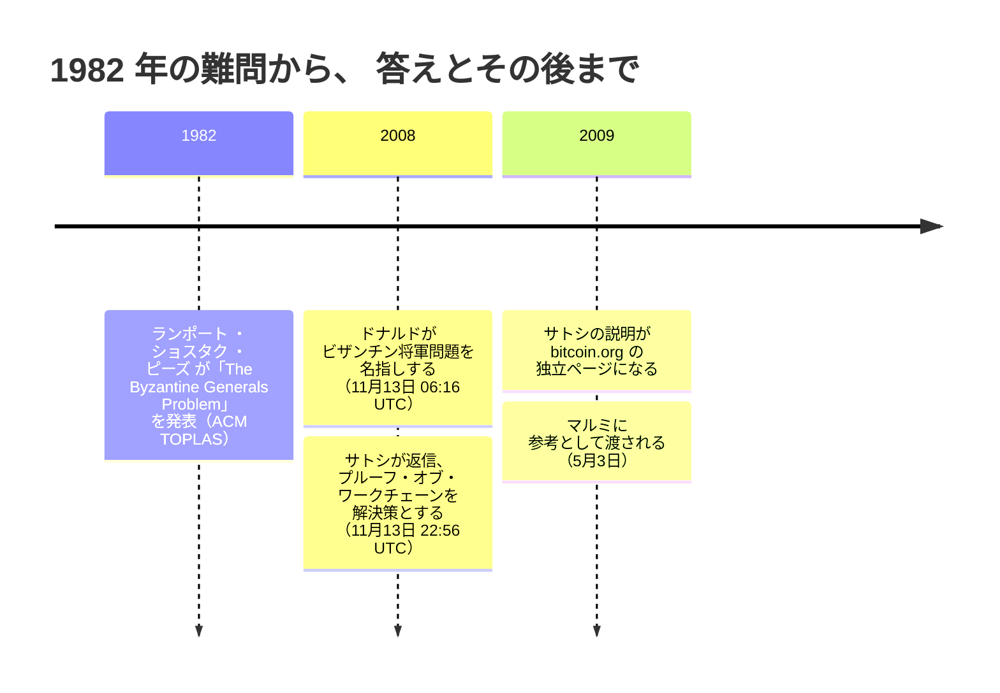

2008 年 11 月 13 日 06:16 UTC。ホワイトペーパー公開から 13 日後、それを議論するメーリングリストのスレッドで、ジェームズ・A・ドナルドは、サトシに突きつけ続けてきた難しさに名前を与えた。分散コンピューティングの古典的な合意問題、ビザンチン将軍問題である。サトシは同日 22:56 に答えた。ホワイトペーパーは草稿にも最終版にも「ビザンチン」の語がなく、このスレッドのそれ以前の返信にも使った者はいない。この語をビットコインに結びつけたのはドナルドのこのメールが最初であり、答えはスレッドの中だけでは終わらなかった。数か月のうちに、サトシはこの答えを [bitcoin.org の独立ページ](/BitcoinArchive/ja/entries/web-document/satoshi/2009-03-09-byzantine-generals-problem/)に仕立てている。

## 1. 1982 年の問題

ビザンチン将軍問題は、ランポート、ショスタク、ピーズによる 1982 年の論文（『ACM Transactions on Programming Languages and Systems』誌掲載）に由来する。複数の将軍が敵の都市を包囲し、伝令を通じてしか連絡を取れない状況で、攻撃するか撤退するか、一つの計画に合意しなければならない。将軍の中には、合意の成立を積極的に妨げようとする裏切り者がいるかもしれない。この論文の中心的な結果は具体的で、逃げ道がない。口頭のメッセージだけでは、将軍の 3 分の 2 を超える人数が忠実でない限り、いかなるプロトコルも合意を保証できない。将軍が 3 人で裏切り者が 1 人いる場合、何も機能しない。

2008 年の時点で、この問題は分散システムに携わる人々にとって定番の参照点になっていた。固定された、既知の、名前の分かっている参加者の集団があり、その一部が嘘をつくかもしれない状況で、一つの共有された決定に到達しようとする、という構図である。

## 2. ドナルドの挑戦

ジェームズ・A・ドナルドは、11 日前の最初の返信からずっと同じ問いを追及していた。ノードを信頼できるかどうかではなく、信頼できるかどうかにかかわらず、どのようなノード群であれ、誰が何を所有しているかについて一つの共有された見解にどうやって至るのか、という問いである。サトシの論文は問題を二重支払いとして枠づけていた。その下にある合意の層へ、ドナルドは繰り返し議論を引き戻した。

<!-- quote: q1 -->
> 誰がどの bitgold コインを所有しているかについて、グローバルに共有された見解へ至るプロセスの規定が不十分だ。

*[補足：引用中の「bitgold コイン」は、ジェームズ・A・ドナルドとハル・フィニーの二人がスレッド早期にそれぞれ使った呼び名の混同であり、ニック・サボへの言及ではない。サボ自身は一貫して「bit gold」と 2 語で綴り、単位そのものを「コイン」と呼んではいない。経緯は[サボ=サトシ仮説のエントリー](/BitcoinArchive/ja/entries/analysis/2013-12-05-szabo-satoshi-identity-hypothesis/)がたどっている。]*

[サトシによるトランザクション確定性の説明への返信](/BitcoinArchive/ja/entries/emails/cryptography/bitcoin-p2p-e-cash-paper/2008-11-13-james-donald-byzantine-generals-problem/)の中で、彼はこの難しさに古典の名前を与えた。

<!-- speaker: James A. Donald -->
> 全員が X を知っているだけでは不十分だ。全員が全員が X を知っていることを知り、さらに全員が全員が全員が X を知っていることを知っていることを知っている必要もある——これはビザンチン将軍問題として知られる、分散データ処理の古典的な難問だ。

これは、ランポートの問題の見かけではなく、入れ子になった知識という核心そのものである。ドナルドは劇的なラベルを求めているのではなく、実際の数学的な難しさそのものを指し示し、それがどこから来ているかを名指している。

## 3. 「おそらくより難しい部分」 — フィニーの見立て

その日の午後、サトシの返信に先立って、ハル・フィニーが同じスレッドでドナルドに答えている。そしてこの問いに、どれだけのものが懸かっているかを見積もった。

<!-- quote: q2 -->
> 一つ言っておきたいんだけど、ビットコインは多くの点で二つの独立したアイデアなんだ。ジェームズがここで挙げている種類の問題を解決する方法、つまりグローバルに一貫性がありながら分散型のデータベースを作ること。そしてそれをウェイ・ダイの b-money（論文中で参照されている）に類似したシステムに使うこと、ただしアカウントベースではなくトランザクション/コインベースだ。グローバルで大規模に分散されたデータベース問題を解決することが、ジェームズが強調するように、おそらくより難しい部分なんだ。

フィニーの読みでは、通貨の側は見慣れた半分だった。b-money が十年前に素描していたからだ。ドナルドが突き続けた共有見解の問題こそ、ビットコインを新しくしている半分だった。

## 4. サトシの答え — 王の Wi-Fi

22:56、[サトシは返信した](/BitcoinArchive/ja/entries/emails/cryptography/bitcoin-p2p-e-cash-paper/2008-11-13-re-bitcoin-p2p-e-cash-paper-satoshi-2/)。枠組みをかわすのではなく、そのまま受け入れる形で。

<!-- quote: q3 -->
> プルーフ・オブ・ワークチェーンはビザンチン将軍問題の解決策だ。その文脈で言い換えてみよう。

この後に続くのが、今や有名な王の Wi-Fi の比喩である。何人かのビザンチン将軍がそれぞれコンピューターを持ち、王の Wi-Fi のパスワードをブルートフォースで破りたいと考えている。だが、過半数が同時に攻撃した場合にのみ、破るのに十分な CPU パワーを合わせ持つことができる。将軍たちは攻撃がいつ行われるかは気にせず、全員が同じ時刻に合意することだけを求める。その合意は、提案された時刻をハッシュに含むプルーフ・オブ・ワーク問題を解くために競い合い、勝者の解をブロードキャストし、全員がその結果できた最も長いチェーンを延長していくことで得られる。十分なプルーフ・オブ・ワークが積み上がれば、どの将軍も、難易度だけを検証することで、過半数がそれに取り組んだに違いないと確認できる。個々のメッセージを信頼する必要はない。

これはドナルドの、入れ子になった知識の問題への直接の答えになっている。誰も、全員が合意した時刻を全員が知っているということを知る必要はない。過半数が既に一致していなければ存在し得ない、労力の連鎖を目にするだけで足りる。

## 5. どのような解決なのか

サトシ自身の言葉は、ビットコインのコンセンサスをビザンチン将軍問題への答えとして読むことを正当化する。ただし、それが答えているのは、1982 年の論文が提起した問題とは異なる形をした版である。ランポート、ショスタク、ピーズは固定された既知の将軍集団を前提とし、嘘をつく者が 3 分の 1 未満であれば成り立つ保証を、限られた回数のメッセージのやり取りの中で得ようとした。ビットコインの参加者集団は固定されておらず、事前に知ることもできない。したがって、そこで得られる保証の形も異なる。

| | ランポート、ショスタク、ピーズ（1982 年） | ナカモト・コンセンサス（ビットコイン） |
|---|---|---|
| 誰が参加できるか | 固定された、既知の将軍集団 | 公開されており、誰でも参加・離脱できる |
| 偽の身元への備え | 不要（将軍はあらかじめ特定されている） | プルーフ・オブ・ワーク（1 票に実際の計算コストがかかる） |
| 合意の到達方法 | 署名または口頭のメッセージを、回数を区切って数える | 蓄積された労力が最大のチェーンを延長する |
| 合意が確定するタイミング | 決定論的、限られた回数のやり取りの中で | 確率的、ブロックが積み重なるほど強くなる |

この、開かれた許可不要の参加者集団にこそ、シビル耐性を持つプルーフ・オブ・ワークの存在意義がある。ハードウェアを買える限り、いくらでも身元を作り出せる仕組みの中では、それぞれのメッセージや票にコストが伴わない限り、それらを数えることに意味はない。[合意形成設計のエントリー](/BitcoinArchive/ja/entries/design/2009-01-03-bitcoin-consensus-design/)は、難易度調整やフォークの解決、ここでの確定性がなぜ絶対的な保証ではなく確率的なものになるのかといった、仕組みそのものを扱っている。その比較の出どころは、記録から直接たどれる。論文中の引用としてではなく、公開のメーリングリスト上の生きた議論として始まったものだ。

## 6. 一つの返信から、プロジェクトのサイトへ

サトシはこの答えを、言いっぱなしにしなかった。2009 年 3 月時点の bitcoin.org の保存記録には、王の Wi-Fi の説明を磨き直した[「The Byzantine Generals' Problem」](/BitcoinArchive/ja/entries/web-document/satoshi/2009-03-09-byzantine-generals-problem/)という独立ページが、プロジェクト自身のサイト上にすでに存在している。そして同年 5 月 3 日、[サイトの FAQ 作成に向けてマルッティ・マルミへ参考資料を渡した](/BitcoinArchive/ja/entries/correspondence/martti-malmi/2009-05-03-bitcoin-003/)際、サトシはこのページを「ビットコインがビザンチン将軍問題をどう解くかについての私の説明」として挙げた。懐疑派への一つの返信として始まったものが、サトシ自身が「私の説明」として人に示すページになっていた。

<!-- entry-closing -->

私がこのやり取りに見るのは、名前を受け入れて、中身を作り替えるという動きだ。サトシは古典的な枠組みに異を唱えず、「解決策だ」と言い切った上で、固定された将軍たちの世界を、誰でも出入りできる世界に置き換えて答えた。三人はそれぞれ、この瞬間への自分の読みを記録に残している。ドナルドは通貨の下にある合意の層を突き、フィニーはその場で「より難しい部分」と呼び、サトシは答えをプロジェクトのサイトに残した。そして比喩の中では、合意を支えるものが入れ替わっている。ランポートの将軍たちは、名の知れた仲間の言葉を数えて合意に至る。王の Wi-Fi の将軍たちは、どのメッセージも信じないまま、攻撃の時刻に一致する。合意を運ぶのは、積み上がった計算そのものだ。その 13 日前、ホワイトペーパーは[「信頼ではなく暗号学的証明に基づく」](/BitcoinArchive/ja/entries/emails/cryptography/2008-10-31-bitcoin-whitepaper-final/)決済システムを求めていた。その一行が、ビットコインの公開記録上初めて 1982 年の語彙で語られたのが、王の Wi-Fi だった。
