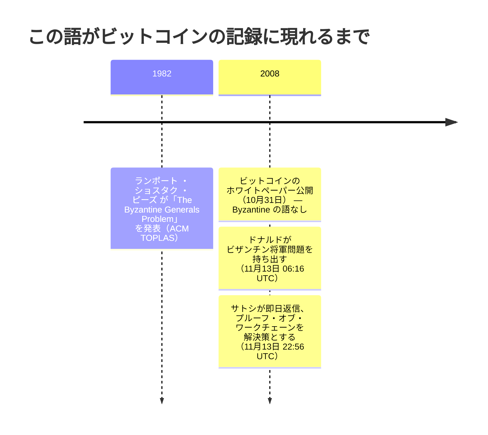

「Bitcoin Byzantine Generals Problem」で検索すると、出典としてホワイトペーパーが挙げられる。だがそれは誤りだ。10月3日の草稿にも 10月31日の最終版にも、「Byzantine」という語は一度も出てこない。この語がビットコインの記録に初めて現れるのは、公開から 13日後、メーリングリストでのやり取りの中である。誰が最初にそう呼び、なぜそう呼んだのかという記録は、今も読むことができる。

## 1. ホワイトペーパーが実際に述べていること

サトシの論文は問題を二重支払いとして枠づけ、解決策としてタイムスタンプサーバーとプルーフ・オブ・ワークチェーンを説明している。この論文は、自分が実は似ている古典的な分散システム問題の名を、一度も挙げていない。その呼び方を持ち込んだのは、論文公開から 13日後のある読者であり、サトシはそれを受け取って、その文脈のまま答えた。両方のメールは[一つのやり取りの両面](/BitcoinArchive/ja/entries/emails/cryptography/bitcoin-p2p-e-cash-paper/2008-11-13-re-bitcoin-p2p-e-cash-paper-satoshi-2/)として、ここに全文が残っている。

## 2. 1982 年の問題

ビザンチン将軍問題は、ランポート、ショスタク、ピーズによる 1982 年の論文（『ACM Transactions on Programming Languages and Systems』誌掲載）に由来する。複数の将軍が敵の都市を包囲し、伝令を通じてしか連絡を取れない状況で、攻撃するか撤退するか、一つの計画に合意しなければならない。将軍の中には、合意の成立を積極的に妨げようとする裏切り者がいるかもしれない。この論文の中心的な結果は具体的で、逃げ道がない。口頭のメッセージだけでは、将軍の 3 分の 2 を超える人数が忠実でない限り、いかなるプロトコルも合意を保証できない。将軍が 3 人で裏切り者が 1 人いる場合、何も機能しない。

2008 年の時点で、この問題は分散システムに携わる人々にとって定番の参照点になっていた。固定された、既知の、名前の分かっている参加者の集団があり、その一部が嘘をつくかもしれない状況で、一つの共有された決定に到達しようとする、という構図である。

## 3. ドナルドの追及

ジェームズ・A・ドナルドは、11 日前の最初の返信からずっと同じ問いを追及していた。ノードを信頼できるかどうかではなく、信頼できるかどうかにかかわらず、どのようなノード群であれ、誰が何を所有しているかについて一つの共有された見解にどうやって至るのか、という問いである。2008 年 11 月 13 日 06:16 UTC、[サトシによるトランザクション確定性の説明への返信](/BitcoinArchive/ja/entries/emails/cryptography/bitcoin-p2p-e-cash-paper/2008-11-13-james-donald-byzantine-generals-problem/)の中で、彼は実際の難しさに名前を与えた。

<!-- quote: q1 -->
> 全員が X を知っているだけでは不十分だ。全員が全員が X を知っていることを知り、さらに全員が全員が全員が X を知っていることを知っていることを知っている必要もある——これはビザンチン将軍問題として知られる、分散データ処理の古典的な難問だ。

これは、ランポートの問題の見かけではなく、入れ子になった知識という核心そのものである。ドナルドは劇的なラベルを求めているのではなく、実際の数学的な難しさそのものを指し示し、それがどこから来ているかを名指している。

## 4. 即日のサトシの答え

17 時間も経たないうちにサトシは返信し、その枠組みをかわすのではなく、そのまま受け入れた。

<!-- quote: q2 -->
> プルーフ・オブ・ワークチェーンはビザンチン将軍問題の解決策だ。その文脈で言い換えてみよう。

この後に続くのが、今や有名な王の Wi-Fi の比喩である。何人かのビザンチン将軍がそれぞれコンピューターを持ち、王の Wi-Fi のパスワードをブルートフォースで破りたいと考えている。だが、過半数が同時に攻撃した場合にのみ、破るのに十分な CPU パワーを合わせ持つことができる。将軍たちは攻撃がいつ行われるかは気にせず、全員が同じ時刻に合意することだけを求める。その合意は、提案された時刻をハッシュに含むプルーフ・オブ・ワーク問題を解くために競い合い、勝者の解をブロードキャストし、全員がその結果できた最も長いチェーンを延長していくことで得られる。十分なプルーフ・オブ・ワークが積み上がれば、どの将軍も、難易度だけを検証することで、過半数がそれに取り組んだに違いないと確認できる。個々のメッセージを信頼する必要はない。

これはドナルドの、入れ子になった知識の問題への直接の答えになっている。誰も、全員が合意した時刻を全員が知っているということを知る必要はない。過半数が既に一致していなければ存在し得ない、労力の連鎖を目にするだけで足りる。

## 5. 何が変わり、何が変わらなかったか

サトシ自身の言葉は、ビットコインのコンセンサスをビザンチン将軍問題への答えとして読むことを正当化する。ただし、それが答えているのは、1982 年の論文が提起した問題とは異なる形をした版である。ランポート、ショスタク、ピーズは固定された既知の将軍集団を前提とし、嘘をつく者が 3 分の 1 未満であれば成り立つ保証を、限られた回数のメッセージのやり取りの中で得ようとした。ビットコインの参加者集団は固定されておらず、事前に知ることもできない。したがって、そこで得られる保証の形も異なる。

| | ランポート、ショスタク、ピーズ（1982 年） | ナカモト・コンセンサス（ビットコイン） |
|---|---|---|
| 誰が参加できるか | 固定された、既知の将軍集団 | 公開されており、誰でも参加・離脱できる |
| 偽の身元への備え | 不要（将軍はあらかじめ特定されている） | プルーフ・オブ・ワーク（1 票に実際の計算コストがかかる） |
| 合意の到達方法 | 署名または口頭のメッセージを、回数を区切って数える | 蓄積された労力が最大のチェーンを延長する |
| 合意が確定するタイミング | 決定論的、限られた回数のやり取りの中で | 確率的、ブロックが積み重なるほど強くなる |

この、開かれた許可不要の参加者集団にこそ、シビル耐性を持つプルーフ・オブ・ワークの存在意義がある。ハードウェアさえ買えるだけ、いくらでも身元を作り出せる仕組みの中では、それぞれのメッセージや票にコストが伴わない限り、それらを数えることに意味はない。[合意形成設計のエントリー](/BitcoinArchive/ja/entries/design/2009-01-03-bitcoin-consensus-design/)は、難易度調整やフォークの解決、ここでの確定性がなぜ絶対的な保証ではなく確率的なものになるのかといった、仕組みそのものを扱っている。その比較の出どころは、記録から直接たどれる。論文中の引用としてではなく、提起されたその日のうちに決着した、生きた議論として始まったものだ。

<!-- entry-closing -->

このやり取りの中で、私が最も多くを物語っていると見るのは、返信が即日だったという一点だ。サトシは用意していた答えを取り出したのではない。手元にあったのは、入手可能な最も厳しい古典的な枠組みを突きつけられても、数時間のうちにその枠組みのまま説明し直して、なお崩れないシステムだった。これは「ホワイトペーパーがビザンチン将軍問題を解いた」という主張よりも強い主張であり、記録が実際に裏付けているのはこちらの方である。
