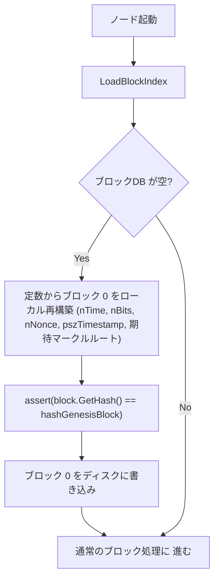

本分析は、Bitcoin v0.1 のソースコードが空のブロックデータベースを検出した際に実際に行う処理を精査し、その機構が [ビットコインのジェネシスブロック](/BitcoinArchive/ja/entries/sourceforge/2009-01-03-genesis-block/)をめぐる長く議論されてきた三つの問い — ブロック 0 とブロック 1 の「5日間の空白」、ジェネシスブロックの暗号学的な帰属、使用不能な 50 BTC coinbase — に対して何を示唆するかを検討する。

技術的事実は Bitcoin v0.1 ソースコードで検証可能。解釈的部分はその旨を明記する。

2009 年 1 月 8-12 日のリリース週におけるサトシ本人の*運用環境*についての独立した推論 — 時期は隣接するが対象が異なるもの — については、[サトシのリリース期環境分析](/BitcoinArchive/ja/entries/analysis/2009-01-10-satoshi-launch-environment/)を参照。

## 1. 本分析で用いる核心的区別

| 用語 | 意味 |
|---|---|
| **認識論的層** | 利用可能な証拠から何が結論できるか／できないか。「単一の正解はあるかもしれないが、我々はそれを特定できない」 |
| **存在論的層** | 問いの前提が成立するか。「単一の正解という概念がそもそも明確に定まっているか」 |
| **匿名化（anonymization、identity hiding）** | 作者は存在するが、識別情報が隠蔽されている状態。既存のシグナルに対する隠蔽操作 |
| **脱帰属設計（un-ownership by design）** | 作者が明確に定まる対象として構造的に成立しない状態。隠蔽すべき識別情報がそもそも存在しない |
| **ブートストラップ初期化** | 定数からネットワークの初期状態を構築する処理。ネットワーク経由で受信したマイニングイベントの処理とは意味的に異なる |

これらの区別は本分析全体で一貫して用いる。§4 と §5 はこの区別に依拠している。

## 2. ハードコードされたパラメーター

Bitcoin v0.1 の `src/main.cpp` では、ブロック 0 の全フィールドがコンパイル時定数として埋め込まれている。

- `hashGenesisBlock` = `0x000000000019d6689c085ae165831e934ff763ae46a2a6c172b3f1b60a8ce26f`（L24）
- `nTime` = `1231006505`（2009-01-03 18:15:05 UTC）
- `nBits` = `0x1d00ffff`
- `nNonce` = `2083236893`
- `pszTimestamp` = `"The Times 03/Jan/2009 Chancellor on brink of second bailout for banks"`
- 期待されるマークルルートと期待されるブロックハッシュも定数として `assert` される

v0.1 には `MineGenesisBlock()` 関数は存在しない。ランタイムでジェネシスのナンスを探索するコードパスは存在しない。`LoadBlockIndex()` が空のデータベースを検出すると、上記定数からジェネシスブロックを決定論的に再構築し、ハッシュを `assert()` で検証してディスクに書き込むだけである。



`Yes` 経路の分岐はノードのライフタイムで一度だけ実行される — 空 DB での初回起動時のみ。ピアとの接続は不要、PoW 検証も呼ばれない。ブロック 0 のコンセンサスはハッシュ等価性のみ。

現代の Bitcoin Core（`src/kernel/chainparams.cpp`）も同じ4つの定数（1231006505, 2083236893, 0x1d00ffff, 1）を使用する。この機構は17年間変わっていない。

実用上の帰結：

- これまで空のブロックデータベースで起動した全ビットコインノードは、各自のローカル環境でバイト単位で同一のブロック 0 を構築してきた
- どのノードもブロック 0 を他ノードから受信していない
- 「ブロック 0 を作成する」ことに採掘は要求されない
- ブロック 0 は唯一である — 全ノードは配布経路なしで同じ唯一のブロックを手元に組み立てる

## 3. 5日間の空白

ブロック 0 のタイムスタンプは 2009-01-03 18:15:05 UTC、ブロック 1 は 2009-01-09 02:54:25 UTC。間隔は 5日 8時間 39分で、想定されている 10 分間隔の約 770 倍に相当する。

この空白をめぐって [Bitcoin Wiki](https://en.bitcoin.it/wiki/Genesis_block) や [ピート・リゾの 2024 年 Bitcoin Magazine 記事](/BitcoinArchive/ja/entries/aftermath/2024-10-01-bitcoin-magazine-genesis-block-5-day-mystery/)等で様々な説が語られてきた — バックデート説、天地創造説、美しいハッシュ説、プレネット仮説、ピア発見要件説。だが、これらを同じリストに並べて「ギャップの原因の選択肢」として扱うのはカテゴリーの誤りである。技術的には問いが二つ混在している:

- **Q1. ギャップそのものは、なぜ存在するのか。**
- **Q2. その 5 日間に、サトシは何をしていたのか。**

Q1 は構造的にほぼ確定する。Q2 は公開記録からは不定のまま残る。本節はこの二つを明確に分離して扱う。

### 3.1 Q1 (ギャップの原因): ハードコードとリリース日の差

Q1 の答えは、仮説の選択ではなく、ソースコードから直接読み取れる構造として確定する:

> **5 日間の空白は、ハードコード値が決定された日と、ライブネットワークが初めて起動した日の差である。ライブチェーン上で実際に経過した時間ではない。**

時系列での整理：

| 日付 | 出来事 | ブロック 0 の状態 |
|---|---|---|
| 2009-01-03 以前 | どこかのタイミングでナンス `2083236893` を探索・発見 | ローカル／一時的 |
| 2009-01-03 | タイムズの見出しを coinbase に埋め込み決定、`nTime = 1231006505` 固定、値をソースに書き込み | ソースコード上の定数として存在 |
| 2009-01-03〜08 | コード整備・テスト・パッケージング、ライブチェーンは未起動 | 定数のまま、ライブブロックではない |
| 2009-01-08 | v0.1 を暗号学メーリングリストに告知 | 同上、定数のまま |
| 2009-01-09（SourceForge 公開、ライブ起動はブロック 1 の数分前と推定） | サトシが初めてライブネットワークを起動 | 定数からブロック 0 が決定論的に再構築される — サトシ自身のマシン上でもこの瞬間が初めての実体化。正確な起動時刻はチェーン上には残らない |
| 2009-01-09 02:54:25 UTC | ブロック 1 がマイニングされる（チェーン上の確定、`nTime`） | |

ブロック 0 とブロック 1 は同一の夜に生まれた実質的な兄弟である。「サトシが 5 日間ブロック 0 だけを抱えて待っていた」というイメージは、空白を経過時間として読むことで生じたアーティファクトにすぎない。

従来の「バックデート説」「タイムズの見出しに合わせた遡及的タイムスタンプ設定」「ハードコード・アーティファクト」などは、すべて同じ構造を別の言葉で述べたものであり、互いに競合する仮説ではない。単一の現象に対する複数の命名である。

### 3.2 Q1 の反転: なぜ 1 月 3 日に間に合わなかったのか

Q1 の形を反転すると、より実質のある問いが立ち上がる — なぜ 1 月 3 日にリリースできなかったのか。タイムスタンプを 1 月 3 日に選んだ時点で、1 月 3 日は目標日付だった。実際のリリースは 1 月 8 日、ブロック 1 のマイニングは 1 月 9 日 02:54:25 UTC（チェーン上の確定、`nTime`。サトシのノード起動はその数分前と推定されるがチェーン上には残らない）。5 日の遅延は、目標に間に合わなかった開発者の遅延である。

公開記録の手がかり — 2009-01-08 19:27:40 UTC の暗号学メーリングリスト告知（[metzdowd.com archive](/BitcoinArchive/ja/entries/emails/cryptography/bitcoin-v0-1-released/2009-01-08-bitcoin-v0-1-released/)）から 2009-01-09 02:54:25 UTC のブロック 1 マイニングまで約 7 時間半しかない — は、「余裕を取った計画通りの進行」よりも「タイトな仕上げ」を弱く示唆する。ただしこの推測はソースコードとチェーンデータからは判定できない。

### 3.3 Q2 (期間中の活動): 経験的に不定

Q1 とは独立に、2009-01-03 〜 01-08 のあいだサトシが具体的に何をしていたかは、公開記録からは確定できない。冒頭で列挙した従来の「仮説群」のうちバックデート説以外は、本来この Q2 のカテゴリに属する:

| 説 | Q2 への寄与 | 評価 |
|---|---|---|
| **テスト / デバッグ / パッケージング** | コード整備 | SourceForge への登録、ドキュメント整備、バイナリビルドが必要だった。最も蓋然性の高い Q2 活動 |
| **美しいハッシュ説** | ナンス探索時間 | ハッシュは難易度 1 の目標値を数値的に大きく下回る（§5.5 参照）。2009年頃の CPU の SHA-256d ハッシュレート（約 1〜10 MH/s、[ラーナーによる Patoshi 推定](/BitcoinArchive/ja/entries/aftermath/2019-04-16-sergio-lerner-patoshi-naming/)と整合）では、先頭ゼロ 10 桁に到達する探索時間は数時間から数日のオーダー。ナンス `2083236893` の探索がいつ完了したかはチェーンデータからは判定不可 |
| **採掘プログラム自体の長時間稼働テスト** | ナンス探索の副次的実行 | 採掘プログラムは v0.1 リリース対象のコンポーネントのひとつであり、テスト・デバッグ期間中に長時間の連続稼働を検証すること自体が最終検証の合理的な一部となる。その稼働中、副次的に最良ハッシュの探索は継続しうる。§5.5 のハーヴェスト・ベスト解釈と整合するが、動機が「深さ N を狙う」「儀式的な時間を残す」ではなく「採掘コードの耐久試験」である点で独立。いずれの動機でも観察されるナンスとは矛盾しないため、チェーンデータからは区別不能 |
| **プレネット仮説** | プライベートテストネット | 1月3日〜1月9日にプライベートテストネットが走っていた可能性。チェーンに残らないため経験的に確認手段なし（§8 未解決参照）。[2008 年 9 月 10 日付の代替プレリリース版ジェネシスブロック](/BitcoinArchive/ja/entries/aftermath/2022-10-06-serhack-alternative-genesis-block/)がサトシが個別に共有したソースに存在しており、開発過程でテスト用ジェネシスブロックが存在していた事実は確定している |
| **ピア発見要件説** | 採掘開始条件 | v0.1 `main.cpp` L2195〜2199 は `while (vNodes.empty()) { Sleep(1000); ... }` でピア待機。ただし 2 ノード構成（1 台上の 2 プロセスでも可）で即座に満たされる。サトシが 1/9 に自分で 2 プロセス立てれば解消する程度の条件であり、ギャップの決定的な原因にはならない |
| **天地創造説** | 象徴的類比 | 民間解釈。技術的根拠はなく、Q2 への寄与もない |

これらは Q1 のギャップ原因ではなく、Q2 の期間中活動の推定材料として位置づけるべき情報である。同じリストに並べると 5 日間の空白が単一の謎として誇張されるが、実際には構造的に確定した Q1 と経験的に不定の Q2 に分解される問題にすぎない。

## 4. 「ブロック 0 の作者」とは何か

決定論的再構築には、あまり明示されない構造的な帰結がある。本節では同じ問いを二つの層に分けて整理する。

### 4.1 通常のブロックとブロック 0 の構造的差異

通常のブロックには、明確に定まる単一の帰属対象が存在する — 最初に PoW を解いてブロックをブロードキャストしたマイナーである。ブロック 0 ではそのマッピングのあらゆる列が異なる：

| 観点 | 通常のブロック | ブロック 0 |
|---|---|---|
| 構築主体 | 最初に PoW を解いたマイナー 1 名 | 全ノードが各自のコードから同じ唯一のブロックを再構築する |
| 配布 | マイナー → ピア → ネットワーク | 配布されない。各ノードがローカルで組み立てる |
| 報酬の所有 | coinbase アドレスの秘密鍵保有者に帰属 | 所有者が存在しない（coinbase 出力が UTXO セットに入らない、§6 参照） |
| 明確に定まる「作者」 | マイナー | 構造レベルに存在しない |

「全ノードが各自構築する」は「複数の異なるジェネシスが存在する」意味ではない。ハッシュ定数（機構 A、§5）がコンセンサスレベルで「正しいジェネシスは唯一」を強制し、自動構築分岐（機構 B、§5）が「その唯一のブロックを配布なしに各ノードが構築可能」にする。結果として、**唯一のブロックに対して単一の出所が存在しない**。

### 4.2 認識論的層：ナンス探索

ハードコードされたナンス`2083236893` は、誰かのマシン上で v0.1 リリース以前に一度だけ実行された物理的計算に対応する。総当たり探索が必要で、探索は 2009-01-08 より前であればどのマシンでも可能であった。

この探索をサトシが行ったという帰属は状況証拠に依拠する：

- サトシが定数を含むソースコードを公開した → サトシが値を決めた、もしくは知っていた
- タイムズの一面の引用がコインベースを特定の日付以降に固定する — サトシは当該期間に活動が確認されている
- coinbase の出力アドレス `1A1zP1eP5QGefi2DMPTfTL5SLmv7DivfNa` はサトシのものとされるが、対応する秘密鍵からの有効な署名提示は一度もない
- [ラーナーの Patoshi パターン](/BitcoinArchive/ja/entries/aftermath/2013-09-03-sergio-lerner-nonce-lsb-discovery/) が初期約 64 ブロックを単一マイナーに結びつけており、連続性からそのマイナーがブロック 0 のナンス探索も行ったと推定される

ただし：

- Patoshi パターンは **ブロック 1 以降**からしか復元できない。ブロック 0 の coinbase 構造は特殊で、統計的手法の適用対象外である。[PLOS ONE 2021 の論文](/BitcoinArchive/ja/entries/aftermath/2021-09-30-plos-one-patoshi-anomaly-study/) 及びラーナー自身の記述で明記されている
- ラーナー自身は「Patoshi」と「Satoshi」を同一視する主張を明確に回避している

チェーンデータから**区別できない**こと：

- ブロック 0 が v0.1 リリース前に構築され一度破棄されたのか、それともリリース後にサトシ運用のノード上で初めて実体化したのか
- ナンス探索を行ったのは誰か
- ナンス探索が完了したのはいつか

認識論的レベル — 利用可能な証拠から何が結論できるか — では、ブロック 0 のナンス探索の帰属は不定である。存在するのは暗号学的証明ではなく、状況証拠の強い集積のみ。

ただしこの枠組みは「単一の正解が存在するが、記録がそれを明らかにしていない」という前提を置いていることに注意する。次のサブセクションでは、この前提そのものを問い直す価値があると論じる。

### 4.3 存在論的層：ナンス探索者はブロック 0 の作者ではない

ナンス探索を行った人物は「ソースコードに埋め込む値を計算した人」であった。その人物は以下のいずれでもない：

- ブロック 0 の所有者ではない（coinbase 出力が UTXO セットに入らない、§6）
- ブロック 0 の配布者ではない（配布が存在しない、§4.1）
- ブロック 0 を他者に渡した事実がない（各ノードが定数からブロックを組み立てる）

値がソースコードに埋め込まれた瞬間から、それは定数となる。コンパイルして実行する誰もが、同じ定数から同じブロックを再構築する。値の歴史的起源（誰が探索したか）は、チェーン上のアーティファクトから切り離される。

「マイナー = 作者」という等号連鎖は、通常のあらゆるブロックに対して自然である。ブロック 0 では崩れる — 「マイナー = 作者」を意味あるものとする構造的条件（PoW を唯一の構築事件とすること、ピア配布を唯一の出所とすること、UTXO 登録を唯一の所有機構とすること）がすべて、設計によって欠けているからである。

存在論的な読みでは、ブロック 0 は「単一の作者が存在するが、特定できない」という状況ではない。「単一作者という概念がこのオブジェクトに対して適用できない」という状況である。「作者はサトシ一人なのか、サトシと協力者か、それとも別人が値だけサトシに渡してコードに埋め込ませたのか」という問いに特権的な答えはない — それは記録が不完全だからではなく、設計が単数値の作者エンティティをそもそも実体化していないからである。

### 4.4 「サトシがビットコインを作った」 — 慣習的帰属と技術的帰属

「サトシがジェネシスブロックを作った」という言明は、文学的・歴史的記述として有意味であり続ける。サトシは v0.1 ソースコードを書き、ハードコード値を決め、状況証拠から最も可能性の高いナンス探索者である。これらは強い根拠である。

しかしその言明は、他のどのブロックに対する同じ言明とも等価ではない。「Block N のマイナーは Y である」は技術的に裏付けられる — coinbase 出力アドレスが特定の秘密鍵保有者に報酬を結びつけ、PoW の痕跡がチェーン上で採掘イベントを記録する。ブロック 0 については、coinbase アドレス自体がハードコードされた定数（秘密鍵保有は未検証）であり、PoW の痕跡もチェーンデータ上のブロック 0 には付随しない。

したがって「サトシがブロック 0 を作った」は、別レベルの事実 —「サトシがコードを書いた」「サトシがソフトウェアをリリースした」— から推論された**慣習的な帰属言明**である。チェーン上の意味での技術的な帰属言明ではない（チェーン上の帰属を支える技術的装置がブロック 0 に関与していないため）。

### 4.5 匿名化 vs 脱帰属設計

§5 の議論を貫く核心的区別：

| | 匿名化 | 脱帰属設計 |
|---|---|---|
| 作者の存在 | ある（識別情報が隠蔽されているだけ） | 構造上、明確に定まる対象として成立しない |
| 辿る可能性 | 原理的には隠蔽を破れば辿れる | 辿る対象が構造的に存在しない |
| 手段 | 運用的隠蔽（Tor、アドレス使い分け、文体制御、打鍵パターン配慮） | 構造設計（自動構築 + coinbase 非 UTXO） |
| サトシの公知の例 | Tor 使用、複数メールアドレス、イギリス英語とアメリカ英語の混在、打鍵パターン配慮、自発的離脱、wallet.dat 削除 | ブロック 0 の自動構築と非 UTXO coinbase |

サトシの匿名化実践とブロック 0 の設計は、同じ種類の動作ではない。前者は**存在するシグナルを隠す**。後者は**シグナルそのものを生まない**。§5 は、この第二のモードこそがブロック 0 設計のより強い読みであり、匿名化実践の延長や強化ではなく、**質的に異なる**ものであることを論じる。

## 5. ハードコード機構の設計分解

### 5.1 2つの独立した機構

v0.1 のジェネシス処理は、論理的に独立な 2 つの機構に分解できる：

| 機構 | 何をするか | 必須か |
|---|---|---|
| **A. ハッシュをハードコード**（`hashGenesisBlock` 定数） | 全ノードが「正しいブロック 0」をハッシュで合意 | **必須。** 共通のジェネシスがなければ分散合意は開始しない |
| **B. 全パラメーターをハードコード＋決定論的自動構築**（`nTime`, `nNonce`, `nBits`, `pszTimestamp` ＋ `LoadBlockIndex()` の空 DB 分岐） | 空 DB のノードが、ピア接続なしでブロック 0 をローカル再構築 | **必須ではない。** 新ノードがピアからブロック 0 を受信し、ハッシュを A で検証するだけの設計でもコンセンサスは成立する |

### 5.2 ハッシュ一致検証だけで済ませる代替設計

想定可能な代替案：

1. ソースコードには `hashGenesisBlock` のハッシュ定数のみ埋め込む
2. 空 DB で起動した新ノードは、最初のピアからブロック 0 データを受信する
3. 受信データのハッシュを計算し、定数と一致すれば採用、一致しなければ拒否

これは他の全ブロックで使われる通常の処理と同じ構造をブロック 0 にも適用するだけで、実装的にはむしろ小さい。新規に空 DB 分岐を加える必要がなく、既存のネットワーキング処理の再利用で済む。

この代替設計では、ブロック 0 には**配布元が存在する**。最初にナンスを発見した人（＝ ブロック 0 の最初の実体化者）だけがブロック 0 のデータを持ち、その配布元は P2P 層に痕跡を残す — 各初期ピアは誰か特定ノードから最初のブロック 0 を受け取るため、起源痕跡が残り得る。その痕跡が**実ネットワーク条件下で起源を一意に特定できるか**は別の経験的問題だが、本分析にとって必要な構造的主張はより狭い：**配布元という概念が発生する**、ということで十分である。機構 B はこの概念そのものを消している。

### 5.3 ソースコードは対称、行動証拠は非対称

サトシは機構 B を選んだ。その選択の 2 つの読み：

**解釈 A — 実装上の便宜。** 自動構築は、新ノードがライブピアなしでブートストラップできるようにするための素直な実装。未帰属性は、最短立ち上げを優先した結果として生じた意図しない副産物。

**解釈 B — 脱帰属設計（un-ownership by design）。** ブロック 0 は、作者が明確に定まる対象として成立しないように構築されている（§4.3）。これは「意図的な匿名化」よりも正確に述べた表現である — 匿名化は存在する著者の識別情報を隠蔽する操作を前提とするが、脱帰属設計は著者を明確に定まる概念として構造レベルで成立させない。

ソースコード単体では解釈 A と B を判別できない。v0.1 が実際に行っていることは両解釈と技術的に矛盾しない。このレベルではどちらを採るかは解釈的判断である。

しかし周辺の記録を加味すると、両解釈の重みは均等ではない：

1. **代替設計の方が厳密に小さい。** ハッシュのみ検証 + ピア受信によるブロック 0 取得は、既存のネットワーキング処理を流用し、空 DB 分岐を追加する必要もない。もし実装上の便宜が実際の動機なら、小さい設計の方が自然な選択となる。自動構築は**より大きい**実装であり、この選択は小さい設計なら節約できたはずの複雑さを支払っている
2. **公知の行動パターンとの整合性。** Tor、使い分けメールアドレス、英米スペル混在、打鍵パターン配慮、自発的離脱、wallet.dat 削除 — すべて同じ方向を指す：識別シグナルを残さない。そのパターンのうちジェネシス設計だけを「便宜」と読み、他を「意図的」と読むのは、記録の対称性を破る唯一の解釈になる
3. **coinbase アドレスを共有定数にしたこと。** 呼び出しごとに生成すれば、個人的シグナルがもう一つ残っていた。ソースに共有定数として埋め込む選択は「個人特定の手がかりを残さない」と整合する
4. **タイムズの見出しが唯一の個人的要素。**ナンス、アドレス、処理構造はすべて非人格化されている。唯一、個人の声を帯びるのは coinbase ペイロードのテキストだけ。他を徹底して非人格化しながら一点だけ意図的に例外を置いた設計は、「意図的」と読む方が「偶然均質」と読むより自然。なお [Chain Bulletin の 2020 年分析](/BitcoinArchive/ja/entries/aftermath/2020-11-23-chain-bulletin-satoshi-london-hypothesis/)は同じ見出しを「英国紙＋英国式スペル慣習」として地理的証拠に読み替え、ロンドン在住仮説を支持する — 同じ残存シグナルを「意図」ではなく「地理」に読む別視点
5. **§6 と同じオッカムの剃刀。** §6 は 50 BTC 使用不能を「見落とし」ではなく「初期状態として扱った帰結」と論じる — 前者は追加の仮定を必要とし、後者は必要としないため。ここに対称的に適用すると：解釈 B は追加仮定を必要としない。解釈 A は、他の選択が一貫して意図的なプロジェクトで、この一箇所だけ「特に理由なく」より大きく必須でない実装が選ばれたと仮定することになる

ソースコードレベルで A と B は対等である。記録の総体としては、B の方が追加仮定を必要としない。本分析の以降のセクションは B をより蓋然性の高い読みとして扱うが、事実ではなく解釈として明示し続ける。

ソースコード自身が（A と B の判別とは独立に）**はっきり示している**こと：未帰属性はブロック 0 に内在する性質ではなく、独立した設計判断の帰結である。別の、同等に成立する実装であれば配布元が存在していた。**より大きく、必須でない実装**を、**配布元を持たない形**で選んだ判断を下したのはサトシである。

### 5.4 なぜこの論点は明示的に論文化されていないのか

妥当な疑問：ブロック 0 の未帰属性が v0.1 ソースから暗黙に導かれるのであれば、なぜ §5.1〜§5.3 の分解（A 必須／B 選択 → 未帰属性は B の帰結）が既存の Satoshi 研究文献で明示的に書かれていないのか。

排他的ではない複数の理由が考えられる：

1. **Patoshi 研究の射程。** ラーナーの研究対象はブロック 1 以降の採掘パターンである。ブロック 0 の特殊な coinbase 構造は手法の適用外となる。ラーナープログラム内では「ブロック 0 はハードコード、所与として扱う」という枠組みが自然に成立し、この枠組みが後続の読者に引き継がれる。ラーナーを信頼の起点として受け取る読者は、この前提も自動的に引き継ぐ
2. **帰属の暗黙化。** 「サトシがビットコインを作った」という命題に「サトシがブロック 0 を生成した」が暗黙に含まれる。後者が独立の検証対象として浮上しない
3. **明らかなメリットの不在。** チェーンデータからこの問いを反証することはできず、またサトシ帰属を支持する状況証拠は実際に強い。暗号学的には不定であると指摘しても、実務的結論は変わらない
4. **単に指摘されていない可能性。** 文献サーベイでは、§5.1〜§5.3 の線に沿ってハードコード機構を「A ハッシュ検証（必須）」と「B 自動構築（選択）」に明示的に分解し、未帰属性を B に帰属させる記述が見当たらない

本節の分解は、v0.1 ソースコードに直接根拠を置く独立した観察として提示している。

### 5.5 二次的観察：PoW 余裕（ジェネシスハッシュの目標値下余裕）

機構 B はブロック 0 に見える唯一の必須でない設計選択ではない。ジェネシスハッシュは難易度 1 の目標値を数値的に大きく下回っている — これはより小さく解釈的な観察ではあるが、正確に述べておく価値がある。

3 つの層を、各層が実際に何を検証するかに即して整理：

| 層 | 何が検証されるか |
|---|---|
| v0.1 のブロック 0 コンセンサス | ハッシュ等価性のみ。`LoadBlockIndex()` 空 DB 分岐は `assert(block.GetHash() == hashGenesisBlock);` を実行 — ブロック 0 に対して PoW の数値比較は**呼ばれない** |
| 難易度 1 での PoW 有効性 | ハッシュを 256 ビット整数として解釈し、難易度 1 の目標値 `0x00000000ffff0000...` 以下であることを数値的に比較する。**これは数値比較であり、桁数カウントではない** |
| 実際のジェネシスハッシュ `0x000000000019d6689c...` | 難易度 1 の目標値を数値的に大きく下回る（先頭の非ゼロな 16 ビットチャンクは `0x0019` で、目標値の `0xffff` をはるかに下回る） |

v0.1 コンセンサス上、ブロック 0 はハッシュ等価性検証のみで通る。理論上は任意のハッシュ値でもプロトコル上は動作した。実際のジェネシスハッシュは難易度 1 の境界を快く満たし、数値的に意味のある余裕を持つ。この余裕を「意図的な設計シグナル」と読むかどうかは、§5.3 の配布元の議論より**軟らかい**問いである：

- **解釈 A**：余裕は保守的な実装選択と読める — 外部者が標準的な PoW チェックを難易度 1 で走らせた時、境界すれすれで通るのではなく余裕を持って通る方が安全
- **解釈 B**：同じ余裕は重み付け的な刻印と読める — 非人格化された設計の中で、タイムズの見出し（編集的コンテンツ）と組になる可視の「目標値下余裕ハッシュ」を、設計が依然として帯びる個別的要素の 2 つとして残す

ソースコードは両解釈を鋭く分けない。観察は解釈 B と**整合する**（特に見出しと組になった時に顕著）が、保守的エンジニアリングの読みを単独で排除できない。§5.3 のように小さい代替実装が存在して選ばれなかったというケースと違い、ここでの代替（境界すれすれのハッシュ）は構造的ではなく様式的なものである。

したがって、ここで指摘するに値するパターンは「サトシはジェネシスに意図的重みを加えた」より狭い：

| 必須でない選択 | 解釈 B への構造的診断度 |
|---|---|
| **機構 B**（自動構築） | 強い — より小さい代替があり、それが採られなかった |
| **タイムズの見出し** | 強い — 非人格化された設計の中で明確に個人的なコンテンツ |
| **PoW 余裕**（目標値下余裕） | 弱い — 両解釈と整合。見出しと組で読む時の方が、単独で読むより目立つ |

この**弱い強度**で述べるのが、初期ドラフトの「8 桁が要求、10 桁が観察」という枠組みよりも正確である。後者は数値比較を桁数カウントと取り違えていた。

**探索モードの考察。** 2009年頃の CPU SHA-256d ハッシュレートのオーダー（約 1〜10 MH/s、ラーナーの Patoshi 推定と整合）では、観察されたジェネシスハッシュのナンス探索は数時間から数日のスケールに落ちる。観察結果と整合する探索モードは二つあり、チェーンデータからは区別できない：

- **ターゲットベース**：目標となる先頭ゼロ桁数に達するハッシュが見つかった時点で停止する。上記レートでは先頭ゼロ 10 桁の期待到達時間は 1〜2 日程度
- **ハーヴェスト・ベスト**：事前に決めた探索時間（実時間）だけ回し続け、その時点で見つかっていた最良値を採用する。1月3日〜1月9日のギャップ区間のスケールで走らせた場合、期待される最良の先頭ゼロ数は 10 桁前後に落ちる — 観察値と数値的にサイズ一致する

ハーヴェスト・ベストの読みは「意図的に深さ N を選んだ」という読みに対する真の代替となる：これに従えば、10 桁という結果は別途選ばれた目標ではなく、選ばれた探索時間の統計的帰結となる。これは §5.3 の機構 B 論証（小さい代替設計が存在して採られなかった、という点に依拠する）を変更するものではない。ただし、PoW 余裕を解釈 B と整合させる経路が**両方**成立することを意味する（ターゲットベースでは「意図的な深さ」、ハーヴェスト・ベストでは「意図的な時間」）。その意味で、特定の探索モードが判定不能なままでも、観察自体を設計スケールのシグナルとしてやや硬く扱うことが可能になる。

## 6. 使用不能な 50 BTC — ブートストラップの帰結

### 6.1 技術的挙動

ブロック 0 の 50 BTC 報酬は一度も動いていない、かつ動かせない。v0.1 でも現代の Bitcoin Core でも、空 DB からのジェネシス構築はブロック 0 をブロックデータベースには書くが、coinbase 出力を UTXO セットには書かない。現代 `chainparams.cpp` のコメントに明記されている： *"the output of its generation transaction cannot be spent since it did not originally exist in the database."*

Bitcoin Wiki は *"it is not known if this was done intentionally or accidentally"*（意図的か偶発的か不明）と控えめに記述している。

### 6.2 偶発 vs 意図的ブートストラップ解釈

マイニング主体のブロック処理系に生じた不整合として読むと、この挙動は穴に見える。通常のブロック処理は `ProcessBlock → AcceptBlock → AddToBlockIndex → ConnectBlock → ConnectInputs → txdb.AddTxIndex` と一本の連鎖で走る。ジェネシスの空 DB 分岐は `block.WriteToDisk` と `block.AddToBlockIndex` しか走らず、`ConnectBlock` を呼ばない。したがって `AddTxIndex` も呼ばれず、coinbase はトランザクションインデックスに入らない。

別の枠組みで読むと、記述対象そのものが変わる。ブロック 0 は「最初に採掘されたブロック」ではない。**ネットワークの初期状態**であり、定数からのブートストラップ構築物であって、受信したマイニングイベントではない。この枠組みの下では、従来「見落としの証拠」と読まれていた 5 つの観察はすべて、設計通りの期待挙動となる：

| 観察事実 | ブートストラップ枠組みでの読み |
|---|---|
| `ConnectBlock` が呼ばれない | 当然。`ConnectBlock` はネットワークに流入するトランザクションを処理する。ブートストラップ初期化は設計上これと別のコードパス |
| coinbase 出力が UTXO に入らない | 当然。UTXO 生成イベントは発生していない。このブロックはマイニングイベントではなく、所与の初期条件である。UTXO は実トランザクションの未消費出力を追跡する集合 |
| 省略を説明するコメントが存在しない | 当然。何も省略されていない。これが初期化の挙動そのものである。コードが意図に反する挙動を示していれば説明コメントが必要だが、そうなっていない |
| 処理の非対称性そのもの | 当然。初期化とトランザクション処理は意味的に異なる操作である。両者が対称であればむしろ不自然 |
| 17 年間の Core 開発で変わっていない | 当然。修正すべきバグではない |

現代 Core のコメントをこの枠組みで読み直すと、レガシーな不具合への後付けの言い訳ではない。*"did not originally exist in the database"* は記述そのものである：ブロック 0 はトランザクションイベントとして起こったことがないので、その出力はトランザクションとしてインデックスされない。

オッカムの剃刀はブートストラップの読みの方を支持する。偶発の読みは、エッジケース処理が概して綿密なリリースにおいて、見落としが一箇所存在したと仮定する必要がある。ブートストラップの読みは何も仮定する必要がない。観察される挙動はすべて、一つの意味論的選択から導出される。

### 6.3 §4 との統一構造（二重の不在）

§6.2 のブートストラップ枠組みは、§4 の存在論的な読みと直接接続する。同じ設計判断 — ブロック 0 を定数から導かれる初期状態として扱い、P2P 層を介して到着するブロックとは見なさない — から、二つの整合的な不在が同時に流れ出る：

```
Block 0 = ブートストラップ初期化（意図的設計、解釈 B）
  ├── 自動構築：ネットワーク観察できる出所なし
  │     → チェーン上で単一作者が確定しない（§4 — 創造的帰属の不在）
  └── 初期状態、トランザクションイベントではない
        → coinbase 出力が UTXO セットに入らない（§6 — 経済的帰属の不在）
```

ブロック 0 は両軸とも構造的に帰属を欠く：暗号学的に特定可能な作者も、暗号学的に特定可能な受益者もない。解釈 B のもとでは、これらは二つの別個の偶然ではなく、**一つの整合的な設計意図の二つの帰結**である — ブロック 0 は、いずれの軸でも特定の誰かに属さないアーティファクトとして世界に置かれた。

### 6.4 ジェネシスアドレスへの献金

ブロック 0 の後に `1A1zP1eP5QGefi2DMPTfTL5SLmv7DivfNa` に送られたトランザクション（累計 100 BTC 超の献金・チップ）は、初期状態除外の対象にはならず、通常の出力である。秘密鍵保有者なら使用可能。それらも一度も動いていない。秘密鍵が実在するとしても、その保有者が無活動であることの弱い傍証。

### 6.5 秘密鍵保有性 — 切り離して扱うべき別次元

本分析の全セクションとは**別の問い**：ブロック 0 の coinbase 出力アドレスに対応する秘密鍵を、誰かが保有しているのか？

混同しやすいので次元を整理する：

| 次元 | ブロック 0 の状況 | 根拠 |
|---|---|---|
| 作者性（誰がブロックを構築したか） | 構造的に不在（自動構築） | ソースコード（§4、§5） |
| 使用可能性（50 BTC を動かせるか） | 不能（UTXO 除外） | ソースコード（§6） |
| 秘密鍵保有性（`1A1zP1eP5...` の秘密鍵を誰が保有しているか） | 不明 | 経験的 — 有効な署名が提示されていない |
| 身元証明可能性（その鍵で署名すれば「サトシである」と証明できるか） | 上の行に依存 | — |

鍵保有性の技術的状況：

- coinbase 出力の公開鍵はハードコードされた定数である。対応する秘密鍵は数学的に存在する（ある時点で誰かが生成した）
- 誰が生成したか（サトシ推定）は状況証拠のみ
- 誰が現在保有しているかは不明 — 有効な署名は実演されていない
- 50 BTC は UTXO セットから除外されている（§6.1）ため、鍵を保有してもそのコインを動かすことはできない。一方で、**任意のメッセージに署名する**ことは技術的に可能である — 実演はされていない

後のサトシ帰属鍵との関係：ブロック 0 の coinbase アドレスはソースコード上のハードコード定数である。ブロック 1 以降の初期ブロックの coinbase アドレスは、サトシのウォレットがブロックごとに新規鍵ペアを生成したものである。ブロック 0 の鍵は Patoshi パターン保有量（約 110 万 BTC）を構成する数千・数万のアドレスのどれとも一致しない — **ブロック 0 の鍵は唯一かつ独立**。

クレイグ・ライト / COPA v. Wright 裁判はこの領域の代表的な公の事件である。2016 年以降クレイグ・ライトは「自分はサトシである」と主張し、身元証明の軸を **ブロック 1〜9** の鍵での署名に置いた — 最も注目を集めた 2016年5月のブログ投稿は、2009 年のブロック 9（サトシ→ハル・フィニー送金）から再利用した署名であることが即座に指摘された。ライトの公の主張と実演はブロック 0（ジェネシス）の coinbase 鍵には及んでいない。同時期の批判者たちが指摘したように、サトシ帰属の本当の試金石はブロック 0 の鍵での署名であり、ライトを含め誰もそれを提示したことがない。2024 年の [COPA v. Wright 判決](/BitcoinArchive/ja/entries/aftermath/2024-03-14-copa-v-wright-ruling/)において、ジェームズ・メラー判事は約 400 ページの判決文でライトはサトシではないと認定し、その証拠提出を産業規模の偽造と特徴づけた。最も積極的な身元主張ですらブロック 0 の鍵に踏み込まなかったこと自体が記録の一部である — 決定的たりえる単発の試験が、今日まで未実行のまま残されている。

シナリオ（すべてソースコードと整合、いずれもチェーンデータから確定不可）：

| シナリオ | 50 BTC 動かせるか | 鍵署名可能な主体 | 観察記録との整合性 |
|---|---|---|---|
| サトシが保有・無活動 | 不能（UTXO） | サトシ（行使していない） | 約 110 万 BTC の無活動パターンと整合 |
| サトシが鍵を破棄 | 不能 | 存在しない（サトシを含めて） | wallet.dat 削除・自発的離脱と整合 |
| サトシが鍵を譲渡 | 不能 | 受け取った者 | 状況証拠なし |
| 鍵の生成がサトシ以外、値だけサトシに渡してコードに埋め込んだ | 不能 | 原生成者 | 状況証拠なし |

秘密鍵保有性は経験的に未確定である。§4 の作者性および §6 の使用可能性とは論理的に独立しており、§5 の議論は特定の答えに依存しない — 脱帰属設計の読みは、鍵保有性のどのシナリオによっても「ブロック 0 をチェーンオブジェクトとして明確に定まる所有者に回復する」ものにならないからである。

## 7. ソースコードによる検証（引証）

### Bitcoin v0.1 `src/main.cpp`

- L24：`const uint256 hashGenesisBlock("0x000000000019d6689c085ae165831e934ff763ae46a2a6c172b3f1b60a8ce26f");`
- L1420〜1489：`LoadBlockIndex()` — 空 DB 分岐でジェネシスブロックを構築・書き込み
- L1455〜1470：
  ```cpp
  char* pszTimestamp = "The Times 03/Jan/2009 Chancellor on brink of second bailout for banks";
  ...
  block.nTime    = 1231006505;
  block.nBits    = 0x1d00ffff;
  block.nNonce   = 2083236893;
  ```
- L1472：`//// debug print, delete this later`
- L1478：`assert(block.hashMerkleRoot == uint256("0x4a5e1e..."));`
- L1480：`assert(block.GetHash() == hashGenesisBlock);`
- L1485：`block.WriteToDisk(...)`
- L1487：`block.AddToBlockIndex(...)` — この経路では `ConnectBlock()` は呼ばれない
- L2195〜2199：`while (vNodes.empty()) { Sleep(1000); ... }` — 採掘開始前のピア待機

### 現代 Bitcoin Core `src/kernel/chainparams.cpp`

- L57〜60：*"Build the genesis block. Note that the output of its generation transaction cannot be spent since it did not originally exist in the database."*
- L126：`CreateGenesisBlock(1231006505, 2083236893, 0x1d00ffff, 1, ...)`

v0.1 と現行 Core で定数値は同一である。

## 8. 未解決の論点

- Patoshi ExtraNonce パターンがブロック 0 を形式的に含むか（PLOS ONE 2021 論文は「最初の 64 ブロック」と言及するが、ブロック 0 の扱いを完全には明示していない）
- `nTime = 1231006505` がナンス探索時の実マシン時刻なのか、タイムズの掲載日に合わせて事後設定された値なのか。チェーンデータだけでは判定できない
- ナンス探索がターゲットベース（目標深さに到達したら停止）で行われたのか、ハーヴェスト・ベスト（一定の実時間だけ回した後に最良値を採用）で行われたのか。両モードとも観察されたナンスおよび 1月3日〜9日のタイミングと整合し、チェーンデータからは区別できない（§5.5）
- 2009年1月3日〜8日にプライベートなテストネットワークが走っていたか（プレネット仮説）。§3 で示したコード整備のみだったとする解釈と競合するが、どちらも現在までの証拠と矛盾しない
- ブロック 0 の coinbase 秘密鍵を誰かが保有しているか、そうであれば誰か（§6.5）。有効な署名は実演されていない

## 9. まとめ

1. ブロック 0 のパラメーターはハードコードされている。全ノードはそれをローカル再構築する。ブロック 0 を他ノードから受信したノードは存在しない
2. 5日間の空白は、定数を固定した日（1月3日）とライブネットワークが起動した日（1月9日）の差として自然に説明できる。チェーン上の経過時間ではない
3. ブロック 0 の作者性は 2 層に分かれる：
   - **認識論的**：ナンス探索を誰が行ったかはチェーンデータから決定できない。サトシへの帰属は状況証拠に依拠する
   - **存在論的**：通常のあらゆるブロックで「マイナー = 作者」を意味あるものとする構造的条件（構築事件としての PoW、配布源としてのピア、所有機構としての UTXO）が、ブロック 0 では設計によってすべて欠けている。「単一作者」はブロック 0 に対して明確に定まる概念ではない
4. ハードコードには独立した 2 つの機構がある。ハッシュ検証（コンセンサス必須）と自動構築（必須ではない）。未帰属性は後者の選択の帰結である
5. その選択が実装上の便宜（解釈 A）だったのか脱帰属設計（解釈 B）だったのかは、ソースコード単体では判別できない。行動証拠 — 必須でなくより大きい実装の選択、サトシの他の非人格化実践との整合、coinbase アドレスの共有定数化、タイムズの見出しを唯一の個人的要素とする構造、§6 と同じオッカムの剃刀 — を加味すると、解釈 B が非対称に有利となる
6. ブロック 0 には二次的な観察がある：ジェネシスハッシュは難易度 1 の目標値を数値的に大きく下回り、v0.1 のブロック 0 コンセンサスは等価性のみで PoW 数値比較を呼ばない。これを「意図的な重み付け」と読めば解釈 B のパターンと整合するが、「外部者の PoW 形式検証が境界すれすれで通るのを避けるための保守的なエンジニアリング選択」と読めば解釈 A と整合する。機構 B 単独より診断度は低く、タイムズの見出しと組で読む時の方が単独より目立つ
7. 同一のブートストラップ構築が、2 つの不在を同時に生み出している：創造的帰属の不在（チェーンデータから作者が確定しない、§4）と経済的帰属の不在（coinbase が UTXO に入らない、§6）。ひとつの設計判断、ふたつの平行する不在
8. ブロック 0 の coinbase アドレス（`1A1zP1eP5...`）の秘密鍵保有性は、上記とは切り離して扱うべき別次元である。経験的に未解決 — 有効な署名は実演されておらず、クレイグ・ライト / COPA 事件がひとつの高プロファイルな主張を封じた。脱帰属設計の議論は、この問いのどの答えにも依存しない

ブロック 0 はビットコインの中で最も象徴的なアーティファクトであり、かつあらゆる軸で明確に定まる所有者から最も遠いブロックである。配布元がない — 特定可能な作者がない。トランザクションイベントがない — 使用可能な出力がない。解釈 A ではこの対は偶然、解釈 B ではこの対は構造そのもの。ブロック 0 は、**単数でも複数でも、特定の誰かに属する物として世界に置かれたのではない** — それが追加仮定を必要としない読み方である。
