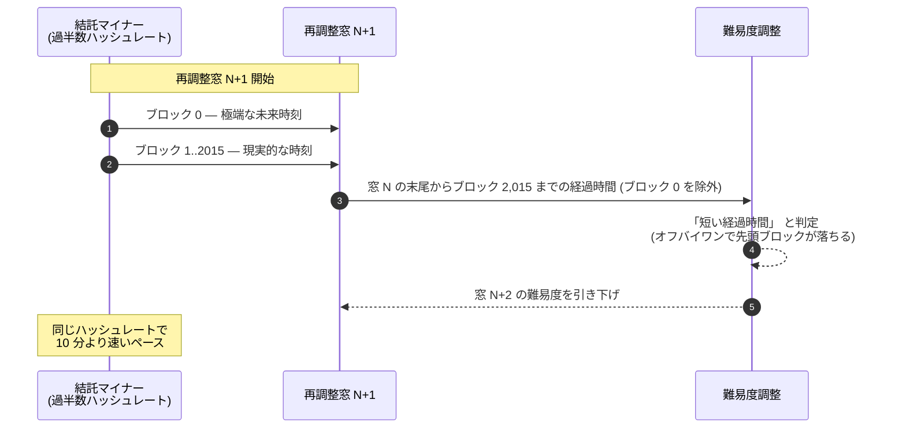

ビットコインの難易度調整アルゴリズムには、サトシ原典コードの段階から残る古いオフバイワン誤りがある。仕様上、再調整の窓は 2,016 ブロック、10 分間隔で言えば 2 週間ぶんとなるはずだ。だが実装上、経過時間の差分を計算するコードが見るのは **ブロック 0 とブロック 2,015 の間**でしかない。つまり再調整窓の先頭ブロックがそもそも時刻計算に入っていない。誤差は小さいが、そこから出てくる悪用シナリオは小さくない。

## 1. 仕組み

ハッシュレートの過半数を握るマイナーが結託すれば、再調整窓の最初のブロックに極端な未来時刻を打刻し、残り 2,015 ブロックには現実的 (場合によっては少し過去寄り) なタイムスタンプを並べる手が打てる。難易度の計算式は前回の窓の **最後**のブロックのタイムスタンプを基点に取り、さらに今回の窓の先頭ブロックを除外して経過時間を測るため、アルゴリズムが「見ている」経過時間は、実際に過ぎた時間よりはるかに短くなる。結果、次回の再調整で難易度が下がり、結託したマイナーはハッシュレートを増やすことなく 10 分よりも速いペースでブロックを掘り続けられる。

ただし攻撃には費用も時間もかかる。公開資料によれば、実害が出るほど難易度を歪ませるには **過半数の体制で約 4 週間維持し続ける**必要がある。 4 週間も多数派の協調が露骨に続けば、ネットワークの他の参加者はとっくに気づく。「原理的には可能、実務的には高くつく」という性質こそ、この欠陥が修正されないまま長年放置されている主因だ。そこまで目立つ多数派が組めるなら、再調整窓を欺くより手っ取り早く儲かる悪戯がいくらでもある。

## 2. なぜこれがサトシのコードに残ったのか

v0.1.0 のソース、固定コミット `4184ab2` の `src/main.cpp` 685–707 行に保存されている初期版を確認すると、この誤りは 2009 年 1 月のリリース時点から存在している。直近のブロックから始めて 2,015 個ぶん遡るループで祖先ブロックを取り出し、そのブロックと現在ブロックとの時刻差を取る。意図は明らかに 2,016 ブロックぶんを測ることだったが、実装は 2,015 ブロックぶんしか測っていない。サトシ自身がこの食い違いに気づいていた形跡は、現存する記録のなかには見当たらない。攻撃の存在が初めて公の場で語られたのは 2011 年の BitcoinTalk であり、以来、数年おきに再発見されてきた。

## 3. Great Consensus Cleanup

アントワーヌ・ポワンソは、この時間ねじれ脆弱性に加えて、似たように長く知られてきたいくつかのプロトコル上の小さな疵を一括して塞ぐソフトフォーク提案、**Great Consensus Cleanup** を主導してきた。提案の中身は、再調整窓の先頭ブロックのタイムスタンプに制約を設けて、ハッシュレートの占有率に関係なくオフバイワンを悪用できなくする方向だ。 2026 年時点では議論は活発に続いているものの、 SegWit (BIP148) や Taproot (BIP341) が踏んだような運用者側の合意水準にはまだ達していない。本提案が狙う不具合は、[コンセンサス設計の難易度調整節](/BitcoinArchive/ja/entries/design/2009-01-03-bitcoin-consensus-design/)で、再調整窓のブロック数計算にある関連のオフバイワン誤りと並んで、既知の 2 つの奇癖の一つとして記録されている。

ペースの遅さはビットコイン特有の慎重さの表れでもある。コンセンサスルールを変えるソフトフォークには、開発者の広い合意と、マイナーやノード運営者の準備状況の両方が要る。「掃除」ぶん、つまり利用者から見て新しい機能が増えるわけではないフォークについては、機能追加型フォークよりさらに合意の閾値が高くなる。結果として、既知だが悪用が割に合わない脆弱性を一旦そのまま残し、危険が顕在化していない場面で大がかりなフォーク作業を仕掛けることへの抵抗が勝ってきた。

## 4. 編者的意義

時間ねじれ攻撃のバグは、「サトシのコードが歴史的遺物としてそのまま走り続けている」ことを示す代表例の一つだ。 15 年前にメインネットで動き始めたまま、誰もあえて触ろうとしないロジック。本物のバグが本番チェーンを脅かさずに眠っているという、ビットコイン設計の頑健性と、壊れていないものを慌てて直さないというプロトコル進化文化の保守性、その両方を同時に示している。 Great Consensus Cleanup がいつか発効するなら、それはサトシ自身の手抜かりを後世が改めて直す、ささやかだが象徴的な最初のソフトフォークになる。
