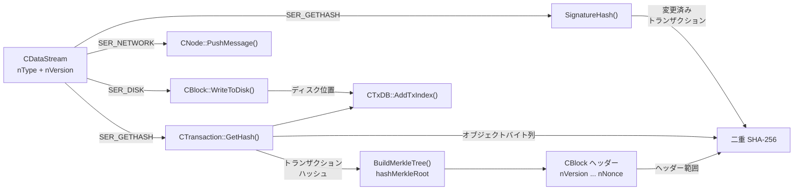

`CTransaction::GetHash()` と `CBlock::GetHash()` は、同じ種類のオブジェクトをハッシュしていない。前者はトランザクションオブジェクトを直列化する。後者がハッシュするのは `nVersion` から `nNonce` までのメモリー範囲であり、トランザクションベクターはそこに含まれない。その内容は `hashMerkleRoot` を通じてヘッダーに入る。

この分岐が後続するすべての経路を決める。同じ直列化フレームワークがネットワークメッセージ、ブロックファイル、オブジェクト識別子、署名ダイジェストに使われる。ただし、呼び出し側がコンテキストを選ぶか、先にオブジェクトを変換する。v0.1 に「直列化されたトランザクション」という普遍的なバイト列はない。

## 1. 1 つの直列化器と 3 つの主要コンテキスト

`src/serialize.h` は、3 つの主要な処理を宣言する:

| コンテキスト | v0.1 での役割 |
|---|---|
| `SER_NETWORK` | P2P メッセージに載せるオブジェクトを直列化する。 |
| `SER_DISK` | ブロックファイルやデータベースレコードに保存するオブジェクトを直列化する。 |
| `SER_GETHASH` | オブジェクト識別子や署名ハッシュの入力に使うバイトを直列化する。 |

`SER_SKIPSIG` と `SER_BLOCKHEADERONLY` は、別の直列化世界ではなく修飾子である。`IMPLEMENT_SERIALIZE` マクロは、1 つのフィールド記述からサイズ計算、書き込み、読み込みの 3 操作を展開する。ストリームは `nType` と `nVersion` をその記述へ渡すため、オブジェクトはフィールドリストを別々に持たずにコンテキストごとの選択ができる。

仕組みは小さいが、結果は単純ではない。ネットワークやディスクのレコードに存在するフィールドを、ハッシュ入力から除外できる。呼び出し側のコンテキストが、バイト列の意味の一部になる。

実装範囲は v0.1 のソースで固定されている。ストリームのコンテキストは `src/serialize.h:28–79`、トランザクションのフィールドとハッシュは `src/main.h:193–395`、ブロックヘッダー・マークルルート・ブロックハッシュは `src/main.h:805–884`、署名検査と `SignatureHash` は `src/script.cpp:692–712, 818–901`、ネットワークメッセージのフレーミングは `src/net.h:434–494, 565–675`、ブロックファイルのフレーミングは `src/main.h:919–959`、トランザクションインデックスは `src/db.cpp:186–201`、ハッシュ関数は `src/util.h:363–390` にある。

バイト列の経路はストリーム種別で分かれる。`SER_GETHASH` はトランザクション識別子と署名ダイジェストへ、`SER_NETWORK` はピア間ペイロードへ、`SER_DISK` は保存レコードへつながる。ブロック識別子は別のヘッダー範囲を通り、マークルルートがトランザクションハッシュをヘッダーへ運ぶ。



## 2. トランザクションハッシュは v0.1 のオブジェクト全体を対象にする

`src/main.h` の `CTransaction` には、トップレベルの直列化フィールドが次の順序で並ぶ:

1. `nVersion`
2. `vin`
3. `vout`
4. `nLockTime`

各入力は `prevout`、`scriptSig`、`nSequence` を含む。各出力は `nValue` と `scriptPubKey` を含む。`CTransaction::GetHash()` は `SerializeHash(*this)` を呼び、`SerializeHash` は `SER_GETHASH` を持つ `CDataStream` を作り、オブジェクトを直列化して、ソースの二重 SHA-256 `Hash` 関数を適用する。

v0.1 には証人フィールドがなく、`txid` と `wtxid` を分ける経路もない。v0.1 の入力直列化は `scriptSig` を含み、`SER_GETHASH` でそれを除外しないため、トランザクションハッシュはトランザクションオブジェクトに存在する署名バイト列を含む。これはこの実装についての記述であり、後世のすべてのビットコイン・トランザクション識別子に対する一般論ではない。

[トランザクション設計](/BitcoinArchive/ja/entries/design/2009-01-03-bitcoin-transaction-design/)は、入力と出力が支払いシステムで何を意味するかを扱う。より狭い問題は、そのオブジェクトの識別子になるバイトの境界である。

## 3. ブロックハッシュはヘッダーで止まる

`CBlock` は、まずヘッダーを宣言する:

`nVersion`、`hashPrevBlock`、`hashMerkleRoot`、`nTime`、`nBits`、`nNonce`。

その後ろに、ネットワークとディスクのデータである `vtx` トランザクションベクターが続く。シリアライザーは `nType` に `SER_GETHASH` または `SER_BLOCKHEADERONLY` が含まれない場合だけ `vtx` を書く。`CBlock::GetHash()` は `Hash(BEGIN(nVersion), END(nNonce))` を呼ぶため、直接のハッシュ入力は完全なブロックオブジェクトではなくヘッダー範囲である。

欠けている接続を作るのが `BuildMerkleTree()` だ。各トランザクションの `tx.GetHash()` から始めてハッシュを対にし、最後のルートを返す。トランザクションが変われば `hashMerkleRoot` が変わり、そのヘッダーフィールドが変わればブロックハッシュも変わる。トランザクションリストはブロックハッシュのバイト範囲に直接入らず、ヘッダーを通じて間接的にコミットされる。

[ブロック・チェーン設計](/BitcoinArchive/ja/entries/design/2009-01-03-bitcoin-block-chain-design/)は、このルートをチェーンのリンクとプルーフ・オブ・ワークへつなげる。その手前の段階では、マークルルートがトランザクションデータとブロック識別子の間の境界である。

## 4. 署名ダイジェストは変換済みトランザクションである

`OP_CHECKSIG` は `txTo.GetHash()` を直接求めない。`src/script.cpp` のインタープリターは、直近の `OP_CODESEPARATOR` から始まるスクリプトを取り出し、検査対象の署名を除去して、その `scriptCode` を `CheckSig` に渡す。

続いて `SignatureHash` はトランザクションをコピーし、ハッシュ前にコピーを変更する:

- すべての入力の `scriptSig` を空にする。
- 現在の入力に選択した `scriptCode` を設定する。
- `SIGHASH_NONE` はすべての出力を削除し、他の入力のシーケンスをゼロにする。
- `SIGHASH_SINGLE` は現在の入力インデックスまでの出力を残し、それより前を null にする。
- `SIGHASH_ANYONECANPAY` は現在の入力だけを残す。
- 変更済みトランザクションを `SER_GETHASH` で直列化し、`nHashType` を付加して二重ハッシュする。

署名は、意図的に作られたトランザクションの見え方にコミットする。区別すべきバイト列は 3 つある:

1. `CTransaction::GetHash()` に使う元の直列化トランザクション。
2. `SignatureHash` に使う変更済みコピー。
3. ネットワークまたはディスクのコンテキストで直列化されたトランザクション。

この 3 つをすべて「トランザクションのバイト」と呼ぶと、署名の有効性を決める規則が消える。

## 5. ネットワーク転送はオブジェクトの直列化器を再利用する

`CNode` のコンストラクターは `vSend` と `vRecv` の両方を `SER_NETWORK` に設定する。`BeginMessage` は送信ストリームへ `CMessageHeader` を書く。続いて `PushMessage` が `operator<<` で引数を直列化し、`EndMessage` がヘッダーへペイロード長を書き戻す。

経路は次のとおりである:

```text
CNode::PushMessage(command, object)
    → CMessageHeader(command, size)
    → CDataStream(SER_NETWORK) << object
    → 直列化されたペイロード
```

メッセージヘッダーは転送用のフレーミングであり、`CTransaction::GetHash()` や `CBlock::GetHash()` の入力ではない。トランザクションはネットワーク転送と別の経路で同じオブジェクト直列化器を使いながら、メッセージコマンドやピアごとのフレーミングから独立した識別子を持つ。

## 6. ディスク保存はフレーミングと位置を加える

`CBlock::WriteToDisk` はブロックファイルを取得し、必要なら `SER_BLOCKHEADERONLY` を設定し、直列化サイズを計算し、ネットワークマジックとサイズプレフィックスを書き、その後にブロックを書き込む。`ReadFromDisk` は逆の処理を行い、非直列化の後でヘッダーハッシュを検査する。ファイルレコードはオブジェクトを包むが、別のブロック識別子を作るわけではない。

トランザクションデータベースも同じ区別を使う。`CTxDB::AddTxIndex` は `tx.GetHash()` をキーとして計算し、ディスク位置と出力数を持つ `CTxIndex` を保存する:

```text
トランザクションオブジェクト
    → CTransaction::GetHash()
    → Berkeley DB キー: ("tx", トランザクションハッシュ)
    → CTxIndex: ディスク位置 + 出力数
    → ブロックファイル内の直列化トランザクション
```

ハッシュはトランザクションを識別し、インデックスは直列化バイト列の位置を示す。この 2 つは関連する処理だが、同じものではない。

## 7. 境界を一つの表にまとめる

| 経路 | コンテキストまたは処理 | 直接の入力または結果 |
|---|---|---|
| トランザクション識別子 | `SER_GETHASH` による `SerializeHash` | v0.1 の `scriptSig` を含む `CTransaction` 全体の直列化 |
| ブロック識別子 | `CBlock::GetHash()` | `nVersion` から `nNonce` までのヘッダー範囲 |
| マークルコミットメント | `BuildMerkleTree()` | 各 `tx.GetHash()` から始まるペアごとのハッシュ |
| 署名ダイジェスト | `SignatureHash()` | 変更済みトランザクション + `nHashType` |
| ネットワークペイロード | `CDataStream(SER_NETWORK)` | `CMessageHeader` 内のオブジェクトペイロード |
| ブロックファイルレコード | `SER_DISK`、必要に応じて `SER_BLOCKHEADERONLY` | フレーミングされたオブジェクトバイトとディスク位置 |
| トランザクションインデックス | `CTxDB::AddTxIndex()` | `("tx", tx.GetHash())` のデータベースキーと `CTxIndex` |

[サトシのコード分析](/BitcoinArchive/ja/entries/analysis/2009-01-09-satoshi-code-analysis/)はコーディングスタイル、コミットパターン、コードベースの進化を扱う。前者が誰がいつコードを変更したかを追うのに対し、こちらでは初期実装が動作するときのフィールドと呼び出し境界を追う。

## 8. v0.1 のソースが確定させること

ソースから曖昧さなく読める実装上の事実は 4 つある:

- トランザクションの同一性は、`scriptSig` を含む完全なレガシートランザクションの直列化に結びつく。
- ブロックの同一性はヘッダーに結びつき、トランザクション内容は `hashMerkleRoot` を通じて入る。
- 署名検証はトランザクション識別子を直接使わず、変換済みトランザクションとハッシュタイプ整数を使う。
- ネットワーク転送、ディスク保存、データベースインデックスは直列化プリミティブを再利用するが、識別子自体は再定義しない。

これは固定した v0.1 ソースについての事実である。現行 Bitcoin Core が同じソース配置やすべての内部呼び出し経路を保持していることまでは示さない。後世のトランザクション形式、証人処理、チェーン状態保存には、それぞれのソースとバージョンの境界が必要になる。
