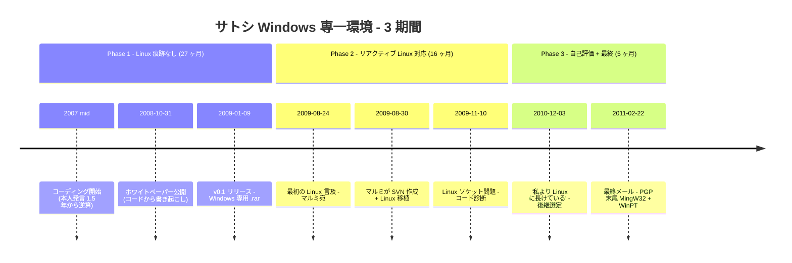

サトシのメールやフォーラム投稿には Linux 言及が多く、マルチプラットフォームで動く Linux に明るい開発者像にも見えてしまう。だが時系列で読むと別の像が浮かぶ。設計期間とリリース後の初期 7 か月 ― 合計 27 か月 ― にわたり、公開記録には Linux 関与の痕跡が一切ない。

Linux は 2009 年 8 月、マルッティ・マルミの Linux 移植への**対応**として初めて記録に現れる。 16 か月の支援作業を経た 2010 年 12 月、サトシ自身が書面でその隔たりを認める ― ギャビン・アンドレセンは「私よりずっと Linux に長けている」。さらに 2 か月後の最終メールに付いた PGP 署名末尾は `GnuPG v1.4.7 (MingW32) - WinPT 1.2.0` ― Windows 専用ツールチェーン。記録された期間は Windows 専一スタックが一度も置き換わらないまま閉じる。

本エントリーは公開記録を時期別に整理する。

## 1. 概要 ― 3 期間

| 期間 | 範囲 | 期間長 | Linux 関与 |
|---|---|---|---|
| **Phase 1** ― 設計 + リリース + 初期 | 2007 半ば → 2009-08-23 | 約 27 か月 | **公開記録上一切なし** |
| **Phase 2** ― マルミ移植への対応 | 2009-08-24 → 2010-12-02 | 約 16 か月 | Linux 言及が現れる、すべてマルミの移植とユーザー報告への対応文脈 |
| **Phase 3** ― 自己評価 + 最終メール | 2010-12-03 → 2011-04-26 | 約 5 か月 | 「私より Linux に長けている」、最終 PGP 署名末尾も Windows 専用 |



期間境界はそれぞれ公開記録の 3 イベントに固定: アーカイブで日付の付いた最初の Linux タグ付きメール (2009-08-24、 Phase 2 開始)、後継者選定の 2010 年 12 月 3 日マルミ宛メール (Phase 3 開始)、そして最終期間の PGP 署名末尾を持つ 2011 年 2 月 22 日のメッセージ。

## 2. Phase 1 ― 設計・リリース・初期 (約 27 か月): Linux 痕跡なし

サトシ自身が 2008 年 11 月の [cryptography メーリングリストへの返信](/BitcoinArchive/ja/entries/emails/cryptography/bitcoin-p2p-e-cash-paper/2008-11-17-bitcoin-p2p-e-cash-paper/)で「コーディングしながらこの 1 年半でそれらの細かい詳細をすべて検討してきた」と述べ、後にマルッティ・マルミに宛てた [2009 年 7 月のメール](/BitcoinArchive/ja/entries/correspondence/martti-malmi/2009-07-21-bitcoin-024/)で「18 か月の開発の後で一息つく必要がある」と書いている。 v0.1 リリース前に自己申告 ~18 か月のコーディング期間が終わるなら、コーディング開始は遅くとも 2007 年半ばに置かれる。サトシ自身は作業順序も記録している ―「すべての問題を解けると確信するためにまず全コードを書く必要があり、その後で論文を書いた」 ([ハル・フィニー宛、 2008 年 11 月 10 日](/BitcoinArchive/ja/entries/emails/cryptography/bitcoin-p2p-e-cash-paper/2008-11-10-re-bitcoin-p2p-e-cash-paper-satoshi-finney/)) ― 論文はコードが実質的に完了した後に書かれたのであり、先に書かれたのではない。後年の「2007 年から」「リリース前に 2 年間の開発」という言い方 ([ハニエツ、 2010-06-18](/BitcoinArchive/ja/entries/forum/bitcointalk/topic-195/2010-06-18-re-transactions-and-scripts-dup-hash160-equalverify-checksig/)、 [ハーン、 2011-01-10](/BitcoinArchive/ja/entries/correspondence/mike-hearn/more-questions/2011-01-10-satoshi-to-hearn-secp256k1/)) は、同じリリース前作業をより広い範囲で語ったもの ― 約 2 年の振り返りは、サトシがエディターを開く前に問題を考えていた数か月を足したもの ― であり、コーディングに先行する独立した設計段階を想定するものではない。ここでの Phase 1 の境界は**コーディング**期間と公開リリースを追跡している。自己発言の全タイムラインは[サイファーパンクへの独立到達分析](/BitcoinArchive/ja/entries/analysis/2008-10-31-cypherpunk-independent-arrival/)に集約されている。

v0.1 は 2009 年 1 月 9 日に SourceForge で**Windows 専用** `.rar` アーカイブとして配布される。その後さらに 7 か月、 2009 年 8 月末まで、ビットコインのソースコードはサトシの手元にのみ存在し、連続する `.rar` リリースで配布される。この 27 か月の窓全体で、アーカイブには次のいずれも存在しない:

- **サトシのメールに Linux 言及なし。** 日付の付いた最初の Linux タグ付きサトシメールは [2009-08-24 マルミ宛](/BitcoinArchive/ja/entries/correspondence/martti-malmi/2009-08-24-bitcoin-029/)。これより前に Linux を話題にした記録は浮上していない。
- **Linux ビルド・移植・ユーザー側コメンタリーなし。** アーカイブ最初の「Linux build」スレッドは 2009 年 10 月末のマルミ宛シリーズ。
- **非 Windows 環境でビットコインを動かした言及なし。** クロスプラットフォーム版はマルミの移植以降に登場するが、サトシ自身は最後まで Windows 環境のまま。

**マルチプラットフォーム配慮の構造的不在 ― 3 つの観察。**

1. **v0.1 は Windows 専用。** [v0.1 (2009 年 1 月 9 日)](/BitcoinArchive/ja/entries/aftermath/2009-01-09-bitcoin-v01-released/) から v0.1.x マイナーシリーズを経て [v0.2 が Linux 対応を追加する 2009 年 12 月 16 日](/BitcoinArchive/ja/entries/aftermath/2009-12-16-bitcoin-v02-released/)まで ― 約 11 か月 ― サトシ自身は Windows 専用 `.rar` を出し続けた。
2. **ホワイトペーパーと初期文書はプラットフォーム沈黙。** OS への言及、ポータビリティ目標、マルチプラットフォーム実装の意図表明、「Windows を最初に選んだ理由」のような戦略的明示 ― いずれも存在しない。
3. **クロスプラットフォーム移植は第三者由来。** Linux 移植は 2009 年 8 月にマルミが、 macOS 移植は 2010 年 8 月にハニエツが、それぞれ第三者として持ち込んだ。サトシ自身の手によるクロスプラットフォームリリースは記録上存在しない。

観察 1 と 3 は 2 通りの読みと整合する: (a) サトシのマルチプラットフォーム視点が初期に薄かった、または (b) Windows 一般ユーザーを意図的に初期採用者として狙った。 (b) は `.rar` パッケージング (Windows 消費者向けの慣れた形式)、インストーラなし (展開して実行)、 Windows 専用初版という選択が首尾一貫した「ダウンロード → ダブルクリック → 動く」戦略として整合する ― [Warez シーン共通点エントリー](/BitcoinArchive/ja/entries/analysis/2009-01-09-satoshi-distribution-and-tooling-anomalies/)が消費者側 Windows 配布慣習との重なりを文書化している。 (a) と (b) は互いに排他的ではなく、両立しうる。

ただし、観察 2 (プラットフォーム沈黙) はどちらの読みでも完全には説明できない。意図的な Windows ファースト戦略でも、通常は「各種プラットフォームがあるが、まず Windows を」のような戦略的明示を伴うのが当時の暗号系個人開発者の標準的振る舞いに近い。サトシはその明示も行っていない。選択それ自体を「議論する対象」として顕在化させていない。

Phase 2 にはサトシが Linux コードを読み診断した記録が残るが、これは必ずしも事前の Linux 知識を意味しない ― 特定の問題に焦点を絞れば数日の集中調査でも詳述しうる範囲であり、マルミの移植やユーザー報告に押されてその場で調べながら対応した可能性も同程度に整合する。結局、公開記録だけで「Linux を事前から知っていた／知らなかった」を断ずるのは難しい。言えるのは、 **Phase 1 において**初期段階で他プラットフォームの存在を顕在化させていなかった、消費者側 Windows 慣習を選んでいた、そして選択それ自体を言葉にしなかった、ということまでである。後述する Phase 2 ではコミュニティに駆動される形で OSS 慣習との接触が記録に入る (autoconf 検討、 Apache 設定、ライセンス比較) ものの、サトシ自身は新規 OSS 慣習の取り込みには消極的な応答を返し続ける (例: autoconf について「我々はまだ小さいので makefile 単純な方が最適」)。

この期間に観察される Windows 寄りの物的証拠 4 件は互いに独立している:

### 2.1 Visual C++ 6.0 SP6 + MinGW GCC 3.4.5 ― ビルドツールチェーン

ビットコイン v0.1 ソースアーカイブの `readme.txt` は、サトシ自身の言葉で対応コンパイラーを記録している:

```text
Compilers Supported
-------------------
MinGW GCC (v3.4.5)
Microsoft Visual C++ 6.0 SP6
```

Visual C++ 6.0 はマイクロソフトが 1998 年にリリース、 SP6（最終サービスパック）は 2004 年リリース。 MinGW GCC 3.4.5（GCC の Windows 移植、 3.4.x 系列の最終リリース）は 2006 年初頭リリース。 2008–2009 年時点で 3 者すべては後継 (Visual C++ 2003 / 2005 / 2008、 GCC 4.x) より数年遅れていた。 Visual C++ 6.0 IDE は広く時代遅れと見なされていた。 [SVN リポジトリ履歴エントリー](/BitcoinArchive/ja/entries/aftermath/2009-08-30-bitcoin-svn-repository-committers/)は移植側からも同じツールチェーンを確認する: 「サトシが Visual C++ 6.0 を使って Windows で開発したビットコインのコードベースを Linux に移植した」。 11 年前の IDE + 2006 年版 MinGW に固定されたワークフローは、ビットコインのために新調された可能性は低い。開発ツールチェーンはバグ修正・セキュリティパッチのために最新追随するのが通常の実務であり、これだけ後継から遅れた構成を使い続けている事実は、ツールチェーンの流れを能動的に追跡していないワークフローを示唆する ― 前向きな意味での「安定」ではなく、慣性で長く回り続けてきた構成である。 readme.txt 自体にも傍証が残る: 「VC6 でビルドするには Boost 1.35 が必要かもしれない。 Boost 1.37 は VC6 でコンパイルできなかった」 ― サトシは新しい Boost を試して VC6 の壁に当たり、コンパイラーを更新する代わりに依存ライブラリを古い側にダウングレードして既存環境に合わせている。

### 2.2 ハンガリアン記法 ― 1990 年代末の Windows C++ スタイル

v0.1 全体で変数名はマイクロソフトのハンガリアン記法 (型接頭辞、例: `nValue`、 `strError`、 `vtx`) に従っていた。 2014 年 8 月、ヴラディーミル・ヴァン・デア・ラーンは新規コードからこの慣習を削除する [PR #4641](/BitcoinArchive/ja/entries/forum/github/pr-4641/2014-08-06-pr-4641-doc-remove-satoshi-s-variable-naming-style/) を提出し、「最初からずっと気に障っていた」と評した。ハンガリアン記法は 1990 年代末から 2000 年代初頭の Win32 / MFC 系譜のスタイル指標 ― Visual C++ 6.0 と同時代である。 (v0.1.0 → v0.3.19 にわたるサトシのコーディングスタイル指紋の完全な統計分析は[サトシコード分析](/BitcoinArchive/ja/entries/analysis/2009-01-09-satoshi-code-analysis/)を参照。)

### 2.3 `.rar` パッケージングと Windows 専用初版

ビットコイン v0.1 と v0.1.x マイナーシリーズ ― 2009 年 1 月から v0.2 が Linux 対応を追加する 2009 年 12 月まで ― は SourceForge で Windows 専用 `.rar` アーカイブとして配布された。形式の詳細は [Warez シーン共通点エントリー](/BitcoinArchive/ja/entries/analysis/2009-01-09-satoshi-distribution-and-tooling-anomalies/)で扱われている。本エントリーで重要なのは、 Windows 専用の初版スコープが Phase 1 のタイミングに整合する点である。

### 2.4 チーム開発ツール一切なしの 8 か月

Phase 1 のうち、リリース後の 7 か月 (2009 年 1〜8 月) は途切れないソロ開発パターンと重なる: バージョン管理なし、テストスイートなし、課題追跡なし、第二レビュアー過程なし。各リリースは現状ソースツリーの新規 `.rar`。公開コミット履歴はマルミが Phase 1 と Phase 2 の境目で SVN リポジトリを開いたときに初めて始まる。 [SVN 履歴エントリー](/BitcoinArchive/ja/entries/aftermath/2009-08-30-bitcoin-svn-repository-committers/)はツールチェーン遷移を記録する: 2009 年 8 月にチーム開発基盤が現れたのはマルミが構築したから。

ジェフ・ガージックは 2010 年からサトシと共に働いた初期のコア開発者で、後にコードの外側からこの不在を指摘している ― サトシは既知の暗号技術をそのまま流用し、新しい方法で組み合わせたが、モジュール化やユニットテストといった正規のコンピューターサイエンス教育で学ぶ基本が欠けていた、と ([ガージックの回顧録](/BitcoinArchive/ja/entries/aftermath/2024-10-28-jeff-garzik-satoshi-lone-genius/)参照)。

4 件の独立観察 ― ビルドツールチェーンの Visual C++ 6.0、コード全体のハンガリアン記法、 `.rar` Windows 専用パッケージング、チーム開発ツール一切なし ― はすべて、 27 か月の全期間にわたって Windows 環境で単独作業する開発者像で収束する。

### 2.5 OSS ライブラリ依存 ― 利用者としての積極性

同じ readme.txt は Bitcoin v0.1.3 の外部ライブラリ依存も列挙している:

| ライブラリ | 役割 | ライセンス |
|---|---|---|
| **wxWidgets** | クロスプラットフォーム GUI フレームワーク | LGPL 2.1 |
| **OpenSSL** | 暗号 (ECDSA、 SHA、 BIGNUM) | Old BSD |
| **Berkeley DB** | 組み込み key-value ストア (`wallet.dat` 等) | New BSD |
| **Boost** | 汎用 C++ ライブラリ (thread、 asio、 filesystem) | MIT-like |

ビットコイン本体も MIT/X11 で公開されている ― 同じ readme.txt の冒頭に明記された寛容な OSS ライセンス。

この事実はサトシを明確に OSS の*利用者*層に位置づける。「OSS の存在を知らなかった」という読みは成り立たない: v0.1 は主要な OSS ライブラリ 4 件を組み合わせ、自身も OSS ライセンスで公開されている。 §3 (後述) が記録するのは別の観察である ― ライブラリ層では OSS を積極利用する一方、 OSS *コミュニティ慣習* 層 (autoconf、ライセンススレッド参加等) では消極的だった。形は **ライブラリの利用者としては積極、コミュニティの貢献者としては受動** ― OSS を「参加する文化」ではなく「使う道具一式」として扱う単独開発者にはよく見られる構成である。

## 3. Phase 2 ― リアクティブ Linux 対応 (約 16 か月)

Linux は 2009 年 8 月 24 日に記録に入る。ここから 2010 年末まで、サトシ書簡における Linux 言及はすべて、他人が進めている作業 ― ほぼ全てマルッティ・マルミの移植と NewLibertyStandard のユーザー側 Linux ビルドテスト ― への**対応**として現れる。

- [2009-08-24 マルミ宛](/BitcoinArchive/ja/entries/correspondence/martti-malmi/2009-08-24-bitcoin-029/): 最初の Linux タグ付きメール。文脈はマルミ側の準備作業。
- [2009 年 10 月末〜11 月初の「linux-build」シリーズ](/BitcoinArchive/ja/entries/correspondence/martti-malmi/2009-10-29-linux-build-048/): マルミが実際の移植を進め、サトシはパッチをレビューする立場。
- [2009-11-08 マルミ宛](/BitcoinArchive/ja/entries/correspondence/martti-malmi/2009-11-08-linux-build-ready-for-testing-066/): NewLibertyStandard の Linux テスト環境の `debug.log` を分析 ― サトシ自身の環境の話ではない。
- [2009-11-10 マルミ宛](/BitcoinArchive/ja/entries/correspondence/martti-malmi/2009-11-10-linux-dead-sockets-problem-073/): ゾンビソケット問題をコードレベルで診断 (「Linux のソケット処理に関係する何かが影響しているのは明らか」)。コードレベルの診断であり、「自分の Linux 環境で再現した」ではない。

Phase 2 全体で一貫したパターン: サトシは Linux ソースを読め、 Linux 固有の挙動をコードレベルで診断でき、 Linux 向けパッチをレビューできる ― が、可視化されたあらゆる露出が**受動的**である。マルミの移植作業と Linux ユーザーからの報告に押される形で行われた対応。記録には自分の Linux 環境でビットコインを動かしている兆候がない。 Phase 1 で見えた Windows 環境の証拠 ― Visual C++ 6.0、ハンガリアン記法、 `.rar` リリース習慣 ― は Phase 2 を通じて途切れず続く。

**学習は受動的で負荷の高いもの。** Phase 2 の Linux 関与は能動的な選択ではなく、ユーザーからの Linux ビルド要望とマルミの移植作業に押される形で始まっている。サトシは Linux についてその場で学びながら対応していた像が読める ― すでに長く Linux 環境で開発していた人物の像ではない。

チーム開発ツール不在は Phase 2 で部分的に解消される: マルミが SVN リポジトリを作成、ラズロ・ハニエツが 2010 年 8 月に一度きりの macOS 修正、ギャビン・アンドレセンが 2010 年 10 月にコミッタとして参加。ただし [SVN コミッタ履歴](/BitcoinArchive/ja/entries/aftermath/2009-08-30-bitcoin-svn-repository-committers/)が示す非対称性は明確だ: 2009–2011 年の全期間 252 コミットのうちサトシが約 160 件、 SVN リポジトリ自体はマルミの主導で作られ、これらコミット内の Linux 移植もマルミの仕事。

**OSS 慣習との接触も Phase 2 で初出。** Phase 1 にはサトシによる Apache、 GNU、 autoconf、ライセンス選択基準などへの言及が一切ない。 Phase 2 でコミュニティからの質問・要請を受けて初めて記録に入る:

- **2009 年 11 月 23 日**: bitcoin.org の Drupal の mod_rewrite 修正のため、 [Apache 設定アクセスをマルミに依頼](/BitcoinArchive/ja/entries/correspondence/martti-malmi/2009-11-23-access-permissions-required-to-fix-drupal-108/)。サーバー管理文脈で Apache 設定の知識を示す。
- **2009 年 12 月 12 日 BitcoinTalk**: ラズロが「macOS ビルドを作った、 autoconf 使うこと考えた？」と尋ねたのに対し、サトシは [「Considered autoconf. 大規模プロジェクトには必要だが、我々はまだ小さいので makefile 単純な方が最適」と返答](/BitcoinArchive/ja/entries/forum/bitcointalk/topic-12/2009-12-12-sni21-re-a-few-suggestions/)。 autoconf (OSS クロスプラットフォーム化の標準ツール) を「考えた (Considered)」という痕跡は残るが、事前から熟知していた上での却下か、提案を受けてざっと調べた上で「うちには不要」と判断したかは、この応答だけからは決まらない。新規ツールに直面した開発者がよく見せる「調べてみたが面倒・現状で十分」反応とも整合する。
- **2010 年 9 月 12 日 BitcoinTalk**: 「[GPL への切り替え](/BitcoinArchive/ja/entries/forum/bitcointalk/topic-989/2010-09-12-re-switch-to-gpl/)」スレッドで MIT / Boost / new-BSD / public domain / GPL のライセンス特性を比較しつつ「ビットコインのような小プロジェクトでは閉鎖化への恐れは過剰」とコメント。ライセンス比較を実務的に行う水準の認識は持つ。

この 3 件から言える弱い結論は、サトシが OSS 慣習を完全に「知らなかった」とまでは断定できない、という限度にとどまる。事前知識からの却下か、提案を受けて短時間調べた上での「不要」判断かは、これらの応答だけからは決定できない。確実なのは応答の形だけ ― 3 件すべてで取り込みを抑える方向に振れている。加えて、これらの発言はいずれも**コミュニティからの問い・要請に押される形で出てきた**ものであり、サトシ自身が能動的に持ち出した OSS 慣習話題ではない。 Linux と同じパターン: Phase 1 沈黙 → Phase 2 でコミュニティに揉まれて受動的に表面化、そして取り込みには消極的な応答を返す。

[§2.5](#25-oss-%E3%83%A9%E3%82%A4%E3%83%96%E3%83%A9%E3%83%AA%E4%BE%9D%E5%AD%98--%E5%88%A9%E7%94%A8%E8%80%85%E3%81%A8%E3%81%97%E3%81%A6%E3%81%AE%E7%A9%8D%E6%A5%B5%E6%80%A7) と合わせて読むと像はより鋭くなる: ライブラリ層では Phase 1 から OSS を能動的に利用していた (wxWidgets / OpenSSL / Berkeley DB / Boost) のに対し、コミュニティ慣習層 (autoconf、ライセンススレッド参加、 GitHub 文化) では受動的なまま。構図は *利用者として能動、貢献者として受動* ― 単独開発者には実際に繰り返し見られる像で、矛盾ではない。

**サトシの Windows / Microsoft 範疇外の技術接点は、ほぼ全て第三者経由で持ち込まれている。** 主要なものを Phase 2〜3 にわたって整理すると:

| 技術・基盤 | サトシ以外による導入 | 時期 | 出典 |
|---|---|---|---|
| SVN リポジトリ | マルッティ・マルミ (r1 で作成) | 2009-08 | [SVN コミッタ履歴](/BitcoinArchive/ja/entries/aftermath/2009-08-30-bitcoin-svn-repository-committers/) |
| Linux ビルド・移植 | マルッティ・マルミ (移植)、 NewLibertyStandard (ユーザーテスト) | 2009-08〜11 | linux-build メール群 |
| macOS ビルド | The Madhatter (試作報告) → ラズロ・ハニエツ (公式マージ r123) | 2009-12 / 2010-08 | [BitcoinTalk topic-12](/BitcoinArchive/ja/entries/forum/bitcointalk/topic-12/2009-12-12-sni21-re-a-few-suggestions/) / SVN 履歴 |
| autoconf 検討 | The Madhatter (提案) | 2009-12 | 同上 (サトシは却下) |
| Drupal / Apache サーバー管理 | (本人主導、ただし bitcoin.org 運用上の要件) | 2009-11〜 | [Drupal 関連メール](/BitcoinArchive/ja/entries/correspondence/martti-malmi/2009-11-23-access-permissions-required-to-fix-drupal-108/) |
| ライセンス比較議論 (MIT / GPL / Boost / BSD / PD) | コミュニティ (Switch to GPL スレッド) | 2010-09 | [BitcoinTalk topic-989](/BitcoinArchive/ja/entries/forum/bitcointalk/topic-989/2010-09-12-re-switch-to-gpl/) |
| 「Linux 引継ぎ」 (自身の限界を承認) | ギャビン・アンドレセン (引継ぎ受け手) | 2010-12 | [後継選定メール](/BitcoinArchive/ja/entries/aftermath/2010-12-03-handover-to-gavin/) |
| Java / JVM エコシステム | マイク・ハーン (bitcoinj 公開告知) | 2011-03 | [ハーン → サトシ bitcoinj リリース](/BitcoinArchive/ja/entries/correspondence/mike-hearn/bitcoinj/2011-03-07-hearn-to-satoshi-bitcoinj-release/) |
| Git 移行 (SourceForge SVN → GitHub) | ギャビン・アンドレセン (サトシ撤退後に実行) | 2011-09 | r252「Development has moved to github」 |

パターンは一貫している: SVN、 Linux、 macOS、 autoconf、 GPL ライセンス比較、 Java、 Git のいずれも、サトシが**能動的に持ち出した**ものではなく、マルミ・ハニエツ・The Madhatter・ハーン・アンドレセンらが個別に持ち込んだ。例外は Apache 設定 (本人主導) だが、これは bitcoin.org 運用上の要件であり、サトシの開発スタック自体への影響はない。サトシの計算機世界の地平は、ビットコイン以前は明らかに Windows / Microsoft 圏で完結していて、 Phase 2 以降はコミュニティに引き寄せられる形でその外側を一つずつ知っていったように見える。

## 4. Phase 3 ― 自己評価と最終期間 (約 5 か月)

2010 年 12 月 3 日、サトシはマルミに後継者にギャビン・アンドレセンを選んだ理由を説明する。 [後継選定メール](/BitcoinArchive/ja/entries/aftermath/2010-12-03-handover-to-gavin/)は、サトシ書簡で Linux 軸上での自己位置づけが最も直接的に現れる箇所を含む:

<!-- speaker: Satoshi Nakamoto -->
<!-- audit:quote-skip -->
> 「ギャビンにすべきだと思う。信頼している、責任感がある、プロフェッショナルだ。そして技術的に私よりずっと Linux に長けている。」

これはアーカイブのサトシ記録で、サトシが具体的な他者を名指して Linux スキル軸に自分を置いた唯一の箇所であり、自分の位置を下に置いている。言い回しは冷静な比較判断だが、内容は ― Phase 2 の 16 か月の Linux 関与を経てもなお ― サトシが自分をギャビン水準の Linux 開発者と見なしていないことを示す。

最終既知メールはその 2 か月後に送られ、期間を可視的な変化なしで閉じる。 [2011 年 2 月 22 日](/BitcoinArchive/ja/entries/correspondence/martti-malmi/2011-02-22-0-3-20-release-shipped-260/)、サトシは bitcoin-list メーリングリストの mailman パスワードをギャビンとマルミに引き継ぐ PGP 暗号化ブロック 2 つを送る。両方とも次の末尾を持つ:

```
Version: GnuPG v1.4.7 (MingW32) - WinPT 1.2.0
```

`MingW32` は GnuPG の Windows 版ビルド。 `WinPT` (Windows Privacy Tray) は GPG の Windows 専用 GUI フロントエンドで、 2000 年代後半の Windows GPG 環境で広く使われていた。末尾はクライアントが自動付与するもので、ホスト OS の受動的痕跡である。記録された期間は始まりと同じ状態 ― サトシは Windows 上 ― で閉じる。

## 5. サイファーパンク時代の文脈 ― 限定的な主張

2008–2009 年の個人開発者にとって Windows 専一スタックは異例だったのか。アーカイブはサイファーパンクコミュニティの OS 嗜好の系統的調査を含まない。ただし、隣接するいくつかの人物についてアーカイブが記録している内容を集めることはできる。

- **ハル・フィニー**は 2011 年の退職まで PGP コーポレーション (後の Symantec) に勤めていた。当時の PGP / GnuPG 系の開発はマルチプラットフォームながら Windows 寄りの色合いが強かった。 [2004 年の再利用可能プルーフ・オブ・ワーク (RPOW)](/BitcoinArchive/ja/participants/hal-finney/) は IBM 4758 セキュアコプロセッサを対象としつつホストコードは Windows 側だった。サトシのプロファイルに最も直接比較できる事例の一つである。

- **ウェイ・ダイ**は [Crypto++](/BitcoinArchive/ja/participants/wei-dai/) ― 初期開発が Windows 上の Visual C++ を中心とした C++ 暗号ライブラリ ― の作者。 b-money (1998) は提案のみで参考実装は存在しないため OS 直接証拠は限られるが、 Crypto++ の系譜は Windows 側を指す。

- **アダム・バック**は [Hashcash (1997)](/BitcoinArchive/ja/entries/aftermath/1997-03-28-adam-back-hashcash-announcement/) を主に Perl の参考実装としてリリースし、これはクロスプラットフォーム。バックの学術・業界双方の経歴は Unix と Windows の両方への露出を示し、一次的な手がかりは明らかではない。

この散発的な証拠が支持するもの: 2000 年代後半の暗号系個人開発者が Windows を主開発環境として使うこと自体は異例ではなかった。ハル・フィニーは直接の先例、ウェイ・ダイのライブラリ系譜も同じ方向を指す。「サイファーパンク = Linux」という遡及的イメージは、サトシの知的軌道上の実在の人物について本アーカイブが示すものとは必ずしも整合しない。

この証拠が支持**しない**もの: サイファーパンクコミュニティ全体についての定量的主張。標本は小さく (名前を挙げた 3 名)、各人物の環境証拠も部分的である。誠実な言い方は「サトシの Windows 専一スタックは文書記録されたサイファーパンク時代の暗号系開発者数名の環境と整合し、矛盾しない」までであり、「サイファーパンクは主に Windows だった」ではない。

## 6. クラスタが示唆するもの

3 つの期間を時系列で読み通すと、観察の塊はサトシのビットコイン以前のバックグラウンドについて構造的な読みを支持する。

- **長く確立された Windows C++ ワークフロー。** Visual C++ 6.0 (1998 年) + ハンガリアン記法は、サトシの C++ 習慣の形成期を 1990 年代末から 2000 年代初頭の Windows 生態系に置く。スタックはビットコインのはるか以前に安定していた。
- **個人開発者であり、チーム開発者ではない。** 27 か月にわたる VCS なし、テストなし、課題追跡なし、第二レビュアーなし ― いずれも 2008 年にチームに埋め込まれた開発者がサイドプロジェクトで脱ぎ捨てる習慣ではない。そもそもこれらの習慣を持ち合わせていなかった人物の習慣である。
- **想定読者層も Windows ユーザー。** v0.1 が Windows 専用 `.rar` で配布された事実は、サトシがノード運用者・P2P 参加者を Windows ユーザーとして想定していた構造的合図。 Linux ユーザーへのリーチは Phase 2 でマルミ移植によって初めて可能になる。
- **Linux 関与はリアクティブ対応のみで、ワークステーションとしての Linux ではない。** Phase 2 のサトシの Linux 能力 ― Linux コードを読み、 Linux 固有の挙動を診断し、 Linux パッチをレビュー ― はマルミの移植への対応の中で育った。 Phase 3 はその対応作業を 16 か月積んだ後でも、サトシが自分をギャビン水準の Linux 開発者と見なしていなかったことを記録する。

これらを束ねると、サトシは**チームやエンタープライズ環境でクロスプラットフォーム開発の経験を持たない個人開発者**のプロファイルに近い。そのタイプは珍しくない: 業務でクロスプラットフォームの企業プロジェクトに触れていない個人開発者の中には、計算機世界を Windows 中心で動いているものとして体験している人がかなり多くいる。「自前の Windows ワークフローが当たり前」という前提が、ほとんど違和感なく共有される。そのプロファイルが Phase 1 の構造的不在 (チーム開発ツールなし + プラットフォーム沈黙 + Windows 専用初版) と Phase 2 の受動的な Linux 学習を同時に説明する。

この読みはサトシの**作業環境**と**実践パターン**を性格づける。国、雇用形態、特定の人物にまで身元を絞り込むものではない ― このプロファイルに合う開発者は複数種類いる (独立コンサルタント、 Windows C++ 履歴の長い趣味開発者、業務時間外に動く元企業 Windows エンジニア等)。

## 7. 限界

- **「私より Linux に長けている」は謙遜の可能性がある。** ギャビン引用は文脈上は誠実な比較判断だが、言葉の枠組み (「技術的にずっと Linux に長けている」) は控えめ表現の余地を残す。それでも構造的承認 ― プロジェクトの日々の運営をギャビンに託す理由の一つに、サトシが及ばない Linux 側の能力があった ― は頑健である。
- **Visual C++ 6.0 は選択ではなく継承された可能性。** 開発者は習慣や互換性制約から、能動的に好んだのでなくとも古いツールチェーンをプロジェクト間で持ち越すことがある。ツールチェーンの古さが示すのは、開発者のワークフローが**いつ**安定したかであって、新しいものに移れたかどうかではない。
- **Phase 1 の Linux 痕跡不在は Linux 無知の証明ではない。** 27 か月の窓に公開記録上の Linux 活動はないが、公開された痕跡が無いことは、個人的な接触まで無かったことを厳密には意味しない。本エントリーの主張は慎重なもの: Phase 1 における Linux 関与の**公開証拠なし**、そして Phase 2 に現れるものは受動的で、既存の Linux ワークフローを示唆するものではない。
- **Phase 2 の受動的なパターンは下地のスキルを覆い隠す可能性 ― ただし逆方向の可能性も同程度に開いている。** コードレベルの Linux 診断ができる開発者は通常「Linux 初心者」ではないが、サトシのような能力者なら短期の集中調査だけで診断レベルに到達することは十分ありえる。極端には、初の Linux タグ付きメール前日まで実質的に Linux 未経験で、そこから次の応答までの間に可視化された能力を獲得した、という読みも公開記録からは排除できない。確実に観察されるのは非対称性: サトシは Linux にコードレビュー・バグ診断レベルで関与しながら、 (可視範囲では) ワークステーションとして Linux を動かすことはなく、期間の終わりに至るまで Windows 専用の PGP ツールチェーンを使い続ける。

## 8. まとめ

- 公開記録はきれいに 3 期間に分かれる。 Phase 1 (2007 半ばから 2009 年 8 月 23 日、約 27 か月、設計・リリース・リリース後ソロ期間) は Linux 関与をいかなる形でも含まない。 Phase 2 (2009 年 8 月 24 日から 2010 年 12 月 2 日、約 16 か月) はマルミの移植への対応文脈における Linux サポート作業を含む。 Phase 3 (2010 年 12 月 3 日以降) はサトシ自身の「私よりずっと Linux に長けている」という自己評価を記録し、 2011 年 2 月の Windows 専用 PGP 署名末尾で閉じる。
- 4 件の独立な Windows 寄り観察 ― ビルドツールチェーンの Visual C++ 6.0、ハンガリアン記法、 Windows 専用 `.rar` パッケージング、 GnuPG MingW32 + WinPT 1.2.0 の PGP 署名 ― は Phase 1 から現れ、最終期間まで途切れず可視である。
- v0.1 が Windows 専用で配布された事実は、サトシがノード運用者・P2P 参加者を Windows ユーザー想定で設計していた構造的合図と読める。 Linux 対応は Phase 2 でマルミの移植が始まって初めて可能になった。
- リリース後最初の 7 か月 (2009 年 1〜8 月) のビットコインはバージョン管理なし、テストスイートなし、課題追跡なし、協調レビュー過程なし。チーム開発基盤は 2009 年 8 月にマルッティ・マルミが構築したから現れた。
- Windows 専一のパターンは、ハル・フィニーやウェイ・ダイの作業環境についてアーカイブが記録している内容と整合する。サトシが引用したサイファーパンク系譜と矛盾するものではないが、コミュニティ全体についての主張に膨らませてはならない。
- この読みはサトシのビットコイン以前に形成された作業環境と習慣を性格づける。それらの習慣が自然に示唆する範囲を超えて身元を絞り込むものではない。

のちのエントリは、ここで示した Windows 専一の所見を二つの異なる文脈で用いる。同定の側では、個別の候補に対する読み — [ウェイ・ダイ同定仮説](/BitcoinArchive/ja/entries/analysis/2008-08-22-wei-dai-satoshi-identity-hypothesis/)、 [ハル・フィニー同定仮説](/BitcoinArchive/ja/entries/analysis/2014-03-25-hal-finney-satoshi-identity-hypothesis/)、 [ピーター・トッド同定仮説](/BitcoinArchive/ja/entries/analysis/2024-10-08-todd-satoshi-identity-hypothesis/) — がそれぞれの候補の記録された作業環境を本エントリの Windows 専一パターンと突き合わせており、 [サトシ同定仮説総覧](/BitcoinArchive/ja/entries/analysis/2008-10-31-satoshi-identity-hypotheses-overview/)はその照合作業を候補選定全体に課される制約として位置付け直す。設計の側では、 [アーキテクチャ進化設計書](/BitcoinArchive/ja/entries/design/2009-01-03-bitcoin-architecture-evolution/)が Windows 中心の初期コードベースをアーキテクチャ漂流の起点として読む。 Phase 1 から継承された技術的決定を、後続の開発者たちが引き受けざるをえなかったという文脈に置くのである。

*[補足：本分析が扱う主人公の作業環境の 3 段階時系列は、小説『[ジェネシス ― 創設者の消失と約束](/BitcoinArchive/ja/novel/)』でも参照される ― Linux 痕跡なしの 27 か月の Phase 1 は、 2007〜2009 年期を「見えない Windows の中で書く」と読む小説の枠組みに対応する。]*
