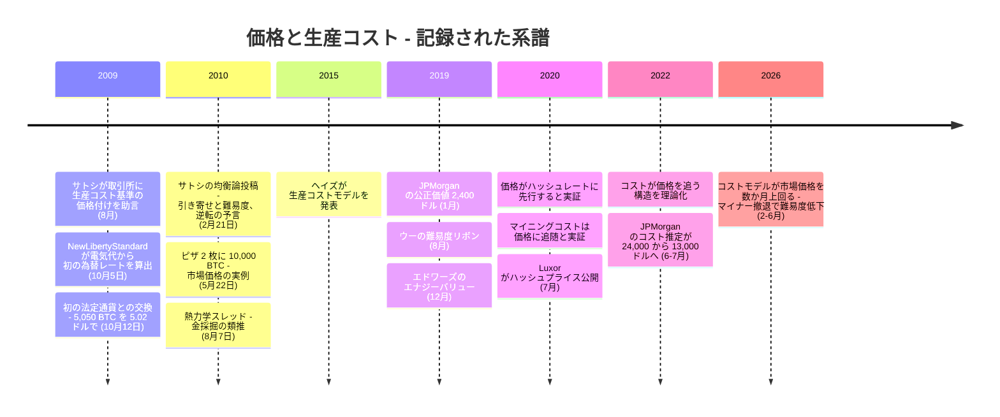

2009 年 10 月 5 日、ビットコインに初めて付いた価格は、市場で発見されたものではなく、[電気代から計算されたもの](/BitcoinArchive/ja/entries/aftermath/2009-10-05-newlibertystandard-first-exchange-rate/)だった。それから 16 年、マイニングコストと市場価格はいまも近い距離で連動し、「生産コスト」はビットコイン市況解説の定番であり続けている。自然に浮かぶのは、どちらが先かという問いだ。マイニングのコストが価格を支えているのか、それとも価格がコストを従えているのか。アーカイブの記録には、その実践（2009 年、コストから導かれた価格）と理論（サトシによる 2010 年 2 月の均衡論。方向の逆転という予言を含む）の両方が残っている。その記録と、後年それを検証した研究を整理する。

## 1. 市場なしの価格付け — 2009 年

[マルッティ・マルミが 2009 年 7 月に最初の取引所サービスを提案した](/BitcoinArchive/ja/entries/aftermath/2009-07-22-bitcoin-exchange-proposal/)とき、サトシの助言は、純粋なオークションではなく生産コストを裏付けとして価格を決めることだった。プロジェクトサイトの FAQ も同じ関係を述べており、その一節は[翌 2010 年 2 月、BitcoinTalk 上でサトシ本人に向けて引用し返される](/BitcoinArchive/ja/entries/forum/bitcointalk/topic-57/2010-02-17-the-current-bitcoin-economic-model-doesnt-work/)ことになる。しかも因果の向きは、すでに価値からコストへ向いていた。

<!-- speaker: Satoshi Nakamoto -->
<!-- audit:quote-skip -->
> 「ビットコインが実際の交換価値を持ち始めると、コイン生成の競争により、コイン生成に必要な電力コストはコインの価値に近づく」

[NewLibertyStandard の 2009 年 10 月 5 日の為替レート](/BitcoinArchive/ja/entries/aftermath/2009-10-05-newlibertystandard-first-exchange-rate/)は、同じ原理を独立に適用したものだった。1 ドル = 1,309.03 BTC、すなわち 1 ドルをマイニング用コンピューターの電気代で割った数字である。1 週間後、この推定は最初の市場の試験を受ける。[マルミが 5,050 BTC を 5.02 ドルで売却する](/BitcoinArchive/ja/entries/aftermath/2009-10-12-martti-malmi-first-btc-sale/)。1 コインあたり約 0.00099 ドルで、コスト式の 0.000764 ドルより約 3 割高い水準だった。板もない価格としては、推定は妥当な範囲に着地していた。

これはビットコインで初めて現れた考え方ではない。古典派経済学は、アダム・スミスの『国富論』（1776 年）以来、生産コストを価値の支点として扱ってきた。「自然価格」、すなわち財を市場に届けるまでの費用の合計は、「すべての商品の価格が絶えず引き寄せられていく中心価格」である。市場価格がまだ存在しない場では、自然価格が唯一の使える数字になる。2009 年のビットコインは、その教科書的な実例だった。

## 2. 2010 年 2 月 — サトシが均衡を述べ、逆転を予言する

2010 年 2 月、投稿者 Suggester が [BitcoinTalk のトピック 57「The current Bitcoin economic model doesn't work」](/BitcoinArchive/ja/entries/forum/bitcointalk/topic-57/2010-02-17-the-current-bitcoin-economic-model-doesnt-work/)を立て、上の FAQ の一節を引用しながら、生成コストが予定表どおり倍々に上がる通貨は使われずに退蔵される、と警告した。返信の中で、[匿名の投稿者 xc](/BitcoinArchive/ja/entries/forum/bitcointalk/topic-57/2010-02-20-xc-msg412/) が関係の向きを組み替えた。

<!-- speaker: xc -->
<!-- quote: q1 -->
> ノード数とそれに伴う計算 CPU 能力は変動し、その競争的な変動によってコストが価値に近づく（逆ではない）。価値は市場と、取引仲介手段（貨幣）としての bitcoin の需要によって設定される。

[翌日のサトシの返信](/BitcoinArchive/ja/entries/forum/bitcointalk/topic-57/2010-02-21-re-current-bitcoin-economic-model-is-unsustainable/)は「素晴らしい分析だ、xc」で始まり、均衡の全体像を述べる。

<!-- speaker: Satoshi Nakamoto -->
<!-- quote: q2 -->
> 価格を確立する市場がない状態では、NewLibertyStandard の生産コストに基づく推定は良い推測であり、有用なサービスだ（感謝する）。あらゆる商品の価格は生産コストに引き寄せられる傾向がある。価格がコストを下回ると、生産が減速する。価格がコストを上回ると、生成して販売することで利益を得ることができる。同時に、生産の増加は難易度を上げ、生成コストを価格に向かって押し上げる。
>
> 後年、新しいコインの生成が既存の供給量に対して小さな割合になると、市場価格が生産コストを決定する方向になり、その逆ではなくなる。

この 2 段落には 3 つの主張が詰まっている。第一に、引き寄せそのもの。「生産コストに引き寄せられる傾向がある」という言い回しは、234 年前にスミスが自然価格について使った動詞と同じだ。第二に、その引き寄せをビットコインで成り立たせている仕組み。供給の増減ではなく、難易度調整が「生成コストを価格に向かって押し上げる」。動くのはコストの側であって、価格だけではない。第三に、明示的な予言。新規のコイン生成が既存供給に比べて小さくなれば、市場価格が生産コストを決めるようになり、逆ではなくなる。

NewLibertyStandard 本人も[同じスレッドで返信し](/BitcoinArchive/ja/entries/forum/bitcointalk/topic-57/2010-02-21-newlibertystandard-msg418/)、コスト由来の自分のレートが永遠に上がり続けることはない、と述べている。生成が割に合ううちは参加者が増え、割に合わなくなれば止める者が出る。価格表を運営する当人による、マイナーの参入と撤退の描写である。

## 3. 金にあってビットコインにない調整弁

普通の商品では、「価格がコストを上回る」と 2 つの調整が同時に走る。既存の生産者が増産し、新しい生産者が参入する。供給が増え、価格そのものが押し戻される。つまり調整の半分は価格の側で起きる。

ビットコインはこの半分を丸ごと取り除いた。発行スケジュールはコンセンサスルールであり、難易度は 2,016 ブロックごとに再調整されて、ハッシュパワーが増えても生成されるコインの数は変わらない。マイナーの参入は新規コインの供給を増やせず、撤退は減らせない。参入と撤退が動かすのは難易度であり、したがって全員の 1 コインあたりのコストである。

| 調整の経路 | 金（古典的な商品） | ビットコイン |
|---|---|---|
| 価格がコストを上回る | 鉱山が増産し、新しい鉱山が開く — 供給が増え、価格自体が押し戻される | ハッシュレートが増える — 発行量は不変 |
| 不均衡を吸収するもの | 一部は価格（供給増）、一部はコスト（採掘条件の悪化） | コストのみ（難易度が上がる） |
| 価格がコストを下回る | 高コストの鉱山が閉じ、供給が絞られ、価格が支えられる | ハッシュレートが減る — 発行量は不変のまま難易度が下がり、コストが下がる |
| 長期の落ち着き先 | 価格 ≈ 限界費用（両側から到達する） | コスト ≈ 価格（コスト側からのみ到達する） |

これは後年、マルティンセンとゴードンの「The Price and Cost of Bitcoin」（2022 年）が理論として定式化した読みである。プロトコルがハッシュレートと無関係に新規コインの流量を固定している以上、マイナーの参入・撤退は市場に届く供給を変えられず、したがって価格を動かせない。マイニングの超過利潤が呼び込むのはハッシュレートであり、それが難易度と限界費用を押し上げ、超過分が消えるまで続く。半減期は同じことを予定された実験として見せる。210,000 ブロックごとに、同じハッシュパワーの 1 コインあたりコストは一夜で倍になるが、市場価格が予定表に合わせて倍になったりはしない。調整はマイナーの利益率とその後の難易度の動きを通じて、コストの側に降りてくる。半減期ごとの記録は[通貨設計書](/BitcoinArchive/ja/entries/design/2009-01-03-bitcoin-monetary-design/)に表としてまとめられている。

## 4. 2010 年 8 月 — エネルギーからの異議

[スレッド「Bitcoin minting is thermodynamically perverse」](/BitcoinArchive/ja/entries/forum/bitcointalk/topic-721/2010-08-05-bitcoin-minting-is-thermodynamically-perverse/)は、同じ関係をエネルギーの側から攻めた。コインの価値が鋳造に燃やした電力の近くに決まるのなら、この仕組みは設計からして実物資源を浪費しているのではないか。起点の投稿には当時の 2 つの立場が両方とも書かれている。生成者が電力を投じる意思そのものがコインに少なくともそれだけの価値を与えているという立場と、生産コストは市場価値とは端的に別物だという立場である。[サトシの返信](/BitcoinArchive/ja/entries/forum/bitcointalk/topic-721/2010-08-07-re-bitcoin-minting-is-thermodynamically-perverse/)は、商品の先例で答えた。

<!-- speaker: Satoshi Nakamoto -->
<!-- quote: q3 -->
> これは金と金の採掘と同じ状況だ。金の採掘の限界費用は金の価格付近にとどまる傾向がある。金の採掘は無駄だが、その無駄は交換手段として金が利用可能であることの有用性よりもはるかに小さい。
>
> Bitcoin の場合も同じだと思う。Bitcoin によって可能になる取引の有用性は、使用される電力のコストをはるかに上回るだろう。したがって、Bitcoin を*持たない*ことこそが正味の無駄になるだろう。

類推の内側にある向きに注意したい。金の採掘の限界費用は、金の価格付近に「とどまる」。ここでも、コストが価格を追う形になっている。

2 日後、[同じスレッドで](/BitcoinArchive/ja/entries/forum/bitcointalk/topic-721/2010-08-09-re-bitcoin-minting-is-thermodynamically-perverse/)サトシは運用上の帰結を付け加えた。生成は最も安い場所に行き着くはずで、それは電気暖房の寒冷地かもしれない。そこでは排熱が無駄にならないからだ。マイナーは価格を所与として最安の電力を探す側であり、調整を担うのはやはりコストの側である。

## 5. 現代の研究 — コストモデルとその批判

2015 年以降、2010 年のフォーラム上の均衡論は、学術と市場調査の研究プログラムになった。一方の系譜はコストを価格の駆動因ないし下限として真剣に扱い、もう一方は因果を測定して、逆向きに走っていることを見出した。

| 研究 | 年 | 主張する方向 | 中心的な主張 |
|---|---|---|---|
| ヘイズ — 生産コストモデル（作業論文 → Telematics and Informatics → Applied Economics Letters） | 2015 / 2017 / 2019 | コスト → 価格 | 1 コインあたりの限界電力コストが基礎的な価値をモデル化する。2017 年のバブルはゼロではなくモデル値へ回帰した |
| JPMorgan のストラテジーノート | 2019 / 2022 | コスト = 下限 | マイニングコストから公正価値 2,400 ドルを導出（2019 年 1 月）。生産コストは「一部の市場参加者に下限と受け止められている」— ただし推定自体が 2.4 万ドルから 1.3 万ドルへ動けば、下限も動く（2022 年半ば） |
| エドワーズ — エナジーバリュー | 2019 | エネルギー → 価値 | エネルギー投入・供給増加率・ドル換算定数から公正価値をモデル化し、価格はそこへ平均回帰するとみる |
| クリストウフェク — Energy Economics | 2020 | 価格 → コスト | 価格とマイニングコストは共通の長期均衡を持つが、調整するのはコストの側 — 数か月から 1 年かけて価格に合わせる |
| ファンタッツィーニ、コロディン — Journal of Risk and Financial Management | 2020 | 価格 → コスト | グレンジャー因果は常に一方向で、価格からハッシュレートへ。遅れは 1 〜 6 週間 |
| マルティンセン、ゴードン — The Quarterly Review of Economics and Finance | 2022 | 価格 → コスト | 発行が固定されている以上、参入・撤退は供給を動かせない。超過利潤はハッシュレートを呼び込み、コストが価格に追いつくまで続く |

モデルと並んで、計器も揃っていった。Luxor のハッシュプライス（2020 年）は、ハッシュパワー 1 単位あたりのマイナー収益を相場として引用できる数字にした。ウィリー・ウーの難易度リボン（2019 年）は、難易度の移動平均群の収縮からマイナーの撤退局面を読む。CoinShares の四半期マイニングレポートは、上場マイニング企業の財務諸表から実現ベースの 1 コインあたり費用を測る。2025 年後半では、費用の測り方（現金支出のみか、減価償却まで含むか）によって約 7.1 万ドルから 15 万ドル超まで幅があり、全費用ベースの加重平均は約 8 万ドルだった。この幅自体がひとつの発見である。「生産コスト」は 1 つの数ではなく、分布なのだ。

そして下限説は実地の試験を受けた。2026 年の初めから、広く参照される難易度回帰による推定は平均の全費用ベース生産コストを約 8.7 万ドルと置いたが、市場価格は 7 万ドル前後にとどまり、モデル上のコストを下回る状態が数か月続いた。折れたのはコストの側だった。マイナーは操業資金のために保有分を売り、撤退し、難易度は 2021 年以来最大の下げ幅を記録した。サトシの 2010 年の投稿が記述し、2020 〜 2022 年の研究が測定した調整が、目の前で走った形である。

*[編者注：§5 の 2026 年の数値は動いている市場のある時点の値である。仕組みを試す材料であって、議論は個別のドル水準に依存しない。]*

## 6. 記録が支持すること

「生産コストが価格を動かすのか、価格がコストを動かすのか」という問いには、記録に基づく答えが 2 つの半分に分かれて存在する。

- **連動は本物である。** 初の為替レートから現在の市場調査まで、コストと価格は互いの推定に使い回せるほど近い距離で動いてきた。
- **市場が生まれる前は、コストが先だった。** 2009 年にはコスト式が唯一の使える支点であり、サトシはまさにそれとして推奨した。最初の市場取引も、[やがて有名になるピザも](/BitcoinArchive/ja/entries/aftermath/2010-05-22-bitcoin-pizza-day/)、式が示す範囲の内側で値が付いた。
- **市場が生まれてからは、価格が先である。** 発行の固定は、普通の商品でコストが価格を支えるための供給の応答を取り除いてしまった。残るのは、価格を追って出入りするハッシュレートが、難易度とコストを引きずって動く姿だけだ。測定された遅れはハッシュレートで数週間、コストで数か月。価格がモデル上のコストを大きく割り込み、コストの側が後から降りてきた 2022 年と 2026 年の局面は、この仕組みの反証ではなく観測例である。
- **サトシは両方の半分を 1 つの投稿で言っていた。** 2010 年 2 月の返信は、市場なき経済のためのコストという支点を認めると同時に、市場価格が生産コストを決めるようになるという逆転を予言した。後年の実証研究が確認したのは、その予言である。

## 7. このエントリーの限界

- 「生産コスト」は 1 つの数ではない。電力価格、ハードウェアの世代、費用の会計方法（現金支出のみか全費用か）によって、実現コストは広い帯に散らばる。1 コインあたりの単一の数字は、いずれも重み付けされたモデルの出力である。
- §5 のモデル群は互いに食い違い、それぞれに当てはめられた係数を持つ。アーカイブは各モデルが何を主張しているかを記録するのであって、どれが正しいかを裁定しない。
- 後続研究は価格とハッシュレートを内生システムとして扱い、因果の判定は時間軸と局面に依存するとする。本エントリーが記録した非対称は支配的な方向であって、唯一の方向ではない。
- ここに価値評価の助言はない。コストと価格のどちらが先かという論点を、アーカイブの一次資料は例外的によく照らし出している。その記録を示す。

本分析が読み解く出来事は[初の為替レートのエントリー](/BitcoinArchive/ja/entries/aftermath/2009-10-05-newlibertystandard-first-exchange-rate/)に記録されており、一次投稿は[トピック 57](/BitcoinArchive/ja/entries/forum/bitcointalk/topic-57/2010-02-21-re-current-bitcoin-economic-model-is-unsustainable/) と[熱力学スレッド](/BitcoinArchive/ja/entries/forum/bitcointalk/topic-721/2010-08-07-re-bitcoin-minting-is-thermodynamically-perverse/)が保持している。[マルミへの取引所助言](/BitcoinArchive/ja/entries/aftermath/2009-07-22-bitcoin-exchange-proposal/)と[最初の売却](/BitcoinArchive/ja/entries/aftermath/2009-10-12-martti-malmi-first-btc-sale/)が 2009 年の連鎖をつなぐ。

コンセンサスルールの側（半減期スケジュール、難易度調整、そしてマイナー収益の手数料市場への移行）は[通貨設計書](/BitcoinArchive/ja/entries/design/2009-01-03-bitcoin-monetary-design/)、[固定供給対調整可能通貨分析](/BitcoinArchive/ja/entries/analysis/2008-10-31-fixed-supply-vs-adjustable-money/)、[手数料のみの将来の分析](/BitcoinArchive/ja/entries/analysis/2026-05-18-mining-reward-exhaustion-fee-only-future/)が扱っており、§3 の調整弁がなぜ閉じたままなのか、新規発行分が尽きたあとに何がそれを置き換えるのかを、三者を合わせて説明している。

<!-- entry-closing -->
アルフレッド・マーシャルの『経済学原理』（1890 年）は、古典派の論争に標準的な決着を与えた。価値を支配するのが効用か生産費かを論じるのは、「紙を切るのがハサミの上の刃か下の刃か」を論じるようなものだ。短期は需要が、長期は生産費が支配する。ビットコインは、片方の刃がボルトで固定された珍しい例である。供給がコンセンサスルールで固定されている以上、コストの刃は長期においても価格を切れない。需要の刃がすでに切った位置に合わせて、研がれるか、鈍るかしかない。
