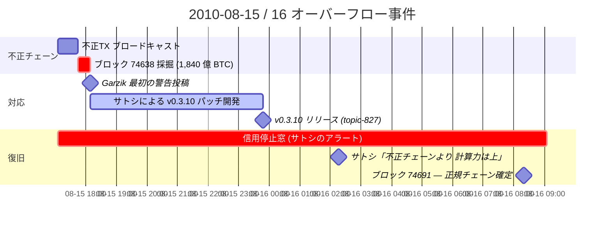

1,840 億 BTC が一つのブロックで生成された。いま見ても、現実離れした数字だ。だが、さらに奇妙なのは、バグが見つかった後である。旧ルールのノードはそのブロックを受け入れ、パッチ適用ノードは拒絶した。ビットコインは一時的に、二つの異なる歴史を抱えた。[バリュー・オーバーフロー事件の事後記事エントリー](/BitcoinArchive/ja/entries/aftermath/2010-08-15-value-overflow-incident/)は、発見、パッチ、チェーン再編成までを記録している。ここではその先へ進み、どちらの歴史が正しいかをネットワークが共有できないなかで、あり得ないトランザクションを消すために何が必要だったのかを追う。

## 1. ソフトフォーク救出が実際にどう機能したか

この修正がソフトフォークで行われたことが、救出の仕組みを決めた。ハードフォークではなく、不正ブロックを含まないチェーンで 53 ブロックを積み重ねれば、全ノード運用者を逐一調整しなくても 1,840 億 BTC を正史から除去できた。

元の合意ルールでは、ブロック 74638 は有効だった。各出力値は非負であり、出力の**合計**に対する整数オーバーフロー検査が欠落していた。Bitcoin v0.3.9 を実行するノードはブロックを目にし、自分が知るルールで検証し、受け入れた。

[Bitcoin v0.3.10](/BitcoinArchive/ja/entries/aftermath/2010-08-15-bitcoin-v0310-overflow-bug-fix/) は `CheckTransaction()` に 2 つの新しいチェックを追加した:

1. 各出力 ≤ MAX_MONEY (21,000,000 BTC)
2. 全出力の合計 ≤ MAX_MONEY

新ルール下では、ブロック 74638 は無効になった。パッチ適用ノードは検証時にブロックを拒絶し、ブロック 74638 の親 (高さ 74637) で分岐し、不正ブロックを含まずに伸びるチェーンを正典として扱った。

ソフトフォークの構造的性質は、新ルールが旧ルールの**真部分集合**であることだ。v0.3.10 で有効なブロックはすべて v0.3.9 でも有効だが、逆は成り立たない。パッチ適用ノードと未適用ノードは、永久に互換性のないネットワークに分裂するわけではない。ただ一時的に、チェーンの先端について見解が異なるだけだ。十分なハッシュパワーが新ルールへ移行するかぎり、パッチ適用チェーンが累積仕事量を蓄積し、最終的に未適用チェーンを累積仕事量で追い越し、未適用ノードは既存のフォーク選択ルールにより長いチェーンに従う。再編成は自動的に起きる。ノードごとの介入は不要だ。

これが、ネットワーク全体を最初から再調整することなく救出が成立した理由である。ルール変更は制約方向に**加算的**だった。拒絶を増やしただけで、許容を増やしてはいない。アップグレードしなかったノードも、累積仕事量が先行するチェーンを依然として追跡しており、パッチ適用チェーンの仕事量が先行するようになった時点で、未パッチノードも結果として正典チェーンに行き着いた。

その代償として支払われたもの: 約 15 時間の期間 (8 月 15 日 17:45 UTC のブロック 74638 から 8 月 16 日 08:20 UTC のブロック 74691 まで) のあいだ、正典チェーンが争われた。この期間のあいだ、どちらのチェーンで承認されたトランザクションも最終とみなすのは安全ではなかった。サトシは [bitcoin-list 警告](/BitcoinArchive/ja/entries/aftermath/2010-08-15-bitcoin-v0310-overflow-bug-fix/)で*「2010 年 8 月 15 日 17:05 UTC（ブロック 74638）以降に発生したトランザクションを信頼しないでほしい」*と釘を刺した。これは、ネットワーク稼働の停止ではなく、相手方信頼に対する 15 時間の停止だった。

その窓から 8 時間半ほど経った時点で、サトシ自身が移行の進み具合をその場で報告している。「[74638 以降、すでに 14 ブロックを生成した。0.3.10 のビルドは約 2～3時間前にアップロードされた。接続しているノードのうち、半数以上がすでに 0.3.10 だ。おそらく、不正なチェーンよりもすでに多くの計算力を持っていると思う。](/BitcoinArchive/ja/entries/forum/bitcointalk/topic-823/2010-08-16-satoshi-msg9642/)」。ブロック 74691 が正式に確定する数時間前の時点で、この機構が頼みとしていたハッシュパワーの移行がすでに優勢だったことを、本人の一人称証言が裏付けている。

機構は機能した。機構の代償は明確に開示された。両方が構造的な記録に属する。

**事件のタイムライン (UTC)**

## 2. 5 時間対応窓 — それは再現できない条件下でのみ成立した

[ガージックの第一警告投稿](/BitcoinArchive/ja/entries/forum/bitcointalk/topic-822/2010-08-15-jgarzik-msg9474/)は BitcoinTalk topic-822 に 18:08 UTC 付で投稿された。サトシの [bitcoin-0.3.10 リリース告知](/BitcoinArchive/ja/entries/forum/bitcointalk/topic-827/2010-08-15-version-0-3-10-block-74638-overflow-patch/)は topic-827 に 23:48 UTC 付で投稿された。異常が公表されてから、Windows・Linux・macOS 各版の SourceForge バイナリを備えた、ビルド済み・署名済み・ダウンロード可能なソフトフォークのリリースまで、5 時間 40 分だった。この 8 月 14〜15 日のサトシのコードチェックインとフォーラム投稿は、同じ 2 日間に ALS で衰弱しながら特異点サミットに出席していたフィニーの記録と重なる。アリバイの比較は[ハル・フィニー同一人物説](/BitcoinArchive/ja/entries/analysis/2014-03-25-hal-finney-satoshi-identity-hypothesis/)で扱っている。

2010 年にこの速さを出せた理由は、いまでは再現できない。修正を書いてから公開するまでの経路が、実質的に**単一の作者と信頼された 2 名のレビュアー**だけで構成されていたからだ。

公的記録に現れる対応の主体は、次の 3 人である。

- **[ジェフ・ガージック](/BitcoinArchive/ja/participants/jeff-garzik/)**: 技術的観察者。生ブロックダンプから異常を特定。
- **[サトシ・ナカモト](/BitcoinArchive/ja/participants/satoshi-nakamoto/)**: コード作者。パッチを書き、テストし、署名・ビルドし、SourceForge にデプロイし、告知を投稿した。
- **[ギャビン・アンドレセン](/BitcoinArchive/ja/participants/gavin-andresen/)**: 並行パッチテスター。[topic-823](/BitcoinArchive/ja/entries/forum/bitcointalk/topic-823/2010-08-15-gavin-andresen-msg9524/) で [knightmb](/BitcoinArchive/ja/participants/knightmb/) の既存のブロックチェーン・スナップショットを清浄な起点として使用し、独自の緊急パッチをビルド・テストした。

公的記録上、5 時間対応の実装経路に現れるのはこの 3 人である。意思決定者は 1 人。ガバナンスプロセスも、レビュー待ち行列も、マージゲーティングもなかった。開発者が自宅で走らせたもの以外に、テストスイートのゲートもない。「サトシのディスクに修正がある」状態から「SourceForge でバイナリがダウンロードできる」状態までのあいだに、制度は介在しなかった。

2018 年、同じカテゴリのバグ (CVE-2018-17144、同一トランザクション内での二重支払いを許してしまうインフレーション・バグ) が Bitcoin Core で発見された時点で、対応インフラは様相を変えていた: 多人数の協調的な開示、通常のメンテナンス・バンプとして発表された静かな修正リリース、遅延を伴う公開、明示的な事後検証（ポストモーテム）。2018 年の修正は時計時間ではより長く、関与人数もより多かった。そうあらねばならなかったからだ。2018 年の対応を生んだ体制は、2010 年の対応を生んだ体制よりも厳密に頑健であった。しかし 2010 年の対応窓は、2010 年がまだ持っていた制度的真空においてのみ達成可能だった。

構造的論点は「2010 年の対応のほうがましだった」ということではない。2010 年の対応が**単一作者によるリリース経路**であり、その経路こそが 5 時間を可能にしたのだ、という点である。同じ脆弱性がそれ以降のどの年に発見されたとしても、5 時間の公開リリースから復旧までの期間は持てない。それ以降のどの年も、グローバル合意関連コードベースに対する単独デプロイ権限を持つ単一作者を持っていないからだ。

## 3. バグ・攻撃・概念実証 — どのカテゴリが当てはまり、どれが当てはまらないか

事件を「攻撃者が 1,840 億 BTC を盗んだ」「バグが悪意ある主体によってトリガーされた」のいずれかに圧縮する物言いがよく見られる。両方の圧縮は、歴史記録が実際に何を確立しているかを問うのに必要な区別を見落としている。

**バグは存在する**。`CheckTransaction()` における出力**合計**に対するオーバーフロー検査の欠落は脆弱性である。CVE-2010-5139 がその名前である。これは誰がそれを悪用するかとは独立に成立する。

**攻撃は起きた (セキュリティ用語の意味で)**。オーバーフローを発動させるトランザクションを生成するには、意図的かつ技術的に情報を持った作業が必要だった。INT64_MAX/2 近辺の値は通常のウォレット使用では現れない。標準ウォレット UI はトランザクションを構築する前に MAX_MONEY と照合する。ブロック 74638 のトランザクションを生成するには、出力値が int64 算術で合計したときオーバーフローするように特別に選ばれた raw トランザクション・バイト列を手で組む必要があった。作者は標準ウォレット検証をバイパスし、手動で署名し、ブロードキャストする必要があった。セキュリティ用語では、脆弱性を意図的に発動させる行為は意図にかかわらず「攻撃」と呼ばれる。この語自体は悪意を含意しない。

**悪意は未証明であり、おそらく証明不能である**。実行者が窃盗、デモンストレーション、ストレステストのどれを意図したかは、チェーンからもトランザクション形状からも確立できない。3 つの可能性が公的記録に等しく整合する:

1. *窃盗の試み*。1,840 億 BTC は不正チェーンが正典になっていれば、壊滅的な富の移転を引き起こしていた。2 つの出力アドレスの秘密鍵を保持していた者が、想定総供給量の 9,000 倍を支配していたことになる。鍵を主張する者が現れていない事実が含意するのは、(a) 行為者は使う意図がなく、デモンストレーションだった、(b) 使う意図はあったがソフトフォークが不可避と認識して沈黙した、(c) 鍵を紛失または破棄した、のいずれかである。

2. *公的概念実証*。本番ネットワーク上で最大インパクトの実証可能な悪用コードを、1 日以内に検出され再編成で除去されると分かっていながら生成する行為は、バグ修正を強制し、バグの存在を文書化することになる。実行者にとっての費用 (若干のマイニング費用、特定リスクの若干) は、実証されたインパクトに対して小さい。

3. *ストレステスト、または敵対的設定での事故*。非標準条件下でコード経路を探っている開発者が、既存の検査が何を許容するかの限界を探りながらバグをトリガーした可能性はある。トリガーは依然として手動で構成されたトランザクション出力値を必要とする。タイプミスでは生成できない。

構造的な事実は、バグ・攻撃・悪意という論点が、ソースコード・行為・意図という 3 つの独立した水準に存在し、利用可能な証拠が各水準に異なる仕方で答える、ということである。チェーンはバグの存在と攻撃された事実を示す。チェーンは攻撃者が何を意図したかを示さない。

## 4. トランザクション構造のフォレンジック分析

ブロック 74638 の支出トランザクションの 2 つの出力値はいずれも **92,233,720,368.54277039 BTC** である。これはウォレット由来の数値ではない。INT64_MAX を 10⁸ (satoshi-to-BTC 変換係数) で割った値から、合計が INT64_MAX を僅かに超えつつ、各出力単独では int64 表現可能範囲内に収まるよう、僅かなオフセットを引いた値である。この選択は意図的であり、検証コードの内部表現に対する知識を露呈する。

実行者が満たした制約:

- **個々の出力 ≤ INT64_MAX satoshi** (そうでなければ出力ごと検証が、合計を取る前に拒絶する)
- **全出力の合計 > INT64_MAX satoshi** (二の補数で負へオーバーフロー)
- **オーバーフロー後の合計が、入力検査 (`output ≤ input`、ただし両者は signed int64 として比較) を通過するに十分小さい**。0.5 BTC の入力で十分だった。負のオーバーフロー値は正の入力値より小さいと比較されるからである。

2 つの出力が同一 (両方 922 億 BTC) であることは構造的選択であり、偶然ではない。INT64_MAX を僅かに超えるよう合計される 2 つの等しい大きな値は、制約を満たす最も単純な構成である。異なる出力値も機能するが、実行者側でより多くの算術か、必要以上に広い値域を要する。同一値は最少情報の選択である。

ブロック 74638 のマイナーは別問題である。ブロックは不正トランザクションを含むに至った通常のプルーフ・オブ・ワーク・ブロックである。未パッチの検証ルール下では、v0.3.9 を走らせている誠実なマイナーであれば誰でも、当該トランザクションが mempool に現れていれば包含していたであろう。マイナーの検証コードが「有効」と返すという意味で、ブロックは「誠実」である。チェーンには、ブロック 74638 のマイナーがトランザクション作者と共謀した証拠は存在しない。マイナーのソフトウェアが走らせていたルールに従う包含は、共謀を含意しない。

## 5. 中央集権パラドックス

ビットコインの設計命題、すなわち信頼できる第三者を持たないピア・ツー・ピア電子キャッシュは、そもそもシステムが存在する理由だった。5 時間救出が機能したのは、設計命題が含まない 3 つの条件によってだ:

1. 他のいかなる主体もコード権威において匹敵し得ない単一作者。
2. その作者が署名したバイナリを運用者が走らせるノード網。
3. 「サトシがパッチを公開した、いま即アップグレード」が、bitcoin-list と BitcoinTalk を通じて伝播し、数時間でネットワークを動員する十分な指示として機能する信頼勾配。

設計命題の厳密な読みでは、これらは何一つ必要であってはならない。プロトコルは自己修正的であるべきで、ノードは独立に検証すべきで、特権的なリリース権限を持つ主体はあってはならない。実際の救出では、3 つすべてが存在し、しかも構造的負荷を担っていた。

これがパラドックスである: システムは、システムが必要としないように設計された中央集権によって救われた。そして利用可能な時間内に他の手段で救出が成立する経路はなかった。同じ速度を持つ代替経路は存在しなかった。

このパラドックスはビットコインの設計命題を無効化しない。命題のランタイム保証とインシデントレスポンス保証が分岐する場所を画定するだけだ。プロトコルは定常状態では分散的でありながら、緊急ルール変更については中央集権的権威に依存しうる。なぜなら緊急ルール変更は、分散検証が内側から組織化できない調整事象だからだ。

事件が確立するのは非対称性である: 分散ネットワークは協調的なパッチを通じてルールへの攻撃を吸収できるが、パッチを生む調整層自体は分散的でない。後年のビットコインがその後数年かけて直面した引き継ぎ (サトシ → ギャビン → 複数メンテナ → 現在の分散メンテナンス体制) は、この非対称性への直接的応答である。2018 年のインフレーション・バグ対応 (多人数開示、単一デプロイ権限なし) は、ポスト・サトシ版の本救出があるべき姿である。

このパラドックスが解消されたわけではない。2010 年 8 月の事件で初めて、パラドックスが稼働中のネットワーク上に現れた。後続のビットコイン・ガバナンスは、この非対称性への長期的な応答として読める。

## 6. ビットコイン史における位置

最初の 10 年に、ビットコインに「これが迅速に検出されていなかったらシステムが存在を停止しえた」水準のものとなる CVE は 2 件ある:

| 年 | CVE | クラス | 修正公開時間 | 正典復旧時間 |
|---|---|---|---|---|
| 2010 | CVE-2010-5139 | 出力合計に対する整数オーバーフロー、1,840 億 BTC を生成可能 | 5 時間 40 分 | 約 15 時間 |
| 2018 | CVE-2018-17144 | 入力重複検査の欠落、同一トランザクション内の二重支払いによるインフレーションを許容 | 協調的リリースで開示と修正、メインネットでは未悪用 | 該当なし (攻撃には使用されず) |

このペアが構造的に有用なのは、2018 年のバグが**悪用されなかった**からだ。重大度は責任ある開示窓で内部評価され、悪用前に修正がリリースされた。公的記録がバグの存在を認めた時点では、復旧すべきものは何もなかった。

2010 年の事件は最初の 10 年において「悪用かつ復旧」のセルに該当する唯一のビットコイン事象である。ビットコインがライブチェーン上で兵器化された致命的バグから生き残れるかの、唯一の公開試験である。答えは: 是。数時間以内にパッチされたソフトフォーク経由で、単一作者によりデプロイされ、約 15 時間の再編成窓内にネットワークに受容された。答えは記録されている。しかしその答えを可能にした条件、すなわち単一作者デプロイ経路は、もはや存在しない。

これが 2010 年事件の歴史記録上の特異な位置である。それは、既知の攻撃クラスでネットワークが自身の復旧能力を持つことの**唯一の概念実証**であり、その実証を生んだ条件は再現可能ではない。続く十年境界の事象、すなわち[ブロックサイズ戦争](/BitcoinArchive/ja/entries/analysis/2008-10-31-bitcoin-fork-and-altcoin-genealogy/)、[2014 年の Bitcoin Core リブランド](/BitcoinArchive/ja/entries/analysis/2014-03-19-bitcoin-core-rebrand-authority-effects/)、[Mt. Gox の経営破綻](/BitcoinArchive/ja/entries/aftermath/2014-02-28-mt-gox-bankruptcy/)は、ガバナンス・エコシステム上のストレスであり、合意バグ・ストレスではない。それらはシステムの異なる側面を試した。2010 年の事象は、復旧が完了したチェーン水準の致命バグ・ストレスとしての公的記録における唯一の事例として残る。

## 7. 本エントリーが確立しないこと

- **攻撃者の身元**。ブロック 74638 の 2 つの出力アドレスはチェーンに記録されているが、対応する秘密鍵はそれ以来使用されていない。著者性に関する公的主張は行われていない。身元の帰属は公的記録には存在しない。
- **攻撃者の意図**。攻撃が窃盗、デモンストレーション、テストのいずれだったかは、トランザクションからもチェーンからも判定できない。上記 §3 は、どのカテゴリの意図が証拠と*整合する*かを記述する。証拠が*確立する*ものは存在しない。
- **マイナーの協力**。ブロック 74638 はチェーンに身元が記録されていない主体によりマイニングされた。マイナーがトランザクション作者と共謀したか否かはチェーンから判定できない。未パッチ検証ルールはトランザクションを受容したため、誠実な包含と協調的包含は区別不能である。
- **knightmb の具体的役割**。ブロックチェーン・スナップショットの貢献は [knightmb のスナップショットと伝説](/BitcoinArchive/ja/entries/analysis/2010-08-15-knightmb-snapshot-and-legend/)エントリーで構造的に記録されている。

*[補足：本分析が扱う 5 時間パッチ投入と中央集権パラドックスは、小説『[ジェネシス ― 創設者の消失と約束](/BitcoinArchive/ja/novel/)』で名指しで描かれる場面の一つ、すなわち「分散型」のシステムが、単一のリリース権限を持つ単独の作者によって救われるという瞬間の構造的根拠となる。]*

<!-- entry-closing -->

この事件でいちばん読み違えやすいのは、救出の成功だけを祝うことだ。稼働中のネットワークで起きた合意障害から復旧できることは示された。同時に、その復旧は、システムが本来必要としないはずのリリース権限に依存した。私はこの事件を、「ビットコインは生き残った」か「中央集権だった」かのどちらかに縮めない。記録に残っているのは、その二つが同時に起きたという、居心地の悪い事実だ。
