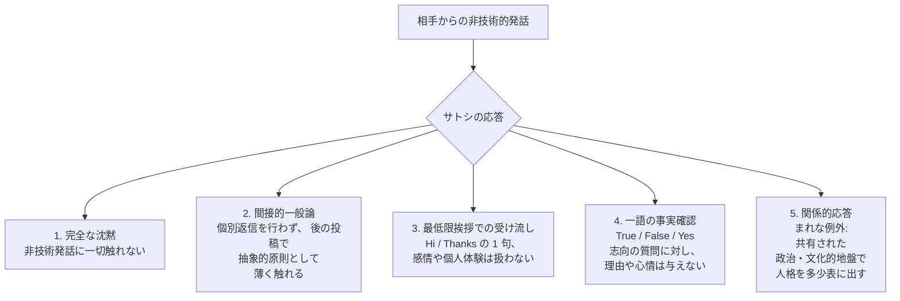

2010 年 12 月 27 日、マイク・ハーンがサトシに宛てたメールの冒頭はこうだった:

<!-- audit:quote-skip -->
> 「メリークリスマス、サトシ。君が世界のどこにいるのかも、祝う習慣があるのかも分からないけどね :-)」

2 日後、サトシの返信はこう始まった:

<!-- speaker: Satoshi Nakamoto -->
<!-- audit:quote-skip -->
> 「論文における簡易支払い検証 (SPV) は、 IP アドレス宛送金 (誰も使っていない機能) のように、直接トランザクションを受け取る前提で書かれていた。あるいは、ノードが公開鍵ですべてのトランザクションに索引を付け、メールサーバーからメールをダウンロードするように、そこからダウンロードできる前提でも書かれていた。 ...」

「メリークリスマス」もなし。「ありがとう」もなし。「君もね」もなし。返信は SPV クライアントモード設計から始まり、 8 段落の技術詳細を経て、季節の挨拶に最後まで戻ってこなかった。これは孤立した事例ではない。約 2 年半 (2009 年 4 月から 2011 年 4 月) におよぶ記録されたメール往復のなかで、サトシは相手からの非技術的な発話に対し、数えるほどの応答パターンを示す。そのうち特定の 1 パターンからは、ほぼ例外なく外れない。

ここに見える応答規律は、サトシの匿名性アーキテクチャの **一層** として読める。 [サトシの匿名性アーキテクチャ](/BitcoinArchive/ja/entries/analysis/2008-10-31-satoshi-anonymity-architecture/)で扱う技術層 (Tor、匿名化メール、メタデータ削除) とは別の層である。技術層は**経路**を不透明に保つ。ここで扱う層は**内容**を不透明に保つ。

## 1. 観察事例の整理

以下の表は、本アーカイブが一次資料で確認した事例を整理したものである。網羅ではない。実際、マイク・ハーンの往復は 33 件、マルッティ・マルミは 257 件、ビットコイントークと暗号学メーリングリスト (`metzdowd.com`) を含めればさらに数百件の文脈が存在する。ここでは「相手が明らかに非技術的な踏み込みをした」場面を代表として選んでいる。

| 日付 | 送信元 → 宛先 | 相手の非技術的発話 | サトシ返信の冒頭 | 非技術発話への扱い | パターン |
|---|---|---|---|---|---|
| 2010-12-27 → 12-29 | [マイク・ハーン → サトシ](/BitcoinArchive/ja/entries/correspondence/mike-hearn/more-questions/2010-12-27-hearn-to-satoshi-more-questions/) | 「メリークリスマス、サトシ。君が世界のどこにいるのかも、祝う習慣があるのかも分からないけどね :-)」 | [「論文における簡易支払い検証 (SPV) は、 ...」](/BitcoinArchive/ja/entries/correspondence/mike-hearn/more-questions/2010-12-29-satoshi-to-hearn-client-mode/) | **一切触れない** | 1. 完全な沈黙 |
| 2009-01-10 → 01-16 | [ハル・フィニー → 暗号学メーリングリスト](/BitcoinArchive/ja/entries/emails/cryptography/bitcoin-v0-1-released/2009-01-10-re-bitcoin-v0-1-released-finney/) | 「面白い思考実験として、ビットコインが成功して世界の支配的な決済システムになったと想像してみよう ... 1 枚あたりおよそ 1,000 万ドル ... 1 億分の 1 の確率」 | [後続投稿 015014 はダスティン・トランメル宛で、フィニー宛ではない](/BitcoinArchive/ja/entries/aftermath/2009-01-16-satoshi-to-trammell-electronic-currency/) | **個別返信なし**。同じスレッド内の後続投稿で抽象的に「広まる場合に備えて少し持っておくのは理にかなうかもしれない。十分多くの人が同じように考えれば、それは自己実現予言になる」と述べるのみで、フィニーの「1,000 万ドル」数値や「1 億分の 1」確率には一切触れない | 2. 間接的一般論 |
| 2009-04-12 → 04-12 | [マイク・ハーン → サトシ](/BitcoinArchive/ja/entries/correspondence/mike-hearn/questions/2009-04-12-hearn-to-satoshi-questions/) | 「質問がたくさんで :) でも本当に革命的なアイデアに出会うのはまれだ。こんなにワクワクした新しい貨幣案は、リップルを見つけて以来だよ」 | [サトシ: 「やあマイク、質問があれば喜んで答えるよ」](/BitcoinArchive/ja/entries/correspondence/mike-hearn/questions/2009-04-12-satoshi-to-hearn-scalability/) | **形式的挨拶のみ**。「革命的」「ワクワクした」「リップル発見の瞬間」は感情的には扱われず、リップルは最後に技術的比較対象として 1 文だけ触れられる | 3. 最低限挨拶での受け流し |
| 2011-03-07 → 03-09 | [マイク・ハーン → サトシ](/BitcoinArchive/ja/entries/correspondence/mike-hearn/bitcoinj/2011-03-07-hearn-to-satoshi-bitcoinj-release/) | 「お元気にしているといいけれど ... 早く戻ってきてほしい！ ... ネットワークにとってワクワクする時期だ！」 + `BitcoinJ` オープンソース公開の告知 | [サトシ: 「素晴らしいニュースだ！ ... 喜んで質問に答えるよ」](/BitcoinArchive/ja/entries/correspondence/mike-hearn/bitcoinj/2011-03-09-satoshi-to-hearn-contracts/) | **技術的告知への 1 句の承認のみ**。「お元気に」「戻ってきて」「ワクワクする時期」はすべて回避され、残りはマークルブランチ、シーケンス番号、 `nLockTime`、契約の濃密な技術議論 | 3. 最低限挨拶での受け流し |
| 2011-01-06 → 01-06 | [ギャビン・アンドレセン → サトシ](/BitcoinArchive/ja/entries/correspondence/gavin-andresen/2011-01-06-writing-about-bitcoin/) | 「サトシ、君は記者対応・広報・取材はやりたくないと察しているけど?」 — 技術質問ではなく個人的志向の質問 | [サトシ返信 (マルミ集 #254)](/BitcoinArchive/ja/entries/correspondence/martti-malmi/2011-01-06-writing-about-bitcoin-254/) — 当該行への返答は **「True」** | **一語のみ**。理由なし、懸念なし、心情なし。志向の確認は記録されたが、志向そのものは展開されない | 4. 一語の事実確認 |
| 2009-05-02 → 05-02 | [マルッティ・マルミ → サトシ](/BitcoinArchive/ja/entries/correspondence/martti-malmi/2009-05-02-malmi-initial-contact/) | ソースフォージ経由の初接触: 「`anti-state.com` フォーラムの `Trickstern` です。ビットコインの開発を手伝えればと思います」 (自己紹介、技術質問なし) | [サトシ: 「`anti-state.com` でのトピック投稿、ありがとう。君のビットコイン理解はまさに的を射ている。一部の反応はネアンデルタール的だったけれど ...」](/BitcoinArchive/ja/entries/correspondence/martti-malmi/2009-05-02-bitcoin-001/) | **例外**。サトシは社交的に応答する: マルミの理解を称賛し、 `anti-state.com` の応答者を「ネアンデルタール的」と性格付け、「燃えやすいが火花がない」という比喩を共有し、自分の見解を示唆する | 5. 関係的応答 (まれな例外) |
| 2009-12-22 → 12-25 | [マルッティ・マルミ ↔ サトシ (祝祭日期間の往復)](/BitcoinArchive/ja/entries/correspondence/martti-malmi/2009-12-25-bitcoin-stuff-138/) | 12 月 22 〜 25 日にかけて VPS のメモリー、 RPC、取引所サービスの構築について複数往復 — 両者とも技術話に留まり、季節挨拶はどちらからも出ない | サトシ 12-25 返信: 「君が正しい。 250,000 ブロックのテスト走行を見ていた ... うっかり」 (技術修正 + 軽い自虐) | **両者が経路を技術に留める**。ここでの挨拶不在は対称的: マルミも挨拶を始めなかった | 1. 完全な沈黙 (相互的) |
| 2010-12-30 → (サトシ返信は独立エントリーに未収録) | [マイク・ハーン → サトシ](/BitcoinArchive/ja/entries/correspondence/mike-hearn/more-questions/2010-12-30-hearn-to-satoshi-spv-progress/) | 「ところで、君のコードは読みやすくて、かけがえのない参考になっている。ありがとう」 | 技術スレッドが続く範囲でのみ承認され、コード称賛の発話には焦点を絞った返答なし | **称賛は扱われない**。パターンは 2011 年スレッドへ続く | 1. 完全な沈黙 |

## 2. 5 つのパターン

これら 5 つのパターンは表面の機構は異なるが、構造的に共通する性質がある: **特定の個人、特定の感情、特定の予測は、個別には決して扱われない**。 1 は機会そのものを拒む。 2 は話題を十分一般的な発言にまで薄めて、特定の個人への応答ではなくする。 3 は社交儀礼を最小限返して交流の場を破らない程度に保つ。 4 はサトシに関する外形的事実 (志向、嗜好) を確認するが、その理由を提供しない。 5 は例外である。対象領域は反法定通貨という共有された立場に限定されており、そこでは個人情報を開示せずに人格性を表現できる。

## 3. ハーンのクリスマス挨拶がなぜ「軽い探り」として読めるか

字面どおり読めば、 12 月 27 日のハーンの挨拶は親しみのある季節の便りだ。サトシの既知の情報統制姿勢に照らして読み直すと、同じ一文は、ハーンが必ずしも意図していなくても、識別可能な事実 2 点への **軽い探り** として機能する。

| 探りの表面 | 答えれば開示されるもの |
|---|---|
| 「君が世界のどこにいるのかも」 | 地理的位置 (大陸、国、地域) |
| 「祝う習慣があるのかも」 | 文化・宗教的枠組み (キリスト教文化圏 / 非キリスト教文化圏) |
| `:-)` | この絵文字は「君が質問の軽さを承知している」「答えなくてよい余地を残している」と示す — 個人情報に触れていることを送り手が認識しているという痕跡 |

直接の返事はどれも情報を分岐させる:

| 仮にサトシが返したとして | 漏れる情報 |
|---|---|
| 「メリークリスマス、君も」 | キリスト教文化圏 / 西洋文化枠組みの可能性 |
| 「祝う習慣はないけど、良い休暇を」 | 非キリスト教文化圏 / 別文化枠組みの可能性 |
| 「君のタイムゾーンではないけど、ありがとう」 | タイムゾーン / 地域 |
| 「ここでは違う祝い方をするよ」 | 別個の地理・文化的標識 |
| そもそも何かしら反応すること | 少なくとも、サトシが社交的な開きを **受信して処理した** ことが伝わり、将来の開きの基準値が確立する |

情報量がゼロになる返事は、その行に何も返さないことだけである。サトシはそれを取る。これは古典的な情報理論の結果の極端な特殊例である。通信路のすべての出力が送り手についての情報を運ぶとき、送り手について何も送らない唯一の方法は、その通信路を閉じることである。サトシのコミュニケーション層の匿名性規律は、個人情報の通信路を求められたときに閉じる。

この読解はハーンが探りを意図していたことを必要としない。絵文字はむしろ意図していなかった可能性を示唆する。必要なのは、答えれば情報が漏れたこと、そしてサトシがそのことを知っているかのように振る舞ったこと、その 2 点だけである。

## 4. 技術匿名性層との関係

| 匿名性層 | 道具 | 対処する脅威 |
|---|---|---|
| [技術層](/BitcoinArchive/ja/entries/analysis/2008-10-31-satoshi-anonymity-architecture/) | Tor、 `vistomail` / `anonymousspeech.com` のウェブメール、 PGP、ヘッダー・メタデータ削除、追跡可能 IP 識別子の不在 | ネットワーク水準での匿名解除 (IP・メールサーバー・ヘッダーを実在の人物に結びつける) |
| **コミュニケーション層 (本エントリー)** | 話題範囲の制限 (技術話のみ)、最低限挨拶での受け流し、一語での事実確認、個人的嗜好・場所・文化・非技術話題への見解の議論拒否 | 内容水準での匿名解除 (**何が話されたか**を実在の人物に結びつける — 文化・地理・年齢・政治的立場・感情の表れ方) |

両層は補完的である。技術層はインフラへのアクセス権を持つ攻撃者には破られうるが、コミュニケーション層はインフラでは破れない。通信路に何も置かれていないからである。サトシのメールをすべて完全に復号した攻撃者でさえ、個人情報の通信路は閉じられたまま、主として技術的な往復だけを見つけることになる。

## 5. マルミの例外が示すもの

2009 年 5 月 2 日のマルッティ・マルミとの初接触のやり取りは、本アーカイブが浮かび上がらせた最も明確な例外である。サトシはマルミに対し、彼のビットコイン理解は「的を射ている」と述べ、 `anti-state.com` フォーラムの反法定通貨の懐疑論者を「ネアンデルタール的」と性格付け、通貨採用について「燃えやすいが火花がない」という比喩を共有する。こうして、個人情報の地盤ではなく **政治・文化的** 地盤に踏み込んでいる。

この区別は重要である。例外はコミュニケーション層の規律を**破ってはいない**。厳格な追加制約のもとで動いている。

| マルミ例外でサトシが踏み込んだもの | 依然として控えているもの |
|---|---|
| 政治・文化的立場 (反法定通貨への共感、通貨懐疑論者への見解) | 場所、年齢、職業、生活時間帯、家族、言語的背景 |
| 戦略的判断 (「準備が整うまで、公の場ではこれをあまり言わないほうがいいだろう」) | ビットコイン以外の特定論点に対する個人的嗜好 |
| 自己描写 (「私の書く文章はあまり上手ではない、コーダーとしての方が得意だ」) | 書く能力・コーディング能力のいずれも個人特定につながる詳細 |

マルミの例外は、最もシンプルに読むなら **「個人特定情報を伴わない、共有された思想的地盤での選択的踏み込み」** である。サトシは反国家通貨の立場への共感を、国・年齢・言語・職業・家族状況のいずれも開示せずに示せる。例外は規律と矛盾するのではなく、規律と構造的に整合する形で発生している。

## 6. 受信側がなぜ抗議しなかったか

ありうる反論: もしサトシが個人内容への踏み込みを規律的に拒否し続けたなら、どこかの相手が異議を唱えるはず (「メリークリスマスのひと言もなしか :-)」等)。アーカイブの記録された往復には、そのような反発はひとつも含まれていない。

記録と整合する読み:

- **技術側での返礼が手厚い**。サトシの技術返信は異例なほど長く、細やかで、助けになる。実際、 12 月 29 日にハーンが挨拶の代わりに受け取った SPV 説明は 8 段落にわたる設計議論である。サトシが引き寄せた種類の通信相手にとって、実質的な技術支援を受けることはクリスマスの挨拶を返してもらうより価値が高い。
- **パターンは一貫しており、気まぐれではない**。 100% の比率で保たれるパターンは、軽んじられたシグナルではなく既知の制約として読まれる。通信相手が応答を 2 つか 3 つ受け取った頃にはこの規律は見えており、それを試そうとすればむしろ礼を欠く形になる。
- **受け手側の文体が時間を追って調整される**。ハーンの 2011 年のメールには依然として個人的なひと言 (「お元気に」「早く戻ってきて」) は含まれるが、それを応答要求としては書かない。受け手が無視してよい礼儀的な前置きとして添えている。マルミの 2009 年 12 月の往復には祝祭日にもクリスマス挨拶が出てこない。最もシンプルな読みでは、マルミは既にこの通信路規範を内面化していた。

## 7. 限界と反対の読み

- **このパターンは規律の一貫性から読まれており、個別メッセージから読まれているのではない**。上記の事例はどれも単独では「サトシが忙しい / 簡潔 / 集中していた」として説明できる。読解の重みは、規律を破る数十回の機会がすべて見送られているという積み重ねにある。
- **「計算された」は推定された性格付けであり、文書化されたものではない**。サトシはこの規律を自分では描写していない。意識的訓練だったのか、染み付いた習慣だったのか、運用上の規程だったのかは、一次資料からは直接復元できない。読解は観察された行動とその一貫性に制限される。
- **例外の集合はマルミ事例だけより広い可能性がある**。マルミ 257 件の全件と、ビットコイントークの全件を網羅的に走査すれば、追加の関係的応答が浮かび上がるかもしれない。本エントリーの整理は網羅的な列挙ではなく代表事例に依拠している。浮かび上がった追加の事例は §1 のマトリクスに追記し、 §2 の 5 パターン分類に照らして評価することが望ましい。
- **本エントリーから身元の主張は導かれない**。規律は**サトシがどう通信したか**を性格付けるものであり、サトシが誰であったかではない。同じ規律は、諜報訓練を受けた運用者、長年の内向的人物、セキュリティ意識の高い研究者、公私分離の長い個人実践を持つあらゆる人物と整合する。感情や地理を気軽に漏らすことが予想される身元は選択的に除外するが、特定の身元を選択するわけではない。

[サイファーパンク独立到達の分析](/BitcoinArchive/ja/entries/analysis/2008-10-31-cypherpunk-independent-arrival/)は、同じ実践の技術側の軸を扱う。ここで見ているのは、その行動側の対応物である。

<!-- entry-closing -->

クリスマスの往復は、サトシが個人的なことを一度も話さなかった証拠ではない。マルミとの最初の接触が反例になる。記録が示すのは境界である。それ以外の観察例では、位置、習慣、感情、称賛を差し出すメッセージが来ると、返信はプロトコルへ戻るか、そこで止まった。この境界は技術的な匿名性層を補完するが、サトシの正体を特定するものではない。残る通信記録が、ひとりの人物をどれほど一貫して視界の外へ置いたかを示している。
