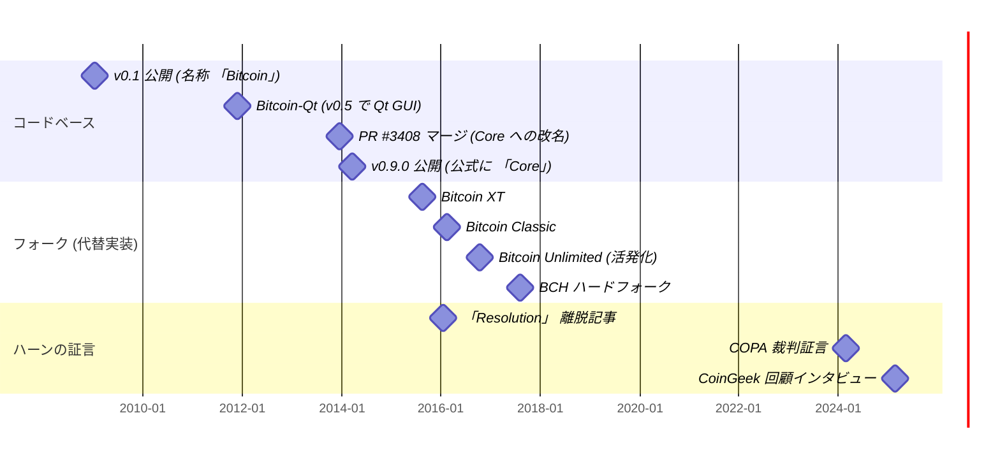

本エントリは一つの出来事 — 2013 年 12 月 16 日にマージされた [プルリクエスト #3408](https://github.com/bitcoin/bitcoin/pull/3408) (Bitcoin-Qt から 「Bitcoin Core」 への改名) と、2014 年 3 月 19 日にバージョン 0.9.0 として公開された改名 — を中心に文書化された記録を整理し、後の三つの証言 ([ハーン 2016](/BitcoinArchive/ja/entries/aftermath/2016-01-14-mike-hearn-resolution-bitcoin-experiment/)、[ハーン 2024 COPA](/BitcoinArchive/ja/entries/aftermath/2024-02-22-mike-hearn-copa-trial-testimony/)、[ハーン 2025 CoinGeek](/BitcoinArchive/ja/entries/aftermath/2025-02-21-mike-hearn-coingeek-retrospective/)) と照合する。当時は曖昧さの解消として提示された改名が、後により重要な意味を持つようになったかを問う。

ここで提示する読みでは、答えは「然り」 である。ただし主張は字面ほど広くはない。**語彙的主張**は、選ばれた名称 「Bitcoin Core」 が 「リファレンスクライアント」 の同義語として機能していない、という点である。「Bitcoin-Qt」 が持たなかった求心力的な重みを、この名称は持つ。改名が後の効果を引き起こしたのか、それとも既に存在していた構造に名前を与えただけなのかは、別個でより難しい問いである (§6)。

## 1. リブランド: 文書化された記録

### 1.1 2013 年 12 月以前の名称

v0.1 (2009 年 1 月 9 日) から 2013 年まで、公式ソフトウェアは三つの重なり合う方法で言及されていた。

| 名称 | 用法 |
|---|---|
| 「Bitcoin」 | サトシ自身が告知に用いた。[暗号学メーリングリストでの v0.1 公開投稿](/BitcoinArchive/ja/entries/emails/cryptography/bitcoin-v0-1-released/2009-01-08-bitcoin-v0-1-released/) や、[ハル・フィニーの 2009 年 1 月 11 日のツイート 「Running bitcoin」](/BitcoinArchive/ja/entries/aftermath/2009-01-11-hal-finney-running-bitcoin-tweet/) など |
| 「bitcoind」 | ヘッドレスデーモンのコマンド名。サトシのリポジトリから引き継がれた |
| 「bitcoin-qt」 | Qt 製 GUI が統合された際に追加された実行ファイル名。2013 年まで使用 |

「リファレンス実装」 という呼称は当時の文章に散見されるが、ソフトウェア自体のブランディングには採用されていない。マイク・ハーンの [2016 年 1 月の離脱記事](/BitcoinArchive/ja/entries/aftermath/2016-01-14-mike-hearn-resolution-bitcoin-experiment/) では「現在 Bitcoin Core と呼んでいるプログラム」 という言い回しが使われている。これ自体が、この名称がソフトウェア本体より新しいラベルだったことを示している。

### 1.2 PR #3408 (2013 年 12 月 16 日マージ)

[プルリクエスト #3408](https://github.com/bitcoin/bitcoin/pull/3408) は [ウラジミール・ファン・デル・ラーン](/BitcoinArchive/ja/participants/wladimir-van-der-laan/) (ハンドル名: laanwj) が起票し、2013 年 12 月 16 日にマージされた。PR 本文と続く 0.9.0 リリースノートに記された動機は同一である。

> 「Bitcoin というネットワークと Bitcoin というソフトウェアの間の混乱を減らすために、リファレンスクライアントを Bitcoin Core に改名した」
>
> — bitcoin.org, [Bitcoin Core 0.9.0 リリースノート](https://bitcoin.org/en/release/v0.9.0), 2014 年 3 月 19 日

PR の改変範囲はユーザーから見える文字列 (プログラムメッセージ、ドキュメント) に限定された。実行ファイル名 `bitcoind` および `bitcoin-qt` はマージ時点では変更されていない。

### 1.3 改名時の内部不一致

PR スレッドには [ピーター・トッド](/BitcoinArchive/ja/participants/peter-todd/) からの実質的な異論が記録されている。[PR #3408 の議論](https://github.com/bitcoin/bitcoin/pull/3408) で要約すれば — 「core」 (核) という語はコンセンサスに直結するコードに限定すべきで、コードベース全体に適用すべきではない、という主張である。ウラジミールはこれに対し、過去の議論 (issue #3203) を参照しつつ、どんな名前を選んでも全員一致は得られないと応じた。

ピーター・トッドの異論は注目に値する。彼が提案した 「core」 の意味 — 還元不能な最小コンセンサスルール — は、まさに 「Bitcoin Core」 という広い名称が後に保てなくなった区別である。2014 年以降、「Bitcoin Core」 は (a) コンセンサス重要コードと (b) 周辺のソフトウェアプロジェクトの両者を、一つのラベルで包摂し、両者を区別しないものとなった。

### 1.4 バージョン 0.9.0 (2014 年 3 月 19 日)

バージョン 0.9.0 は新名称で配布された最初のリリースである。リリースノートでは改名は事務的な整理 — ネットワークとソフトウェアの曖昧さ解消 — として提示されている。当時の記録のうち、PR スレッド・リリースノートのいずれにも、改名を位置付けの選択として枠付ける言及はない。記録された意図に従えば、これは記述的な改名だった。

**Bitcoin Core 改名年表**

## 2. 改名が導入した意味の変化

本節は解釈の核にあたる。§1 の事実主張は引用された記録に依拠する。以下は編集的な読みであり、読みとして提示し、異論を許容する。

「Bitcoin-Qt」 や 「bitcoind」 という名称は、権威についての主張を持たない。実装を識別するだけである。「Bitcoin Core」 という名称は、先行する名称が持たなかった三つの意味的ベクトルを導入する。

1. **「Core」 (核) は中心を含意し、それ以外を周縁化する**。一つのプロジェクトが 「Core」 になると、代替実装を周縁的でなく呼ぶ語彙の余地は狭まる。「フォーク」 「代替」 「少数派クライアント」 — 暗黙の勾配が用語の中に組み込まれる
2. **「Core」 は還元不能な必要性を含意する**。語源 (ラテン語 *cor* 「心臓」) と英語慣用 (「core curriculum」 「core values」) は、本質性の含みをこの語に背負わせる。「core」 (核) を冠する実装は 「リファレンス」 を冠する実装より構造的に離脱しにくい — 言葉の意味するものが異なるからである
3. **選ばれた名称は、改名が解消するはずだった区別自体を曖昧にした**。リリースノートが述べた動機は 「Bitcoin というネットワーク」 と 「Bitcoin というソフトウェア」 を区別することだった。選ばれたラベルは 「Bitcoin」 をプロジェクト接頭辞に、「Core」 を修飾語にした — ソフトウェアを上位語の傘の中に置き、外には置かなかった。曖昧さ解消を完遂する命名 (例: 「Genesis Client」 「Satoshi Client」 「Reference Bitcoind」) であれば、両者は語彙的に分離されたはずである。「Bitcoin Core」 はそれを行わなかった

(3) は構造に関わる点である。ピーター・トッドの PR #3408 コメントは、別の角度から近接する懸念を記録していた — 彼は 「core」 をコンセンサスルール、すなわち真に還元不能な部分、に予約することを望んでいた。プロジェクト全体に適用することではなく。マージされた選択はその区別を保たなかった。2015〜2017 年に報道や SNS で用いられた広い語彙もそれを保たなかった。

## 3. 効果に関する三つの証言

§2 の解釈的読みは、それぞれ別の音域で、後の三つの証言によって裏付けられる。すべて [マイク・ハーン](/BitcoinArchive/ja/participants/mike-hearn/) のものである。彼は初期に [サトシと直接メールを交わし](/BitcoinArchive/ja/entries/aftermath/2011-04-23-mike-hearn-satoshi-email-exchange/)、2015〜2016 年のガバナンス危機までプロジェクトに残った人物である。

### 3.1 ハーン、2016 年 1 月 (「Bitcoin 実験の決着」)

[2016 年 1 月の離脱記事](/BitcoinArchive/ja/entries/aftermath/2016-01-14-mike-hearn-resolution-bitcoin-experiment/) でハーンはこう書いている。

> 「サトシが去ったとき、彼は現在 Bitcoin Core と呼んでいるプログラムの手綱を、初期の貢献者の一人であるギャビン・アンドレセンに引き渡した」

この言い回しは示唆に富む。改名から 2 年後の 2016 年に書いているハーンは、「現在 Bitcoin Core と呼んでいる」 と但し書きを付ける必要を感じている — ソフトウェアそのものの同一性として扱っていない。2016 年時点で、この名称は十分に効力を持っており、ハーンは 2010〜2013 年に存在しなかったラベルを使っていることを意識している。

### 3.2 ハーン、2024 年 2 月 (COPA 対ライト裁判の証人陳述書)

[ハーンの COPA 証言](/BitcoinArchive/ja/entries/aftermath/2024-02-22-mike-hearn-copa-trial-testimony/) は改名そのものを直接論じてはいないが、2009〜2014 年のプロジェクト権威構造についてのハーンの説明を文書化している。これは 2014 年の改名を読む際の同時代的枠組みを提供する。

### 3.3 ハーン、2025 年 2 月 (「CoinGeek 回顧」)

[CoinGeek インタビュー](/BitcoinArchive/ja/entries/aftermath/2025-02-21-mike-hearn-coingeek-retrospective/) でハーンは — より長い距離から振り返って — 「Bitcoin Core」 という名称の採用を後悔し、その命名がプロジェクト内の不健全な権力構造を強化したと指摘した。

これは三つの証言のうち、ハーンが改名そのものを問題として明示的に枠付けた唯一のものである。インタビューでは仕組みの詳細は説明されていない。しかし、彼はこの後悔を [Bitcoin Foundation](#5-bitcoin-foundation-との並行性) の扱いへの後悔と並べて述べており、両者を同じパターン — 実験的な仕組みを早すぎる段階で制度的な仕組みに変えること — の現れとして見ていることを示唆する。

## 4. 2015〜2017 年のフォーク事件 — 事例研究

2015〜2017 年にかけて、複数の代替実装がビットコインのコードベースをフォークした。それぞれを取り巻いた語彙は示唆に富む。

| 年 | 名称 | 当時の語彙が枠付けた立場 |
|---|---|---|
| 2015 年 8 月 | Bitcoin XT | 「代替クライアント」 「フォークプロジェクト」 |
| 2016 年 2 月 | Bitcoin Classic | 「フォーク」 |
| 2016 年 10 月 | Bitcoin Unlimited (活発化期) | 「フォーク」 |
| 2017 年 8 月 1 日 | ビットコインキャッシュ (BCH) | ハードフォークによるチェーン分裂 |

パターンが観察される — Bitcoin Core は 「Bitcoin」 という名前を保持し、代替実装は離脱を語彙的に位置付ける修飾語を受け取った。Bitcoin XT や Bitcoin Classic を稼働させることは、当時の語彙では Bitcoin から離れることだった — 四つすべてが同じ v0.1 系譜のフォークであるにもかかわらず。語彙がその非対称性を増幅した。

主張は、改名がスケーリング論争の結末を引き起こしたというものではない。複数の構造的要因 — 取引所の方針、マイナーの経済、ネットワーク効果、BIP プロセス — が結末を形作った。主張はもっと限定的である — 2015〜2017 年に当事者が普通の言葉で状況を説明しようとしたとき、利用可能な語彙はすでに偏っていた。2016 年時点で 「より大きなブロックの規則集合に従う Bitcoin 参加者」 を中立的に呼ぶ用語は存在しなかった。利用可能なすべての用語が、その参加者を 「Bitcoin Core」 と呼ばれる別の何か — あるいはより損害が大きいことに、単に 「Bitcoin」 と呼ばれる何か — の外に置いた。

マイク・ハーン自身の離脱 ([Bitcoin XT、2015〜2016 年](/BitcoinArchive/ja/entries/aftermath/2016-01-14-mike-hearn-resolution-bitcoin-experiment/)) はそうした事例の一つである — 彼の離脱は公然と Bitcoin から去ることとして枠付けられ、Bitcoin 内部で一つの規則集合を擁護することとしては枠付けられなかった。

## 5. Bitcoin Foundation との並行性

同じ 2025 年 CoinGeek インタビューで、ハーンは 「Bitcoin Core」 の後悔と Bitcoin Foundation の扱いへの後悔を並べている。Foundation の文書化された経緯は以下の通り。

| 日付 | 出来事 |
|---|---|
| 2012 年 9 月 27 日 | ギャビン・アンドレセン、ピーター・ヴェッセネス、マルク・カルプレス、チャーリー・シュレム、パトリック・マーク、ジョン・マトニスにより設立 |
| 2014 年 4 月 | Mt. Gox 破綻、カルプレスが理事会を辞任 |
| 2015 年 4 月 | 新任理事のオリヴィエ・ヤンセンスが [Foundation は 「事実上破産している」 と公表](https://coinjournal.net/news/recently-elected-board-member-olivier-janssens-reveals-all-bitcoin-foundation-broke-gavin-seems-to-confirm/)、ギャビン・アンドレセンとパトリック・マークが追認 |
| 2015〜2022 年 | 事実上機能停止、501(c)(6) 認定が 2022 年 5 月 15 日に取り消し |

改名と並べて読むと、Foundation は同じ構造的特徴を持つ — 実験的なソフトウェアプロジェクトを単一の制度的な拠点に変換した。その拠点が存在すれば、「Bitcoin の方針」 には会場ができる。Foundation が財務的に脆弱でずさんに運営されていた (ヤンセンスの告発) ことは偶発的である。それが単一の代表機構として存在したこと自体は、構造の選択である。ハーンが二つの後悔を並べたのは、彼の読みでは両者が早すぎる制度的結晶化 — 実験的なものを、中心を固定する形で命名すること — の事例だからである。

## 6. 開かれた論点

ここで提示した読みは解釈である。三つの反対読みが明示的に認められるべきである。

**(a) 「名前は記述的だった」**: 0.9.0 リリースノートと PR #3408 の動機は相互に整合している — 改名は曖昧さ解消であり、位置付けではなかった。この読みでは、2015〜2017 年の効果は他の要因 (ブロックサイズの不一致、マイナー経済、取引所方針) によって引き起こされ、名前は下流の色付けであり、上流の原因ではない。この読みは擁護可能である。ただし、参加者であったハーンが 2025 年に改名を特定して後悔の対象にした理由は説明できない。

**(b) 「中立的な名称は存在しなかった」**: プロトコルとソフトウェアがリリース時点で外延的に重なるピアツーピアシステムでは、どんな名称を選んでも曖昧さ解消の問題を完全には解けない。どの名称も時間とともに権威を蓄積する。この読みは部分的に正しい — 故に §2 の議論は読みとして提示され、判定としては提示されない。ただし、同じ議論は 「Bitcoin-Qt」 には弱くしか当てはまらない — 「Qt」 は GUI ツールキットを指し、ソフトウェアにプロトコルの中心であるという主張を背負わせなかった。

**(c) 「権威はすでに集中していた」**: [2010 年 12 月のアンドレセンのリードメンテナー就任告知](/BitcoinArchive/ja/entries/aftermath/2010-12-19-andresen-lead-maintainer-announcement/) から 2013 年まで、コア開発者の小さな集団 (アンドレセン、ウラジミール、ピーテル・ヴァイレ、その他) はすでに事実上の決定権威だった。2014 年の改名はすでに存在していた構造に名前を与えただけで、構造を作り出したのではない。この読みではハーンの後悔は的外れだった、ということになる。この読みも部分的に正しい — 故に本エントリは改名を権威の創出ではなく語彙の*再形成*として枠付けている。

§2 で提示した読み — この名称は実装とネットワークを区別していた語彙を取り除き、両者を区別しない語彙で置き換えた — は、三つの反対読みすべてを生き残る。なぜなら語彙的主張は、2014 年以前に誰が権威を持っていたか、あるいは 2015〜2017 年に代替実装がなぜ失敗したか、とは独立しているからである。語彙的主張は次のものである — 2014 年 3 月 19 日以降、当時の語彙では、一方の側を Bitcoin からの離脱として語彙的に位置付けることなく不一致を論じることが難しくなった。証言 (§3)、事例研究 (§4)、並行性 (§5) は、それぞれ独立に語彙的主張をより明瞭にする。

読みを反証する反事実: もし 2015〜2017 年の代替実装のいずれかが、異なる規則集合を稼働しながら主流の用法で 「Bitcoin」 という名称を保持することに成功していれば、語彙的非対称性は機能しなかったことになり、名前は単なるラベルだったということになる。§4 で列挙した四つの代替実装はいずれもそれを達成しなかった。この事実は読みと整合する — 証明ではないが。

*[編者注：本エントリはビットコインのガバナンス史における複数要因のうち一つとしての改名事件を分析する。名前単独で後の権威構造が生み出されたという主張ではないし、2015〜2017 年のスケーリング立場の是非に関する主張でもない。§1 の事実主張は出典付き、§2〜§5 の読みは読みとして提示する。本分析の起点となった証言は [マイク・ハーン 2025 年 CoinGeek 回顧](/BitcoinArchive/ja/entries/aftermath/2025-02-21-mike-hearn-coingeek-retrospective/) を参照のこと。]*
