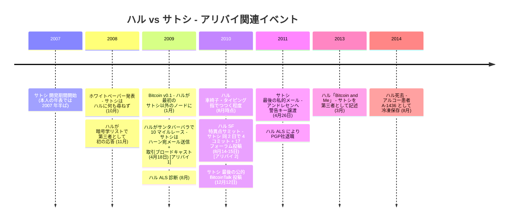

本エントリーは、[ハル・フィニー](/BitcoinArchive/ja/participants/hal-finney/) — カリフォルニア工科大学で訓練を受けた暗号学者、PGP 2.0 の主要開発者、[Reusable Proof-of-Work（RPOW、2004 年）](/BitcoinArchive/ja/entries/aftermath/2019-08-21-hal-finney-rpow-recognition/)の考案者、サトシ以外で最初にビットコインを稼働させた人物、人類初の人物間ビットコイン取引（10 BTC、2009 年 1 月 12 日）の受領者、ドリアン・ナカモトから数ブロック離れた場所に住んでいたカリフォルニア州テンプル市の長期居住者 — がサトシ仮名の主体だったとする、繰り返し公的に提起される仮説を記録する。最も多く引用される公的提唱は、[2014 年 3 月 25 日のアンディ・グリーンバーグによる Forbes 特集「Nakamoto's Neighbor」](/BitcoinArchive/ja/entries/aftermath/2014-03-25-greenberg-forbes-nakamotos-neighbor/) で、地理的偶然を中心に仮説を構成し、フラン・フィニーのレース当日の写真を主要な反証として提示した。仮説は[ジョン・カレイロウのニューヨーク・タイムズ・アダム・バック調査のためにフロリアン・カフィエロが 2026 年に実施した文体計量分析](/BitcoinArchive/ja/entries/aftermath/2026-04-08-nyt-carreyrou-adam-back-satoshi-investigation/)でも再浮上し、フィニーは最近接マッチをめぐってアダム・バックとほぼ同点と報告された。本エントリーは仮説の主張を提示し、支持論点を提唱者の言い分どおりに記述し、反証を同等の詳細で並べる。判断は読者に委ねる。

## 1. 仮説の主張

仮説は、フィニーがサトシ・ナカモト仮名の主体であり、彼が記録した「サトシ」 との公的な関わり — [2009 年 1 月のメールのやり取り](/BitcoinArchive/ja/entries/correspondence/hal-finney/2009-01-08-satoshi-to-finney-release/)、[最初のビットコイン取引](/BitcoinArchive/ja/entries/aftermath/2009-01-12-first-bitcoin-transaction/)（2009 年 1 月 12 日）、2013 年の[「Bitcoin and Me」](/BitcoinArchive/ja/entries/aftermath/2013-03-19-bitcoin-and-me-hal-finney/) 回顧 — はすべて仮名を維持するための演出だったとする。この読みのもとでは、フィニーは開発期（2007〜2008 年）から少なくとも 2009 年 8 月の ALS 診断まで、可能性としては 2011 年初頭の退職までサトシとして活動していた。さらに強い変種は 2011 年以降のサトシ通信（[2011 年 4 月のマイク・ハーン宛メール](/BitcoinArchive/ja/entries/correspondence/mike-hearn/holding-coins/2011-04-23-satoshi-to-hearn-moved-on/) と[2011 年 4 月のギャビン・アンドレセンへの警告キー譲渡](/BitcoinArchive/ja/entries/correspondence/gavin-andresen/2011-04-26-satoshi-to-andresen-alert-key/)）を扱う必要があり、共著者または事前ドラフトを必要とする。

仮説に対するアリバイ性のイベントは 2 つ: 2009 年 4 月 18 日のレース当日時間帯と 2010 年 8 月 14-15 日の特異点サミット時間帯。サトシの記録された活動との位置関係:

## 2. 仮説を支える論点

### 2.1 RPOW（2004 年）— 直接的な概念上の先駆

2004 年、フィニーは[Reusable Proof-of-Work（RPOW）](/BitcoinArchive/ja/entries/aftermath/2019-08-21-hal-finney-rpow-recognition/) を構築した。これはアダム・バックの[Hashcash](/BitcoinArchive/ja/entries/aftermath/1997-03-28-adam-back-hashcash-announcement/) トークン（設計上 1 回限り）を、サーバー検証による再利用機構によって譲渡可能にしたシステムである。名指しされたサトシ候補の中で、ビットコイン以前にプルーフ・オブ・ワークに基づくデジタルトークンシステムを実際に動作させた者はフィニーただ一人。概念的系譜は直接的: Hashcash → RPOW → ビットコインのマイニング報酬。

反論: RPOW はサーバー仲介型でアーキテクチャの距離が大きい。

| 構成要素 | RPOW (2004) | ビットコイン (2009) |
|---|---|---|
| プルーフ・オブ・ワーク | ✅ | ✅ |
| 譲渡可能トークン | ✅ | ✅ |
| 信頼された発行サーバー (IBM 4758 セキュアコプロセッサー) | ✅ — 必要 | ❌ — 排除 |
| 分散型台帳 | ❌ | ✅ |
| 分散型最長チェーン合意 | ❌ | ✅ |
| UTXO モデル | ❌ | ✅ |
| マイニング報酬鋳造 | ❌ — 鋳造なし | ✅ |
| 固定供給上限 | ❌ | ✅ — 2,100 万 |
| 稼働中の P2P ネットワーク | ❌ — サーバークライアント | ✅ |

ビットコインの中心的な設計上の動き — 信頼された発行者を完全に排除する — はまさに RPOW がやっていないことである。RPOW の著者性は能力と問題領域への関与を示すが、「認証済みサーバー経由の譲渡可能 PoW トークン」 と「最長チェーン合意による信頼不要な P2P デジタルキャッシュ」 の隔たりは大きい。ビットコイン v0.1 のコンポーネント別の出所については[ビットコイン設計系譜](/BitcoinArchive/ja/entries/analysis/2008-10-31-bitcoin-design-lineage/) を参照。

### 2.2 ドリアン・ナカモトへの地理的近接

フィニーはカリフォルニア州テンプル市に約 10 年間居住していた — グリーンバーグの 2014 年 Forbes 記事の数週間前に[Newsweek がドリアン・ナカモト](/BitcoinArchive/ja/entries/aftermath/2014-03-06-newsweek-dorian-nakamoto/) をサトシ候補として特定した、まさに同じ町である。フィニーとドリアン・ナカモトは「数ブロック離れた場所」 に住んでいた。論点: 「サトシ・ナカモト」 が真の著者から数ブロック離れた場所に住む実在の人物の名前から構築された仮名だった、というもの。[仮名構築分析](/BitcoinArchive/ja/entries/analysis/2008-10-31-satoshi-anonymity-architecture/) で他の名前選択機構と比較される、より精緻な版である。

反論: テンプル市はサンガブリエル・バレーの人口約 36,000 人の小さな郊外であり、偶然は起こる。論点は、フィニーが（自身と無関係の名前ではなく）隣人の名前から派生した仮名を選んだこと、およびその後さらなる地理的手がかりを残さずに何年もその仮名を維持したこと、の両方を受け入れる必要がある。グリーンバーグの記事が記録するパターンは、行動的裏付けのない地理的隣接である — フランは、ハルがドリアン・ナカモトとの繋がりや認識を持っていなかったと強く主張している。

### 2.3 2026 年文体計量での僅差と広範コーパスでの順位

フロリアン・カフィエロの[2026 年ニューヨーク・タイムズ調査向け文体計量レビュー](/BitcoinArchive/ja/entries/aftermath/2026-04-08-nyt-carreyrou-adam-back-satoshi-investigation/) は、12 候補中フィニーがアダム・バックとほぼ同点と報告した。カフィエロ自身は結果を不確定と評した。[Bitcoin Institute によるバス・ヴァン・ドルストの 75,000 人著者コーパスの再分析](/BitcoinArchive/ja/entries/analysis/2026-05-03-van-dorst-corpus-reanalysis-named-candidates/) は、フィニーの執筆を上位 6.89%（12,739 人中 878 位）に位置づける — ニック・サボに次ぐ第 2 位である。

| 文体計量研究 | ハル・フィニーの結果 |
|---|---|
| Skye Grey 2013（サボ単独仮説検証） | 候補集合に未収録 |
| アストン大学 2014（11 候補） | 順位非公開 |
| ヴァン・ドルスト 2024 / Bitcoin Institute 再分析（75,000+ 著者） | 12,739 中 878 位 — 上位 6.89%、名指し候補内 2 位 |
| カフィエロ／カレイロウ NYT 2026（12 候補） | アダム・バックとほぼ同点、カフィエロは結果を不確定と評価 |

最も多く引用される 4 件の文体計量調査において、フィニーは強いが首位ではないマッチとして一貫して現れる。サトシとの執筆語調の重なりが大きい — 両者ともクリアで技術的でネイティブ水準の英語、共通のサイファーパンクメーリングリスト語彙で書いていた。

### 2.4 最初の受領者かつ最早期協力者の地位

フィニーはサトシ以外で最初にビットコインを稼働させた人物であり、[人類初の人物間ビットコイン取引の受領者](/BitcoinArchive/ja/entries/aftermath/2009-01-12-first-bitcoin-transaction/) であり、サトシとの最早期の実質的な技術通信者の一人だった。フィニーの[2008 年 11 月の暗号学メーリングリストへのホワイトペーパー発表に対する応答](/BitcoinArchive/ja/entries/correspondence/hal-finney/2008-11-19-finney-to-satoshi-scalability/) は、ほとんどの暗号学者が懐疑的だった時点で、実質的かつ支持的なものだった。論点: 複雑なシステムの著者は、立ち上げ時に既知で信頼できる、能力のあるエンジニアを近くに置く傾向がある。

反論: 信頼できる技術協力者を立ち上げ時に表に置きながら匿名でシステムを公開することは、信頼できる協力者がいる匿名の著者がまさに選ぶパターンである。同時に、暗号学メーリングリストで高品質なシステムを高品質な最初のユーザーが識別したパターンでもある。フィニーが記録した自己の説明は後者である — [「Bitcoin and Me」](/BitcoinArchive/ja/entries/aftermath/2013-03-19-bitcoin-and-me-hal-finney/) で「私はサトシ以外で最初にビットコインを動かした人物だったと思う」 と書く。

### 2.5 サイファーパンク資質、能力、および英語水準

フィニーは長期にわたるサイファーパンクであり、暗号プロトコル実装の記録された経験（PGP 2.0、RPOW、最初の暗号学的に基づく匿名リメイラー）、カリフォルニア工科大学の工学経歴、米語を母語とする背景を持つ。技術コーディングプロファイル（深い暗号ライブラリ、動作するシステム実装、数十年にわたる低レベルプログラミング）はビットコイン v0.1 が示すものと整合する。

反論: このプロファイルは当該時期の上級サイファーパンクの少なからぬ人数に当てはまり、候補集合を絞り込むがフィニーを特定して選び出さない。カフィエロの「ハル・フィニーがほぼ同点［アダム・バックと］」 結果は構造的にこの点を示している — 複数の候補が執筆語調プロファイルに適合し、文体計量手法はそれらの間で一意な選択をできない。詳細は[特定の非対称性分析](/BitcoinArchive/ja/entries/analysis/2008-10-31-satoshi-identification-asymmetry/) を参照。

## 3. 反証

### 3.1 2009 年 4 月 18 日のレース当日アリバイ

最も強いアーカイブ内反証は、[2014 年 Forbes 特集でのアンディ・グリーンバーグ](/BitcoinArchive/ja/entries/aftermath/2014-03-25-greenberg-forbes-nakamotos-neighbor/) によって最初に報告され、[2023 年のジェイムソン・ロップ](/BitcoinArchive/ja/entries/aftermath/2023-10-21-lopp-hal-finney-not-satoshi/) によって構造化された時系列のアリバイである。2009 年 4 月 18 日土曜日、フィニーはカリフォルニア州サンタバーバラで 10 マイルレースを走っていた。同じ時間帯、サトシはビットコインネットワーク上で活動していた。

| 時刻 (太平洋時間) | ハル・フィニー | サトシ |
|---|---|---|
| 8:00 AM | レース開始 (タイミングチップデータ、レース写真家の画像、レース結果 ID 591、フランの写真) | — |
| 8:55 AM | 走行中 | ブロック 11,408 がマイク・ハーンへの 32.5 BTC 送金を確認 |
| 9:16 AM | ゴールから ~2 分 | マイク・ハーン宛メール（「I sent back 32.51 and 50.00」）を 9:16 AM PT に送信 |
| ~9:18 AM | レース完走 (~78 分後) | — |

レースはタイミングチップデータ、レース写真家の画像、レース結果 ID 591、フランが撮影した追加写真で記録されている。アーカイブには[2009 年 4 月 18 日のサトシ・ハーン宛メール](/BitcoinArchive/ja/entries/correspondence/mike-hearn/questions/2009-04-18-satoshi-to-hearn-ecdsa/) があり、タイムスタンプはレースの時間帯内に位置する。同一人物が 10 マイルレースを走りながら取引をブロードキャストしメールに返信することはできない。

アリバイの成立には、フィニーのレース写真とタイミングチップデータが本物（2014 年にフランが偽造したものではない）であり、メールとオンチェーン取引のタイムスタンプが正確（時計のずれや改ざんを受けていない）であることが必要だが、両者は通常そうであり、オンチェーン記録（ブロック 11,408 のタイムスタンプ）はフランが操作できる私的記録から独立している。2014 年の Forbes 記録は 2023 年のロップによる構造化に約 10 年先行する — フランがグリーンバーグに直接写真を見せ、グリーンバーグが印刷物として公開した。これは仮説否定のために事後的に構築されたアリバイではなく、サトシのネットワーク活動と偶然一致した、当時記録された活動である。

ロップ 2023 およびピーター・ミラー 2026 の追加分析は、仮説に対する 4 つの構造的観察を加える:

- **IP アドレスの相違**: 2009 年 1 月 10 日のビットコインデバッグログにフィニーの IRC ノードが IP `207.71.226.132` で記録され、サトシの IP は `68.164.57.219` と異なる ISP・地理的領域に現れる。フィニーがサトシだったなら、両端点が同じデバッグログで同時に別ピアとして現れない。
- **コーディングスタイルの相違**: フィニーの公開コードはインデントにタブ・識別子に `snake_case` を用いる。サトシのビットコイン v0.1 ソースはスペースと `camelCase`（Visual C++ on Windows 典型のハンガリアン記法プレフィックス付き）を用いる。コメント形式と関数名規則も体系的に異なる。
- **英米綴りの相違**: サトシの執筆は一貫して英国・連邦の綴り（`colour`、`favour`、`optimise`、`maths`）を用いる。フィニーの執筆は全体を通して米国式である。サトシのメール語調をハルの執筆と比べる文体計量比較では、メール語調はハルよりホワイトペーパーに近い。
- **OS 環境の相違**: ビットコイン v0.1 は Windows 専用 `.rar` アーカイブで Visual C++ 6.0 SP6 + MinGW GCC 3.4.5 でビルドされた。サトシの 2010 年 12 月のアンドレセン宛自己記述「[ギャビンは]私より Linux にずっと詳しい」 は Windows 中心の作業環境を裏付ける。フィニーは記録された長期 Mac ユーザーだった。開発環境の記録は 2 台の異なるマシンを示す。

### 3.2 フィニーの 2013 年「Bitcoin and Me」 における第三者的記述

2013 年 3 月、フィニーは BitcoinTalk に[「Bitcoin and Me」](/BitcoinArchive/ja/entries/aftermath/2013-03-19-bitcoin-and-me-hal-finney/) を投稿した — ALS 末期にアイトラッキングソフトを用い、死の 1 年前に書かれたものである。エッセイは一貫してサトシとの関わりを第三者として記述している:

> 今日、サトシの真の正体は謎となった。だが当時、私は日系の若い男 — とても聡明で誠実 — を相手にしていると思っていた。生涯で多くの優秀な人々を知る幸運に恵まれてきたので、その兆しは見分けがつく。

> 私はサトシ以外で最初にビットコインを動かした人物だったと思う。

仮説が真であるためには、このエッセイは病床から、彼が 4 年間関わってきたビットコインコミュニティに宛てて、瀕死の人物が書いた持続的な自己欺瞞でなければならず、観客への利益も妥当な動機もない。シンプルな読みは、フィニーがサトシを彼が関わった人物 — その正体は彼にとっても謎のままだった人物 — として回想している、ということ。

[他候補に適用される自己記述枠組み](/BitcoinArchive/ja/entries/analysis/2008-08-20-satoshi-self-statements/) と比較して、フィニーの記述は異常に明確である: ビットコイン公開期間全体の彼の枠組み付けがサトシを別人として扱っている候補である。

### 3.3 Patoshi マイニング規模の不整合

[セルジオ・ラーナーの Patoshi 分析](/BitcoinArchive/ja/entries/aftermath/2013-04-17-sergio-lerner-patoshi-analysis/) は、単一の支配的な初期マイナー — ほぼ確実にサトシ — を約 22,503 ブロック・約 1,148,800 BTC 未使用残として特定する。[ロップ 2022 年「Was Satoshi Greedy?」](/BitcoinArchive/ja/entries/aftermath/2022-09-16-lopp-was-satoshi-greedy-miner/) は、Patoshi パターンを利益最大化ではなくネットワーク防衛のための意図的なハッシュレート抑制として再構成している。

| 項目 | Patoshi（サトシ） | ハル・フィニーの記録 |
|---|---|---|
| マイニングしたブロック | 約 22,503 | 「数ブロック」 — 難易度 1 の少数 |
| 蓄積 BTC | 約 110 万 | 控えめな初期保有を相続人のためにオフラインウォレットに統合 |
| マイニング行動 | ネットワーク保護のための持続的・防衛的抑制 | 短期間稼働後、コンピューターが熱くなりファン音が気になり停止 |
| マイニング期間 | 2009 年〜2010 年初頭まで継続 | 2009 年初頭に停止、2010 年末にウォレットを再発見 |

フィニー自身の[「Bitcoin and Me」](/BitcoinArchive/ja/entries/aftermath/2013-03-19-bitcoin-and-me-hal-finney/) は彼のビットコイン保有量について明示的: コンピューターが熱くなりファン音が気になったためビットコインを止める前に「数ブロック」 をマイニングしたと記述し、その後 2010 年末まで忘れていたが、「まだ動いていた」 と「驚いて」「古いウォレットを引っ張り出し」、ビットコインがまだそこにあるのを確認した、と記す。フラン・フィニーの[2019 年「Cryonics Magazine」 プロファイル](/BitcoinArchive/ja/entries/aftermath/2019-04-01-fran-finney-hal-finney-profile/) は家族のビットコイン保有量について同様に明示的である。

仮説は、フィニーが Patoshi 規模の保有を妻、遺産、およびアルコー（患者の冷凍保存後の財務に関わる）から ALS 期間中ずっと隠し続け、同時にその規模を明示的に矛盾する公的回顧を書いた、ということを要求する。Patoshi の防衛的マイニング行動 — 出力を抑制した持続的なネットワーク保護 — もまた、ファン音のために 2009 年初頭にビットコインを止めたというフィニー自身の記述と相容れない。

### 3.4 識別性論

[ウェイ・ダイの 2014 年 AALWA スレッド回想](/BitcoinArchive/ja/entries/aftermath/2014-01-12-wei-dai-retrospective-on-satoshi/) は、サトシが開発期間中に可視のサイファーパンクコミュニティで「以前から積極的に活動していた人物ではない」 と論じる — これは 2007〜2008 年にサイファーパンク議論で可視に活動していた候補に対する反証として作用する読みである。フィニーはこの期間中、サイファーパンクコミュニティで継続的に可視だった: 匿名リメイラーを運営し、エクストロピー研究所と LessWrong に投稿し、自身の名前で冷凍保存と寿命延長コミュニティに関与していた。LessWrong での[2009 年 10 月の「Dying Outside」](/BitcoinArchive/ja/entries/aftermath/2009-10-05-hal-finney-dying-outside/) エッセイは、2008〜2009 年の開発・公開期間中の彼の活動の公的記録の一部である。

[識別性論](/BitcoinArchive/ja/entries/analysis/2008-10-31-cypherpunk-independent-arrival/) のもとで、フィニーの継続的な可視のサイファーパンク活動は、アダム・バック、サッサマン、その他の当該時期の可視に活動していた候補に当てはまるのと構造的に同じ問題である。

### 3.5 ALS 進行と 2010 年 8 月の特異点サミット

第 2 のアリバイ的観察はより長い時間帯を覆う。フィニーの ALS 診断は 2009 年 8 月に確定した。2010 年 8 月 — 15 か月後 — までに病状は目に見えて進行していた。フラン・フィニーの 2010 年 8 月 22 日の公開投稿は、ハルとフランが 2010 年 8 月 14-15 日にサンフランシスコでの特異点サミットに出席したことを記録する。同期間、当時の記述とハル自身の[「Bitcoin and Me」](/BitcoinArchive/ja/entries/aftermath/2013-03-19-bitcoin-and-me-hal-finney/) は、彼のタイピング速度が 120 WPM の速射から指でつつく程度に低下し、一日の多くを電動車椅子で過ごしていたことを文書化している。

同じ 2010 年 8 月 14-15 日の時間帯、サトシはオンラインで高活動だった: 4 つの SVN コードチェックインと 17 の BitcoinTalk フォーラム投稿。活動は通常のサトシ多忙期間のフットプリント — 実質的な技術的関与、持続的なタイピング量、[匿名化アーキテクチャエントリー](/BitcoinArchive/ja/entries/analysis/2008-10-31-satoshi-anonymity-architecture/) が記録する西海岸時間帯パターン（午前 10 時頃ピーク、正午頃低下）と整合する投稿時刻 — である。

仮説は、ハルが両方をやっていたことを要求する: 指でつつくタイピング速度でサンフランシスコの数日間カンファレンスに物理的に出席しながら、同じ時間帯にビットコイン設計問題について 4 つのコミット + 17 の長文フォーラム投稿を生み出す。組み合わせは「サトシ」 ハンドルの下で活動する第二の人物なしには実現しない — これは §1 で導入した仮説の共著者変種に帰着する。

### 3.6 家族の証言の一貫性

フラン・フィニーは複数のインタビュー — グリーンバーグの 2014 年 Forbes 記事（直接レース写真を見せた）、[2019 年「Cryonics Magazine」 プロファイル](/BitcoinArchive/ja/entries/aftermath/2019-04-01-fran-finney-hal-finney-profile/)、その後の取材 — でハルがサトシだったことを一貫して否定してきた。家族の証人は単独では不完全な証拠だが、フランの説明は写真で裏付けられ、10 年以上にわたり、独立したインタビューを通じて一貫して持ちこたえてきた。フランが保存したレース当日の写真は直接的な一次資料の証拠であり、彼女のインタビュー証言は数年にわたる一貫した裏付けの記録である。仮説が家族の証言記録に耐えるためには、ハルは公的な欺瞞に加えて妻に対する数年にわたる欺瞞を維持し、同時にその欺瞞を矛盾させる活動の写真証拠を残していなければならない。

## 4. 広い記録の中での位置づけ

最も多く引用される 4 件の文体計量調査において、フィニーが最近接マッチとして現れたものはゼロ。サボが 3 件で首位、アダム・バックが 1 件（カフィエロが不確定と評しフィニーが「ほぼ同点」）で首位。4 件全てのパターンは、いずれの単一候補も決定的に浮上せず、フィニーの「強いが首位ではない」 マッチが §2.5 で論じた執筆語調の重なりと整合する、ということ。

レース当日アリバイ（§3.1）、2013 年の第三者的記述（§3.2）、Patoshi 規模の不整合（§3.3）、特異点サミット／ALS 進行アリバイ（§3.5）は、構造的に異なる反証ラインを構成する: それぞれが当該時点で当時記録された記録であり、事後的な再構成ではない。フィニーは反証が主に告白の不在に依拠する候補（サボ、アダム・バック）とは異なる証拠的位置にある。フィニーには、サトシの役割と整合させるのが困難な、能動的に記録された活動と自己記述がある。

[サトシの 2008 年 8 月 22 日のアダム・バック宛メール](/BitcoinArchive/ja/entries/correspondence/adam-back/2008-08-22-satoshi-to-adam-back-b-money/) — 「b-money のページは知らなかった」 — はフィニーがサトシと最初に記録された接触をする数か月前である。フィニーがサトシだったなら、パターンはこうなる: フィニーが「サトシ」 としてバックにメールし、b-money への紹介を受け、「サトシ」 としてウェイ・ダイにメールし、2 か月待ってから「ハル・フィニー」 として暗号学メーリングリストでビットコイン発表に支持的に応答する自分自身に向けてメールする。能動的かつ継続的な共同演出なしには成立しない構造。

他の名指し候補仮説との比較については、[サトシ正体仮説概要](/BitcoinArchive/ja/entries/analysis/2008-10-31-satoshi-identity-hypotheses-overview/) および個別エントリーの[サッサマン](/BitcoinArchive/ja/entries/analysis/2011-07-03-sassaman-satoshi-identity-hypothesis/)、[金子勇](/BitcoinArchive/ja/entries/analysis/2013-07-06-kaneko-isamu-satoshi-identity-hypothesis/)、[サボ](/BitcoinArchive/ja/entries/analysis/2013-12-05-szabo-satoshi-identity-hypothesis/)、[トッド](/BitcoinArchive/ja/entries/analysis/2024-10-08-todd-satoshi-identity-hypothesis/)、[アダム・バック](/BitcoinArchive/ja/entries/analysis/2026-04-08-adam-back-satoshi-identity-hypothesis/) を参照。

## 5. このエントリーの限界

- 本エントリーは新しい証拠を提示しない。2014 年 Forbes 特集、2023 年ロップ分析、フィニーの 2013 年「Bitcoin and Me」 エッセイ、2026 年 NYT 調査とカフィエロ分析、Bitcoin Institute によるヴァン・ドルストの再分析、Patoshi パターンの文献、フラン・フィニーのインタビュー記録、ピーター・ミラー 2026 年合成から資料を編集したものである。
- 本エントリーは仮説を公正に提示し、反証も同等の詳細で公正に提示し、判断を読者に委ねる。
- 本エントリーは「最も蓋然性の高いサトシ候補」 を指名しない。
- カフィエロの「ハル・フィニーがほぼ同点」 結果は、フィニーまたはアダム・バックのいずれかの確認ではなく、特定の*一意性*に関する材料として扱われる。対称的な取り扱いについては[アダム・バック仮説エントリー](/BitcoinArchive/ja/entries/analysis/2026-04-08-adam-back-satoshi-identity-hypothesis/) を参照。
- 新しい証拠が浮上した場合 — フィニーの 2013 年枠組みと矛盾する私的執筆や通信、レース当日アリバイをサトシのネットワーク活動と偽造を必要としない形で和解させるもの、Patoshi 規模の保有とフィニーの遺産との記録された繋がり等 — 本エントリーは更新されるべきである。

*[編者注：本エントリーは 2014 年 3 月 25 日 Forbes 記事を、長期にわたる仮説の最も目立つ公的提唱として用いる。枠組みは意図的に保守的である: 仮説を提示し、支持論点を提唱者の言い分どおりに記述し、反証を同等の詳細で並べる。本エントリーは仮説が真である可能性が高いか低いかについて編集的結論を引き出さない。直接の判決を求める読者は、それを見つけられない。]*
