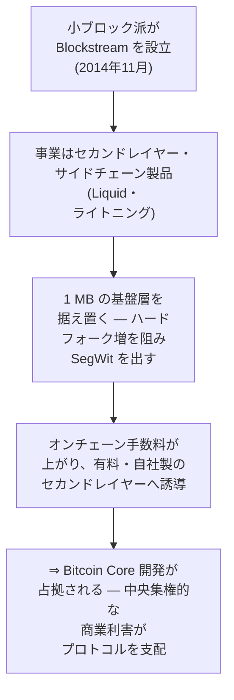
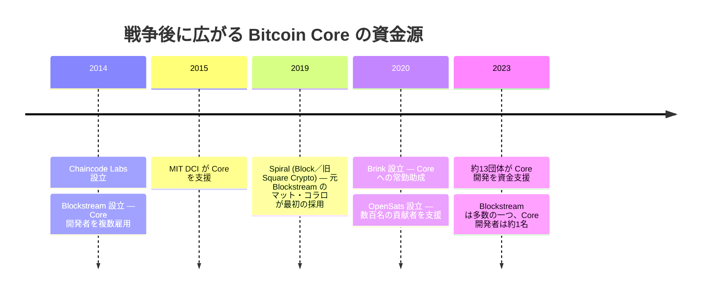

「Blockstream がビットコインを支配している」。ビットコインをめぐる議論で声の大きい界隈に入ると、必ずこの言葉に出会う。[ブロックサイズ戦争](/BitcoinArchive/ja/entries/analysis/2015-08-15-block-size-war-2015-2017-overview/)が残した数々の批判のなかでも、これがいちばん根強く残っている。主張の中身はこうだ。Bitcoin Core の開発者を多く抱えるある一社が、自社の売るセカンドレイヤー製品を必要とされる状態にするために、基盤層をわざと不便なまま据え置いた。中心を持たないはずのビットコインを、一つの企業がひそかに握ってしまった、というのである。

ところが、この言葉を最初に口にしたのは、Blockstream を悪役に仕立てたい人間ではなかった。プロジェクトを去っていく開発者自身だった。

<!-- audit:quote-skip -->
> 「新しい分散型の通貨として、『システム上重要な機関』も『大きすぎて潰せない』もない存在になるはずだったものが、それよりも悪い何か――ほんの一握りの人間に完全に支配されるシステム――になってしまった」
>
> — マイク・ハーン、[「ビットコイン実験の決着」](/BitcoinArchive/ja/entries/aftermath/2016-01-14-mike-hearn-resolution-bitcoin-experiment/) (2016 年 1 月 14 日)

ハーンが名指したのは「一握りの人間」であって、特定の一社ではない。ところが世間に広まり、今も広まり続けているのは、企業の名を挙げるほうの言い方だ。一握りの人間が、いつのまにか一つの社名に置き換わっていた。小さな違いに見えるが、事実を確かめるうえでは、この違いが大きな意味を持つ。

## 1. ハイジャック説

批判を検討するなら、いちばん強い形のものを取り上げるべきだ。弱い形を崩しても意味がない。この告発をもっとも丁寧に組み立てたのが、ロジャー・ヴァーの 2024 年の著書『Hijacking Bitcoin』である。小ブロック側に立つジョナサン・ビアの『The Blocksize War』 (2021) に正面から反論した、拡大派の一冊だ。その主張を図にすると、次のようになる。

ヴァーによれば、小ブロック派はセカンドレイヤーで稼ぐために Blockstream を設立し、基盤層は据え置くべきだと唱えることで、そのセカンドレイヤーをなくてはならないものにした。さらに踏み込んだ言い方もある。Bitcoin Core とどこかの政府、そして Blockstream が手を組み、ネットワークをわざと機能不全にするために 1 MB の制限を保ちつづけた、というものだ。これは単なる言いがかりではなく、ひと続きの因果関係として組み立てられている。だからこそ、ひとつずつ順番に確かめていける。

## 2. 記録が裏づける部分

この因果関係のうち、最初の三つの段階は、いずれも記録に裏づけられた事実である。ここを否定しようとすると、かえって事実と食い違ってしまう。

| 環 | 記録が示すこと |
|---|---|
| **雇用の重なり** | Blockstream は 2014 年 11 月、Bitcoin Core の開発者たち（[グレゴリー・マクスウェル](/BitcoinArchive/ja/participants/gregory-maxwell/)、[ピーター・ウィーユ](/BitcoinArchive/ja/participants/pieter-wuille/)、マット・コラロ、ホルヘ・ティモン、マーク・フリーデンバッハ）によって設立され、[アダム・バック](/BitcoinArchive/ja/participants/adam-back/)が最高経営責任者に就いた。その後も複数の Core 貢献者を雇い入れている。Blockstream から給与を受け取る人と Core のコミッターが重なっていたのは事実だ。 |
| **ソフトフォークという選択** | Core はハードフォークによるブロックサイズの引き上げを退け、代わりに [SegWit (BIP 141)](/BitcoinArchive/ja/entries/bip/2015-12-21-bip-0141/)（ウィーユが共同執筆）を 2017 年にソフトフォークとして導入した。基盤層のブロック上限は、拡大派が望んだ形では引き上げられなかった。容量は、署名データを軽く数える仕組みによって増やされた。 |
| **実在するセカンドレイヤー事業** | Blockstream は実際にセカンドレイヤー製品を売っている。取引所やトレーダー向けの連合型サイドチェーン Liquid（2018 年開始）だ。セカンドレイヤーの決済で利益を得る動機が同社にあるのは確かである。 |

告発者が前提をでっち上げているわけではない。土台となる事実は、しっかりしている。問題が生じるのはその先で、しっかりした事実から「だから乗っ取りだ」へと飛躍するところにある。

## 3. 記録が裏づけない部分

この因果関係は、「利害が重なっている」が「わざと壊した」に変わるところで途切れる。途切れる箇所は三つある。

**ライトニングは Blockstream のものではない。** 告発の要は、基盤層をわざと混雑させて、利用者を Blockstream の有料のレイヤーへ追い込む、という筋書きにある。しかし、そのライトニングは Blockstream のものではない。2015 年の論文でジョセフ・プーンとサディアス・ドリヤが提案したもので、二人とも Blockstream とは関係がない。実装も三種類ある。LND（Lightning Labs、もっとも広く使われている）、Core Lightning（Blockstream）、Eclair（ACINQ）だ。Blockstream はそのうちの一つを保守しているだけで、自社が発明したわけでも、利用料を取れるわけでもない。あくまで公開プロトコルの一実装にすぎない。同社が実際に売っている Liquid は、取引所向けの目立たないサイドチェーンであって、普通の送金から料金を取る関所ではない。

**小ブロックを支持する技術的な主張は、Blockstream より古く、その外でも広く共有されている。** 1 MB の上限を入れたのはサトシ自身で、2010 年、迷惑投稿への対策としてだった。Blockstream が生まれる四年も前のことである。上限の引き上げに慎重であるべきだとする論拠、たとえばノードを動かす負担や、ブロックが伝わる遅さ、ブロックを大きくしたときに採掘が一部へ集中する危険は、Blockstream とは無縁の開発者たちが以前から唱えてきたものであり、開発者全体でも多数派の立場だ。この保守的な姿勢を一社の給与のせいにしたいのなら、その会社が一度も雇っていない開発者まで同じ姿勢を取っている理由を、別に説明しなければならない。

**Blockstream は Core の大半を占めたことが一度もなく、いまではごく一部にすぎない。** Core の貢献者は、これまでに数百人を数える。Blockstream が抱えていたのは 2015 年から 2016 年の最盛期でもせいぜい数人で、2020 年代半ばには、同社の公開記録によれば Core の開発者は一人ほどになっている。資金の出どころも、集中するどころか、2017 年以降に大きく広がった。

2020 年代半ばには、Core の開発は Blockstream を含めておよそ十三の団体に支えられている。Chaincode Labs、MIT DCI、Spiral、Brink、OpenSats、Human Rights Foundation、Btrust などだ。告発が名指してきた当人たちも、それぞれ別の場所へ移っていった。共同設立者のマット・コラロは 2019 年に Spiral の最初の社員になり、ウィーユは Chaincode Labs へ移った。かつて一社に集まっていた人材は、独立して資金を持つ十あまりの組織へ散らばっている。「Blockstream がビットコインを支配している」が 2016 年に指していたものが何であれ、その指し示す範囲は、年を追うごとに小さくなっている。

## 4. 同じ疑いを、批判する側にも

批判が小ブロック側に向ける疑いは、それを口にする側にも同じように向けなければ、公平ではない。[フォーク戦争の考察](/BitcoinArchive/ja/entries/analysis/2015-08-15-bitcoin-fork-wars-as-not-oss/)が逆の向きにも当てている疑いと同じものだ。拡大派もまた、利害から自由ではなかった。[ジハン・ウー](/BitcoinArchive/ja/participants/jihan-wu/)の Bitmain は、オンチェーンの取引が増えることに、ハッシュレートと採掘機材を通じた利害を持っていた。[ロジャー・ヴァー](/BitcoinArchive/ja/participants/roger-ver/)の bitcoin.com は、自ら「本物のビットコイン」と称して推した大ブロックのチェーンに、ブランドと集客の利害を持っていた。商業的な利害が技術的な立場を無効にするのなら、それは両側とも無効にする。無効にしないのなら、どちらも無効にはならない。片方だけを「金で言わされているだけだ」と切り捨てるのは、自分の側を映す鏡を見ていないということである。

## 5. 記録から下せる判定

問いを二つに分ければ、答えも二つに分かれる。

ひとつめ。商業的な利害が、Core の開発のすぐ近くにあったか。あった。記録もそれを隠してはいない。Blockstream は Core の開発者が設立し、セカンドレイヤーの事業を持ち、論争の山場では、一つの給与名簿に異例なほど多くのベテラン開発者を集めていた。中央に資金源を持たない仕組みの、その基準となる実装に、一つの会社が近づきすぎているのではないか。この懸念は、根拠のない妄想ではなかった。注意して見ておく価値は、確かにあった。

ふたつめ。では、Blockstream はビットコインを支配したのか。自社が利益を得る製品へ利用者を追い込むために、基盤層をわざと使いものにならなくしたのか。これは記録が裏づけない。この筋書きが成り立つには、ライトニングが Blockstream の関所であり（実際には実装が三つある公開プロトコルだ）、小ブロックの主張が一社だけの立場であり（実際には会社より古く、その外でも広く共有されている）、さらに Blockstream が Core の大半を占めていなければならない（実際には最盛期でも少数で、いまは一人ほど、十三の支援団体のうちの一つにすぎない）。強い告発が頼りにする根拠は、どれも記録によって崩されてしまう。

たどり着く先は[フォーク戦争の考察 §6](/BitcoinArchive/ja/entries/analysis/2015-08-15-bitcoin-fork-wars-as-not-oss/) と同じで、本記事はあの考察が結論を出さずに残した部分を引き継いでいる。雇用が重なっていたのは事実であり、乗っ取りという主張は記録に裏づけられない。そして、告発がうっすらと指している本当の懸念、つまり保守する人がごく少数で、資金の出どころがかつて偏っていたという点こそが、もっと地に足のついた、より小さな事実であり、しかも戦争以来どの時点よりも薄れている。だから「ビットコインは Blockstream に支配されている」は、間違った一文だ。正しいのは、もっと控えめな一文になる。基準となる実装を一つだけ置く仕組みは、影響力を小さな輪のなかに集めやすい。だからこそ、誰が資金を出し、誰がその輪の内側にいるのかを見ておくことに意味がある。派手さはない。しかし、証拠が裏づけられるのはこちらの一文のほうだ。
