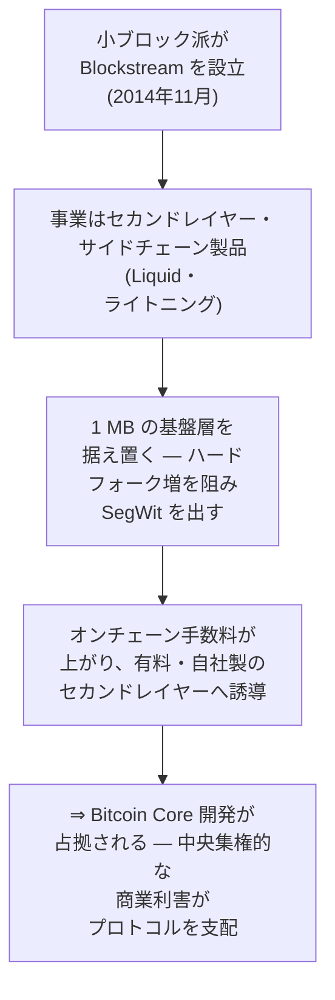
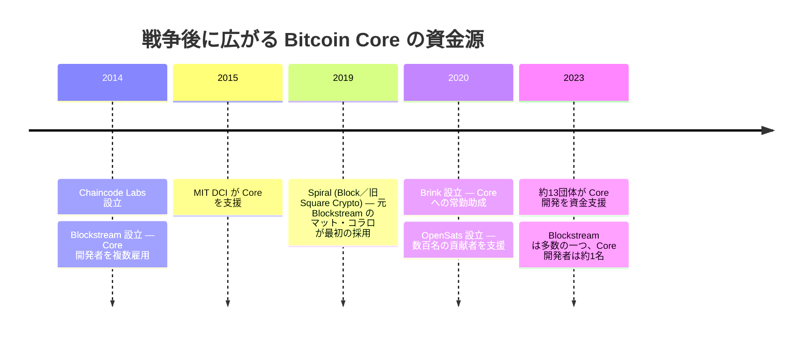

「Blockstream がビットコインを支配している」。[ブロックサイズ戦争](/BitcoinArchive/ja/entries/analysis/2015-08-15-block-size-war-2015-2017-overview/)が残した批判のなかで、この一文がいちばん長く生き延びている。Bitcoin Core の開発者を多く抱えるその一社が、自社の売るセカンドレイヤーを欠かせないものにするために、基盤層をわざと不便なまま据え置いた、という。中心を持たないはずのものを、一社が握った。

最初にこの一文を口にしたのは、Blockstream を憎む誰かではなかった。プロジェクトを去っていく開発者、[マイク・ハーン](/BitcoinArchive/ja/participants/mike-hearn/)だった。

<!-- audit:quote-skip -->
> 「新しい分散型の通貨として、『システム上重要な機関』も『大きすぎて潰せない』もない存在になるはずだったものが、それよりも悪い何か――ほんの一握りの人間に完全に支配されるシステム――になってしまった」
>
> — マイク・ハーン、[「ビットコイン実験の決着」](/BitcoinArchive/ja/entries/aftermath/2016-01-14-mike-hearn-resolution-bitcoin-experiment/) (2016 年 1 月 14 日)

ハーンが名指したのは「一握りの人間」であって、一つの会社ではない。だが世間に残ったのは、会社の名のついたほうだった。一握りの人間が、いつのまにか一つの社名に置き換わっている。確かめるべきは、まずそこだ。

## 1. ハイジャック説

この告発をもっとも丁寧に組み立てたのは、ロジャー・ヴァーの 2024 年の著書『Hijacking Bitcoin』である。小ブロック側に立つジョナサン・ビアの『The Blocksize War』 (2021) に正面から反論した、拡大派の一冊だ。その主張は、ひとつながりの因果になっている。

ヴァーによれば、小ブロック派はセカンドレイヤーで稼ぐために Blockstream を設立し、基盤層は据え置くべきだと唱えて、そのセカンドレイヤーを欠かせないものにした。さらに踏み込めば、主張はこうだ。Bitcoin Core とどこかの政府、そして Blockstream が手を組み、ネットワークをわざと止めるために 1 MB の上限を保ちつづけた。ひと続きの因果だから、つなぎ目をひとつずつ確かめられる。

## 2. 記録が裏づける部分

最初の三つのつなぎ目は、記録に裏づけられている。

| 環 | 記録が示すこと |
|---|---|
| **雇用の重なり** | Blockstream は 2014 年 11 月、Bitcoin Core の開発者たち（[グレゴリー・マクスウェル](/BitcoinArchive/ja/participants/gregory-maxwell/)、[ピーター・ウィーユ](/BitcoinArchive/ja/participants/pieter-wuille/)、マット・コラロ、ホルヘ・ティモン、マーク・フリーデンバッハ）によって設立され、[アダム・バック](/BitcoinArchive/ja/participants/adam-back/)が最高経営責任者に就いた。その後も複数の Core 貢献者を雇い入れている。Blockstream から給与を受け取る人と Core のコミッターが重なっていたのは事実だ。 |
| **ソフトフォークという選択** | Core はハードフォークによるブロックサイズの引き上げを退け、代わりに [SegWit (BIP 141)](/BitcoinArchive/ja/entries/bip/2015-12-21-bip-0141/)（ウィーユが共同執筆）を 2017 年にソフトフォークとして導入した。基盤層のブロック上限は、拡大派が望んだ形では引き上げられなかった。容量は、署名データを軽く数える仕組みによって増やされた。 |
| **実在するセカンドレイヤー事業** | Blockstream は実際にセカンドレイヤー製品を売っている。取引所やトレーダー向けの連合型サイドチェーン Liquid（2018 年開始）だ。セカンドレイヤーの決済で利益を得る動機が同社にあるのは確かである。 |

前提がでっち上げられているわけではない。土台の事実は動かない。崩れるのはその先、動かない事実から「だから乗っ取りだ」へ移るところだ。

## 3. 記録が裏づけない部分

この因果は、「利害が重なっている」が「わざと壊した」に変わるところで切れる。切れるのは三か所だ。

**ライトニングは Blockstream のものではない。** 告発は、基盤層を混ませて利用者を Blockstream の有料のレイヤーへ追い込む、という筋書きに支えられている。だが、そのライトニングが Blockstream のものではない。2015 年の論文でジョセフ・プーンとサディアス・ドリヤが提案したもので、二人とも Blockstream とは関係がない。実装は三つある。LND（Lightning Labs、最も広く使われている）、Core Lightning（Blockstream）、Eclair（ACINQ）。Blockstream が保守しているのはそのうちの一つで、自社が発明したわけでも、利用料を取れるわけでもない。同社が実際に売っているのは Liquid、取引所向けの目立たないサイドチェーンで、ふつうの送金から料金を取る関所ではない。

**小ブロックを支持する技術的な主張は、Blockstream より古い。** 1 MB の上限を入れたのはサトシ自身で、2010 年、迷惑投稿への対策だった。Blockstream が生まれる四年前のことである。上限を上げることへの慎重論（ノードを動かす負担、ブロックが伝わる遅さ、ブロックを大きくしたときの採掘の偏り）は、Blockstream と縁のない開発者たちが以前から唱え、いまも開発者の多数派が共有している。保守の姿勢を一社の給与で説明したいなら、その会社が一度も雇っていない開発者まで同じ姿勢でいる理由を、別に用意しなければならない。

**Blockstream は Core の大半を占めたことが一度もない。** Core の貢献者はこれまでに数百人を数える。Blockstream が抱えていたのは、2015 年から 2016 年の最盛期でも数人だ。2020 年代半ばには、同社の公開記録で Core の開発者は一人ほどになっている。資金の出どころも、狭まるどころか、2017 年以降に大きく広がった。

いま Core を支えているのは、Blockstream を含めておよそ十三の団体だ。Chaincode Labs、MIT DCI、Spiral、Brink、OpenSats、Human Rights Foundation、Btrust など。告発が名指してきた当人たちも、それぞれ別の場所へ移った。共同設立者のマット・コラロは 2019 年に Spiral の最初の社員になり、ウィーユは Chaincode Labs へ移っている。一社に集まっていた人材は、別々に資金を持つ組織へ散った。「Blockstream がビットコインを支配している」が 2016 年に指していたものは、年ごとに小さくなっている。

## 4. 「商売で言っている」は、誰にでも言える

告発の柱は、§3 で切れた事実の鎖だけではない。もう一本、Blockstream の技術的な主張を「商売のために言っているだけだ」と見なす動機論がある。事実ではなく動機を問う柱なので、ここは別に見る。

その「技術論など商売で言っているだけだ」という切り方は、振るう当人に同じ強さで返ってくる。[ジハン・ウー](/BitcoinArchive/ja/participants/jihan-wu/)の Bitmain は、オンチェーンの取引が増えることに、ハッシュレートと採掘機材で利害を持っていた。[ロジャー・ヴァー](/BitcoinArchive/ja/participants/roger-ver/)の bitcoin.com は、自ら「本物のビットコイン」と呼んだ大ブロックのチェーンに、ブランドと集客で利害を持っていた。利害が相手の技術論を消せるのなら、告発する側の技術論も、同じ理屈で消える。この物差しを最後まで当てれば、残る主張は一つもない。

だから利害の指摘は、動機を疑う入口にはなっても、「わざと壊した」の証拠にはならない。告発はここでも、崩れた事実の代わりに動機論へ寄りかかる。そしてその動機論は、名指した相手と同じだけ、名指した本人にも当たる。痛み分けの中立ではない。告発がもたれかかる柱が、もう一本折れる。

## 5. 記録から下せる判定

告発は二つの主張を束ねている。答えはそれぞれ違う。

商業的な利害が、Core の開発のすぐ近くにあったか。あった。記録もそれを隠していない。Blockstream は Core の開発者が設立し、セカンドレイヤーの事業を持ち、論争の山場では、一つの給与名簿に異例なほど多くのベテラン開発者を抱えていた。中央に資金源を持たない仕組みの、その基準実装に、一つの会社が近づきすぎてはいないか。この懸念は、根拠のないものではなかった。

では、Blockstream がビットコインを支配したのか。利益のために基盤層をわざと使えなくしたのか。そこは記録が裏づけない。この筋書きが立つには、ライトニングが Blockstream の関所であり（実際は実装が三つある公開プロトコルだ）、小ブロックの主張が一社だけのものであり（実際は会社より古く、外でも広く共有されている）、Blockstream が Core の大半を占めていなければならない（実際は最盛期でも数人、いまは一人ほど、十三ほどの団体の一つにすぎない）。強い告発が頼る根拠は、どれも記録に崩される。

たどり着く先は[フォーク戦争の考察 §6](/BitcoinArchive/ja/entries/analysis/2015-08-15-bitcoin-fork-wars-as-not-oss/) と同じで、本記事はその考察が判断を残した部分を引き取る。雇用が重なっていたのは事実、乗っ取りという主張は記録が裏づけない。そして、告発がうっすら指していた本当の懸念、つまり保守する人がごく少数で、資金の出どころがかつて偏っていたことは、もっと地に足のついた、もっと小さな事実だ。しかも戦争のあと、どの時点よりも薄れている。だから「ビットコインは Blockstream に支配されている」は、当たらない。当たるのはもっと静かな一文だ。基準実装を一つだけ置く仕組みは、影響力を小さな輪に集めやすい。だから、誰が資金を出し、誰が輪の内側にいるかを見ておく。証拠が支えるのは、こちらの一文のほうだ。
