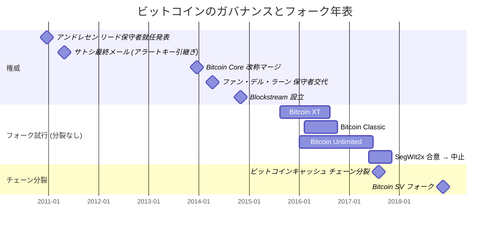

ビットコインの 2015-2017 年フォーク戦争は、本流チェーンに対する 4 度のハードフォーク試行 (Bitcoin XT, Bitcoin Classic, Bitcoin Unlimited, SegWit2x) と、生き残った 1 件の分岐 ([ビットコインキャッシュ](/BitcoinArchive/ja/entries/currency/2026-07-27-bitcoin-cash-currency-overview/)、2017 年 8 月 1 日) を生んだ。隣接する 2 つの考察記事が、これらの出来事が何であり、改称がそれらに何をしたかを扱っている: [ビットコインの家系図](/BitcoinArchive/ja/entries/analysis/2008-10-31-bitcoin-fork-and-altcoin-genealogy/)は出来事の連鎖を記録し、[Bitcoin Core 改称が権威構造に与えた影響の考察](/BitcoinArchive/ja/entries/analysis/2014-03-19-bitcoin-core-rebrand-authority-effects/)は 2014 年の改称が導入した語彙の非対称を読む。その 2 つの奥には第三の問いが潜んでいる: なぜこれらの出来事は、それぞれが普通のオープンソースの意見対立としてではなく、政治的・経済的な争奪戦として展開したのか。

ここで提示する読み筋は構造的なものである。2014-2017 年のビットコインには 3 つの条件が揃っていた。指名された権威の真空、規則決定の上に積み上がった経済的重み、そしてプロトコル・ソフトウェア・稼働中の通貨ネットワークという三層分離である。この 3 つが組み合わさって、鍵となるパラメーターをめぐる対立がソフトウェアの問題にとどまることを構造的に不可能にした。改称考察が記録する語彙の非対称は、これらの条件が表に現れるための語彙的な道具である。

**権威の移行 + フォーク試行 + チェーン分裂 (2010 - 2018)**

## 1. 2011 年 4 月以後の真空 (結果ではなく前提)

しばしば見られる読み筋は、サトシ離脱を戦争の感情的な流れの中に置く。「あれだけ揉めていたのだから、いなくなるのも当然だ」という型である。年表は逆を語る:

| 日付 | 出来事 |
|---|---|
| 2011 年 4 月 23 日 | [マイク・ハーン宛のサトシ最終メール](/BitcoinArchive/ja/entries/correspondence/mike-hearn/holding-coins/2011-04-23-satoshi-to-hearn-moved-on/) |
| 2011 年 4 月 26 日 | [ギャビン・アンドレセン宛のサトシ最終メール](/BitcoinArchive/ja/entries/aftermath/2011-04-26-satoshi-final-known-email/) (警告鍵の引き渡し) |
| 2011-2014 年 | アンドレセンと小さな集団がコードを保守、大きな対立はなし |
| 2013 年 12 月 16 日 | [Bitcoin Core 改称マージ](/BitcoinArchive/ja/entries/analysis/2014-03-19-bitcoin-core-rebrand-authority-effects/) |
| 2015 年 8 月 15 日 | [Bitcoin XT 立ち上げ](/BitcoinArchive/ja/entries/aftermath/2015-08-15-bitcoin-xt-launch/) — 戦争の公的局面の始まり |
| 2017 年 8 月 1 日 | [ビットコインキャッシュ分岐](/BitcoinArchive/ja/entries/aftermath/2017-08-01-bitcoin-cash-fork/) |

サトシは公的フォーク局面の幕開けより 4 年以上前に離脱している。対立が彼を追い出したのではない。彼の不在が既に作っていた構造の真空のなかで、対立は起きた。(サトシ離脱の*理由*については、2010 年末の BitcoinTalk 上の宣教的圧力を扱う[ハーン 2025 年 CoinGeek 回顧](/BitcoinArchive/ja/entries/aftermath/2025-02-21-mike-hearn-coingeek-retrospective/)を参照。その動因は 2014 年以後に起きたこととは別の力学である。)

公的な後継者宣言はなかった。プロジェクトを保有する法人もなかった。形式的な引き渡し文書もなかった。後年のハーンの説明によれば、引き渡しに最も近かったものは場当たり的な手続きだった:

<!-- audit:quote-skip -->
> 「サトシが去ったとき、彼は私たちが今 Bitcoin Core と呼んでいるプログラムの手綱を、初期の貢献者であるギャビン・アンドレセンに渡した。…… ただ一つだけ困ったことに、サトシは実際にはギャビンにその仕事を引き受けてもらえるかと尋ねたことがなく、しかも実のところギャビンはそれを望んでいなかった」
>
> — マイク・ハーン、[「ビットコイン実験の決着」](/BitcoinArchive/ja/entries/aftermath/2016-01-14-mike-hearn-resolution-bitcoin-experiment/) (2016 年 1 月 14 日)

[アンドレセンのリードメンテナ就任表明](/BitcoinArchive/ja/entries/aftermath/2010-12-19-andresen-lead-maintainer-announcement/) (2010 年 12 月 19 日) はサトシの沈黙より 4 か月前のもので、対象はコードベースであってプロトコルではなかった。2011 年以後、コードベースには保守者がいたが、プロトコルには誰もいなかった。ビットコイン財団 (2012 年 9 月設立) はその役割を引き受けようとしたが、2015 年までに財政的に破綻している。この同じ制度的不在を、[デジタルゴールドの構造的特徴を扱う考察](/BitcoinArchive/ja/entries/analysis/2008-10-31-bitcoin-digital-gold-structural-features/)は、ビットコインを財団統治型の後発チェーンから分ける 6 つの構造的特徴の一つとして数えている。コードベースの保守者 (アンドレセン、続いて 2014 年 4 月以降の[ウラジミール・ファン・デル・ラーン](/BitcoinArchive/ja/participants/wladimir-van-der-laan/)) は事実上の決定者だったが、その権威は慣習的なものであって、指名されたものではなかった。

これがあとで起きたすべての前提である。語彙の非対称、経済的重み、三層構造は、この真空に流れ込んだものである。

## 2. 2014-2015 年までに上に積み上がった金

[Bitcoin XT 立ち上げ (2015 年 8 月 15 日)](/BitcoinArchive/ja/entries/aftermath/2015-08-15-bitcoin-xt-launch/) の頃には、ビットコインの経済的表面積は趣味プロジェクトと呼べる規模を遥かに超えていた:

- **価格**。2015 年 8 月でおよそ 230 ドル、2013 年末には 1,000 ドル超のピークがあった。
- **採掘**。ASIC 機材が GPU・CPU 採掘を駆逐していた。Bitmain (2013 年 10 月設立、共同設立者[ジハン・ウー](/BitcoinArchive/ja/participants/jihan-wu/)) が支配的な ASIC 製造業者だった。採掘は資本集約的・地理的に集約された産業活動になっており、規則の継続性に経済的に依存していた。
- **取引所と保管**。主要取引所 (Bitfinex, Coinbase, Kraken) は機関投資家の資金フローを扱っていた。保管サービスは大きな残高を守っていた。BitGo (2013 年設立、最高経営責任者[マイク・ベルシェ](/BitcoinArchive/ja/participants/mike-belshe/)、後の 2017 年 [SegWit2x](/BitcoinArchive/ja/entries/aftermath/2017-11-08-segwit2x-cancellation/) 署名者の一人) が代表例。
- **保守側の企業圏**。Blockstream (2014 年 11 月設立、[アダム・バック](/BitcoinArchive/ja/participants/adam-back/)、[グレゴリー・マクスウェル](/BitcoinArchive/ja/participants/gregory-maxwell/)、ピーター・ウィレ、ホルヘ・ティモン、マット・コラロ等が共同設立) は複数の Bitcoin Core 貢献者を雇用し、研究と周辺ツール開発 (サイドチェーン、ライトニング、Liquid) を進めていた。
- **拡大派の企業圏**。[ロジャー・ヴァー](/BitcoinArchive/ja/participants/roger-ver/)の bitcoin.com は拡大派と整合した最も目立つ商業的拠点だった。Bitmain のハッシュレート占有はオンチェーン拡張と商業的に整合していた。後に [nChain](/BitcoinArchive/ja/entries/aftermath/2018-11-15-bitcoin-sv-fork/) (カルヴィン・エアー、クレイグ・ライト) が BSV 分岐の企業基盤を提供する。

これらの条件のもとで鍵となるパラメーター (ブロックサイズ、手数料市場、ソフトフォーク有効化方針) が議論されると、「純粋な技術判断」は収益、ハッシュレートの整合、資産評価から切り離せなくなる。各陣営は一貫した技術的論拠を提示でき、しかもその一貫した技術的論拠は商業的立場と整合していた。この整合自体は失格の理由ではない。プロジェクトが経済的に大きくなったときに起きることである。ただし、この整合は、「参加者は技術的に正しいことだけを議論していた」という前提を取り去る。

## 3. 縛る三つの層

ここがビットコインを普通のオープンソースプロジェクトと分ける概念上の論点である。「ビットコイン」という名前を 3 つのものが共有している:

| 層 | 中身 |
|---|---|
| プロトコル | 合意規則 — ブロック形式、署名検証、最長チェーン規則、2,100 万通貨上限 |
| ソフトウェア | リファレンス実装 (Bitcoin Core)、およびプロトコルに合致するあらゆる代替実装 (XT, Classic, Unlimited, ABC 等) |
| ネットワーク・通貨 | その規則に従って稼働する生きたチェーン — その規則を採用したすべてのノード、マイナー、取引所、保有者、決済事業者 |

普通のオープンソースでは三層は重なる: プロジェクト、ソフトウェア、配備物は事実上同一である。コードベースをフォークすれば代替実装が生まれるだけで、それ以外は何も変わらない。Spring のフォークは Spring のフォークである。Ruby のフォークは Ruby のフォークである。ブランドと利用者基盤は移らない。本家は本家のままで、フォークは自分で築ける範囲の利用者から始める。

ビットコインでは三層は原理的には分離可能でも、実態としては結合している。プロトコルはノードが受け入れるものによって定義され、ソフトウェアはそのプロトコルを符号化し、生きた通貨は規則が共同で維持されている場所で稼働する。コードベースをフォークして異なる規則で動かすことは、生きた通貨ネットワークから出ることを意味する。既存チェーンのハッシュレート、取引所上場、アドレス体系、ティッカー、ブランドへの接続を失うことになる。同じ規則で生きたネットワークに留まることは、2014 年の語彙では「Bitcoin Core」か互換実装になることを意味する。普通のオープンソースには、本家の選択から離れながらブランドと利用者基盤を保持するフォーク、という類比物が存在しない。意見対立のコストは異常に高い。

これが、2015-2017 年の各フォークが「自分こそビットコインだ」と主張する必要があった理由である。[Bitcoin XT](/BitcoinArchive/ja/entries/aftermath/2015-08-15-bitcoin-xt-launch/)、Bitcoin Classic、Bitcoin Unlimited、[ビットコインキャッシュ](/BitcoinArchive/ja/entries/aftermath/2017-08-01-bitcoin-cash-fork/)のすべてがそうした。これは虚栄ではない。流動性、ハッシュレート、取引所上場、ブランド認知を引き寄せるための構造的要件だった。「ビットコイン」という名前を公に手放したフォークは、これらの軸すべてで顕著な構造的不利を背負って出発することになる。自立不可能ということではなく (独立した名称の暗号通貨が存在することからも分かる)、ただし元のチェーンと同じ土俵で競うのが実質的に難しくなる、という意味である。

## 4. 三つの条件の組み合わせ

§1-§3 はそれぞれ単独では部分的にしか説明しない。真空単独ではリーダーシップ問題が生じる。金単独では普通のロビー活動が生じる。三層構造単独ではプロトコル ≠ ソフトウェア ≠ ネットワークという技術的観察が生まれる。三つが積み重なると、2015-2017 年戦争のあの特有の形状が生まれる:

- 真空は、ビットコインを代表して問題を解決する権限を持つ機関がない、という意味になる。
- 金は、各陣営が利害を持ち、技術判断と商業的立場を完全に分けることができない、という意味になる。
- 三層構造は、技術的フォークが同時にアイデンティティのフォークでもある、という意味になる。規則について意見が対立することは、何をビットコインと呼ぶかを争うことになる。

[改称考察](/BitcoinArchive/ja/entries/analysis/2014-03-19-bitcoin-core-rebrand-authority-effects/)が記録する語彙の非対称は、これらの条件が手を伸ばした語彙的な道具である。2014 年の「Bitcoin Core」という選択は、利用可能な語彙を一方向に重みづけたが、2014 年に別の名前が選ばれていたとしても、下にある構造は変わらなかったはずである。本流クライアントが何と呼ばれていたとしても、争われる対象は依然として「ビットコイン」という名前だっただろう。なぜなら、ネットワーク、ハッシュレート、金がそこに乗っていたからである。ハーンの [2016 年離脱エッセイ](/BitcoinArchive/ja/entries/aftermath/2016-01-14-mike-hearn-resolution-bitcoin-experiment/)の言い回し (「ビットコインは失敗した」であって「拡大派は失敗した」ではない) も、BCH・BSV 陣営の「本物のビットコイン」という言い回しも、文体的な大げさではない。それらは構造が参加者に言わせていることである。

これは、普通のオープンソースから来た観察者が当惑する戦争の特徴も説明する: 中立的に負ける道がなかった。普通のフォークでは、負けた側は単に小さな規模で自分のプロジェクトを動かして、それで暮らしを続ける。ビットコインでは、負けた側は規則を完全に放棄するか、または、一般的にはビットコインと呼ぶことができないチェーンの上で、ハッシュレート占有・取引所上場・別ティッカーを引き受けるか、どちらかしかなかった。2015-2017 年の 4 件のハードフォーク試行はいずれも本来のティッカーを確保できなかった。この帰結は構造的な読みと整合する: 争いは規則だけではなく、名前とネットワークをめぐるものだった。

## 5. 本読みの境界 — フォークではなく新規構築を選んだ者たち

§1-§4 の条件は、フォークを選んだ者たちの闘い方を説明する。ただし 2013-2014 年にビットコインの方向性に異論を持っていた者**全員**を説明しているわけではない。この時期の少数の人物が、フォークではなくゼロから新チェーンを構築した。本記事の読みが対象とする集団の外側にいる、ということである。最も明確な事例は[ヴィタリック・ブテリン](/BitcoinArchive/ja/participants/vitalik-buterin/)である。

ブテリンはフォーク戦争が始まる時点で既にビットコインコミュニティに深く関わっていた人物である。17 歳でビットコインを発見 (2011 年)、19 歳でミハイ・アリシエとともに『Bitcoin Magazine』を共同創設 (2012 年 5 月、コミュニティ初の印刷雑誌)。2013 年を通じて Magazine に多数寄稿、広く使われる `pybitcointools` ライブラリに貢献、ビットコインのスクリプト言語にチューリング完全な計算を載せる拡張を主に Mastercoin チーム経由で主張した。ビットコイン開発コミュニティはこの拡張を採らなかった。

彼の応答はフォークではなかった。2013 年末に[イーサリアム](/BitcoinArchive/ja/entries/forum/bitcointalk/topic-428589/2014-01-23-vbuterin-ethereum-welcome-to-the-beginning/)のホワイトペーパーを執筆。2014 年 1 月 26 日、マイアミの北米ビットコイン会議でイーサリアムを公的に発表。メインネットは 2015 年 7 月 30 日に稼働した。[Bitcoin XT 立ち上げ](/BitcoinArchive/ja/entries/aftermath/2015-08-15-bitcoin-xt-launch/)の 16 日前である。ブロックサイズ戦争の公的フォーク局面が始まったとき、イーサリアムは既に独自のコミュニティを持つ稼働中のチェーンだった。

部分的に並行する事例が[ダニエル・ラリマー](/BitcoinArchive/ja/participants/daniel-larimer/)である。ラリマーは 2010-2013 年に BitcoinTalk で活発に活動し、[「スケーラビリティとトランザクションレート」スレッド](/BitcoinArchive/ja/entries/forum/bitcointalk/topic-532/2010-07-29-re-scalability-and-transaction-rate/)でサトシにトランザクション確認速度をめぐって異論を呈し、サトシから有名な突き返し「信じないか理解できないなら、説得するための時間はない、すまない」を受けた人物。ラリマーはその後、BitShares (2014 年)、Steem (2016 年)、EOS (2018 年) を構築した。同じパターン: ビットコインコミュニティに参加 → 構想が採用されない → ゼロから新設計を作る。

これらの事例を記録する意図は、フォーク戦争組と能力で序列を付けることではない。マイク・ハーンは Google のシニアエンジニア職を辞してビットコインに全力投球した人物である。ギャビン・アンドレセンは長年ビットコインのリードメンテナだった。ピーター・ウィレもアモリー・セシェも有資格なプロトコルエンジニアだった。

記録する意図は、目標が違ったという点を明示することにある。ハーンが望んでいたのは**ビットコイン上のより大きなブロック**であって、ビットコインの貨幣設計をスマートコントラクトで置き換えることではなかった。アンドレセンは自分が正しいと信じるパラメーターでビットコインを動かしたかった。BCH と BSV の陣営は自分たちの商業モデルに合わせてビットコインの経済を再形成したかった。これらの目標はいずれもビットコインのコードベースに留まることを必要とし、それはフォークを意味する。ブテリンとラリマーは、設計がビットコインそのものではない体系を作りたかった。その目標は新チェーンを必要とした。

ここで §1-§4 の読みの境界が明確になる。真空、金、三層構造は、ビットコインを保ちながら変えたいと考える集団の中でフォーク戦争を生む。本当に新しい何かを作りたいと考える者たちはその集団の外側にいた。

## 6. 残された論点

3 つの対抗読みを明示しておく。

**(a) 「フォークは技術的論拠で負けた」**。BIP 101 の 8 MB 倍化スケジュール、BCH の 8 MB 初期上限、BSV の 128 MB 上限は、それぞれ技術的に独自の問題を抱えていた。採掘集中化リスク、伝播遅延、ノード可動性の懸念は実在し、無視できない論点だった、という立場は擁護可能である。この読みは §1-§4 と矛盾しない。本記事の構造的条件は、どちらの側が技術的に正しかったかを決定したわけではない。技術的にどちらが正しいにせよ、争いはアイデンティティ争奪戦として展開する、ということを決めただけである。両者の読みは同時に真でありうる。

**(b) 「保守側は Blockstream の作戦だった」**。拡大派でしばしば主張される読みでは、Blockstream の研究計画 (SegWit、ライトニング、オフチェーン層) が本流側の立場を駆動しており、これは企業による占拠だった。文書的記録は*雇用の事実*、すなわち複数の Bitcoin Core 貢献者が Blockstream 従業員だったことを支持する。しかし、それ自体では*占拠主張* を支持しない。技術的立場は、書き手が報酬を受けているからといって無効になるわけではない。同じ懐疑は逆方向にも当てはまる: Bitmain のハッシュレート占有と bitcoin.com のブランディングは、拡大ブロックという商業的利害と整合していた。どちら側の立場も資金によって無効化されるわけではないし、同時に、どちら側の立場も資金から自由ではなかった。この告発そのものについて、出どころ、依拠する事実、記録が支える範囲と支えない範囲を読み解く作業は、[Blockstream 中央集権批判の考察](/BitcoinArchive/ja/entries/analysis/2014-11-01-blockstream-centralization-claim/)で個別に展開する。

**(c) 「ビットコインはただのオープンソースで、フォーク = 離脱という捉え方自体が間違っている」**。この読みでは、すべてのフォークは普通のソフトウェアフォークと同じであり、占有を獲得したものは技術判断が持ちこたえたものである。この読みは内的に一貫しており、初めてこの話題に触れるソフトウェア技術者にとって最も自然に響くものである。ただし、[2016 年に書いたハーン](/BitcoinArchive/ja/entries/aftermath/2016-01-14-mike-hearn-resolution-bitcoin-experiment/)や [2025 年に書いたハーン](/BitcoinArchive/ja/entries/aftermath/2025-02-21-mike-hearn-coingeek-retrospective/)を含む参加者自身が、これらの出来事を、ソフトウェアの観点ではなくアイデンティティ・権威・名前の観点で繰り返し論じたことを、この読みは説明できない。参加者自身の捉え方は文書的記録の一部である。それを単なる混乱として片づけねばならない読みは、それを証拠として受け止める読みよりも説明力が弱い。

§1-§4 の読みはひとつの読みとして提示するものである。主張するのは次の一点だけである。参加者自身の捉え方 (権威・名前・真空・アイデンティティ) は、コードの上に乗った実在の荷重を記述したものであって、普通のオープンソースの意見対立を誤認したものではない。

この読みが挟まれている二つの記録は、[2015 年 8 月の Bitcoin XT 公開](/BitcoinArchive/ja/entries/aftermath/2015-08-15-bitcoin-xt-launch/)と、[マイク・ハーンの 2016 年「決着」エッセイ](/BitcoinArchive/ja/entries/aftermath/2016-01-14-mike-hearn-resolution-bitcoin-experiment/)である。

*[編者注：主張するのは構造であって、心理ではない。特定の人物の動機についての主張は行わない。語彙の軸については [Bitcoin Core 改称が権威構造に与えた影響の考察](/BitcoinArchive/ja/entries/analysis/2014-03-19-bitcoin-core-rebrand-authority-effects/)、出来事の連鎖については[ビットコインの家系図](/BitcoinArchive/ja/entries/analysis/2008-10-31-bitcoin-fork-and-altcoin-genealogy/)を参照。]*
