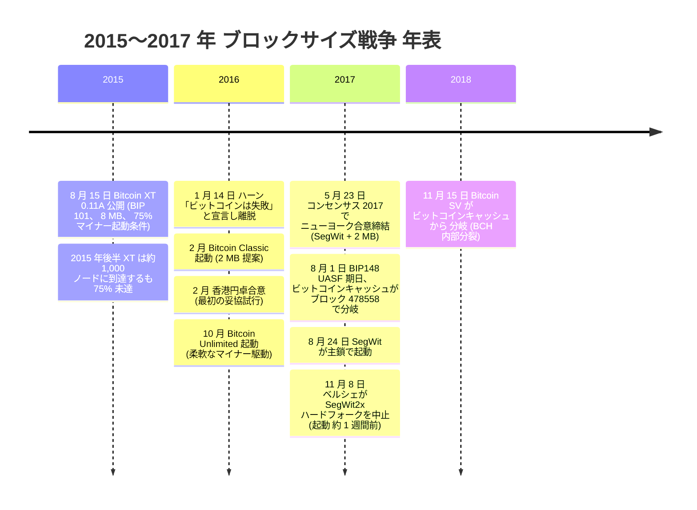
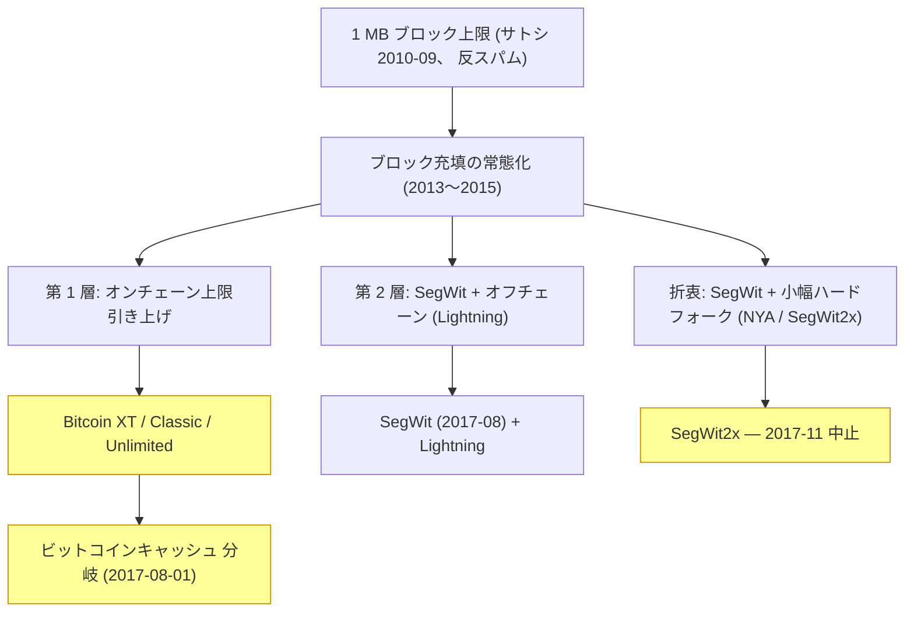

2015 年 8 月から 2017 年 11 月までの間、ビットコインのオープンソース運営は、たった一つのパラメーターをめぐる長期にわたる論争で試された ― [サトシ・ナカモト](/BitcoinArchive/ja/participants/satoshi-nakamoto/)が 2010 年 9 月に反スパム暫定措置として追加した 1 MB のブロックサイズ上限である —— もっとも[レイ・ディリンジャー](/BitcoinArchive/ja/participants/ray-dillinger/)は同じ上限について異なるローンチ前起源を回想しており、記録されているコミット履歴は彼の説明を裏付けていない。この論争は主鎖上で 4 連続のフォーク試行を生み、 1 件の恒久的なチェーン分裂、 Segregated Witness の起動、そしてビットコインのプロトコル更新が合意に到達する方法の恒久的変化をもたらした。本エントリは記録された一連の流れを段階・派閥・転換点別に整理する。

## 時系列

## 論争を成立させた三つの争点

ブロックサイズ戦争は単一の対立に還元できない。三つの異なる争点が、早い段階で決着することを妨げ続けた:

三つの争点: (a) 制約は処理能力か分散性か (第 1 層 vs 第 2 層の優先順位)、 (b) ハードフォークは安全に実施可能か (争いのあるフォークはネットワーク分裂を生むという反論)、 (c) オフチェーンプロトコルは自己保管を損なわずに拡張できるか (利用者体験の問い)。各派閥の答えは、この三つの組み合わせで異なっていた。

## 三派閥

| 派閥 | 主要人物 | 中心主張 | 帰結 |
|---|---|---|---|
| **大ブロック派** | [マイク・ハーン](/BitcoinArchive/ja/participants/mike-hearn/)、 [ギャビン・アンドレセン](/BitcoinArchive/ja/participants/gavin-andresen/)、 [ロジャー・ヴァー](/BitcoinArchive/ja/participants/roger-ver/)、 [ジハン・ウー](/BitcoinArchive/ja/participants/jihan-wu/)、 [アモリー・セシェ](/BitcoinArchive/ja/participants/amaury-sechet/) | 1 MB は暫定措置であり撤廃必須、オンチェーン容量こそ唯一の拡張手段、オフチェーン層は仲介者リスクを再導入する | Bitcoin XT・ Bitcoin Classic・ Bitcoin Unlimited はいずれも起動失敗。 [ビットコインキャッシュ](/BitcoinArchive/ja/entries/aftermath/2017-08-01-bitcoin-cash-fork/)が 2017 年 8 月 1 日に別チェーンとして分岐 |
| **Core 開発者派** | グレゴリー・マクスウェル、ピーター・ウィーユ、ウラジミール・ファン・デル・ラーン | 争いのあるハードフォークはネットワークを分裂させる、ノードの分散性を保つ必要、拡張は SegWit + Lightning + ソフトフォークで達成可能 | SegWit は 2017 年 8 月 24 日に主鎖で起動。以降の主鎖更新 (2021 年タップルート) もソフトフォーク経路を踏襲。 Core レポジトリは支配的実装として継続 |
| **NYA 折衷派** | [マイク・ベルシェ](/BitcoinArchive/ja/participants/mike-belshe/)、ジェフ・ガージック、ウェンセス・カサレス、エリック・ヴォーヒース、ピーター・スミス、ジハン・ウー | 業界主導の交渉により、 Core の選好する SegWit と、小幅なハードフォーク (2 MB) を抱き合わせ、中間案を提示 | 第一段 (SegWit) は 2017 年 8 月 24 日に実装。第二段 (2 MB ハードフォーク) は [11 月 8 日にベルシェが中止](/BitcoinArchive/ja/entries/aftermath/2017-11-08-segwit2x-cancellation/)、予定起動ブロック 494784 の約 1 週間前 |

上表で名前が挙がる Core 開発者派の三人のうち、ピーター・ウィーユについては [彼の伝記エントリ](/BitcoinArchive/ja/participants/pieter-wuille/)に詳しい ― BIP-32、SegWit、Taproot の著作や libsecp256k1 の開発など、ここで要約した Core 開発者派の立場を支える業績がまとめられているが、このブロックサイズ紛争そのものには触れていない。

派閥分類は事後的な整理で、当人たちの自己定義ではない。 2 年間に複数のアクターが派閥間を移動した ― 例えばジハン・ウーは NYA に署名しつつ、合意の第一段の期間中にビットコインキャッシュのフォークを支援した。上記の参加者は各派閥の主要提案発足時の代表的人物。その背後の支持層 (マイナー・取引所・フルノード運用者・個人保有者) は異質で揺れ動く立場を持っていた。

## 第 1 段階: Bitcoin XT と最初の公開フォーク (2015 年 8 月〜2016 年 1 月)

2015 年 8 月 15 日の [Bitcoin XT 0.11A](/BitcoinArchive/ja/entries/aftermath/2015-08-15-bitcoin-xt-launch/) 公開が、戦争の公開フォーク段階の起点。メーリングリストとビットコイントーク上の不一致は 2013 年から積み上がっていたが、 XT は最初のプロダクション品質の Bitcoin Core フォーク ― インストール可能なバイナリと公開された起動スケジュール (BIP 101: 2016 年 1 月から 8 MB、 2 年毎倍増で 2036 年に 8 GB、マイナー支持 75% で起動) を伴う最初のリリース。

XT は 2015 年後半に約 1,000 ノードに到達したが、 75% の起動閾値には達しなかった。公的に支持を表明したマイナーと取引所は、実際の起動シグナルを保留した。 2016 年 1 月までに XT のノード数は 30 を下回るまで崩壊。 2016 年 1 月 14 日、 [ハーンは「ビットコイン実験の終結」を公表](/BitcoinArchive/ja/entries/aftermath/2016-01-14-mike-hearn-resolution-bitcoin-experiment/)し、ビットコインは失敗したと宣言、保有コインを売却して生態系から離脱した。

第 1 段階の教訓: マイナー起動条件付きハードフォーク (BIP 101) は、 Core 開発者・最大級の取引所・経済的重みを持つノードの過半を含む連合の支持なしには通らない。 75% の閾値は高く見えたが、実際にはシグナル重みを握る主体がその変更を望まなかったため到達不可能だった。

## 第 2 段階: 大ブロック派の継続試行 (2016 年 2 月〜2017 年 4 月)

Bitcoin Classic は 2016 年 2 月に類似の 2 MB 提案で起動、起動条件はやや緩い (75% + 28 日猶予期間)。 Bitcoin Unlimited が 2016 年 10 月に柔軟なマイナー駆動方式で続いた ― マイナーが好みのブロックサイズ上限を設定し、その上限までのブロックを受け入れるという方式。両者とも XT と同様、起動には至らず: Bitcoin Classic はマイナー支持率約 6% でピークに達して崩壊、 Bitcoin Unlimited は一時的に高めの約 40% に達したが、クリーンなフォークに必要な 75%+ の超過半数には決して到達しなかった。

2016 年 2 月に Core 開発者数名と主要マイニングプール運営者の間で締結された香港円卓合意は、非公開の妥協を試みた: SegWit を先行起動、そして「後で」 2 MB ハードフォーク。合意には強制力のある時間軸がなく、ハードフォーク部分は実施されなかった。 2017 年初頭までに、大ブロック派は合意を破られたものとして広く扱うようになった。

第 2 段階の教訓: プロトコル起動には公開された提案とリリースバイナリ以上のものが必要。 Bitcoin Core レポジトリ・最大級のマイニングプール・主要取引所・フルノード運用者の長尾、それぞれが事実上の拒否権を持ち、四つの関門すべてを通過した提案のみが起動可能。

## 第 3 段階: ニューヨーク合意とビットコインキャッシュ (2017 年 5 月〜8 月)

2017 年 5 月 23 日にコンセンサス 2017 会議で署名されたニューヨーク合意 (NYA) は、戦争中で最も野心的な妥協試行。 58 の主要ビットコイン業者 ― 取引所・マイニングプール・決済処理業者・ビットコイン保有企業 ― の代表者が、二つのプロトコル変更を抱き合わせることに合意:

- **第一段:** BIP 91 のロックイン機構を経由して SegWit を 30 日以内に主鎖で起動
- **第二段:** SegWit 起動の 3 ヶ月後に 2 MB ブロックサイズ上限へハードフォーク

並行して、別の動きが勢いを得た: BIP148 ユーザー起動ソフトフォーク (UASF)、マイニングを行わないフルノードが 2017 年 8 月 1 日以降 SegWit シグナルなしのブロックをすべて拒否するという方式。 BIP148 は異例の手段 ― Core 開発者側ではなく利用者ノード側からマイナーに対する起動圧力を加えた ― で、大半は NYA 失敗時の代替案と見られていた。 NYA の第一段 (SegWit) は BIP 91 経由で 2017 年 7 月 21 日にロックイン、 BIP148 期日の 10 日前。ほとんどの観察者は、 BIP148 の期日がマイナー協力を強制したと評価している。

2017 年 8 月 1 日 ― BIP148 期日 ― [ビットコインキャッシュのハードフォーク](/BitcoinArchive/ja/entries/aftermath/2017-08-01-bitcoin-cash-fork/)がブロック 478558 で実行され、 `ViaBTC` プールが約 12:37 UTC に採掘した。フォークは Bitcoin ABC 実装を使用: 8 MB 初期ブロックサイズ、 SegWit 非採用、少数派ハッシュレートの新チェーンでブロック生成可能にする難易度調整改修。ビットコインキャッシュはジハン・ウー (マイニングプール支援)、ロジャー・バー (公開ブランディング)、 [アモリー・セシェ](/BitcoinArchive/ja/participants/amaury-sechet/) (プロトコル実装) の協働。 XT とその後継群とは異なり、 BCH は同一チェーン上の置換ではなく意図的な恒久分裂として設計された: `SIGHASH_FORKID` によるリプレイ保護で、トランザクションは一方のチェーンでのみ有効。

SegWit は 2017 年 8 月 24 日に主鎖で起動。

## 第 4 段階: SegWit2x 中止と戦争の終結 (2017 年 10 月〜11 月)

ビットコインキャッシュが別チェーンとして分離し、 SegWit が主鎖で稼働した時点で、残された問いは NYA の第二段だった: 主鎖は合意通り 11 月に 2 MB ハードフォークを実行するのか。

起動ブロックはブロック 494784 に設定され、 2017 年 11 月 16 日頃の予定。起動前の数ヶ月、反対派が結束: Bitcoin Core 開発者は更新を支持しないと表明、複数の大手取引所はハッシュレート分布に関係なく元の 1 MB チェーンをビットコインとして扱うとシグナル、フルノード運用者は大ブロックを受け入れないソフトウェア (Bitcoin Core 0.15) を稼働させていた。

2017 年 11 月 8 日、 [マイク・ベルシェ (BitGo CEO 兼 NYA 署名者) はメーリングリストで SegWit2x ハードフォークの中止を発表](/BitcoinArchive/ja/entries/aftermath/2017-11-08-segwit2x-cancellation/)、予定起動の約 1 週間前。投稿はウェンセス・カサレス・ジハン・ウー・ジェフ・ガージック・ピーター・スミス・エリック・ヴォーヒースの五名の元 NYA 署名者によって連名で署名された。 NYA 署名者で中止に公的に反論した者はなく、以来代替の 2 MB ハードフォーク試行は組織されていない。

11 月 8 日のメッセージが主鎖におけるブロックサイズ戦争の正式な終結。以降、ビットコインのプロトコル更新はソフトフォークのみで進化: [タップルート](/BitcoinArchive/ja/entries/bip/2020-01-19-bip-0341/)は 2021 年 11 月に Speedy Trial 機構で起動、同等規模の争いのあるハードフォーク運動は組織されていない。

## 余波と構造的帰結

**生き残ったフォーク。** ビットコインキャッシュは別チェーンとして稼働を継続。 2018 年 11 月 15 日、 BCH 自体が争いのあるハッシュ戦争を経て Bitcoin ABC と [Bitcoin SV](/BitcoinArchive/ja/entries/aftermath/2018-11-15-bitcoin-sv-fork/) に分裂。両チェーンとも 2017 年以降、市場価値・ハッシュレート・開発者活動のいずれにおいてもビットコイン主鎖より小規模に留まっている。

**UASF 機構。** BIP148 のユーザー起動ソフトフォーク方式 ― マイナーではなくマイニング非参加フルノードからの圧力 ― は恒久的なガバナンス手段となった。 2024 年の `Ordinals` / `Inscriptions` 論争、 2025 年の OP_RETURN 上限論争、その他の後続の争いのある変更はいずれも BIP148 型で議論されている: マイナー・開発者・フルノード運用者の非対称な権力下で、誰が何を強制できるのか。

**ソフトフォーク限定の規範。** 2017 年 11 月以降、ビットコイン主鎖で争いのあるハードフォークは試みられていない。ソフトフォーク (タップルート、将来のドライブチェーン、将来の耐量子移行) が暗黙のデフォルト。戦争の主要教訓 ― 後続のあらゆる更新運動に内部化されたもの ― は、争いのあるハードフォークがマイナー・開発者・取引所・ノード運用者長尾を横断する連合の支持を要し、その連合は「ビットコインの拡張」ではなく「ビットコインの改変」と一部のコミュニティが扱う変更については到達不可能であることが証明された、という点。

**1 MB 同等の遺産。** 基本ブロックサイズ上限は名目上 1 MB のままだが、 SegWit の重み基準計算により実効的にはトランザクション型構成によって約 2〜4 MB まで上昇している ― この数値の背後にある重量単位の仕組みは[ブロック・チェーン設計ページ](/BitcoinArchive/ja/entries/design/2009-01-03-bitcoin-block-chain-design/)で扱っている。オンチェーン容量の問い ― ビットコインの成長に対してこれで十分か ― は 2024〜2026 年の追加ブロック重み拡張議論で再浮上しているが、 2017 年以降の主鎖変更がすべて要求してきた多段関係者連合の支持を得た提案はまだ出ていない。

## ビットコインガバナンスコーパスにおける位置

ブロックサイズ戦争は、ビットコインのプロトコル変更がどう実現するかに関する議論で最も多く引用される単一の事件。 [ビットコイン家系図分析](/BitcoinArchive/ja/entries/analysis/2008-10-31-bitcoin-fork-and-altcoin-genealogy/)が論争をフォーク史記録の中で広く整理し、 [「フォーク戦争はオープンソースではない」分析](/BitcoinArchive/ja/entries/analysis/2015-08-15-bitcoin-fork-wars-as-not-oss/)がオープンソース運営の視点で読むなら、本エントリは記録された一連の流れ ― 段階・提案・起動結果 ― を整理し、ビットコインの運営モデルに関する議論が実際に起きた共有記録に立ち返れるようにする。

本段階別再構成は、論争の一次記録エントリ二件によって規範的な記録として扱われる。 [2015 年 8 月の Bitcoin XT 公開エントリ](/BitcoinArchive/ja/entries/aftermath/2015-08-15-bitcoin-xt-launch/)は本総覧を、開幕事件が含まれるより広い連鎖として読む。 [2017 年 8 月のビットコインキャッシュ・フォークエントリ](/BitcoinArchive/ja/entries/aftermath/2017-08-01-bitcoin-cash-fork/)は本総覧を、 8 月 1 日分裂が終結事件として位置付けられる、論争の完全な段階別記録として引用する。
