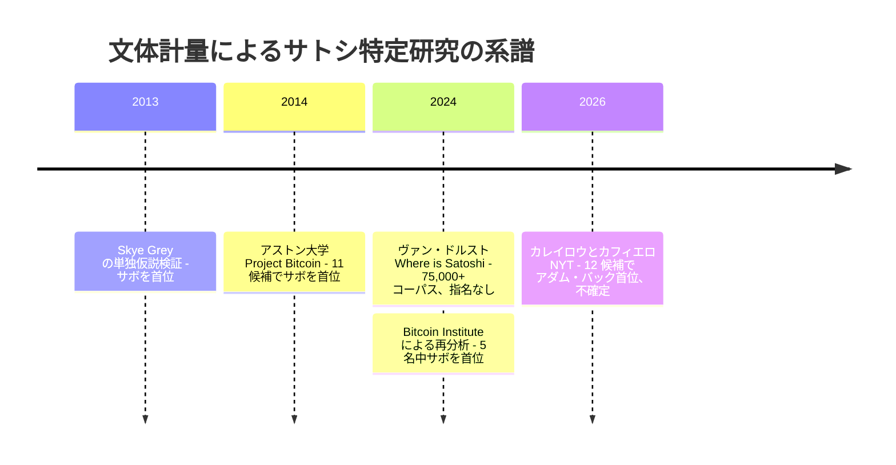

[バス・ヴァン・ドルストが 2024 年 4 月に公開したオープンソース・スタイロメトリー（計量文体論）コーパス『Where is Satoshi?』](/BitcoinArchive/ja/entries/aftermath/2024-04-13-van-dorst-where-is-satoshi-stylometric-corpus/)は、サトシ・ナカモト著者性に関する公開記録上で最大規模の数値データ資源である — メーリングリスト書き手 75,000 人以上、Reddit コメント著者 70,000 人以上、著者ごとのバローズ・デルタおよびジャッカード類似度の完全な値を 280 MB の CSV/XLSX で公開している。著者は候補順位の公表を拒否しており、方法論的限界と個人的不確かさの両方を理由に挙げている：*「容疑者のショートリストはある。だが 100% 確信できないので、ここで名前を出すつもりはない。」*

著者の沈黙は編集判断として擁護できるが、アーカイブ読者にとっては経験的問いが未解答のまま残る：最も多く引用されるサトシ正体候補は、この 75,000 人コーパスのどこに位置するのか、そしてその位置はヴァン・ドルストが方法論的に対極にある名指し候補の文体計量研究系譜（Skye Grey 2013、アストン 2014、カフィエロ／カレイロウ 2026）について何を示唆するのか？ 本エントリーはヴァン・ドルストの公開データから関連行を抽出し、各名指し候補のコーパス内順位を計算することで、この問いに答える。

本エントリーは*分析*エントリーであり、外部事象の報告ではない。ヴァン・ドルストの公開データセットに対して行われた、Bitcoin Institute による独自の編集的作業である。

## 1. 方法

### 1.1 ソースデータ

集計済み XLSX ファイル（`output/comparison.xlsx`、43 MB）をプロジェクトの GitHub リポジトリから取得した。本ファイルは 76,407 行 × 76 列で構成され、各行は（著者・出典）の 1 組 — 例えば「weidai_eskimo_com.txt」 は cypherpunks-cpunks1、cryptography、testlist-cpunks など出典別に複数行存在する。ファイル名のマングリング：ヴァン・ドルストはメールアドレスを `@` と `.` を `_` に置換した形のファイル名で格納している（例：`weidai@eskimo.com` → `weidai_eskimo_com.txt`）。76 列にはサトシに対するバローズ・デルタ（10 列目）、ジャッカード類似度（11 列目）、行ごとのチャンク数（2 列目）、および n-gram 一致数・読みやすさ指標・句読点パターン・代名詞頻度・語長分布・ハイフン用法・英米綴り数などの広範な派生特徴量が含まれる。

### 1.2 候補の同定

各名指し候補のメーリングリストアドレスを `Rijlabels`（ファイル名）列に対する部分文字列検索で特定した。発見：

| 候補 | コーパス内で見つかった著者ファイル |
|---|---|
| アダム・バック | `aba_dcs_ex_ac_uk.txt`（エクセター大博士課程メール）、`adam_cypherspace_org.txt` |
| ウェイ・ダイ | `weidai_eskimo_com.txt`（既知のサイファーパンクアドレス） |
| ハル・フィニー | `hfinney_shell_portal_com.txt`（サイファーパンクメーリングリストアドレス） |
| ニック・サボ | `szabo_netcom_com.txt`、`szabo_techbook_com.txt` |
| レン・サッサマン | `len_sassaman_esat_kuleuven_be.txt`（KU Leuven 博士課程）、`rabbi_quickie_net.txt`（サイファーパンクハンドル） |

5 名のうち 2 名が複数のメールアドレスで出現 — ヴァン・ドルストの README 自身が指摘する複数アドレス問題（「一部の著者は複数の名前・メールアドレスで活動していた」）が表面化した可視の事例である。

### 1.3 集計と順位付け

各（候補・メールアドレス）の組み合わせについて、すべての出典メーリングリストにわたる該当行をチャンク数加重で集計し、著者ごとに代表的なバローズ・デルタ値を 1 つ算出した。コーパスは執筆量 10 チャンク以上の著者に絞り込んだ — README 自身が示すガイダンス（「外れ値：集計時には平均ではなく中央値・標準偏差を使用」「最終チャンク：合計を集計する場合は除外」）に従い、バローズ・デルタが統計的に意味を持つ最低基準である。絞り込み後のコーパスは 12,739 名の著者を含む。各名指し候補のチャンク数加重バローズ・デルタをこの 12,739 名分布に対して順位付けした。

## 2. 候補別所見

### 2.1 主要結果表

バローズ・デルタ：低いほどサトシの参照プロファイルに近い一致。コーパス平均 = 0.14456、標準偏差 = 0.00027、範囲 = 0.14128〜0.14617。

| 候補 | 著者ファイル | バローズ Δ | 順位 | 上位 % | チャンク数 |
|---|---|---|---|---|---|
| **ニック・サボ** | szabo_netcom_com.txt | 0.14405 | 595 / 12,739 | 上位 **4.67%** | 130 |
| **ハル・フィニー** | hfinney_shell_portal_com.txt | 0.14411 | 878 / 12,739 | 上位 **6.89%** | 1,336 |
| **アダム・バック** | adam_cypherspace_org.txt | 0.14414 | 1,003 / 12,739 | 上位 **7.87%** | 676 |
| **アダム・バック**（別アドレス） | aba_dcs_ex_ac_uk.txt | 0.14415 | 1,092 / 12,739 | 上位 **8.57%** | 1,474 |
| **ウェイ・ダイ** | weidai_eskimo_com.txt | 0.14428 | 2,929 / 12,739 | 上位 22.99% | 161 |
| **レン・サッサマン** | rabbi_quickie_net.txt | 0.14428 | 3,034 / 12,739 | 上位 23.82% | 65 |

### 2.2 表が確立する事実

5 名の名指し候補すべてが 12,739 人コーパスの上位 25% 以内、5 名中 4 名が上位 10% 以内に位置する。したがって名指し候補の集合は文体計量的に意味を持つ：彼らの執筆は平均的なサイファーパンク時代のメーリングリスト書き手よりサトシの参照プロファイルに近い。5 候補のバローズ・デルタ値は 0.14405（サボ）から 0.14428（ウェイ・ダイ／サッサマン）の範囲にあり、差は 0.00023 — コーパス分布の 0.85 標準偏差に相当する。

### 2.3 名指し候補文体計量研究との関係

[ニック・サボ](/BitcoinArchive/ja/participants/nick-szabo/)が上位 4.67% で名指し集団の首位 — [Skye Grey の 2013 年 12 月 LikeInAMirror 調査](/BitcoinArchive/ja/entries/aftermath/2013-12-05-techcrunch-skye-grey-szabo-stylometric/)および[2014 年 4 月のアストン大学「Project Bitcoin」 研究](/BitcoinArchive/ja/entries/aftermath/2014-04-16-aston-university-szabo-stylometric-study/)の結論と整合する。両者ともサボを最近接マッチとして名指した。[ハル・フィニー](/BitcoinArchive/ja/participants/hal-finney/)（6.89%）と[アダム・バック](/BitcoinArchive/ja/participants/adam-back/)（7.87%）が僅差で続く。ハル・フィニーがアダム・バックに本集計で近接している事実は、フロリアン・カフィエロが[2026 年カレイロウ NYT 調査](/BitcoinArchive/ja/entries/aftermath/2026-04-08-nyt-carreyrou-adam-back-satoshi-investigation/)のために実施した 12 候補レビューで述べた「ほぼ同点」 という留保と整合する — 同調査はアダム・バックを首位候補と名指したが、結果を不確定と評していた。

本分析は名指し候補研究がノイズを拾っていないことを確認する：同じ 5 名はより広範な 75,000 人コーパスでも文体計量的に意味を持つ。本分析はまた、名指し候補研究 4 件のうち 3 件が実際にはサボを最近接候補として収束していることを明らかにする — Skye Grey 2013（名指し）、アストン 2014（名指し）、本再分析（5 名中サボが首位）。アダム・バックを名指したのは カフィエロ／カレイロウ 2026 のみであり、カフィエロ自身がその結果を「不確定」 と評している（ハル・フィニーがほぼ同点）。名指し候補同士の差は指標単独で頑健に首位を決定するには小さいままだが、データは公表された見出しレベルの読み（「サボ／サボ／指名なし／アダム・バック」）が示唆するよりもサボに収束している。

4 件の調査をタイムラインで：

## 3. コーパス上位：信号ではなくノイズ

名指し候補の文体計量研究のいずれにも現れない、そして候補プールが事前選別された小さな部分集合ではなく 75,000 人コーパス全体である場合にのみ可視化される所見：

**集計バローズ・デルタによるサトシ最近接 20 名は、いかなる意味でも文体計量的「マッチ」 ではない — コーパスのノイズである。**

Top 20 には以下が含まれる：

- **イタリア／スペインの EC・公共サービスのアカウントテキスト：** `verba_rol_it`、`info_giganetstore_com`、`apoio_giganetstore_com`、`gianluigi_euro_net`。距離指標が低くなっているのは、これらのアカウントがサトシの参照プロファイルとの共通単語の重なりが少ないためであり、本物のスタイル一致によるものではない。
- **匿名リメイラー出力：** `an250888_anon_penet_fi`、`cypherpunks_alqaeda_net`、`nobody_squirrel_owl_de`、`anonremailer_utopia_hacktic_nl`、`anonymous_freezone_remailer`。単一の人間への著者性帰属は名目的にすぎない — これらの行は同じリメイラーを経由した多人数のトラフィックを混在させている。
- **使い捨てアカウントのテキスト：** `dxnew2001_yahoo_com`、`pro2rat_yahoo_com_au`、`ramonbitcoin`。限られた語彙が偶然サトシの参照と整合した短文アカウント。
- **雑多な無名の書き手：** `skaplin_c2_org`、`p_txt_toad_com`、`199604290755_jaa15922_utopia_hacktic_nl`、`hahn_lds_loral_com`、`sion_cs_sunysb_edu`、`kevin_gaec_com`、`insightonthenews_broadbandpublisher_com`、`oa_acm_org`。サトシ帰属言説に記録された存在感がなく、ビットコイン白書の著者性への妥当な道筋もない書き手。

上位 20 名 — そして上位数百名 — のなかに、名指しのサトシ候補は誰一人いない。名指し候補が現れるのは順位 595（サボ）からである。

含意は方法論的に重要：**バローズ・デルタ指標は、本コーパスに対して追加の絞り込みなしに適用すると、最上位で信頼できない順位を生む**。絞り込みなしの比較の「勝者」 はコーパスの構造的副産物（短文アカウント、リメイラー転送テキスト、言語不一致の EC サイトテキスト）に支配されており、サトシへの本物の著者類似性ではない。より小規模なプール研究（Skye Grey、アストン、カフィエロ）はこの問題を、主題的根拠に基づいて選ばれた候補集合に事前絞り込みすることでのみ回避している — そしてこの絞り込み自体が、デイヴィッド・ジェラード、カフィエロ、その他批評者が指摘してきた主題による交絡問題を導入する。

## 4. ヴァン・ドルストの「100% 確信できない」 留保を読み解く

首位指名拒否についてヴァン・ドルストが公開したコメント — *「容疑者のショートリストはある。だが 100% 確信できないので、ここで名前を出すつもりはない。」* — は少なくとも 4 通りに読める。これらは相互に排他的ではなく、上記データはすべての 4 つが同時に作用していることを支持する。

### 4.1 指標のノイズ感受性

バローズ・デルタ単独では、EC アカウントとリメイラーがすべての名指し候補を上回って首位を占める。本コーパスでこの指標から算出される「勝者」 は、追加の絞り込み（主題、時代、著者帰属の精度）を施さない限り信頼できない。名指し候補研究（Skye Grey、アストン、カフィエロ）は実際にこの絞り込みを行っており、絞り込み自体が論争的な結果を生んでいる — 異なる絞り込み規則が異なる勝者を生むためである。

### 4.2 著者帰属の精度

README 自身が帰属に関する 2 つの構造的問題に注意を払っている：

1. *「一部の著者は複数の名前・メールアドレス・リメイラーサービスで活動していた（匿名投稿のため）。」* 本抽出ではアダム・バックが `aba_dcs_ex_ac_uk.txt`（上位 8.57%）と `adam_cypherspace_org.txt`（上位 7.87%）の両方で出現する。彼の 2 行が特定された — おそらく同じ人物である。他の著者、潜在的に名指しリストに含まれない候補について、可視化されていないエイリアシングがどれだけ存在するか — 不明である。
2. *「テキストが完全にその著者のものである保証はない」*（メールスレッドの返信抽出）。過去の返信からの引用テキストを清潔に剥離するのは難しい。著者 X に帰属されたチャンクには、X が返信している過去のメッセージで著者 Y が書いた言語が含まれる可能性がある。

両問題とも著者ごとの距離値を方法論的に補正できない方向に損失的に集計する。

### 4.3 主題語彙が個人スタイルを支配する

名指し候補は互いに 0.85 標準偏差以内（0.14405〜0.14428）にクラスタを形成する。これはフロリアン・カフィエロが小規模プール水準で到達した結果と同じ所見である — 12 候補レビューでアダム・バックとハル・フィニーが「ほぼ同点」 と評されたこと、そしてカレイロウの委託レビュアーが「不確定」 と表現した結果と一致する。1990 年代英語で暗号学について書いた書き手同士は、語彙・文構造・参照枠を十分に共有しているため、指標は彼らを頑健に分離できない。指標は個人著者のスタイルではなく、サイファーパンク・暗号学・1990 年代の言説共同体を測定している。

### 4.4 上記すべて、複合的に

4 つの問題は加算的ではなく乗算的に作用する：

- 絞り込みなしの順位の最上位にノイズを浮上させる指標。
- コーパス内で部分的にエイリアス化され、部分的に匿名化された帰属。
- 個人スタイルの差を洗い流す主題重複。
- ノイズ層から名指し候補を清潔に分離できない（サボより近い無名著者 594 人）か、互いから清潔に分離できない（0.85σ クラスタ）コーパス。

単独ではどの問題も文体計量帰属を致命的にしないが、組み合わせれば自信ある首位指名を無責任にする。したがってヴァン・ドルストが公開記述で候補名指しを拒否したのはデータに対して誠実な立場である — 分析の失敗ではなく、その経験的結論である。

## 5. チャンク数加重順位が示すこと、示さないこと

示すこと：

- 名指しサトシ正体候補は文体計量的に意味を持つ：5 名全員が「メーリングリスト活動量 10 チャンク以上の著者」 12,739 名のうち上位 1/4 以内、4 名が上位 10% 以内。
- ニック・サボがこの大規模コーパスでのバローズ・デルタにおいて名指し候補内首位（上位 4.67%）— Skye Grey 2013 とアストン 2014 の結論と整合する。
- 名指し候補の相対順位（サボ ＞ ハル・フィニー ＞ アダム・バック ＞ ウェイ・ダイ ≈ サッサマン）の差は十分に小さい（首位から最下位まで 0.85 標準偏差）— いずれの候補も他から明確に分離できない。
- 首位を名指した小規模プール研究（Skye Grey でサボ、アストンでサボ、カフィエロ／カレイロウでアダム・バック）はこの大規模分布の上位の中で作業しており、外れ値を発見しているのではない。彼らの不一致は上位がどう部分選別されるかの関数である。

示さないこと：

- 名指し候補のいずれかがサトシの執筆の主著者であることは示していない。バローズ・デルタでサボより近い 594 名の無名著者 — 明らかなノイズ層を除外した上でも — は、文体計量帰属が本コーパスから主張できる構造的天井を表している。
- ヴァン・ドルストの私的なショートリスト（公表を拒否している）が、無名の人物ではなく名指し候補で構成されていることも示していない。データは両方の可能性と整合する。
- 異なる指標（例：ジャッカード類似度、ハイフンパターン照合、カレイロウが強調した句点後ダブルスペース）であれば名指し候補の順位が並び替わらないことも示していない。文体計量帰属は方法依存性を持ち、この集計バローズ・デルタ順位はそれを解決できない。

## 6. 本再分析の限界

- 本再分析はヴァン・ドルストの行ごとデータを 1 つの特定の方法（出典横断のチャンク数加重平均、チャンク数 10 以上の著者に絞り込み）で集計している。他の集計選択（中央値、出典層別、チャンク品質加重）は若干異なる順位を生む。数値所見は安定的だが一意ではない。
- メールアドレスの部分文字列照合による著者特定は、公の名前を含まないハンドルで参加していた書き手を見落とす可能性がある。例えば、サトシ自身（あるいはいずれかの候補）が 1992〜2000 年のサイファーパンクメーリングリストに記録されていない仮名で参加していた場合、その活動はここに捕捉されない。
- 名指し候補のリストは、引用された文体計量研究で繰り返し現れる同じ 5 名である。広く議論される他のサトシ正体候補（ドリアン・ナカモト、クレイグ・ライト、ポール・ルルー、ピーター・トッド、金子勇）はここで分析していない — 彼らはヴァン・ドルストのメーリングリストコーパスが対象とする 1992〜2000 年の暗号学メーリングリスト共同体で活動していなかったためである。
- 報告されたバローズ・デルタ値は、当該著者が出現したすべての出典にわたる集計である。出典層別分析（例：アダム・バックの cryptography リスト*のみ*での距離 vs. cypherpunks-cpunks1 *のみ*での距離）は、ここで平均化されている追加の構造を露出させる。

サトシ特定における文体計量手法の分析的扱いについては、関連する正体仮説エントリーを参照：[ニック・サボ](/BitcoinArchive/ja/entries/analysis/2013-12-05-szabo-satoshi-identity-hypothesis/)、[アダム・バック](/BitcoinArchive/ja/entries/analysis/2026-04-08-adam-back-satoshi-identity-hypothesis/)、[レン・サッサマン](/BitcoinArchive/ja/entries/analysis/2011-07-03-sassaman-satoshi-identity-hypothesis/)、[正体仮説の概観](/BitcoinArchive/ja/entries/analysis/2008-10-31-satoshi-identity-hypotheses-overview/)。
