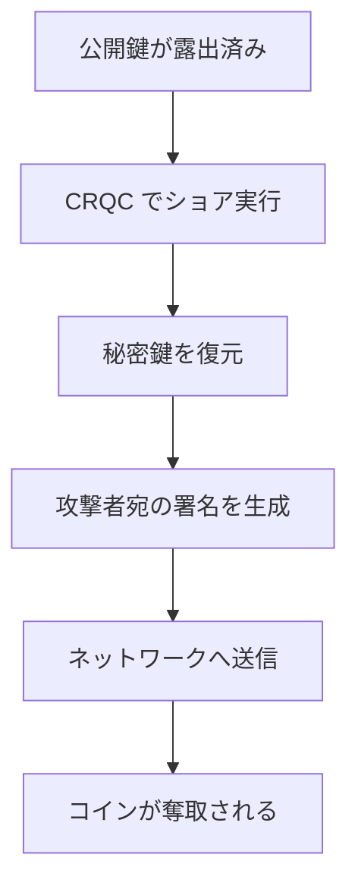
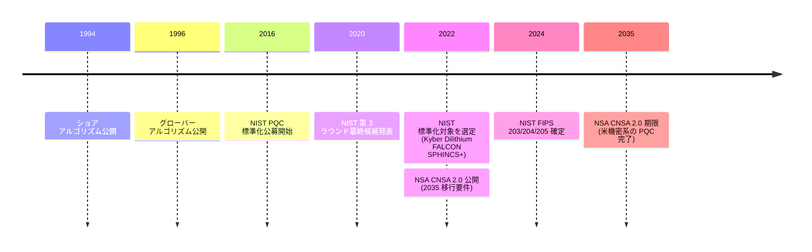

検索エンジンで「量子ビットコイン」 と引くと、要するに「ビットコインが破られる日は世界が終わる日だ」 という体裁の見出しが連なって出てくる。本エントリーはその枠組みを出発点にとり、その枠組みが通常一つにまとめてしまう 2 つの別の問いを切り分ける — **ビットコインのどの資産が実際に脅威にさらされるのか**、十分に強力な量子コンピューターに対して、そして **その能力はいつ到来するのか**。両方とも、見出しが示唆するよりも具体的かつ限定的に答えられる。

本エントリーは予測ではない。暗号学的に意味のある量子コンピューター ( CRQC, cryptographically relevant quantum computer ) の到来年は、ごく一部の国立研究所と大手研究機関の外からは知り得ない。その内部から見ても推定の幅は数十年に及ぶ。文書として確かなのは、ビットコインの暗号設計が選んだ前提、ポスト量子標準化の制度的記録、そして時期について踏み込んだ発言を残した暗号学者・インフラストラクチャ関係者の公開記録である。

## 1. 量子コンピューターが実際に何を破るのか

関係する 2 つのアルゴリズムがある。両方とも古く ( 1994 年と 1996 年 )、よく理解されている:

- **ショアのアルゴリズム** ( 1994 年提案、 1997 年正式公開 ) は、十分大きな量子コンピューター上で離散対数問題を多項式時間で解く。ビットコインの署名方式 — 楕円曲線 secp256k1 上の ECDSA — はこの曲線上の離散対数が困難であるとの仮定に依拠している。 ショアのアルゴリズムはこの仮定を破る。十分な論理量子ビットと低エラー率を備えた量子コンピューターは、対応する公開鍵から秘密鍵を復元できる。
- **グローバーのアルゴリズム** ( 1996 年 ) は非構造化探索に対して 2 乗の高速化を与える。 SHA-256 に対しては、攻撃者は古典の 2^256 演算ではなく量子の 2^128 演算で原像を見つけられることを意味する。 2^128 は依然として実行不可能である。 グローバーは SHA-256 を**弱化**するが、**破ら**ない。

非対称性こそが本主題の中心的な技術事実である。ビットコインの署名側 ( ECDSA ) は崩壊する。ハッシュ側 ( SHA-256、 RIPEMD-160 ) は曲がるが折れない。 2040 年に何が起きようと 2060 年に何が起きようと、プルーフ・オブ・ワークの掘削アルゴリズム自体が最初に破綻するわけではない。

復元された秘密鍵からコイン窃取に至る経路:

この攻撃が成立するのは、公開鍵がチェーン上に露出済みである場合に限る — そしてこの条件は、ビットコインのすべてのアウトプット形式について成り立つわけではない。

## 2. ビットコイン以外の何が破れるのか

secp256k1 上の ECDSA を破る同じショアのアルゴリズムは、現在実用されている RSA・ディフィー・ヘルマン・すべての楕円曲線暗号を等しく破る。これらはビットコイン固有の暗号要素ではなく、インターネット・金融システム・大半の政府インフラの土台となっている暗号である。

| 領域 | 現在使われている量子脆弱な暗号 | 制度的対応 |
|---|---|---|
| **TLS / HTTPS** | RSA 鍵交換、 ECDHE、 ECDSA 証明書 | NIST FIPS 203 ( ML-KEM ) の採択、 IETF の TLS 1.3 における ML-KEM ベースのハイブリッド鍵交換ドラフト |
| **銀行決済 ( EMV、 SWIFT、カードネットワーク、 PKI )** | RSA 署名、 ECDSA | BIS Project Leap ( 2022〜2023、 ECB・英銀 (BoE) と協働 ) によるポスト量子安全な中央銀行・銀行間チャネル研究 |
| **政府・軍事 PKI、機密通信** | RSA、 ECC | 米 National Security Memorandum 10 ( 2022 年 5 月 )、 NSA CNSA 2.0 ( 2022 ) による 2035 年までの PQC 移行義務、英国 NCSC・ EU・日本における同等の取り組み |
| **コード署名、ファームウェア署名、ソフトウェア更新 ( OS、 IoT )** | RSA、 ECDSA | NIST IR 8547 ( 2024 ) による連邦機関・ベンダー向け移行戦略ガイダンス |
| **「収穫しておいて後で復号」 — 記録された暗号化通信への遡及攻撃** | 上記いずれも、過去または現在の取得分に対して | CISA ( 米サイバーセキュリティ庁 ) 量子レディネス勧告 ( 2023 年 8 月 ) — 記録済みデータへのリスクを明示的に警告 |

ビットコインに固有なのは攻撃面の**構造**である — 使用したトランザクションの公開鍵が永久にチェーンに残る公開台帳という建て付け、しかも一部のアウトプット形式は使用前にすでに公開鍵をチェーンに置く設計。暗号機構の崩壊そのものは世界規模の問題である。 NIST PQC 標準化と NSA-2035 義務は、ビットコインを世界の銀行・通信・政府と**同じ**移行ロードマップ上に置く。「ビットコインが破られる日」 はビットコインだけが破られる日ではない — そして、その日に向けた準備は 2016 年の NIST 公募開始以来、世界規模で並行して進んでいる。

## 3. 現時点で露出しているもの

ビットコインはその歴史の中でいくつかのアウトプット形式を蓄積してきた。それぞれが公開鍵を異なる時点で露出させ、その露出窓全体が休眠コインに対する量子攻撃の脆弱性面となる。半減期カードと供給曲線はアーカイブの[ビットコインチャートページ](/BitcoinArchive/ja/chart/)にある。ここで重要なのは、コインがどの形式で置かれているかである。

| アウトプット種類 | 公開鍵がチェーンに現れる時点                | 量子的露出度                                                              |
|---|---|---|
| **P2PK** (Pay-to-Public-Key, 2009-2010 年世代) | 生成時点 — 公開鍵そのものがスクリプト | **高い。** 生成された瞬間から公開鍵が見える。量子能力をもつ攻撃者は任意のタイミングで秘密鍵を復元できる。サトシ世代の初期コインの大半が該当する。 |
| **P2PKH** (Pay-to-Public-Key-Hash) | 使用時 — それまでは `HASH160(pubkey)` のみがスクリプトに格納される | **未使用なら低い、使用後は高い。** 使用ごとに公開鍵が露出する。同一アドレスを使い回した場合、以降の UTXO は露出済み状態で受け取られる。 |
| **P2WPKH** (Segregated-Witness, BIP 141) | 使用時、 P2PKH と同様 | **未使用なら低い。** 露出パターンは P2PKH と同様。 |
| **P2TR** ([Taproot, BIP 341](/BitcoinArchive/ja/entries/bip/2020-01-19-bip-0341/)) | 生成時点 — 32 バイトの x-only 公開鍵がスクリプトそのものになる | **高い。** Taproot は鍵パス使用時にスクリプトツリーを開示せずに済むよう、鍵を意図的にチェーンに置く設計を選んだ。 BIP 341 は P2WPKH に比べて量子耐性が下がる点を明記している。 |
| **P2MR** (Pay-to-Merkle-Root, [BIP 360 draft](/BitcoinArchive/ja/entries/bip/2024-12-17-bip-0360/)) | 使用時。鍵パス使用を取り除き、コミットメントは script tree の Merkle 根のみ | **長期露出攻撃に耐性。** Taproot から鍵パスを取り除いたソフトフォーク提案。 PQC 署名の導入は将来の別提案として位置づけられる。現在は draft 段階。 |

この表から直接導かれる帰結が 2 つある:

- **本当の露出はアドレスの使い回しにある**。「ビットコイン」 という抽象が脅威にさらされているのではない。アドレスを使い回さず、 P2PKH / P2WPKH でのみ保有し、使用前に量子安全方式へ移行する利用者は、 P2PK や使い回しの P2PKH を抱える利用者とは別の脅威クラスに属する。
- **P2TR の設計上の代償は、量子的露出として支払われている**。 Taproot は使用プライバシーと集約効率のために選ばれた選択肢であって、長期的な量子耐性のために選ばれたのではない。暗号コミュニティはこの代償を承知の上で受け入れた — 量子への移行はもっと遅い別時計で進むという仮定の下で。

2009-2010 年世代の P2PK コインの集合 — [サトシ・ナカモト](/BitcoinArchive/ja/participants/satoshi-nakamoto/)が掘削した残高の大半を含む — は「露出度が高く、保有者なしでは移行不能」 のカテゴリーに属する。これらのコインがいつか移動するかどうかは、 ショアのアルゴリズムが答えられる問いではない。答えられるのは鍵の保有者だけである。

## 4. 時期の論争

256 ビットの楕円曲線上でショアのアルゴリズムを実行できる CRQC の到来年は争点がある。 2 つの種類の記録が存在する — 制度的なコミットメントと、名指しの公開発言である。

制度的記録:

NSA の CNSA 2.0 における 2035 年期限は、この論争の中で最も具体的な数字である。これを CRQC の存在時期の**予測**と読むか、もしものための**予防的余裕**と読むかは解釈の余地があるが、制度側の振る舞いは一貫している — 2020 年代でポスト量子暗号を標準化し、 2030 年代でロールアウトする。

名指しの個人の記録 (アーカイブにエントリーが存在する暗号学者・ビットコインインフラ関係者から):

- [アダム・バックの 2025 年 11 月発言](/BitcoinArchive/ja/entries/aftermath/2025-11-15-adam-back-quantum-threat-timeline/)は、ビットコインに対する実務的な量子脅威を「 20-40 年」 先と位置づけ、 SLH-DSA 型の署名方式を適切な対応と見ている。これは名指しの暗号学界隣接の立場の一つであり、合意された数字ではない。
- 量子ハードウェアの業界ロードマップ ( IBM、 Google ) は、 2030 年代前半に数万物理量子ビットの機械を目標としている。物理量子ビットから論理量子ビットへの変換、さらに論理量子ビットから secp256k1 上で Shor を走らせる CRQC への変換は、誤り訂正のオーバーヘッドを伴い、それ自体が活発に研究されている。

「収穫しておいて後で復号する」 ( harvest now, decrypt later ) 懸念は、ある特定の種類のデータに対して時期問題を別の角度から提示する。現時点でチェーン上に露出している任意のもの ( P2PK、露出済みの P2TR、使用後の P2PKH ) は**今この瞬間**にチェーン監視者によって取得され、 CRQC が存在する時点で**いつでも**攻撃され得る。移行期限は「 CRQC 到来まで」 ではなく「 CRQC 到来までの時間から、現在から移行までの時間を**引いた**もの」 である。

## 5. 移行の道筋

量子的露出に対する提案は複数の方向で公開されている。アーカイブは[ BIP 360 ( P2MR ) draft](/BitcoinArchive/ja/entries/bip/2024-12-17-bip-0360/) を保持している — Taproot に似たアウトプット形式から鍵パス使用を取り除き、コミットメントを script tree の Merkle 根のみに限定するソフトフォーク提案である。 P2MR は楕円曲線鍵に対する**長期露出攻撃** ( 使用後にチェーン上に長期間残った公開鍵への攻撃 ) に耐性を持つが、**短期露出攻撃** ( メンプール内の未確認トランザクションが含む公開鍵への攻撃 ) には耐えないと明記されている。 BIP 360 自体が、短期露出攻撃への防御にはポスト量子署名の導入が必要であり、それは別の将来提案として扱うと述べている。ポスト量子署名方式そのもの ( ML-DSA、 FALCON、 SLH-DSA ) は ECDSA に対して桁違いに大きい — SLH-DSA の署名はパラメーター集合により約 8〜50 KB、 ECDSA の約 72 バイトに対して大きい。

提案間のトレードオフは大きく 3 軸ある:

- **署名サイズ。** 格子型方式 ( ML-DSA / FALCON ) はキロバイト級、ハッシュ型 ( SLH-DSA ) は数十キロバイト級、 ECDSA はサブキロバイト級である。ブロック領域への圧迫はこれに比例する。
- **安全性仮定。** 格子型方式は、十分に研究されているが歴史の浅い問題 ( Module-LWE、 Module-SIS ) の困難性に依拠する。ハッシュ型 ( SLH-DSA ) はハッシュ関数の安全性のみに依拠し、「もしこの仮定が崩れたら」 となった場合の面積が最小である。暗号学者はこれらを異なる重みづけで評価する。
- **更新互換性。** ソフトフォーク型のハイブリッド ( BIP 360 のような ) は、選ばれた PQC 方式が後に弱いと判明した場合に巻き戻し可能である。ハードフォーク型の置換はそうではない。ソフトフォークのハイブリッドはこの理由で好まれ、また展開も遅い — 利用者の能動的な選択が要るためである。

すでに発行済みのコインに対する移行問題は、新規発行に対する問題より難しい。新規発行は、量子安全方式が一度配備されればそれを既定として使える。既存の P2PK、露出済み P2TR、使い回し済みの P2PKH のアウトプットは、プロトコル**側**から移行させることはできない。鍵の正当な保有者が、その秘密鍵が未だ無傷の状態で署名するしか方法がない。保有者が亡くなっている・失念している・不在のコインは、ネットワークが何をしようと現在の形式のまま放置される。これらに対する処理案も複数存在する — 物議を醸す「使うか失うか」 ( use them or lose them ) の期限付きルールも含めて — が、合意に至ったものはない。

## 6. このエントリーの限界

本エントリーは、暗号設計が確約していること、制度的および名指しの個人の記録が伝えていることを整理するものである。到来年を予測するものではなく、表題の「ビットコインが破られる日は世界が終わる日だ」 という枠組みを支持するものでもない:

- CRQC の到来は研究計画の成果であり、その分布は外部観察者には知り得ない。信頼に値する情報源からの推定の幅は「この 10 年内に」 (稀、一般にハードウェアを構築する側から ) から「今世紀中またはそれ以降」 (稀、誤り訂正の困難さを懸念する暗号学者から ) まで広がっている。アーカイブは制度面の NSA-2035 線とアダム・バックの「 20-40 年」 線を、最も文書化された 2 点として扱う。
- ビットコインのプロトコルは、ポスト量子署名対応をソフトフォークで追加可能である。固定した暗号基盤ではなく、この**変更可能性**こそが、本主題に対する工学的視点と「世界終焉」 視点を分ける点である。
- 移行リスクの集中先は特定の UTXO カテゴリーであり、システムとしてのビットコイン全体ではない。 P2PK 世代のコイン、露出済み P2TR、使い回し済み P2PKH アドレスが高露出のプールである。使い回しのない P2PKH / P2WPKH に保有され、 CRQC の存在前に移行されたコインは別の脅威クラスに属する。

*[編者注：表題の「世界終焉」 枠組みは「問いの枠組み」 であって「答えの枠組み」 ではない。暗号学の記録、標準化の記録、移行提案の記録を合わせて読むと、対象は「およそ 20 年規模の準備期間を伴う工学的問題」 として浮かび上がる — 上限は NSA-2035 義務、下限は現時点で CRQC が存在しないという観測である。本エントリーは、この期間が十分に広いかどうかについて立場を取らない。期間そのものを記録する。]*
