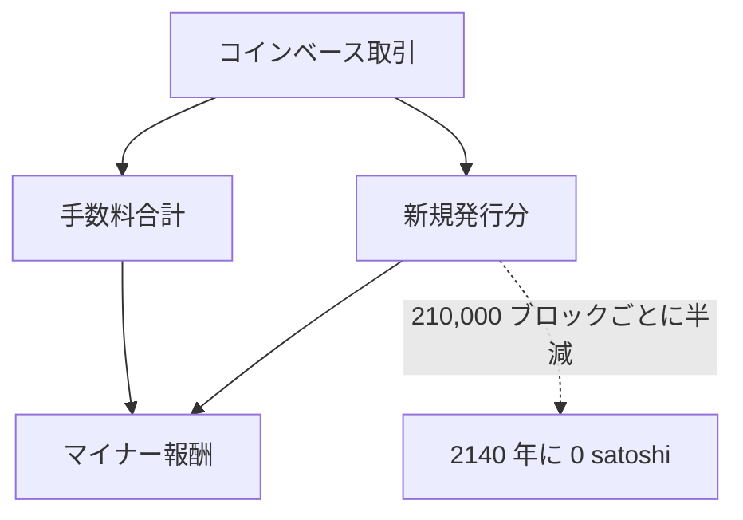

ビットコインのブロック報酬の新規発行分は、 210,000 ブロックごとに半減する。現行のコンセンサスルール — すべてのフルノードが強制するルール — のもとでは半減は 33 回行われ、 satoshi 単位の整数演算によって、 34 回目以降の新規発行分は 0 に切り捨てられる。 10 分のブロック目標時刻と[ 2009 年 1 月 3 日のジェネシスブロック](/BitcoinArchive/ja/entries/aftermath/2009-01-03-genesis-block/)を起点に算出すると、最終の半減期はおよそ 2140 年に当たる。それ以降、ブロックを生成したマイナーが受け取る収入は、そのブロックが運ぶトランザクション手数料のみとなる。

本エントリーが整理するのは三点 — [ビットコインのホワイトペーパー](/BitcoinArchive/ja/entries/emails/cryptography/2008-10-31-bitcoin-whitepaper-final/)とコンセンサスコードが設計として確約していること、サトシ自身が新規発行終了後の時代について残した記述、そして手数料のみの体制の持続可能性についてこれまでに残された論争の輪郭である。 100 年先のネットワーク挙動を予測するものではない —  2026 年の時点で、 2140 年の手数料市場・ハードウェア経済・トランザクション需要を正しく見通せる者はいない。本エントリーは、設計が何を前提としているか、何を未決のままにしているか、そして真剣な分析がこれまでに何を問題として提起してきたかを記録する。

## 1. 設計が確約していること

手数料のみの体制は後年の解釈ではなく、[サトシ・ナカモト](/BitcoinArchive/ja/participants/satoshi-nakamoto/)の当初の仕様にすでに明記されている。ホワイトペーパー §6「インセンティブ」 の該当箇所は次の通り:

> インセンティブはトランザクション手数料でも賄うことができる。トランザクションのアウトプットの値がインプットの値より小さい場合、その差額はトランザクションを含むブロックのインセンティブ値に加算されるトランザクション手数料となる。所定の数のコインが流通に入ると、インセンティブは完全にトランザクション手数料に移行でき、完全にインフレーションフリーとなる。

ホワイトペーパーの記述は、一方の構成要素が将来的に消滅する 2 構成のブロック報酬を示している:

この帰結を決定づけている設計上の選択は 2 つある。

- **半減期スケジュール。** ブロック報酬の新規発行分は 50 BTC から始まり、 210,000 ブロックごとに半減する。これは Bitcoin Core の `validation.cpp` 内の `GetBlockSubsidy()` にコンセンサスルールとして書かれている — 33 回の半減後、整数演算による切り捨てで新規発行分は 0 satoshi になる。「発行終了」 と呼ばれる独立したイベントが起きるわけではない。スケジュールが satoshi の最小単位を下回る点に達して、自然に終わる、それだけのことである。各半減期のカード・供給曲線・価格史は、アーカイブの[ビットコインチャートページ](/BitcoinArchive/ja/chart/)にある。

- **2,100 万枚上限。** この上限値はコード中のどこにも定数として書かれていない。半減の等比級数を合算した**帰結**として現れる数値である。広く引用される 20,999,999.9769 BTC という値も、この算術から導かれる結果に過ぎない。

両者を合わせて読めば、ビットコインは新規発行と 2,100 万枚上限の両方を保ったまま 2140 年を迎えることはできない。設計は選択を強いる。選ばれた選択肢は、上限を守り、新規発行を最終的に 0 にすることだった。

## 2. 新規発行終了後の時代についてサトシが述べたこと

この点について、サトシが残した発言は限られている。上に引用したホワイトペーパーの記述が最も直接的なものであり、同時代の BitcoinTalk 上の議論はより慎重で、移行を「保証」 ではなく「未決の論点」 として扱っている。

ブロック報酬の構造に関する最初期の本格的なフォーラム議論は[ BitcoinTalk のトピック 48「What's with this odd generation?」 ( 2010 年 2 月 )](/BitcoinArchive/ja/entries/forum/bitcointalk/topic-48/2010-02-14-re-whats-with-this-odd-generation/)である。ユーザーは、一部のブロックが 50 BTC を超える支払いを受けていることに気づき、その上乗せ分はコインベース取引が取り込んだトランザクション手数料であると説明を受けた。このスレッドは、 2 つの収益源がプロトコル上でどのように合算されるかが公に記録された最初の事例である。 2140 年以降の状態についてサトシ本人の発言は含まれておらず、ホワイトペーパーが記述した仕組みを実例で確認する内容に留まる。

サトシは「手数料は十分な額になる」 という趣旨の発言を一度も残していない。ホワイトペーパーは手数料に「移行できる」 と述べる。コードはその移行を強制する。しかし、その結果として成立する均衡が安全であると論じた記述は、サトシ自身の書いた文書のどこにも見当たらない。

## 3. 「セキュリティ予算」 論争

手数料のみの体制が持続可能かどうかをめぐる議論は、おおむね 2 つの立場に大別できる。

### 3.1 充足説

充足説の主張はおおよそ次のような形をとる — 新規発行が縮小するにつれ、需要に対するブロックスペースの希少性が高まり、手数料が上昇し、ブロックごとの手数料総収益はかつてのブロック報酬に近い水準に収束していく。この立場を支持する論者は、 2012・2016・2020・2024 年の各半減期がいずれもセキュリティの崩壊を引き起こさずに新規発行を半分にしてきた実績を、ネットワークが適応可能であることの根拠として挙げる。手数料がドル建てで歴史的なブロック報酬と**同額になる**必要はなく、扱われている価値に対して二重支払い攻撃が経済的に成立しないだけのハッシュパワーを支えられれば十分だ、というのがこの立場である。

### 3.2 不安定説

不安定説の最も体系的な定式化は、 **Carlsten, Kalodner, Weinberg, Narayanan「On the Instability of Bitcoin Without the Block Reward」** ( ACM CCS 2016 ) である。同論文は、手数料の**総額**が大きいとしても、ブロック間の手数料の**ばらつき**そのものが、新規発行のあった時代には存在しなかったゲーム理論的な不安定性を生む、と論じる:

- **セルフィッシュマイニングの誘因が強まる。** 新規発行分が一定であった時代には、見つけたブロックを公表せず私的なチェーンを伸ばすことの相対的なコストは一定だった。手数料が大きく変動する体制では、高手数料のブロックの上に新しいブロックを生成しようとするマイナーには、そのブロックを無視して再マイニングし、手数料を奪う誘因が生じる — 論文はこれを「アンダーカッティング」 と呼ぶ。
- **手数料を理由とするフォークが合理的な選択になりうる。** 手数料が冒頭付近のトランザクションに集中したブロックは、その上に延長するよりも、再マイニングして奪う方が利益的になりうる。
- **均衡戦略が不安定化する。** 同論文は、正直な多数派戦略がナッシュ均衡にならない条件を数式で示す。

カールステンらの結果は、あるモデルに関する理論的な主張であり、未来のネットワークについての経験的観察ではない。前提条件 (とりわけ手数料の到着パターン) が 2140 年において成立するかどうかは、まさに同論文が答えていない、答えることができない論点である。

### 3.3 両立場に共通する構造

両者の立場は、問題の構造そのものについては一致している — プロトコルの長期的なセキュリティは、トランザクション手数料が、合理的なマイナーにとって「正直なチェーンを延長する方が攻撃よりも望ましい」 と判断できるだけの安定した収益を生むか、という一点に依存する。両者の見方が分かれるのは、その安定性が無介入のままの手数料市場によって達成されるかどうかである。

## 4. より広い貨幣設計の記録の中で

ビットコインの固定供給・新規発行の逓減という設計は、ビットコイン以前のサイファーパンク的な貨幣設計が同じく取り組んでいた問いに対する、ひとつの具体的な答えである — そして、他の設計は別の答えを採っていた。

[ウェイ・ダイ](/BitcoinArchive/ja/participants/wei-dai/)の[ b-money 提案 ( 1998 年 )](/BitcoinArchive/ja/entries/aftermath/1998-11-26-wei-dai-pipenet-b-money-announcement/)では、貨幣の発行を経済状況に応じて変動させる仕組みが採用されていた。新規貨幣は標準的な財のバスケットのコストに比例して発行され、計算単位は固定の発行スケジュールではなく実質価格に追随する設計だった。同時期の[アダム・バックによる b-money への論評](/BitcoinArchive/ja/entries/aftermath/1998-12-06-adam-back-b-money-monetary-critique/)は、このような設計が含意する金融政策上の選択そのものに踏み込んでいる。ビットコインの設計はこれと反対の立場をとる — 供給スケジュールを固定し、その帰結として生じる手数料市場の方を政策変数として扱う、という立場である。

ウェイ・ダイ自身は[ 2013 年のビットコイン金融政策に対する所見](/BitcoinArchive/ja/entries/aftermath/2013-04-21-wei-dai-bitcoin-monetary-policy-critique/)において、固定供給という選択は自分であれば採らなかった設計であると記録している。ホワイトペーパーが明示的に名指しした先行作品の設計者からのこの所見は、論争に対する判決ではなく、論争の文書記録の一部である。

2015 〜 2017 年の[ブロックサイズ戦争](/BitcoinArchive/ja/entries/analysis/2015-08-15-bitcoin-fork-wars-as-not-oss/)は、ブロックサイズの拡大がスループット (したがって手数料市場の総量) を分散性と引き換えに引き上げる選択である、という意味で、本節で対比した 2 つの立場が初めて具体的に衝突した場面と読むこともできる。当事者たちが公の議論で交わしたのはスループットと分散性の話であり、 2140 年そのものは語られていない。しかし、論点の底にある問い —「新規発行がなくなった後、ネットワークのセキュリティを何が担保するのか」 — は、同じ問いである。

## 5. このエントリーの限界

本エントリーは、設計上の確約と記録された論争の整理である。予測ではない。

- 「 2140 年ごろ」 という数字を生む算術は、 10 分のブロック目標と半減期スケジュールが変更されないことを前提に立っている。両者とも現行のコンセンサスルールであり、原理的にはネットワークが変更可能である。アーカイブが保持しているいずれのフォーラム上でも、両者の変更が真剣に提案された記録は存在しない。
- §3 の経済学的議論はいずれも理想化されたゲームをモデルにしている。 2140 年の実際のマイニング経済は、ハードウェアのコスト曲線・エネルギー市場・手数料需要・そしてまだ実装されていないプロトコル変更に依存する。 2016 年の論文がこれらに答えを与えることはできない。
- 本エントリーは、手数料のみへの移行が成功するか否かについて立場を取らない。アーカイブの役割は、サトシが何を書いたか、コードがネットワークに何を強制しているか、そして専門的な分析がこれまでに何を問題として提起してきたかを記録することにある。

*[編者注：「 2140 年」 という数字は、現行のコンセンサスルールの帰結であり、固定された予言ではない。仮にネットワークがブロック目標時刻や半減期スケジュールを変更すれば、この日付は移動する。アーカイブが 2140 年を扱うときの立場は、 2,100 万枚上限が現行設計の帰結であるのと同じ意味で、**現行設計が生み出す日付**として扱う、というものである。]*
