このエントリーは予備知識なしに読めるように書いている ― ビットコイン、 暗号学、 コンピューター同士の通信のどれも、 前もって知っている必要はない。 ここを最後まで読み通せば、 本アーカイブの他のエントリーを開いても、 出てくる用語に詰まらず読み進められるようになっているはずだ。 主要な用語はすべて、 初出のところで一行の定義と、 仕組み上どこに位置するかを示す図を添える。

一語だけ調べたい場合は[用語の早見表](#2-用語の早見表)へ。 そうでなければ上から順に読むだけでよい ― 各章は前の章の内容しか前提にしない。

## 1. ビットコインって何？

ビットコインとは、 仲介する銀行なしで動く電子マネーのシステムだ。 銀行口座にあるドルや円は、 銀行が管理するデータベースの記録に過ぎない ― 銀行がオフラインになったり、 口座を凍結したり、 間違いを起こせば、 利用者は手詰まりになる。 ビットコインは、 その「中央で支配する単一の銀行」 を、 **誰でも参加できる数千台のコンピューターのネットワーク、 誰も全体を支配しない構造**に置き換える。

それらのコンピューター 1 台 1 台を**ノード**と呼ぶ。 ノードは中央サーバーを経由せず、 互いに直接やり取りする。 こうした方式のネットワークを**ピアツーピア**、 略して **P2P** と呼ぶ。

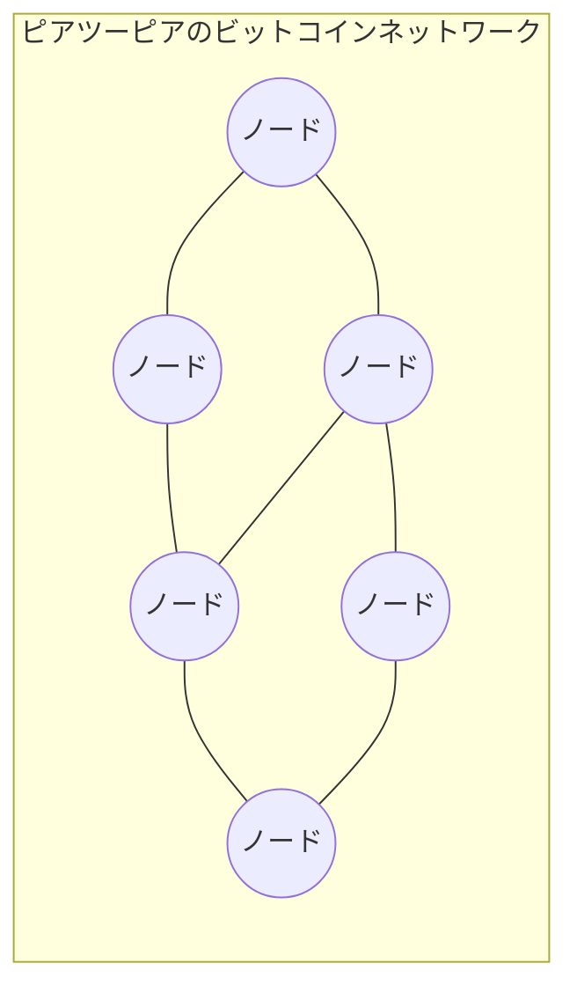

<!-- audit:quote-skip -->
> **ノード** ― ビットコインソフトウェアを実行し、 他のビットコインノードに接続しているコンピューター。 誰でも 1 台動かせる。
> **ピアツーピア (P2P)** ― 中央サーバーを介さず、 コンピューター同士が直接つながるネットワーク方式。

このシステムのルールは、 2008 年に[サトシ・ナカモト](/BitcoinArchive/ja/participants/satoshi-nakamoto/)が公開した 1 本の短い論文 ― [Bitcoin ホワイトペーパー](/BitcoinArchive/ja/entries/emails/cryptography/2008-10-31-bitcoin-whitepaper-final/) ― で定義されている。 ソフトウェア本体は 2 か月後の 2009 年 1 月にリリースされ、 それ以来止まることなく稼働し続けている。

先に進む前に 1 つ補足を。 上で述べた「ノード」 ― ブロックチェーン全部を保持し、 すべてのルールを独立に検証する種類 ― を **フルノード** と呼ぶ。 これとは別に、 もう少し軽い変種として **軽量ノード**、 または **SPV** クライアント (*simplified payment verification* の略) と呼ばれるものがあり、 各ブロックの先頭にある要約データ ― **ブロックヘッダー** ― だけをダウンロードして、 特定のトランザクションが存在するかをフルノードに問い合わせる方式で動く。 スマートフォンウォレットの多くは SPV で動くが、 もう一段単純な「ウォレット運営者の中央サーバー API に問い合わせる」 方式 (より軽量だが運営者を全面的に信頼する) を採るものも多い。 SPV の発想はホワイトペーパー § 8 で示され、 実用的なエンジニアリングは数年後、 おもに[マイク・ハーンの bitcoinj 開発](/BitcoinArchive/ja/entries/correspondence/mike-hearn/more-questions/2010-12-30-hearn-to-satoshi-spv-progress/)によって進められた。 この後の章では、 特に断らない限り「ノード」 はフルノードを指す。

この後の章では、 その「勝手に動き続ける」 システムが実際にどう動くのかを順を追って説明する。

## 2. 用語の早見表

調べたい語からジャンプできる索引として使ってよい。 各語のリンクは、 図と一緒に解説している章につながる。

| 用語 | 意味 |
|---|---|
| [ノード](#1-ビットコインって何) | ビットコインソフトウェアを動かしているコンピューター |
| [フルノード](#1-ビットコインって何) | ブロックチェーン全体を保持し、 すべてのルールを独立検証するノード (本記事の前提とする種類) |
| [軽量ノード (SPV)](#1-ビットコインって何) | ブロックヘッダーのみダウンロードし、 残りはフルノードに依存するノード (スマートフォン用が典型) |
| [ピアツーピア (P2P)](#1-ビットコインって何) | コンピューター同士が直接つながる構造、 中央サーバーなし |
| [ウォレット](#3-コインの正体-utxo-モデル) | 鍵を保持し、 ビットコインの送受信を可能にするソフトウェア |
| [秘密鍵](#3-コインの正体-utxo-モデル) | コインを支配する秘密の数値、 これを持つ者がコインを動かせる |
| [公開鍵](#3-コインの正体-utxo-モデル) | 秘密鍵から導かれる数値、 他人に公開して安全 |
| [アドレス](#3-コインの正体-utxo-モデル) | 公開鍵から導かれる短い文字列、 コイン受け取り用 |
| [デジタル署名](#3-コインの正体-utxo-モデル) | 秘密鍵の保有者が何かを認可したことの暗号学的証明 |
| [トランザクション](#3-コインの正体-utxo-モデル) | 1 つ以上の入力から 1 つ以上の出力へコインを動かすメッセージ |
| [入力](#3-コインの正体-utxo-モデル) | これから使う過去の出力への参照 |
| [出力](#3-コインの正体-utxo-モデル) | 受取人のアドレスに対して施錠された、 新しいコインの塊 |
| [UTXO](#3-コインの正体-utxo-モデル) | まだ使われていない出力、 「コイン」 の実体 |
| [BTC / satoshi](#3-コインの正体-utxo-モデル) | 単位 (1 BTC = 100,000,000 satoshi) |
| [ブロック](#4-ブロックチェーン-取引の永久記録) | トランザクションをひとまとめにした塊 |
| [ハッシュ](#4-ブロックチェーン-取引の永久記録) | 任意のデータから計算される短い指紋となる数値 |
| [ハッシュ関数](#4-ブロックチェーン-取引の永久記録) | ハッシュを生成する関数、 入力を 1 文字でも変えるとまったく違うハッシュになる |
| [ブロックチェーン](#4-ブロックチェーン-取引の永久記録) | すべてのブロックを古い順にハッシュで連ねた構造 |
| [ジェネシスブロック](#4-ブロックチェーン-取引の永久記録) | 最初のブロック (ブロック 0) |
| [ブロック高](#4-ブロックチェーン-取引の永久記録) | チェーン内でのブロックの位置番号 (ジェネシスは高さ 0) |
| [マイナー](#5-マイニング-新規発行と検証) | 新しいブロックを追加しようと試みるノード |
| [マイニング](#5-マイニング-新規発行と検証) | 新しいブロックを追加しようとする作業 |
| [ナンス](#5-マイニング-新規発行と検証) | 正しいブロックハッシュを探すためにマイナーが変え続ける数値 |
| [プルーフ・オブ・ワーク (PoW)](#5-マイニング-新規発行と検証) | ブロックを追加するためにマイナーが解く必要のあるパズル |
| [難易度](#5-マイニング-新規発行と検証) | そのときのパズルの難しさ |
| [コインベーストランザクション](#5-マイニング-新規発行と検証) | ブロック最初の特殊な取引、 新しいビットコインを生み出す |
| [ブロック報酬](#5-マイニング-新規発行と検証) | コインベーストランザクションで新規発行されるビットコイン |
| [トランザクション手数料](#5-マイニング-新規発行と検証) | トランザクションに添えてマイナーへ支払う少額の上乗せ |
| [マイナー報酬](#5-マイニング-新規発行と検証) | ブロック報酬 + そのブロック内の手数料合計 |
| [半減期](#5-マイニング-新規発行と検証) | 210,000 ブロックごと (約 4 年) にブロック報酬が半分になるイベント |
| [メモリープール](#6-メモリープール-待合室) | まだブロックに入っていないトランザクションの待合室 |
| [確認](#6-メモリープール-待合室) | 自分のトランザクションの上に積まれたブロック数、 多いほど不変性が高い |
| [合意](#7-合意と改竄防止) | 全ノードが同じブロックチェーンに同意している状態 |
| [検証](#7-合意と改竄防止) | ノードがトランザクションやブロックがルールに従っているかを確認する作業 |
| [二重支払い](#7-合意と改竄防止) | 同じコインを 2 回使おうとする行為、 ビットコインが解いた問題 |
| [改竄](#7-合意と改竄防止) | あとからブロックを書き換えようとする行為 |
| [最長チェーン](#7-合意と改竄防止) | 累積仕事量がもっとも多いチェーン、 正直なノードはこれを採用する |

## 3. コインの正体: UTXO モデル

「ビットコイン (1 枚)」 とは、 どこかにあなたの名前付きで置かれているコインオブジェクトではない。 もっと**レシート (受領証)** に近い。

友人から 1 BTC を受け取ったとしよう。 実際に受け取っているのは、 ネットワーク上のトランザクション記録だ。 そこにはこう書かれている: *「この 1 BTC の塊は、 この秘密鍵で開錠できるアドレスに施錠された」。* この塊を**出力**と呼ぶ。 使っていない間は**未使用の出力**、 略して **UTXO** (Unspent Transaction Output) と呼ばれる。 あなたの「残高」 とは、 あなたの**ウォレット**が開錠できるアドレスに施錠されている UTXO の合計だ。

ビットコインを使う (送る) ときは、 ウォレットが新しい**トランザクション**を組み立てる:

1. 既存の UTXO を 1 つ以上**入力**として並べる (消費するコイン)、
2. 1 つ以上の新しい**出力**を作る (受取人のアドレスに施錠された新しいコインの塊)、
3. 入力を支配する**秘密鍵**で全体に署名する。

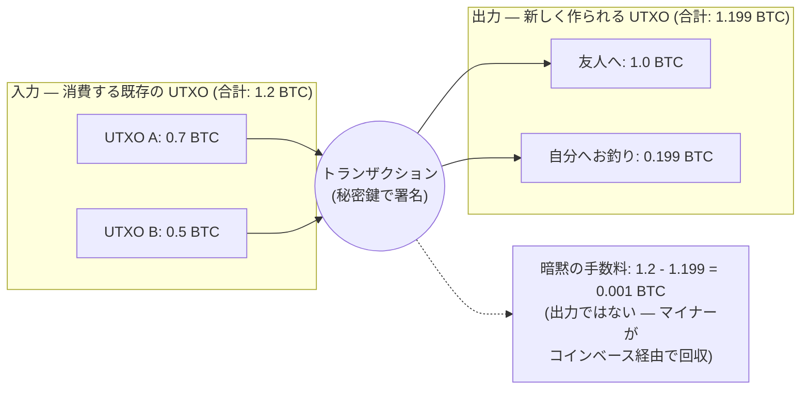

入力は常に UTXO 全体を消費する ― UTXO を「半分だけ」 使うことはできない。 1 BTC を払いたいが手元の唯一の UTXO が 1.2 BTC なら、 トランザクションは 1.2 BTC 全体を消費し、 1.0 BTC の出力を受取人に作り、 0.199 BTC の出力を自分のウォレットに「お釣り」 として作る。 どの出力にも割り当てられなかった残りの 0.001 BTC が、 このトランザクションを取り込んだマイナーが受け取る**トランザクション手数料**となる (5 章)。

普段目にする単位は **BTC** だが、 内部的には**satoshi**で数えている: 1 BTC = 100,000,000 satoshi。 送れる最小単位は 1 satoshi で、 システム作者の名前から取られている。

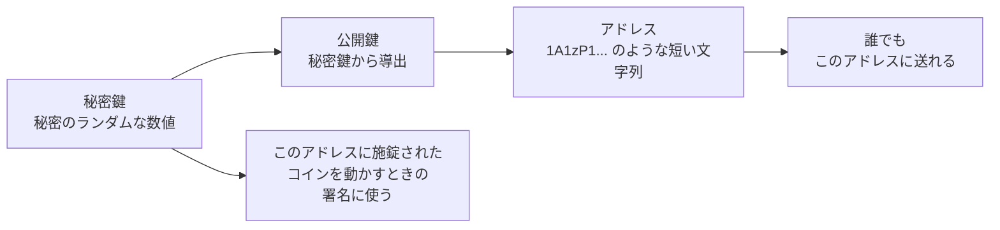

支配権を持つのは**秘密鍵**だけだ。 失えば、 そのアドレスに施錠されたコインは取り戻せない。 **公開鍵**と**アドレス**は秘密鍵から一方向の数学で導かれるので、 他人に渡しても安全だ。 **デジタル署名**は秘密鍵と当該トランザクションからウォレットが生成する一片のデータで、 ネットワーク上の誰もが「その署名がそのアドレスに対して有効」 と検証できる。 秘密鍵そのものを見る必要はない。

ホワイトペーパー [Bitcoin: A Peer-to-Peer Electronic Cash System](/BitcoinArchive/ja/entries/emails/cryptography/2008-10-31-bitcoin-whitepaper-final/) では § 2 "Transactions" でこの仕組みを扱っている。

## 4. ブロックチェーン: 取引の永久記録

ピアツーピアネットワーク上に放たれたトランザクションは、 まだ確定しない。 おおよそ同じ瞬間に正式化される一群のトランザクションをまとめた塊 ― **ブロック** ― にバッチ化される。 ブロックは平均で約 10 分に 1 個生成される。

各ブロックには、 そのブロック自身の指紋となる短い数値、 **ハッシュ**が含まれる。 ハッシュは**ハッシュ関数**という数学的処理によって計算される ― 任意の入力データ (ブロック、 文章、 ファイル、 なんでも) を固定長の短い数値に変換する関数だ。 ビットコインが使うハッシュ関数 (SHA-256) には 2 つの重要な性質がある:

- 入力を 1 文字でも変えると、 まったく違うハッシュになる。
- ハッシュから逆算して入力を推測することはできない。

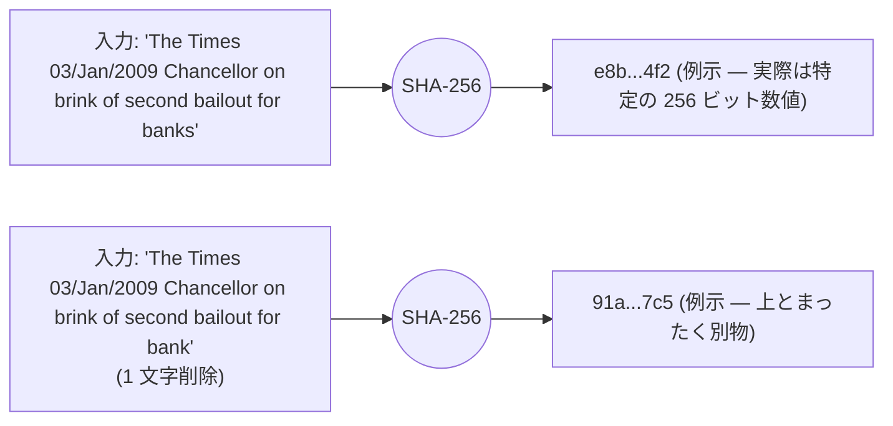

さらに各新規ブロックには、 1 つ前のブロックのハッシュも自分自身の中に含まれている。 このリンクが**チェーン**を作る: すべてのブロックが、 1 つ前のブロックを指し続け、 最初のブロックまで遡れる。

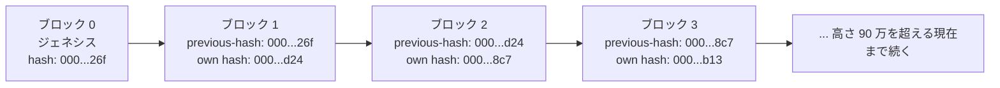

最初のブロックを**[ジェネシスブロック](/BitcoinArchive/ja/entries/aftermath/2009-01-03-genesis-block/)** (またはブロック 0) と呼ぶ。 特殊な存在で、 マイニングされたのではなく、 サトシによってソースコードに直接ハードコードされた ― 詳細な機構は[ジェネシスブロックハードコード分析](/BitcoinArchive/ja/entries/analysis/2009-01-03-genesis-block-hardcode-analysis/)が v0.1 ソースを読み解いている。 ブロック 0 から数えた各ブロックの位置を**ブロック高**と呼ぶ: ジェネシスは高さ 0、 次のブロックは高さ 1、 という具合だ。

ジェネシスから最新のブロックまで連なる全体構造が**ブロックチェーン**だ。 ノードを動かしている全員が、 同じものを 1 部ずつ持っている。

## 5. マイニング: 新規発行と検証

マイニングそのものに入る前に、 似た響きだが別物の 3 つの用語を整理する:

- **ノード** はビットコインソフトを動かしてチェーンを検証する ― それが仕事
- **マイナー** はノードのうち、 *さらに* 計算力を投入して次のブロック生成競争に参加するもの
- **ウォレット** は鍵を管理してトランザクションを組み立てるソフトウェア。 ノードの中に同居していても、 ノードと別プロセスで隣接していても、 スマートフォン上にフルノード無しで存在していてもよい

マイニングは「ノードであること」 の上に純粋に追加される活動だ。 ウォレットはさらに別の関心事で、 スマートフォンウォレットは普通、 他人のノードに SPV (1 章) で問い合わせている。 Bitcoin Core はこれら 3 つの役割をすべて 1 つのプログラムに同梱しているため、 一般にこれらの用語が混同される最大の原因になっている。

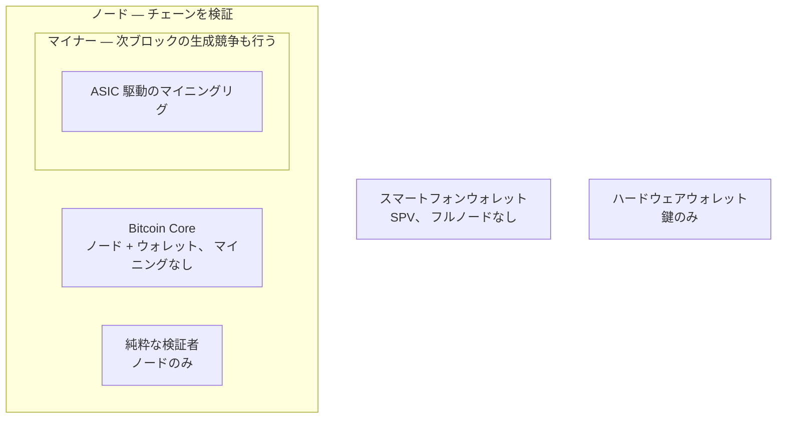

では、 次のブロックに何のトランザクションを入れるかは誰が決め、 新しいビットコインはどこから来るのか？

答えは**マイニング**だ。 作業をやる気のあるノードは誰でも**マイナー**になれる。 マイナーは待機中のトランザクションを集め、 候補ブロックにまとめ、 そしてパズルを解く競争を始める。 パズルとはこうだ: *「ブロックに数値をひとつ入れて、 ブロックのハッシュが先頭にゼロを規定数並べるようにせよ」*。 マイナーが変え続けるその数値を**ナンス**と呼ぶ。 ハッシュ関数 (4 章) は予測不能な出力を返すので、 当たりのナンスを見つける方法は試し続けるしかない。 何百万回も試すこのプロセスを**プルーフ・オブ・ワーク** (略して **PoW**) と呼ぶ ― もともとは [1997 年にアダム・バックが発表した Hashcash](/BitcoinArchive/ja/entries/aftermath/1997-03-28-adam-back-hashcash-announcement/) でスパム対策として提案された方式を、 ビットコインが中核の仕組みとして再利用している。

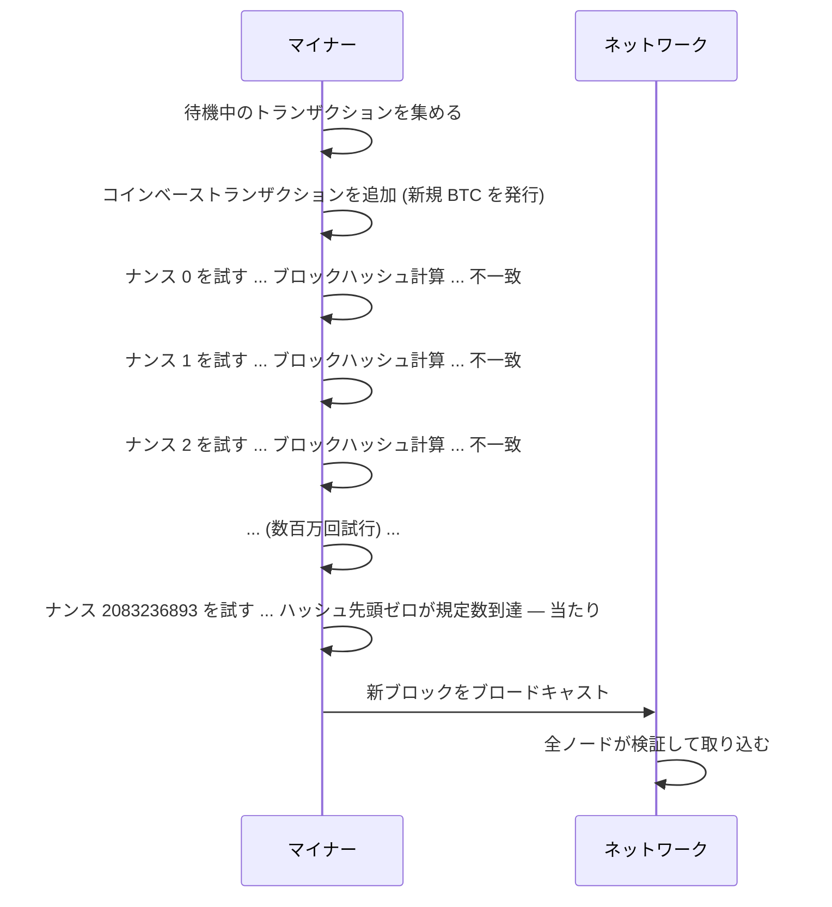

何個のゼロが必要かを**難易度**と呼ぶ。 ネットワークは 2,016 ブロックごと (約 2 週間ごと) に難易度を調整して、 マイナーがどれだけ計算力をつぎ込もうとも、 当たりのブロックが平均で約 10 分に 1 個見つかるようにする。

勝ったマイナーは、 ブロックの先頭に特殊なトランザクションを 1 つ入れる権利を得る。 過去の出力を参照しない唯一のトランザクション (過去のコインを一切消費しない) ― **[コインベーストランザクション](/BitcoinArchive/ja/entries/aftermath/2009-01-03-genesis-block/)** だ。 このトランザクションが生み出す出力は、 新しいビットコインがこの世に生まれる唯一の経路だ。 生み出される額を**ブロック報酬**と呼ぶ。 さらにマイナーは、 取り込んだ通常トランザクションに添えられた**トランザクション手数料**もすべて集める。 この 2 つを合わせたものが**マイナー報酬**だ。

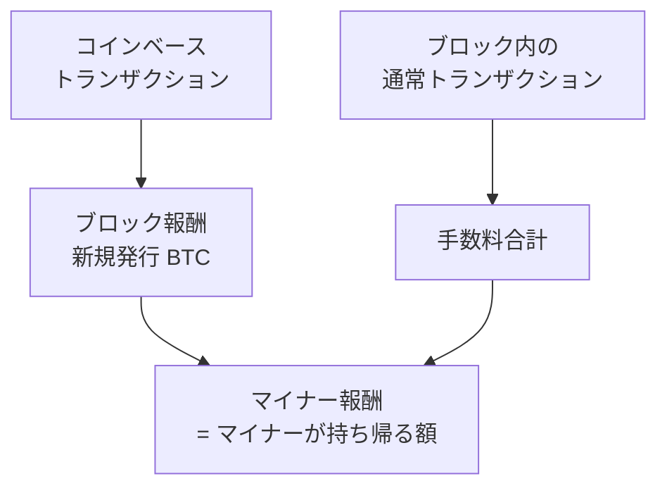

ブロック報酬は一定ではない。 2009 年 1 月に **50 BTC/ブロック**で始まり、 210,000 ブロックごと (約 4 年ごと) に半減する。 このイベントを**半減期**と呼ぶ。 十分な回数の半減を経るとブロック報酬は 0 satoshi になり、 マイナーはトランザクション手数料のみで報酬を受け取るようになる。 今後発行されるビットコインの総数は、 このスケジュール上のブロック報酬を全部足したものになり、 計算するとほぼちょうど **2,100 万 BTC** に収まる。 このスケジュールの帰結は[マイニング報酬枯渇分析](/BitcoinArchive/ja/entries/analysis/2026-05-18-mining-reward-exhaustion-fee-only-future/)で深く扱われている。

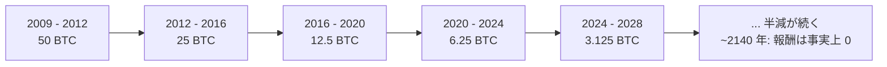

**なぜほとんどのノードは実際にはマイニングしないのか。** 「ノードは誰でもマイナーになれる」 はプロトコル上の真理だが、 実態はほとんどのノードがマイニングしない。 現代のマイニングは産業規模の **ASIC** ハードウェア (*application-specific integrated circuit* の略、 「特定用途向け集積回路」 ― ビットコインのハッシュ関数しか計算しない代わりに、 1 回の計算に必要な電力が汎用コンピューターよりはるかに少ないチップ) を必要とする。 産業 ASIC 時代は 2013 年に始まった ― サトシ 2011 年消失の *後* である。 したがってサトシ時代の「1 CPU = 1 票」 像は元の設計意図であり、 今日の運用現実ではない。 この乖離の全容 (および現状がサトシ設計と異なる他 3 軸) は対となるエントリー[サトシの設計意図とビットコインの現状の乖離](/BitcoinArchive/ja/entries/analysis/2026-05-24-satoshi-design-vs-current-reality/)で扱う。

## 6. メモリープール: 待合室

トランザクションを送信しても、 即座にブロックに入るわけではない。 まずピアツーピアネットワークを伝わり、 各ノードの**メモリープール** ― まだブロックに取り込まれていないトランザクションの局所的な待合室 ― に着く。 マイナーは候補ブロックを組み立てるときメモリープールから取捨選択し、 手数料が高いものから優先的に取り込む傾向がある (手数料はそのまま自分の収入になるからだ)。

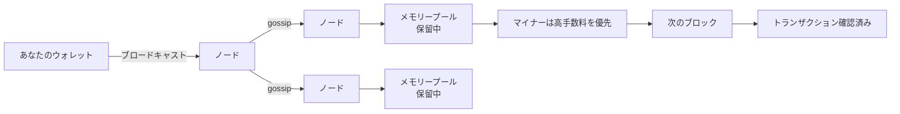

自分のトランザクションがブロックに入ると、 これで**確認**が 1 個になる。 次のブロック ― 自分のブロックの上に積まれるブロック ― が確認 2 個目になる。 上に 1 ブロック積まれるごとに確認が 1 増え、 トランザクションを巻き戻すのが指数関数的に困難になる。 「事実上不変」 と見なせる目安として、 古くから 6 確認が使われてきた。

## 7. 合意と改竄防止

誰でもコンピューター 1 台でマイナーになれるのなら、 悪意あるマイナーがトランザクションをでっち上げたり、 あなたのトランザクションを取り消したり、 自分に 100 万 BTC を発行したりするのを、 何が止めているのか？

連動する 2 つの設計思想がある:

**1. 全ノードによる検証。** 新ブロックがブロードキャストされると、 各ノードは独立にチェックする: ブロック内の各トランザクションの署名は有効か？ 消費されるコインは本当に未使用の UTXO か (二重に使われていないか)？ ブロックハッシュはプルーフ・オブ・ワークを満たしているか？ コインベース報酬はスケジュール通りか？ どれかひとつでも不合格なら、 ノードはそのブロックを拒否する。 無効なトランザクションを混ぜようとしたマイナーは、 単に「ネットワークの他の全員が受け入れないブロック」 を作って終わる。

**2. 最長チェーンが勝つ。** ときどき、 2 人のマイナーがほぼ同時に正当なブロックを見つけることがある。 ネットワークには一時的に 2 本の競合チェーンが現れる。 次のブロックがどちらかの上に積まれて勝負を決める ― 次のブロックが先に積まれた方が**最長チェーン** (厳密にはプルーフ・オブ・ワークが最も累積したチェーン) となり、 取り残されたブロックは捨てられる。 すべての正直なノードは常に最長のチェーンを採用する。

この 2 番目のルールが、 **改竄**を構造的に絶望的にする。 攻撃者が 100 ブロック前のブロックの中のトランザクションを書き換えたいとしよう ― 例えば自分が行った支払いを取り消したい、 とか。 そのトランザクションを書き換えれば、 ブロックのハッシュが変わる。 ハッシュが変われば次のブロックの「previous-hash」 リンクが壊れる。 そうなれば、 その次のブロックも、 そのまた次も、 先端まで全部壊れる。 攻撃者は 100 ブロック分のプルーフ・オブ・ワークを最初からやり直すことになる ― しかもその間、 世界中の正直なマイナーは本物のチェーンを延ばし続けている。 攻撃者は、 正直なネットワーク全体の合計を上回る計算力を握っていない限り、 永遠に追いつけない。

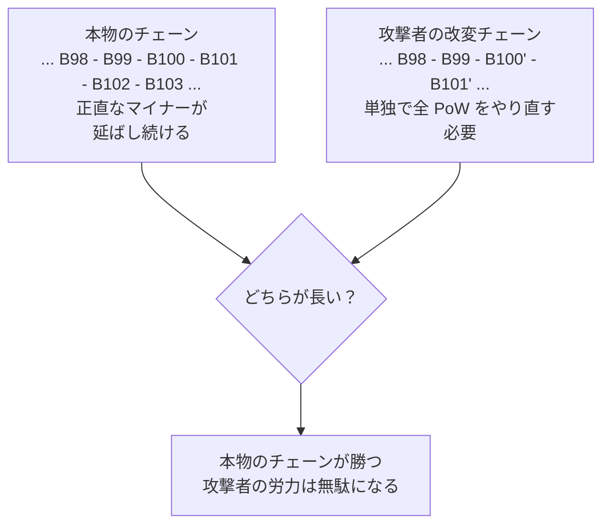

これは**二重支払い**の防止と同じ仕組みでもある。 悪意あるユーザーが、 同じ UTXO を消費しようとする 2 つの矛盾するトランザクションをブロードキャストしたら、 どちらか 1 つが先にチェーンに入る。 もう 1 つは UTXO がもはや未使用ではないので、 全ノードに拒否される。 信頼ではなく、 数分の競争で決着がつく。

すべてのノードが同一の正規チェーンに同意する状態 ― 中央の調停者なしに、 機械的なルールだけから自然と立ち上がる状態 ― を**合意**と呼ぶ。

## 8. ここから何を読むか

ここまでがビットコインの基本的な仕組みだ。 ここから先は、 出てきた用語のひとつひとつをより深く追える:

- [ビットコインのシステム設計概観](/BitcoinArchive/ja/entries/design/2009-01-03-bitcoin-system-design-overview/) ― 本記事で押さえた用語を 11 領域 (合意、 ブロックチェーン、 P2P ネットワーク、 ウォレット、 暗号工学、 トランザクション、 通貨設計、 セキュリティ、 ストレージ、 アーキテクチャの変遷、 エコシステム) に整理した設計文書索引。 体系的に深掘りしたいときはここから始めるとよい。
- [Bitcoin ホワイトペーパー](/BitcoinArchive/ja/entries/emails/cryptography/2008-10-31-bitcoin-whitepaper-final/) ― 2008 年 10 月にサトシが公開した、 オリジナルの 8 ページの記述。 用語を知った今なら短く読み通せる。
- [ジェネシスブロック](/BitcoinArchive/ja/entries/aftermath/2009-01-03-genesis-block/) ― サトシが最初のブロックに何を、 なぜ刻んだのか。
- [ジェネシスブロックハードコード分析](/BitcoinArchive/ja/entries/analysis/2009-01-03-genesis-block-hardcode-analysis/) ― ブロック 0 がどう構築され、 50 BTC の報酬がなぜ永遠に動かせないのかの技術的詳細。
- [1997 年のアダム・バックによる Hashcash 発表](/BitcoinArchive/ja/entries/aftermath/1997-03-28-adam-back-hashcash-announcement/) ― ビットコインが中核で再利用したプルーフ・オブ・ワーク方式。
- [マイニング報酬枯渇分析](/BitcoinArchive/ja/entries/analysis/2026-05-18-mining-reward-exhaustion-fee-only-future/) ― ブロック報酬が最終的にゼロに達したとき、 マイナー経済はどうなるか。
- [ビットコイン設計系譜分析](/BitcoinArchive/ja/entries/analysis/2008-10-31-bitcoin-design-lineage/) ― ビットコインのどの部分が先行研究から、 どの部分が真に新規の設計から来ているか。
- [サトシの設計意図とビットコインの現状の乖離](/BitcoinArchive/ja/entries/analysis/2026-05-24-satoshi-design-vs-current-reality/) ― 4 軸 (マイニング、 カストディ、 ガバナンス、 スケーリング) で現在の Bitcoin が本記事のプロトコル設計とどう乖離しているかを描いた対となる記事。 本記事のプロトコル章を読んだ *後* に。
- [マイク・ハーン 2010 年 12 月 SPV 進捗報告](/BitcoinArchive/ja/entries/correspondence/mike-hearn/more-questions/2010-12-30-hearn-to-satoshi-spv-progress/) ― 軽量ノードウォレットの実用エンジニアリングの裏側。
- [ビットコインのトランザクション設計](/BitcoinArchive/ja/entries/design/2009-01-03-bitcoin-transaction-design/) ― UTXO モデル、 Bitcoin Script、 有効な支払いの形を、 上記のトランザクション用語の背後にある設計文書の詳細度で扱う。
