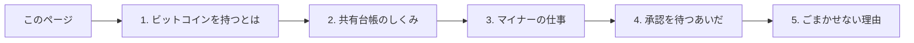

明日、銀行のコンピューターが止まったとする。あなたの残高も、取引の履歴も、誰かに支払う手段も、すべてがその一社のデータベースの中にあり、あなた自身が直接触れるものは何もない。あなたはその一社が正確な帳簿を保ち、それを使わせ続けてくれると信頼しているだけだ。

ビットコインが答えようとしたのは、もう少し狭い問いだ。互いを知らず、信頼もしていない何千台ものコンピューターが、数学と共通のルールだけを頼りに、「誰が何を持っているか」という帳簿を、**特定の管理者なしに**正確に保てるだろうか。[サトシ・ナカモト](/BitcoinArchive/ja/participants/satoshi-nakamoto/)は 2008 年の短い論文、[Bitcoin ホワイトペーパー](/BitcoinArchive/ja/entries/emails/cryptography/2008-10-31-bitcoin-whitepaper-final/)でその方法を示し、ソフトウェアは 2009 年 1 月から今日まで、10 分おきに、誰の指図もなくその答えを実行し続けている。

このガイドは、あなたの前提知識を一切求めない。「ブロックチェーン」という語も、暗号学的な鍵の概念も、必要ない。お金や領収書についての日常的な感覚さえあれば十分だ。全 5 ページ、それぞれが平易な一つの問いに答える。

1. **[ビットコインを持つとは、実際どういうことか](/BitcoinArchive/ja/entries/analysis/2026-09-06-what-owning-a-bitcoin-actually-means/)**：どこにもコインという物がないなら、あなたは実際には何を手にしているのか。
2. **[取引はどうやって共有台帳になるのか](/BitcoinArchive/ja/entries/analysis/2026-09-06-how-transactions-become-a-shared-ledger/)**：何千台ものコンピューターが、なぜ最後には同じ記録を持つに至るのか。
3. **[マイナーたちは実際、何を競っているのか](/BitcoinArchive/ja/entries/analysis/2026-09-06-what-miners-are-actually-racing-to-do/)**：新しいビットコインはどこから来るのか、そしてなぜそれが競争になるのか。
4. **[送金が未承認のあいだ、何が起きているのか](/BitcoinArchive/ja/entries/analysis/2026-09-06-what-happens-while-a-payment-is-unconfirmed/)**：送金が正式なものになる前に通る待合室の中身。
5. **[なぜ誰も台帳をごまかせないのか](/BitcoinArchive/ja/entries/analysis/2026-09-06-why-no-one-can-cheat-the-ledger/)**：特定の信頼できる管理者なしに、システム全体が信頼に足るものになる最後のしくみ。

最初は順番どおりに読むとよい。どのページも直前のページの内容に乗っている。5 本を通しで読み終えたあとは、下の用語早見表だけを単独の索引として使える。各行は、その語をただ名指すだけのページではなく、実際に説明しているページへリンクしている。

## 用語から探す

| 用語 | 解説ページ |
|---|---|
| ウォレット、秘密鍵、公開鍵、アドレス、署名 | [1. ビットコインを持つとは](/BitcoinArchive/ja/entries/analysis/2026-09-06-what-owning-a-bitcoin-actually-means/) |
| UTXO、トランザクション、入力、出力、お釣り | [1. ビットコインを持つとは](/BitcoinArchive/ja/entries/analysis/2026-09-06-what-owning-a-bitcoin-actually-means/) |
| ブロック、ハッシュ、ブロックチェーン、ジェネシスブロック、ノード | [2. 共有台帳のしくみ](/BitcoinArchive/ja/entries/analysis/2026-09-06-how-transactions-become-a-shared-ledger/) |
| ピアツーピアネットワーク | [2. 共有台帳のしくみ](/BitcoinArchive/ja/entries/analysis/2026-09-06-how-transactions-become-a-shared-ledger/) |
| マイニング、マイナー、ナンス、プルーフ・オブ・ワーク、難易度、ブロック報酬、半減期 | [3. マイナーの仕事](/BitcoinArchive/ja/entries/analysis/2026-09-06-what-miners-are-actually-racing-to-do/) |
| メモリープール、トランザクション手数料、確認 | [4. 承認を待つあいだ](/BitcoinArchive/ja/entries/analysis/2026-09-06-what-happens-while-a-payment-is-unconfirmed/) |
| 検証、合意、最長チェーン、二重支払い | [5. ごまかせない理由](/BitcoinArchive/ja/entries/analysis/2026-09-06-why-no-one-can-cheat-the-ledger/) |

## この先どこへ進むか

上の 5 本が腑に落ちたら、進む先は 2 つある。

- [Bitcoin ホワイトペーパー](/BitcoinArchive/ja/entries/emails/cryptography/2008-10-31-bitcoin-whitepaper-final/)そのもの：わずか 9 ページで、用語を知った今のほうがずっと読みやすい。
- [ビットコインのシステム設計概観](/BitcoinArchive/ja/entries/design/2009-01-03-bitcoin-system-design-overview/)：本アーカイブの技術設計文書シリーズ。同じ範囲を、正確なアルゴリズムやパラメーター、サトシの原設計から現在までの変遷まで含めた実装レベルの深さで辿り直せる。
