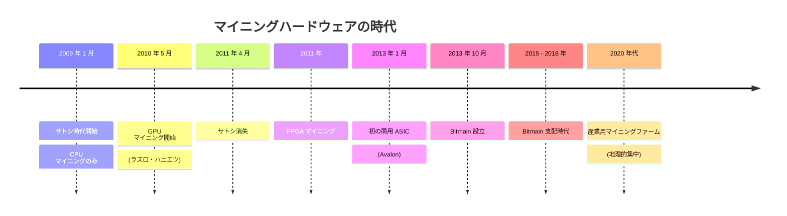
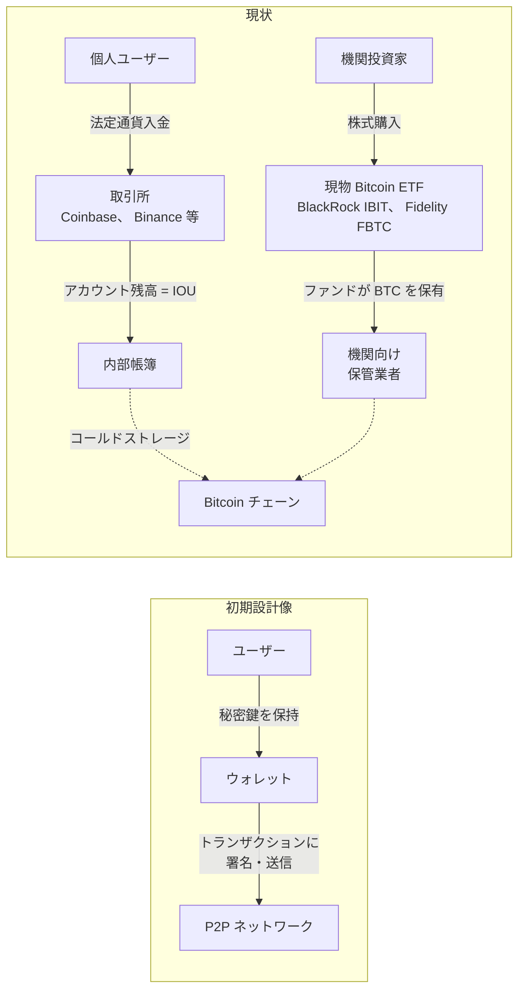
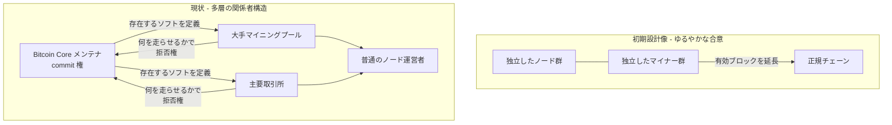
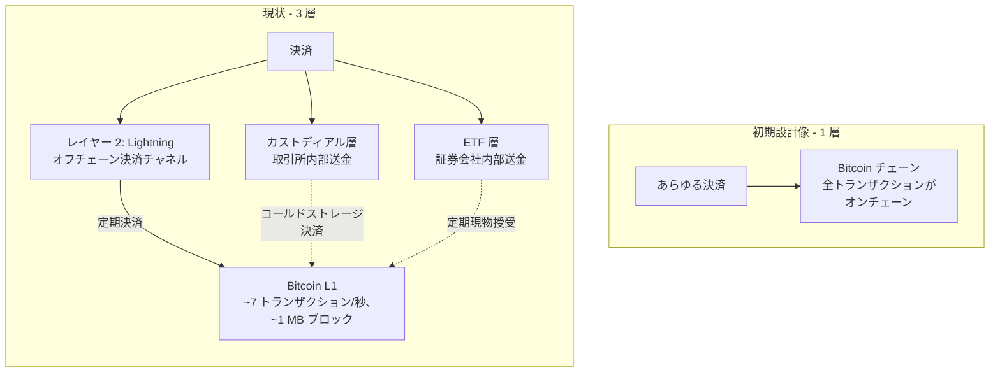

ビットコインのプロトコルは、 2008 年に[サトシ・ナカモト](/BitcoinArchive/ja/participants/satoshi-nakamoto/)が書き下したルールから今もほぼ変わらず動いている。しかし**ユーザー体験**、 **経済構造**、 **ガバナンスの実態**は、初期設計の姿から大きく乖離している。 [ホワイトペーパー](/BitcoinArchive/ja/entries/emails/cryptography/2008-10-31-bitcoin-whitepaper-final/)や[ビットコインの仕組み図解](/BitcoinArchive/ja/entries/analysis/2026-05-23-how-bitcoin-works-visual-glossary/)を読むとプロトコルの忠実な姿は描けるが、大多数のユーザーが実際に触る世界の姿は描けない。本稿は乖離が最も大きい 4 つの軸を、一次資料へのリンクとともに辿る。

| 軸 | 初期設計像 | 現状 | 乖離開始 |
|---|---|---|---|
| **マイニング** | 「1 CPU = 1 票」 | ASIC 寡占 | 2010 GPU、 2013 ASIC |
| **カストディ** | 各人が秘密鍵を保管 | 取引所 IOU / ETF 商品 | 2011 ~ (Mt. Gox) |
| **ガバナンス** | ノードのゆるやかな合意 | Bitcoin Core メンテナ + 大手マイナー | 2010 年 12 月 (サトシ → ギャビン移譲) |
| **スケーリング** | 直接 P2P 決済 | レイヤー 2 (SegWit/Lightning) + カストディアルオフチェーン | 2010 年 1 MB 上限、 2017 年 SegWit |

## 1. マイニング ―「1 CPU = 1 票」 → ASIC 寡占

**サトシの記述** (ホワイトペーパー § 4「Proof-of-Work」): *「Proof-of-work is essentially one-CPU-one-vote.」* (プルーフ・オブ・ワークは本質的に 1 CPU = 1 票である)。暗黙の前提は、マイニングが汎用コンピューター上で続くという構図だった。 PC を持つ誰もが参加でき、ネットワークの防衛は普通のノード群がブロック生成も担うことで成立する。

**現状**。 2013 年にマイニングは PC を離れ、専用設計のチップ、すなわち **ASIC** に移行した。ビットコイン初の商用 ASIC は 2013 年 1 月の Avalon ASIC、同年に設立された [Bitmain](/BitcoinArchive/ja/participants/jihan-wu/) が 2015 ~ 2018 年に支配的製造業者となった。現代の ASIC は同じキロワット時の電力で、汎用コンピューターより数千万倍多くのハッシュ計算を処理できる。 ASIC を相手にして PC でマイニングしても電気代を浪費するだけで何も生まない。現代のマイニングは少数のプールと少数の地理に集中した重工業であり、ノードを動かすことに付随する参加型副業ではない。

**乖離の起点**。 GPU マイニングは 2010 年 5 月に始まった (後に 10,000 BTC でピザを買ったラズロ・ハニエツが先駆者)。サトシは当時これに難色を示し、ハニエツに「ゆっくりやってくれないか」と頼んだ。当時のやり取りの記録は[ハニエツによる回想](/BitcoinArchive/ja/entries/aftermath/2010-05-10-hanyecz-recalls-satoshi-gpu-pushback/)を参照。 FPGA マイニングは 2011 年、 ASIC マイニングは 2013 年に続いた。サトシは 2011 年 4 月に消失したため、 **ASIC 時代全体はサトシ後**である。時系列は文書化されているが、 *消失の理由*は文書化されていない (マイニングハードウェアの乖離を離脱理由として結びつけるサトシの発言は現存しない)。

**集中化の帰結**。 [レイ・ディリンジャー 2018 年インタビュー](/BitcoinArchive/ja/entries/aftermath/2018-10-01-ray-dillinger-interview/)と[マイニング報酬枯渇分析](/BitcoinArchive/ja/entries/analysis/2026-05-18-mining-reward-exhaustion-fee-only-future/)で詳述。

<!-- chart: lopp-hashrate-analysis -->

## 2. カストディ ― 自分で鍵を持つ → 取引所 IOU (および ETF 商品)

**サトシの記述** (ホワイトペーパー § 1「序論」): 「必要なのは、信頼ではなく暗号学的証明に基づく電子決済システムであり、信頼できる第三者を介さず、二者間で直接取引できるものだ」。この設計は、各ユーザーが自身の秘密鍵を保持することを前提にしている。そうでなければ自分でトランザクションに署名できないからだ。

**現状**。今日「ビットコインを所有」する人々の少なからぬ割合、とりわけ取引所や ETF 経由で取得した層は、一切の鍵を持っていない。取引所 (Coinbase、 Binance、 Kraken など) にアカウント残高を持っているか、ファンドの株式を持っているだけだ。これはホワイトペーパー冒頭が排除する「信頼できる第三者」そのものを置く構成である。機能的には、カストディアル業者からのビットコイン建て IOU であり、証券会社の口座と区別がつかない。コミュニティが端的に表現した呼称が「自分の鍵でなければ、自分のコインではない」である。

**機関投資の極み: 現物 ETF**。この潮流は 2024 年 1 月、米国 SEC が初の現物 Bitcoin ETF (BlackRock IBIT、 Fidelity FBTC 等) を承認したことでさらに進んだ。 ETF 投資家は一切ビットコインを保有しない。保有するのは、保管業者を介してビットコインを保有するファンドの株式だけだ。数か月のうちに、これらの ETF は合計数十万 BTC を保有するに至った。これがカストディ軸の機関投資的な極みである: ホワイトペーパーの「ピアツーピア電子現金」は、個人投資家・機関投資家のマネーの大半にとって、既存の証券会社のインフラを通じてアクセスする伝統的な資産クラスになった。

**なぜ重要か**。カストディ業者が破綻すると、 IOU は支払われない。 [2014 年 2 月の Mt. Gox 破綻](/BitcoinArchive/ja/entries/aftermath/2014-02-28-mt-gox-bankruptcy/)は約 850,000 BTC の顧客保有を失った。 [2022 年 11 月の FTX 崩壊](/BitcoinArchive/ja/entries/aftermath/2022-11-11-ftx-collapse/)は別世代の運営者で同じパターンを繰り返した。いずれの場合も、被害ユーザーはプロトコルレベルで何のコインに対する請求権も持たなかった。持っていたのは、破綻企業に対する契約上の請求権だけだった。これはビットコインがプロトコルレベルで不可能にするよう設計した銀行破綻モードを、ユーザーの選択とサービス設計の上層で再現したものである。この 2 つの破綻は、損失の機構別に象徴的事例を整理した[失われたビットコイン ― トーマス、ハウエルズ、 QuadrigaCX、 Mt. Gox、 FTX と「不可逆性」の教訓](/BitcoinArchive/ja/entries/analysis/2026-06-02-bitcoin-iconic-losses-overview/)でも、より詳しく取り上げられている。

## 3. ガバナンス ― 分散合意 → コア開発者 + 大手マイナー

**サトシの記述** (ホワイトペーパー § 5「ネットワーク」): 「[ノードは] CPU の力で投票し、有効なブロックを延長する作業を通じて受容を表明する……」。描かれるのは、多数の独立した運営者の作業から、メカニズムだけで合意が立ち上がる構図であり、特権的な意思決定者はいない。

**現状**。今日のプロトコル変更は、多層の関係者構造によって門番される: Bitcoin Core ソフトウェアのメンテナチーム (commit 権を持つ少数の貢献者) が正規クライアントの仕様を定める; 大手マイニングプール、主要取引所、保管業者、経済的に重みのあるノード運営者は、それぞれどのソフトウェアを走らせるかで実質的な拒否権を行使できる; 普通のノード運営者はどのバージョンをインストールするかを選ぶことで参加する。 2017 年の UASF (ユーザー有効化ソフトフォーク) 騒動は「ユーザー側の連携した圧力」が原理的にマイナーの選好を覆せることを示したが、実務的な意思決定は運用上重要な少数の関係者に集中している。下図は読みやすさのため 2 層に単純化してあるが、実際の影響関係はもっと多くの関係者の間で交差している。

**乖離の起点**。 3 つの分岐点:
- 2010 年 12 月: [サトシはギャビン・アンドレセンにメンテナンス権限を引き渡した](/BitcoinArchive/ja/entries/aftermath/2011-04-26-satoshi-final-known-email/) (事前にギャビンに引き受ける意思があるか確認しないまま)。ギャビンは続いて他の 4 人の開発者に commit リストを与えた。人選は形式的なプロセスによるものではなく、「その場にいて役に立つことをしていた」という基準で選ばれた。これが現代のコアメンテナチームの種子である。
- 2015 ~ 2017 年: ブロックサイズ戦争。 [ビットコインフォーク戦争は OSS ではない](/BitcoinArchive/ja/entries/analysis/2015-08-15-bitcoin-fork-wars-as-not-oss/)参照。紛争は SegWit 有効化 (BIP 141)、ユーザー有効化ソフトフォーク (UASF) からの圧力、ニューヨーク合意 (NYA) の頓挫、そしてビットコインキャッシュの分岐という、多面的な政治的・経済的プロセスを経て決着した。ホワイトペーパーが描くゆるやかな合意ではない。
- 2016 年 1 月: [マイク・ハーンがビットコイン実験は失敗したと宣言し](/BitcoinArchive/ja/entries/aftermath/2016-01-14-mike-hearn-resolution-bitcoin-experiment/)、全コインを売却。ガバナンス崩壊を直接の理由として挙げた。

<!-- chart: fork-genealogy -->

## 4. スケーリング ― 直接 P2P 決済 → レイヤー 2 / オフチェーン

**サトシの記述** (ホワイトペーパー § 1「Introduction」): *「...allowing any two willing parties to transact directly with each other...」* (二者間で直接取引できる)。暗黙のモデルは、通常の決済がチェーン上に着地することだった。

**現状**。ビットコインの 1 MB ブロックサイズ上限は、チェーンを約 7 トランザクション/秒に制限する (現実的なトランザクションサイズではもっと少ない)。日常の小売決済はおさまらない。仮におさまったとしても、ピーク時には手数料で締め出される。実際のスケーリング経路は二層化だった: SegWit (BIP 141、 2017 年有効化) が Lightning Network のための余地を作り、決済はチェーン外に移って定期的な決済時のみベース層に触れる。カストディアル取引所も*スケーリング層として*機能している。 Coinbase アカウント間の内部送金はチェーンに一切到達しない。

**乖離の起点**は 2010 年のブロックサイズ議論 (サトシ自身が暫定的に置いた 1 MB 上限、元々はスパム対策) で、 2015 ~ 2017 年の[フォーク戦争](/BitcoinArchive/ja/entries/analysis/2015-08-15-bitcoin-fork-wars-as-not-oss/)を経て結晶化した。今日の日常利用の大半において、ビットコインはホワイトペーパーが描く直接 P2P 現金像というよりも、信頼度の異なる複数の決済システムが積み重なった、その最下層の決済層に近い形で使われている。これは [2008 年 11 月にジェームズ・A・ドナルドが名指しで予見した帰結](/BitcoinArchive/ja/participants/james-donald/)である。彼はビットコイン銀行を「bink」と名付け、金本位制で金が紙幣を支えたように、ビットコインを口座マネーの下に位置づけた。

## 本稿が主張していないこと

乖離を指摘することは「ビットコインは失敗した」という主張ではない。これらの乖離の一部は、大量採用の不可避な帰結とも言える: ASIC 特化は経済的に価値ある PoW が必ず引き寄せるもの、カストディ取引所はほとんどの人が鍵管理の責任を負いたがらないから存在する、レイヤー 2 スケーリングはベース層のセキュリティを保ったまま広がる保守的な道筋である。本稿の主張は、ビットコインの初心者向け説明がこれら 4 つの乖離を *省略する* と不完全だ、ということだけだ。読者は実際にサービスを使った瞬間に、この乖離に遭遇する。案内なしで自分でギャップを埋めるより、最初からギャップを明示する方が易しい。

[ビットコインの仕組み図解](/BitcoinArchive/ja/entries/analysis/2026-05-23-how-bitcoin-works-visual-glossary/)は、ホワイトペーパーと初期設計から読めるプロトコルの基本形を記述する。本稿はその対となる記事である: プロトコルは実在し、動いている。その上に立ち上がっている運用上の現実もまた実在し、同じものではない。

