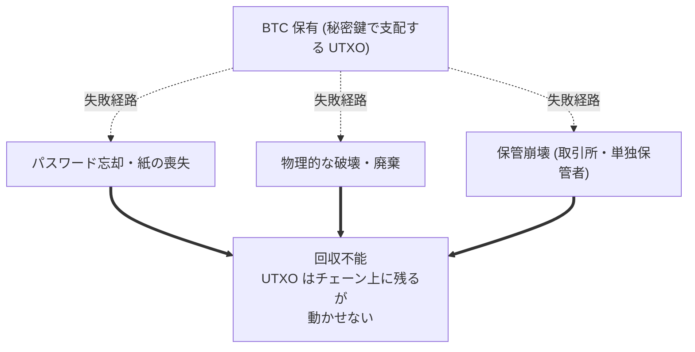

ビットコインのプロトコルには復旧の仕組みがない。 サポート窓口もなければ、 裁判所命令もマスター鍵も中央機関もなく、 秘密鍵が破壊された / 失われた / そもそも移転可能な形で存在したことがない UTXO を再発行できる主体は存在しない。 これは欠陥ではなく、 ホワイトペーパーの「信頼された第三者の排除」 から直接導かれる意図的な設計判断である。 その判断のコストは、 人間側の損失 ― 不注意、 敵対的環境、 詐欺 ― がそのまま恒久化することにある。

本エントリは、 失われたビットコインを巡る公的言論で繰り返し参照される「象徴的」 損失事例を、 年代順や金額順ではなく **機構別** に横断整理する。 主要メディアのまとめ記事はしばしば機構の違う事例を一緒に並べてしまい、 根底の構造を見えにくくする ― この整理はそれを編集側で解きほぐすことを目的とする。

## 3 つの損失機構

3 機構は失敗の所在 (利用者本人 / 物理世界 / 仲介者) は異なるが、 チェーン側から見れば同一である ― 当該 UTXO はそのまま、 周辺の取引ルールも変わらず、 当該コインは無期限の将来まで流通から外れる。

### 1. パスワード忘却

最も意識的に自分で起こす損失モード。 利用者は秘密鍵を保有しているが、 鍵を格納するデバイスを解錠・復号するための秘密 (パスワード) を提供できない。

| 事案 | 年 | 数量 | 機構 |
|---|---|---|---|
| [ステファン・トーマス IronKey ロックアウト](/BitcoinArchive/ja/entries/aftermath/2021-01-12-stefan-thomas-7002-btc-ironkey-lockout/) | 2011 年〜 | 7,002 BTC | IronKey USB ドライブ (10 回ミスで自動消去)、 紙に記したパスワードを紛失、 2021 年 NYT 報道時点で 10 回中 8 回失敗済 |

トーマスの件は本機構の代表例。 BIP39 シードフレーズ忘却、 紙ウォレット紛失、 復号できないバックアップ等の派生事例は個別の知名度はトーマスより低いが、 数の総和としては Chainalysis 等の長期休眠供給量推計の最大シェアを占める。

### 2. 物理的な破壊・廃棄

鍵が物理メディア上に存在していたが、 そのメディアが失われたり、 破壊されたり、 物理的事情でアクセス不能になった事例。

| 事案 | 年 | 数量 | 機構 |
|---|---|---|---|
| [ジェームズ・ハウエルズのニューポート埋立 HDD](/BitcoinArchive/ja/entries/aftermath/2024-12-03-james-howells-7500-btc-newport-landfill/) | 2013 年〜 | 約 7,500 BTC | 自宅清掃で HDD を誤廃棄、 ニューポート市議会ドックスウェイ埋立地に。 12 年にわたる発掘許可請求と却下、 2025 年英高等法院も請求を退ける |

このカテゴリには火災・水害・ハードウェアウォレットの偶発的破壊による損失も含まれる。 ハウエルズ事案が異例によく記録されているのは、 廃棄が無意識でかつ場所が正確に判明しているという 2 点が揃っているため。

### 3. 保管崩壊

利用者が秘密鍵を直接持っていなかった事例。 仲介者 (取引所・カストディアン・単独鍵保管者) に預けていたが、 仲介者側が鍵を失う / 破壊する / 不正流用する / その他の理由で資産を渡さなくなった。

| 事案 | 年 | 数量 | 失敗モード |
|---|---|---|---|
| [Mt. Gox 倒産](/BitcoinArchive/ja/entries/aftermath/2014-02-28-mt-gox-bankruptcy/) | 2014 年 | 約 85 万 BTC (後に約 65 万 BTC へ修正) | 長期のトランザクション順応性悪用による窃盗 + 運用上の管理失敗、 2024 年に債権者への部分返済が開始 (10 年後) |
| [QuadrigaCX 崩壊 / コットン死去](/BitcoinArchive/ja/entries/aftermath/2019-04-08-quadrigacx-gerald-cotten-death/) | 2018-19 年 | 約 2.5 億カナダドル | 単独保管者の CEO が死去、 後に OSC が「長期にわたる詐欺」 と認定、 債権者回収は約 13% |
| [FTX 倒産](/BitcoinArchive/ja/entries/aftermath/2022-11-11-ftx-collapse/) | 2022 年 | 顧客資金約 80 億ドル | 創業者サム・バンクマン=フリードによる大規模不正流用、 25 年の禁固刑、 部分回収が進行中 |

保管崩壊は上流の故障原因に最もばらつきがある損失モード ― 純粋な運用失敗 (Mt. Gox の一部)、 保管に偽装した個人詐欺 (QuadrigaCX、 FTX)、 外部からの保管者への盗難 (Mt. Gox の一部)。 上流原因が多様でも、 チェーン側の結末は同じ ― コインが顧客の支配下から動かされ、 顧客は取り戻せない。

## 対照事例: 回収できた損失

保管崩壊が必ず恒久化するわけではない。 象徴的損失史で最も目立つ対照例が [2016 年 Bitfinex ハック](/BitcoinArchive/ja/entries/aftermath/2022-02-08-bitfinex-hack-morgan-lichtenstein-arrest/)である。 119,756 BTC が盗まれ、 2022 年のリヒテンシュタイン・モーガン夫妻逮捕・起訴を経て 94,000 BTC が最終的に回収された。 構造的に重要なのは、 回収が成立した理由がビットコインプロトコルの提供によるものではなく、 オンチェーンフォレンジクスに、 オフチェーンの保管者 (洗浄犯の口座を保有する他の取引所) への召喚状とマスター鍵リストを保管したクラウドストレージへの捜索差し押さえを組み合わせた結果である、 という点。 プロトコルの不可逆性が破られたわけではなく、 攻撃者側のオフチェーンの運用ミスが衝かれた。

## 不可逆性の教訓

ビットコインの設計議論で繰り返される論点 ― [ビットコインのウォレット設計分析](/BitcoinArchive/ja/entries/design/2009-01-03-bitcoin-wallet-design/)や[ビットコインの安全保障モデル概観](/BitcoinArchive/ja/entries/design/2009-01-03-bitcoin-security-model/)で最も明示的に語られる論点 ― は、 「不可逆性はビットコインを検閲耐性のあるものにする性質と同じ性質であり、 失われたコインを失われたものにする性質と同じ性質である」 ということだ。 トレードオフは意図して結ばれている。 上に並べた事案は、 システムの不具合ではない。 設計どおりに動いているシステムが、 パスワードを忘れる人・HDD を捨てる人・不正な仲介者に資産を預けた人という、 避けられない部分集合に適用された結果である。

## 目録の範囲と将来の追加

上に挙げたのは、 最も頻繁に引用される象徴的事例。 ビットコインの記録された損失全体はもっと広く、 初期のフォーラム損失報告 (2010 年 8 月の [BitcoinTalk topic-782 スレッド「Lost large number of bitcoins」](/BitcoinArchive/ja/entries/forum/bitcointalk/topic-782/2010-08-11-re-lost-large-number-of-bitcoins/) は代表的な初期事例) や、 メール往復レベルの損失報告 (Liberty Standard の [2009 年 11 月の失われたコイン群](/BitcoinArchive/ja/entries/correspondence/liberty-standard/2009-11-10-lost-six-sets-of-coins/)など) も含まれる。 本横断ページは、 新しい事案が公的記録に入るたびに ― 新たなハードウェアウォレット失敗、 新たな保管者崩壊、 既存の長期忘却事案の再発見など ― 個別エントリを `aftermath/` に新規追加し、 上記の機構別表に 1 行追加するだけで拡張できる設計にしてある。 骨格 (3 機構分類と不可逆性原理) は安定、 事案リストだけが伸びていく。
