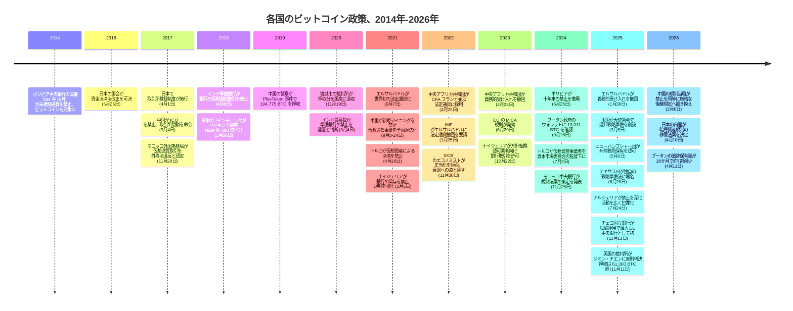

2013 年以降、30 あまりの政府がビットコインについて公式の立場を取ってきた。そのほぼ全てが、少なくとも一度は自らの方針を覆している。全国的な禁止が解除された例がある。法定通貨化の義務づけが撤回された例が、二つの国で起きている。数年にわたる黙認のあとにマイニング禁止へ転じた例もある。この記事が追う中で一度も方針を覆さなかったのは二つだけ、日本と EU である。理由は同じだ。どちらもそもそも一度もビットコインを禁止したことがない。

そして、ビットコインを最も厳しく禁止した政府ほど、いま国家に帰属するとされる残高としては世界でも指折りの規模のビットコインを抱えているのは、買ったからではなく、押収したからだ。

## 1. 転換した国々

転換にはいくつかの型がある。全面禁止がそのまま解除された例（ボリビア）。禁止を一段と強めたうえで解除した例（ナイジェリア）。中央銀行の禁止を議会ではなく裁判所が違憲と判断した例（インド）。法定通貨化の義務を外圧で撤回した例（エルサルバドル、中央アフリカ共和国）。連邦政府自身が、没収資産を事件ごとに売却する慣行から一転して、保有方針を宣言した例（米国）。逆方向の転換もある。それまで黙認されていた活動を一転して禁止した例（中国。この禁止を §6 で見るとおり、2026年には同等の厳格さを保ったまま後継の通達に正式に置き換えられることになる）。それぞれに固有の転換前と転換後の日付がある。

| 国・地域 | 転換前 | 転換後 | 転換の時期 |
|---|---|---|---|
| [中国](/BitcoinArchive/ja/entries/aftermath/2021-09-03-china-crypto-mining-ban/) | マイニングは黙認（国内取引所は 2017 年からすでに禁止） | 新規マイニングを禁止し、中国居住者向けの海外取引所を含む仮想通貨事業全体を違法と宣言 | 2021 年 9 月 |
| ボリビア | 全面禁止（決議 044 号、2014 年） | 規制付きの購入・売却を認可（決議 082 号） | 2024 年 6 月 25 日 |
| ナイジェリア | 銀行の仮想通貨関与を禁止（2017 年）、決済関与も禁止（2021 年） | 認可業者向けの銀行取引を許可 | 2023 年 12 月 22 日 |
| インド | 準備銀行が銀行に仮想通貨取引の停止を指示（2018 年） | 最高裁が同通達を違憲と判断（2020 年）。2022 年には仮想デジタル資産に 30% の一律課税を導入 | 2020 年 3 月 4 日 |
| [エルサルバドル](/BitcoinArchive/ja/entries/aftermath/2021-09-07-el-salvador-bitcoin-law/) | ビットコインを法定通貨に義務化（2021 年） | 義務的受け入れを[撤回](/BitcoinArchive/ja/entries/aftermath/2025-01-30-el-salvador-bitcoin-law-reform/) | 2025 年 1 月 30 日 |
| 中央アフリカ共和国 | CFA フランと並ぶ法定通貨に採用（2022 年） | 義務的受け入れを終了、参考仮想通貨に格下げ | 2023 年 3 月 23 日 |
| [米国](/BitcoinArchive/ja/entries/aftermath/2025-03-06-us-strategic-bitcoin-reserve/) | 没収したビットコインを事件ごとに売却、統一された保有方針なし | 大統領令 14233 号が連邦戦略ビットコイン準備を宣言、財務省に売却しないよう指示 | 2025 年 3 月 6 日 |

転換はここでは常態だが、普遍ではない。バングラデシュ中央銀行は 2017 年 12 月に仮想通貨取引を認可していないと通達し、2022 年 9 月の改訂ガイドラインでも同じ立場を繰り返した。エジプトの大法官（グランド・ムフティ）は 2017 年末のファトワで商業目的の仮想通貨利用を禁じ、翌月には中央銀行がビットコインは法定通貨でないと改めて確認、以後どちらの立場も動いていない。アルジェリアは 2025 年 7 月、2018 年の禁止をさらに深め、対象となる仮想通貨活動の範囲を広げる新法を制定した。トルコは 2021 年 4 月に仮想資産による決済を禁止し、2024 年 7 月に仮想資産事業者を資本市場委員会の許認可下に置いた後もその禁止自体は残ったままだ。規制は禁止の周りに置かれただけで、禁止に取って代わったわけではない。

モロッコはこの二群の中間にある。中央銀行総裁は 2024 年 11 月、2017 年の当初判断から 8 年を経て、仮想資産を禁止ではなく規制する法案の草案を発表したが、2026 年半ば時点でこの草案はまだ法律になっていない。政府が転換を発表することと、実際に転換することは別の話だ。

上の表に一度も現れない政府が二つある。日本と EU はそもそもビットコインを禁止したことがなく、したがって撤回すべき転換の記録もない。理由は §4 で扱う。

## 2. 禁止と没収 — 最大級の国家保有はこうして生まれた

最も広範な禁止を敷いた国が、同時に国家帰属の残高としては世界最大級とされるビットコインを抱える国でもある。中国の警察は 2019 年、PlusToken というポンジ・スキームの運営者から 194,775 BTC を押収した。塩城市の裁判所は 2020 年 11 月 19 日、このビットコインを国庫に没収する判決を下した。同じ政府が仮想通貨事業全体を違法と宣言する 9 か月前のことだ。コインが国家の手元に残ったのは、北京がビットコインを保有する価値があると判断したからではない。詐欺事件の証拠として押収され、資産をすでに違法と宣言した政府には、それを国内市場で売る先がないからだ。[ビットコインの保有地図](/BitcoinArchive/ja/entries/analysis/2026-07-09-bitcoin-ownership-map/)は、この残高と、他のすべての政府の残高が今どこにあるかを追跡している。

同じ主権の下にある一つの通達が、正反対の線を引く。香港証券先物委員会は 2018 年 11 月、仮想資産取引プラットフォームの最初の構想枠組み（サンドボックス）を公表し、本土の禁止がすでに施行されていた 2022 年 10 月には自らを仮想資産に「開かれた、包摂的な」立場だと宣言、2023 年半ばには二重免許制度を発効させ、2025 年 8 月にはステーブルコイン条例を施行した。2026 年 2 月、北京の規制当局が本土の禁止を同等に厳格な後継の通達に置き換えたその同じ年に、香港は独自のステーブルコイン計画を変わらず推し進めた。一つの主権のもとで、二つの方向が同じ年に並んでいる。

購入ではなく押収によって築かれた大規模な保有を持つ政府がほかに二つあり、それぞれコインが手元に来たあとの処分方針は異なる。

| 国・地域 | 保有の由来 | 政府の処分方針 | 時期 |
|---|---|---|---|
| [中国](/BitcoinArchive/ja/entries/analysis/2026-07-09-bitcoin-ownership-map/) | PlusToken ポンジ・スキームの没収（194,775 BTC） | 国庫への没収が命じられたが、その後の保管状況は非公開、仮想通貨事業は依然として違法のまま | 2020 年 11 月 19 日 |
| [米国](/BitcoinArchive/ja/entries/aftermath/2025-03-06-us-strategic-bitcoin-reserve/) | シルクロード、Bitfinex ハック、Prince Group 事件、それぞれ別個に十年がかりで没収 | 大統領令 14233 号が連邦戦略ビットコイン準備を宣言、財務省に売却しないよう指示 | 2025 年 3 月 6 日 |
| 英国 | 刑事没収、ジミン・チエン詐欺事件 | 準備方針なし、政府自身の立場はビットコインを準備資産として保有しないというもの | 2025 年 5 月 |

米国側の三件は単一の出来事ではない。シルクロードの没収、2016 年の Bitfinex ハックからの回収、そして 2025 年の Prince Group 事件は、それぞれ数年ずつ隔てた別個の経緯で連邦の管理下に入り、大統領令 14233 号がその累積総量を一つの恒久方針にまとめたのはそのあとのことだ。[事件ごとの詳しい経緯](/BitcoinArchive/ja/entries/aftermath/2025-03-06-us-strategic-bitcoin-reserve/)は各事件を順にたどっている。この表に並ぶ三つの政府に共通する形はこうだ。いずれも、いま保有している資産を自ら買おうと決めたわけではない。

英国の事案は、三件のうち単独最大の押収を生んだ。ロンドン警察は 2018 年 11 月 1 日、容疑者の名前すら特定される前に、4,741.36 BTC の入ったノートパソコンを回収した。ジミン・チエンは 2024 年 4 月、6,200 万ポンド超相当のウォレットとともに逮捕され、英国の裁判所が 2025 年 11 月に彼女へ 11 年 8 か月の実刑を言い渡すころには、事件全体を通じた押収量は 61,000 BTC を超えていた。世界でも指折りの規模の仮想通貨没収でありながら、その同じ年に表明された英国自身の準備資産方針は、ビットコインの保有をおよそ想定していない。

## 3. 二つの法定通貨化実験、二つの撤回

ビットコインを法定通貨にした政府はこれまでに二つしかない。どちらも、義務化した部分をすでに撤回している。

| | エルサルバドル | 中央アフリカ共和国 |
|---|---|---|
| 法定通貨化 | 2021 年 9 月 — 世界初 | 2022 年 4 月 22 日 — 法 22.004 号、世界で 2 番目 |
| 外部からの圧力 | IMF が法定通貨の地位撤回を要請（2022 年 1 月 25 日） | IMF が法的・透明性・経済上のリスクを警告（2022 年 5 月 4 日） |
| 撤回 | 議会が義務的受け入れを撤回（2025 年 1 月 30 日） | 義務的受け入れを終了、参考仮想通貨に格下げ（2023 年 3 月 23 日、全会一致） |

エルサルバドルの撤回は、自国の帳簿には及ばなかった。IMF 融資の条件に保有量ゼロという縛りがあったにもかかわらず、[エルサルバドルのビットコイン準備](/BitcoinArchive/ja/entries/aftermath/2025-01-30-el-salvador-bitcoin-law-reform/)は 2026 年 7 月 25 日時点でおよそ 7,723 BTC のままだった。レジでビットコインを受け取る義務はなくなった。国自身が持つビットコインはなくなっていない。

## 4. 一度も転換しなかった二つの国・地域

上の二つの表のどちらにも現れない政府が二つある。転換すべきものが何もないからだ。日本は 2016 年以来、暗号資産の規制を一方向にだけ強めてきた。EU は、そもそも撤回すべき禁止を課したことがないまま、包括的な枠組みを築いた。出発点が正反対のまま、同じ「転換なし」にたどり着いている。ただし、後述するドイツの事例はこれとは異なる。ドイツの寛容な税制上の扱いは禁止にまで至ったことはないが、いま自らの転換圧力にさらされている。

[日本の資金決済法改正](/BitcoinArchive/ja/entries/aftermath/2017-04-01-japan-payment-services-act-amendment/)は 2016 年 5 月 25 日に国会を通過し、翌年 4 月 1 日に施行され、取引所の登録を義務づける制度を作った。以後の一歩一歩はすべて規制を積み増す方向で、後退はない。2018 年 1 月 26 日のコインチェック・ハッキング（NEM 約 580 億円分）の翌年、呼称は「仮想通貨」から「暗号資産」へ改められ（2019 年 5 月 31 日）、2022 年 6 月 3 日には電子決済手段としてのステーブルコイン区分が新設された。この区分の下で、JPYC が日本初の免許を受けた円建てステーブルコイン発行者として登録されたのが 2025 年 8 月 18 日。2026 年 4 月 10 日、内閣は暗号資産規制を資金決済法から金融商品取引法へ移す法案を閣議決定した。10 年目に入った規制強化の流れをさらに延ばすものであり、依然として撤回すべき禁止は存在しない。

EU は正反対の道筋で同じ場所にたどり着いた。暗号資産市場規則（MiCA）は 2023 年 6 月 9 日に官報に公示され、6 月 29 日に発効、2024 年末までに全面適用に至った。撤回すべき先行の禁止なしに作られた、単一の包括法だ。MiCA 自身の前文 22 項は、ビットコインのような発行体を持たない暗号資産を、発行体向けの義務から除外している。これにより、ビットコインそのものは、この法律が実際に統治する範囲のすぐ外側に置かれることになる。禁止が示したはずの懐疑は、法文ではなく論評の形で現れている。欧州中央銀行自身のウルリッヒ・ビンドザイルとユルゲン・シャーフは 2022 年 11 月 30 日のブログで、ビットコインは決済手段としても投資対象としても適さず、規制によって「正当化すべきではない」と論じた。この懐疑はフランクフルトだけのものではない。国際決済銀行（BIS）のアグスティン・カルステンスは 2021 年 1 月、ビットコインは「どちらかといえば投機的資産だ」と述べ、BIS の 2022 年版年次経済報告書は、暗号資産には安定した名目上の錨がないと結論づけている。

| | 日本 | EU |
|---|---|---|
| 各歩みの引き金 | 取引所の破綻やハッキング — Mt. Gox、次いでコインチェック | 単一の引き金なし。事前に策定された一つの包括法 |
| 制度の形 | 改定のたびに新たな免許区分を加える登録制度 | 発行体を持たない資産への明示的な除外規定を伴う単一規則 |
| 方向性 | 2016 年以来の連続した強化、同じ法律を繰り返し改正 | 2023 年施行の単一の法律、以後の改正なし |
| ビットコイン自体の位置づけ | 2019 年以来、暗号資産として規制、禁止されたことはない | 発行体向け義務から除外、ECB 自身のエコノミストは正当化すべきでないと主張 |

日本が強化を重ねるのは、取引所の破綻、ハッキング、ルールブックを必要とするステーブルコインの登場など、何かが壊れるたびだ。そのたびの手当てが、禁止に手を伸ばすことなく制度をさらに狭めていく。EU は一気に自らのルールブックを書き上げ、そのルールブックが最も説明しづらかった唯一の資産に、そのための除外規定を書き加えた。どちらの政府にも撤回すべきものはなく、そこに至った理由も同じではない。

## 5. 2025 年 — 準備資産化への転換

2025 年、方向はもう一度変わった。ビットコインを禁止する、あるいはその周りを規制するのではなく、一群の政府がそれを保有すべきかどうかを問い始めた。

| 国・州 | 動き | 時期 | 結果 |
|---|---|---|---|
| ニューハンプシャー州 | HB 302 に署名、州財務局に上限 5% までのビットコイン投資を認可 — 米国州法として初 | 2025 年 5 月 6 日 | 成立。ただし 1 億ドル規模のビットコイン担保地方債は行政評議会が 3 対 2 で後日否決（2026 年 7 月 8 日） |
| テキサス州 | SB 21、テキサス戦略ビットコイン準備法に署名 | 2025 年 6 月 20 日 | 成立。初回購入を実施、IBIT（ブラックロックの上場投資信託）で 500 万ドル（2025 年 11 月 20 日） |
| アリゾナ州 | SB 1025（全面的な準備法案）を、退職基金にとって「実績のない」資産だとして拒否 | 2025 年 5 月 2 日 | 拒否 |
| アリゾナ州 | HB 2749、新たな納税者負担なしに未請求・放棄済みデジタル資産の保有を認可 | 2025 年 5 月 7 日 | 署名 |
| アリゾナ州 | HB 2324、裁判所没収資産を準備基金へ組み入れる法案 | 2025 年 7 月 1 日 | 拒否。法執行機関の意欲を削ぐとの理由 |
| モンタナ州 | HB 429、ビットコイン準備法案 | 2025 年 2 月 22 日 | 下院が 59 対 41 で否決 |
| ワイオミング州 | HB 201 | 2025 年 2 月 10 日 | 委員会採決 1 対 7 で本会議に至らず廃案 |
| ノースダコタ州 | HB 1184、準備の調査・承認法案 | 2025 年 | 下院が 57 対 32 で否決 |
| ユタ州 | 上院がビットコイン準備条項を削った HB 230 修正案に知事が署名 | 2025 年 3 月 25 日 | 準備条項なしで成立 |
| ペンシルベニア州 | HB 2664、州財務局に上限 10% までの投資を認可 | 2024 年 11 月 19 日提出 | 未成立 |
| チェコ | 中央銀行 CNB がビットコインを含む 100 万ドルの試験ポートフォリオを承認、その後開始 | 2025 年 10 月 30 日 / 11 月 13 日 | EU の中央銀行として初めて直接ビットコインを保有 |
| ブータン | 国家マイニング由来の保有、大半を売却 | 2019 ~ 2026 年 | 2024 年 9 月に 13,011 BTC でピーク、2026 年 4 月に 3,954 BTC まで減少 |

ニューハンプシャー州自身の議会が、一つの州の中にある振れ幅を示している。財務局が権限を得たのは 2025 年 5 月、その 14 か月後には行政評議会が 1 億ドル規模のビットコイン担保地方債を 3 対 2 で否決した。ビットコイン法を成立させることと、ビットコイン担保の債券を発行することは別々の採決だったということだ。アリゾナ州は、単一州として最も幅の広い振れ方をした。5 月に全面的な戦略準備法案を拒否し、数日後には新たな納税者負担のない未請求デジタル資産の受け入れ法案に署名、7 月には法執行機関の没収資産を準備基金に回す第 3 の法案を再び拒否した。一つの議会が、棚ぼたの資産には「はい」と答え、能動的な投資に近いものには二度「いいえ」と答えた。

チェコ国立銀行の試験ポートフォリオは、同じ中央銀行という制度の身内と緊張関係にある。CNB 政策委員会は 2025 年 10 月 30 日、ビットコインを含む 100 万ドル規模のデジタル資産試験ポートフォリオを承認し、二週間後に開始した。EU 域内の中央銀行として初めて直接ビットコインを保有した事例であり、ECB 自身のエコノミストがビットコインは正当化すべきでない、衰退への道にあると論じてからわずか 3 年後のことだ。

ブータンの保有量は 2025 年の転換より前から積み上がり、いまはその流れに逆行して動いている。国家投資機関の Druk Holding and Investments（DHI）は 2019 年、自国の水力発電を使ってビットコインのマイニングを始め、2023 年には Bitdeer とのマイニング提携を拡大した。2024 年 9 月 16 日までに、追跡対象のウォレットは 13,011 BTC を保有していた。これまでに確認された国家保有としては 4 番目の規模である。その 18 か月後、およそ 7 割が消えていた。2026 年 4 月 11 日時点で 3,954 BTC まで減少している。準備法を一本も通さずに世界有数の国家ビットコイン保有を築き、そのほとんどを同じように静かに売ることもできる。政府にはそれができる。

## 6. 本稿の限界

- **これは生きた政策領域である。** 本稿が記録するすべての状況は、公開後にも再び変わりうる。中国の 2026 年 2 月の通達は、2021 年の通達という特定の文書を正式に廃止し、同じ一手で同等に厳格な後継の通達に置き換えた。本稿が確定済みとして数える事例でさえ、実質を変えずに形だけ変わることがあるという証拠だ。
- **「大半」は「すべて」ではない。** バングラデシュ、エジプト、アルジェリア、そしてトルコの決済禁止は、本稿の起点日時点で転換の記録がない政府だ。モロッコの草案は表明された意図であって、まだ成立した法律ではない。
- **規制緩和の側にも、それ自体への揺り戻し圧力がある。** ドイツは一度もビットコインを禁止していない。2013 年の政府答弁は、ゼロから免許制度を作る代わりに、ビットコインを「経済財（Wirtschaftsgut）」と分類した。だが 2023 年の連邦財政裁判所判決が 1 年超の保有後の売却益を非課税としたのに対し、2025 年 11 月には社会民主党（SPD）会派がその非課税措置の撤廃を提案しており、本稿執筆時点で決着していない。
- **一つの事件の内部でさえ、数字が確定していない場合がある。** 中国が没収した PlusToken のビットコインがその後どう扱われたかは、これまで一度も公に説明されていない。本稿は 2020 年の没収判決自体が述べる内容だけを記す。
- **本アーカイブの記録は、一時点の写しである。** 基準日は 2026 年 7 月 28 日。上に挙げたすべての BTC 数量・採決結果・法的状況は、そのために日付を添えてある。どれも積算ではなく、その日その日の写しとして扱ってほしい。

## ビットコインにとっての意義

上のどの転換・没収・準備宣言も、ビットコインそのものが従う規則を一つも変えていない。政府は取引所を違法にでき、名指しした個人を訴追でき、裁判所がその人物と結びつけた特定のコインを没収できる。だが、それはすべて、ある人物や機関が国家の手の届く鍵を保有し、裁判所がその引き渡しを命じられるという層の上で起きていることだ。それは[ビットコインの保有地図](/BitcoinArchive/ja/entries/analysis/2026-07-09-bitcoin-ownership-map/)が、押収されたものも含め、残高を名指しの保有者へたどることで追跡しているのと同じ層である。2,100 万枚という上限も、発行スケジュールも、ノードがブロックを検証する規則も、そのどれ一つとして、この 30 か国近い政府のいずれにも許可を求めなかった。ボリビアが 2014 年にビットコインを禁止し 2024 年に禁止を解いたときも、エルサルバドルが法律に「無制限の法定通貨」と書き込み、後にその文言を消したときも、塩城市の裁判所が 194,775 BTC を国庫に没収し、その国庫がそれをどう扱ったかをいまだに一度も説明していないときも、何も動かなかった。

[使われることと持たれることの間にある、ビットコイン自身の緊張](/BitcoinArchive/ja/entries/analysis/2008-10-31-bitcoin-electronic-cash-vs-digital-gold/)は設計の問いだ。政府がそれを保有してよいか、禁じてよいか、他者から没収してよいかは政策の問いであり、30 通りの答えが出され、そのほとんどが後に覆された。そして、その 30 の決定のどれの下でも、プロトコルは投票の行方にかかわらずブロックを生成し続けた。
