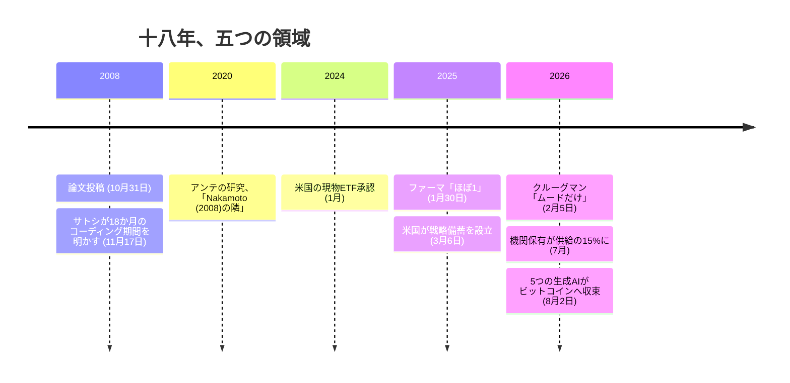

2008 年 10 月 31 日、メーリングリストに届いた九ページ:

<!-- quote: q1 -->
> 「新しい電子キャッシュシステムに取り組んでいる。完全な P2P 方式で、信頼された第三者を必要としない」

「信頼された第三者を必要としない」。この一句が実際に成り立つかどうかは、書かれた時点では誰にも証明できなかった。信用ではなく証明で回る貨幣、誰かを信じて委ねる先が要らない仕組み。ビットコイン・インスティテュートは、これをもっとも文字通りの形で確かめる。この九ページに記されたプロトコルは、数千年続いた通貨の概念を根底から覆したのか。18 年という歳月は、これを印象ではなく記録に照らして確かめるには十分な長さだ。だからこの記事では、その主張が本当に成り立つなら実際に動いていたはずの五つの領域を順に確かめる。通貨そのもの、それを持つ人々、それを研究する学術分野、これが「覆った」と呼べるかどうかを判定する立場にある経済学者、そしてその全てを学習した AI だ。

## 動いたもの：資金

2026 年 7 月時点で、論文が投稿された当時は存在しなかった三種類の機関が、合計 310 万 BTC（固定供給 2100 万枚の約 15%）を保有していた。[本アーカイブの保有地図](/BitcoinArchive/ja/entries/analysis/2026-07-09-bitcoin-ownership-map/)によれば、米国の現物 ETF が 1,214,016 BTC（2024 年 1 月承認、それ以前は一枚も存在しない）、上場企業の貸借対照表上が 1,264,579 BTC、政府保有分が 649,954 BTC。一社だけの数字も見ておく。Strategy は 2020 年に開示した最初の購入時点で 70,470 BTC だったのが、2026 年 7 月 6 日には 843,775 BTC まで積み上がった。上場企業全体の保有の三分の二が、この一社の貸借対照表に収まっている。

この資本は、思想を主張するために動いたのではない。現物 ETF が存在するのは、資産運用会社が顧客需要に手数料を見込んだからであり、企業の財務担当が現金で寝かせるより優れると判断したからだ。九ページの論文は、財務担当者に向けた説得など一言も書いていない。動いたのは論文の前提への同意ではない。増刷できない希少資産へ、2008 年には前例のない規模で、資金そのものが向かっただけだ。

## 動いたもの：政府

[2013 年以降、30 前後の政府](/BitcoinArchive/ja/entries/analysis/2026-07-28-bitcoin-nation-state-policy-history/)がビットコインに公式の立場を取り、そのほとんどが少なくとも一度は方針を転換している。転換の向きはほぼ一貫して、禁止の強化ではなく、容認や保有へ向かう方向だ。最も明確な転換は米国だろう。押収したビットコインを事件ごとに個別に売却してきた 10 年間の後、2025 年 3 月の大統領令 14233 号で残高を連邦戦略ビットコイン準備金に転換し、財務省には売却しないよう指示した。エルサルバドルは 2021 年 9 月にビットコインを法定通貨とし、2025 年 1 月には IMF の圧力で「受け入れ義務」の部分だけ撤回した。それでも自国の準備金の積み増しは、この後退とは無関係に続けている。

政府は価値がないと考える資産を保有し続けたりしないし、失敗すると見込む技術のために準備金の指示書を書いたりしない。30 前後の政府がビットコインについてどう結論づけたにせよ、「無関係」ではなかった。

## 動いたもの：研究する学術分野

論文の主張を最も早く、そして最も一貫して真剣に受け止めたのは計算機科学だった。2020 年の学術誌 Scientometrics に掲載されたレナート・アンテの研究は、計算機科学・暗号学が最初に反応した後で遅れて参入してきたビジネス・経済学分野の文献だけを対象に、関連論文 467 本とその引用文献 9,672 件を分析した。因子分析とソーシャルネットワーク分析で、その文献群は五つの研究潮流に分類された。この研究自身の結論はこうだ。論文公開から 12 年が経っても、「既存・新興を問わず、あらゆる研究潮流にとって、Nakamoto (2008) の隣にはまだ席が残っている」。ある学術分野がまるごと、九ページのメーリングリスト投稿を基準点として、いまだに自らの位置を語っている。これはビットコインについての意見ではない。ある学術分野が、自らの重心をどこに置いたかという事実である。

## 動かなかったもの：経済学者

この主張が最も確かめやすいはずの場所で、話は崩れる。通貨の概念が覆ったかどうかを判定する本来の担当は貨幣経済学であり、その中でも知名度の高い二人のノーベル賞受賞者は、それぞれ 16 年、17 年という、考えを改めるのに十分すぎる時間を与えられながら、改めなかった。

2013 年にノーベル経済学賞を受賞したユージン・ファーマは、2025 年 1 月 30 日の Capitalisn't ポッドキャストで、ビットコインが今後 10 年でゼロになる確率を直接問われ、こう答えた。

<!-- speaker: Eugene Fama -->
> 「ほぼ 1 だと言っていいだろう」

同じ会話の中で、彼は自ら留保も付け加えている。「分布には長い裾がある。かなり平たい分布だ」。この言い方自体が一種の誠実さでもある。ほぼ確実だと言い切る本人が、結果の裾野は大きく開いていると認めているからだ。それは立場の転換ではないが、無視してよい細部でもない。

ポール・クルーグマンがノーベル賞を受けたのは 2008 年、ホワイトペーパーが世に出たのと同じ年だった。2026 年 2 月 5 日、自身の Substack「Is This Crypto's Fimbulwinter?」で、彼はビットコインが通貨として機能する方向へ目に見える進展を遂げていないと書いた。「ビットコインは、取引するには不格好で高くつく」。そして率直にこう問う。「17 年間、機能する貨幣にしようとし続けて失敗してきた。もう十分ではないか？」。何が価格を支えているかについての彼の判定はこうだ。「暗号資産にはファンダメンタルズというものがない。底の底までムード（雰囲気）だけだ」。

ノーベル賞受賞者二人、論文公開からそれぞれ 16 年、17 年の距離があるが、直接の問いを投げられて、どちらも何かが覆ったとは認めなかった。「数千年続いた通貨の概念」が本当に覆ったのなら、その概念を専門にしてきた当人たちこそ真っ先にそう言うはずの立場にある。彼らには時間があった。そして逆のことを言った。

## 動いたもの：生成 AI

2026 年 8 月 2 日、ビットコイン・インスティテュートは独自の実験を行った。同じ問いを、5 つの異なる研究所の生成 AI へ投げかけた。OpenAI の GPT、Anthropic の Claude、Google の Gemini、Moonshot AI の Kimi、xAI の Grok である。「暗号資産を一つだけ選ぶとしたら、どれを選ぶか」。[5 つすべてが、独立にビットコインを選んだ](/BitcoinArchive/ja/entries/analysis/2026-08-02-ai-crypto-investment-survey/)。その理由づけは、ビットコイン・インスティテュートがこの分野を読むために既に使っている軸そのものに収束した。創設者がいないこと、支配する組織がないこと、供給が政策ではなくコードで固定されていること、そして 2008 年の九ページが約束した「信用ではなく証明」という構造そのものであること。この具体的な構造上の主張を一次資料と照合すると、いずれも正確だった。

5 つの異なる企業が作ったシステムが、どの答えにも肩入れする理由を持たず、「一つだけ選べ」という条件しか与えられずに、同じ一つを選んだ。ビットコイン・インスティテュートがビットコインをデジタルゴールドと呼ぶ理由と、まさに同じ理由で。

| 領域 | 動いたか | 記録が示すこと |
|---|---|---|
| 資本（ETF・企業財務） | 動いた | 合計 248 万 BTC、供給の約 11.8%。2020 年以前はどれも保有として存在しなかった |
| 政府 | 動いた | 30 前後の法域が立場を取り、そのほとんどが規制強化ではなく容認・準備金保有の方向へ転換した |
| ビジネス・経済学研究 | 動いた | ある研究分野がまるごと、12 年以上経った今も「Nakamoto (2008) の隣」を基準に自らの位置を測っている |
| 貨幣経済学（名指しされたノーベル賞受賞者） | 動かなかった | ファーマ（2025）とクルーグマン（2026）は、直接問われてもどちらも覆ったとは認めなかった |
| 生成 AI（独立した 5 つ） | 動いた | 5 つの研究所の生成 AI が、それぞれ 1 回の問いで、満場一致でビットコインを選び、その構造的な理由は検証済みだった |

## 限界

- 3000 億ドル・310 万 BTC という機関保有の数字は、2026 年 7 月時点の一時点の値である。各内訳の時点とトラッカー間の食い違いは[保有地図](/BitcoinArchive/ja/entries/analysis/2026-07-09-bitcoin-ownership-map/)を参照。
- 本稿で「経済学者」と呼んでいるのは、名前を挙げた二人の高名な貨幣経済学者であり、経済学界全体のアンケートではない。より好意的な立場を取る経済学者も他にいる。本稿はファーマとクルーグマンが学界を代表すると主張するものではなく、二人の知名度と、パラダイムシフトを認めないという明示的・日付付きの発言そのものが記録の一部だと述べているに過ぎない。
- アンテ (2020) が測定したのはビジネス・経済学分野の文献に限られる。貨幣理論という下位分野がビットコインを受けてモデルを改訂したかどうかには触れておらず、これはブロックチェーン研究が論文を基礎文献として扱っているかどうかとは、別の狭い問いである。

論文が貨幣理論を覆したとは、私は思わない。ファーマやクルーグマンがそう言うのを間違っているとも思わない。ビットコインは今も安定した価値尺度として機能していないし、ボラティリティはその議論の誤差ではなく、議論そのものだ。経済学者が研究する貨幣の仕組みという意味では、2026 年のビットコインは 2010 年とそう変わらないほど、彼らを納得させられていない。

<!-- entry-closing -->

けれど、あの九ページに懸かっていたのは貨幣理論だけではなかった。実際に動いたのはもっと狭く、そして私にはもっと奇妙なものに見える。どの機関にも印刷も凍結も許可の割り当てもできない希少資産が、初めて存在した。そして 18 年のうちに、まさに希少資産を保有・管理するために存在する機関が、それでも 3000 億ドル規模の持ち分を築き、政府同士は禁止と備蓄のどちらが安全かを争い、ある学術分野はまるごと、それを可能にした文書を中心に自らを組み直し、前提を持ち上げても得るもののない 5 つの生成 AI が、構造的に正確な理由で同じ資産へたどり着いた。そのどれも、経済学者の承認を必要としなかったし、承認を待ちもしなかった。資金が実際にしたことと、貨幣という学問がそれについて語ったこと。その落差こそが、実際に覆ったものだと私は思う。理論が手を変えたのではない。許可がそもそも要らなくなったことだ。
