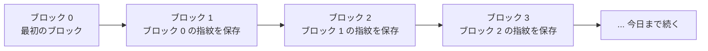

何千人もの見知らぬ人がそれぞれ自分の写しを持っている、共有の帳面を思い浮かべてほしい。それでも、書かれている内容について食い違いが長く続くことはない。原本を所有する特定の誰かはおらず、誰でもページの追加を提案でき、他の全員がそれを検証してから自分の写しに取り込む。この帳面こそが、ビットコインの実体だ。前のページでは、そのページに何が書かれるか、つまり手渡されるレシートを扱った。このページでは帳面そのもの、つまり誰がそれを管理し、写し同士が食い違わないようにしているものは何かを扱う。

## 何千という独立した写し

誰でも、ふつうのコンピューターでビットコインのソフトウェアを動かせる。それを動かしている各コンピューターを**ノード**と呼ぶ。ノードは中央のサーバーを経由せず、互いに直接やり取りし、聞きつけた新しい情報をそのまま隣へ伝えていく。人から人へ広まるうわさ話に近く、掲示板を介した告知とは違う。この、仲介者を挟まない直接方式のネットワークには名前がある。**ピアツーピア**、略して **P2P** だ。

<!-- visual: gossip-network -->

どのノードも、自分自身の写しを使って、新しいページが加わるたびに同じルールへ照らして独立に検証してから受け入れる。他のどのノードも信用する必要はない。それぞれが自分自身で検証しているからだ。

## こっそり書き換えられないページ

新しい取引は、帳面に 1 件ずつ書き込まれるわけではない。ある程度まとめて束にされ、その束を**ブロック**と呼ぶ。新しいブロックはおよそ 10 分に 1 回追加される。

では、誰かが 40 ページ目にこっそり戻って内容を書き換える、といったことは何が防いでいるのか。各ブロックには、ブロックの中身全体から計算される短い指紋、**ハッシュ**が付いている。ブロックの中身をたった 1 文字変えるだけで、指紋はまったく別物になる。中身を変えながら同じ指紋を保つ方法はなく、指紋から中身を逆算する方法もない。

<!-- visual: hash-fingerprint -->

ページ同士を実際に鎖状に結びつけているのはここからだ。どのブロックも、自分自身の中に*直前の*ブロックの指紋を保存している。古いページの何かを変えれば、そのページの指紋が変わる。すると、次のページが「このはずだ」と記録していた指紋と一致しなくなり、次のページも壊れる。そのまた次のページも同様で、今日まで全部が壊れる。ここでは歴史をこっそり書き換えることは単に難しいのではなく、書き換えれば即座に見える構造になっている。

その最初のページは、**[ジェネシスブロック](/BitcoinArchive/ja/entries/aftermath/2009-01-03-genesis-block/)と呼ばれる**。それより前には何もないので、通常のやり方で追加するのではなく、存在そのものを特別扱いして作らざるを得なかった唯一のブロックだ。それ以降のすべては、その上に途切れることなく鎖状に積み上げられてきた。**ブロックチェーン**という語はここから来ている。ブロックの鎖であり、1 つ 1 つが直前のブロックに固定されている。

こうして、どのノードも同じチェーンで一致することになる。ページ単位で検証され、あとからこっそり編集することはできない。まだ答えていない問いが 1 つ残っている。次のページを追加できるのは実際には誰で、なぜわざわざそんなことをするのか。[次のページ](/BitcoinArchive/ja/entries/analysis/2026-09-06-what-miners-are-actually-racing-to-do/)がその答えだ。
