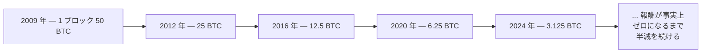

抽選会が成立するのは、誰にも事前に仕組めない形で当選者を決める方法があってこそだ。番号付きの玉を回転させてランダムに引くドラム式抽選器なら、誰も出る番号を細工できない。ビットコインには、まったく別の問いに対して、それと同じ役割を果たすものが必要だった。共有の帳面に次のページを追加したい人は大勢いるが、実際に追加できるのは誰なのか、という問いだ。

## ページを追加する権利を勝ち取る

ソフトウェアを動かしている人なら誰でも、次のブロックの追加に挑戦できる。この挑戦を**マイニング**と呼び、それを行うコンピューターを**マイナー**と呼ぶ。ただし、マイナーは好きなときにブロックを追加できるわけではない。まず一種のくじに勝たなければならない。

くじの仕組みはこうだ。候補ブロックに**ナンス**と呼ばれる数値を 1 つ付け、[前のページ](/BitcoinArchive/ja/entries/analysis/2026-09-06-how-transactions-become-a-shared-ledger/)で説明した指紋計算にそのブロック全体を通す。出てきた指紋が、たまたま十分な数のゼロで始まっていれば、そのナンスは当たりで、ブロックは有効になる。そうでなければナンスを変えて、また試す。指紋の出方はまったく予測できないので、当てずっぽうに勝る賢い手はない。唯一の戦略は、コンピューターが 1 秒間に何十億通りもの数字を試し続け、たまたま当たりが出るのを待つことだ。

<!-- visual: nonce-search -->

このしらみつぶしのくじ引きは**プルーフ・オブ・ワーク**、略して **PoW** と呼ばれる。何かを得るために、本物の、コストのかかる作業をやらせるという発想で、もとは 1997 年に[アダム・バックの Hashcash](/BitcoinArchive/ja/entries/aftermath/1997-03-28-adam-back-hashcash-announcement/) が、迷惑メールの送信コストを引き上げる手段として提案したものだ。ビットコインはこれをシステム全体の核として再利用している。現在いくつのゼロが必要かという**難易度**は、数週間ごとに自動調整される。世界中でどれだけの計算力がこのパズルに投入されようとも、当たりのブロックが平均でおよそ 10 分に 1 回見つかるように、難易度が締められたり緩められたりする。

## 新しいビットコインは実際どこから来るのか

このくじに勝つと、賞品が付いてくる。勝ったマイナーは、自分のブロックの先頭に特殊な項目を 1 つ入れる権利を得る。これが**コインベーストランザクション**で、誰かの既存のレシートを使うのではなく、何もないところから新しいレシートを作り出し、マイナー自身に支払う。この新たに作られる額を**ブロック報酬**と呼び、これこそが新しいビットコインがこの世に生まれる*唯一*の経路だ。それに加えて、マイナーはブロックに含めた通常のトランザクションに添えられた小額の手数料も受け取る。

この報酬は永遠に一定ではない。 2009 年 1 月に 1 ブロックあたり 50 BTC で始まり、およそ 4 年ごとにちょうど半分になる。このイベントを**半減期**と呼ぶ。

この縮小スケジュールを最後まで計算すると、将来発行される総量は 2,100 万 BTC にわずかに届かない額に収まる。それ以降、マイナーはトランザクション手数料だけを受け取ることになり、新規発行分はなくなる。

このくじに今日勝とうとすると、この 1 種類の計算だけを行うために作られた専用のコンピューター機材が、産業規模で必要になる。抽選のたとえ話が連想させるような、普段使いのノートパソコンではない。この変化やその他いくつかの変化が、ビットコインの日々の運用のいまの姿を、最初期のころの姿から隔てている。この比較を知りたい読者には、[対となる分析記事](/BitcoinArchive/ja/entries/analysis/2026-05-24-satoshi-design-vs-current-reality/)がその違いを整理している。

このくじに勝てばブロックは追加されるが、それも一瞬のことにすぎない。[次のページ](/BitcoinArchive/ja/entries/analysis/2026-09-06-what-happens-while-a-payment-is-unconfirmed/)では、送金がそのくじに届くまでの間に何が起きているか、そして本当に確定したと見なせるまでに何ブロック必要かを扱う。
