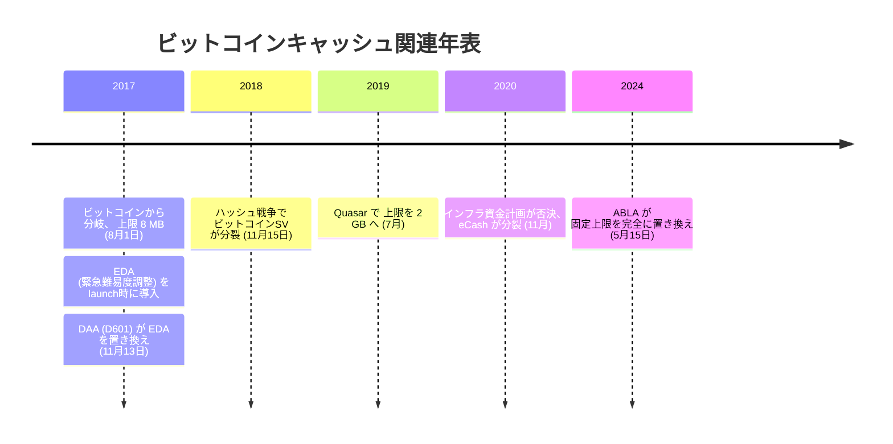

フォークの三日前の 2017 年 7 月 28 日、Bitcoin ABC のリード開発者[アモリー・セシェ](/BitcoinArchive/ja/participants/amaury-sechet/)は、取材にこう答えていた。

<!-- audit:quote-skip -->
> ビットコインには、広く使われる電子キャッシュになってほしい。日々の安い買い物にも、高額な支払いにも使われる暗号通貨に。

2017 年 8 月 1 日、彼のチームが書いたソフトウェアはブロック 478558 で 1 MB の上限を超えるブロックを受け入れ、[ビットコインの残高台帳と 2,100 万枚の上限をそのまま引き継いだ新しいチェーン](/BitcoinArchive/ja/entries/aftermath/2017-08-01-bitcoin-cash-fork/)を生んだ。ビットコインキャッシュ (BCH) と名付けられたこの鎖が変えたのは、供給表でも採掘規則でもない。誰がその規則を書き換えられるのか、という一点だった。

## 設計思想 — 「電子現金」を取り戻す

BCH を生んだソフトウェアの正式名は Bitcoin ABC、すなわち「Adjustable Blocksize Cap（調整可能なブロックサイズ上限）」の略である。名前そのものが立場を語っている。ビットコイン本体が Segregated Witness（SegWit）と Lightning ネットワークのようなオフチェーン層で取引容量を増やす道を選んだのに対し、セシェのチームはブロックサイズそのものを大きくする道を選んだ。セシェ自身はレイヤー 2 技術そのものを否定してはいない。その境界線を、彼はフォーク直前のインタビューで慎重に引いている。

<!-- audit:quote-skip -->
> レイヤー 2 技術そのものに反対しているわけではない。価値を加えることはできる。反対しているのは、ベースレイヤーを大きくしないことだ。

彼の異議は、高い手数料がビットコイン自身のホワイトペーパーの副題にある「電子現金」という半分の役割に何をもたらすかへ向いていた。

<!-- audit:quote-skip -->
> 特に二つ目の定義は、手数料が高いとうまく機能しない。5 ドルの買い物に 50 セントの手数料がかかるなら、それは大きな痛手だ。摩擦が大きすぎる。

フォーク時のブロックサイズ上限は、ビットコイン本体の 1 MB 上限の 8 倍にあたる 8 MB に設定された。セシェはこれを確定した数字ではなく、慎重な出発点として説明している。

<!-- audit:quote-skip -->
> 8 メガバイトあれば、上限に近づくまでの間に調整の仕組みを用意するのに十分な大きさだ。かといって、無制限にして無法状態にしたいわけでもない。

その出発点を置き換える仕組みについても、彼は同じ取材でこう述べていた。

<!-- audit:quote-skip -->
> このフォークが過去のものになったら、ブロックサイズを扱う何らかの仕組みを必ず導入する。私たちが中央計画者を演じずに済むように。

その仕組みが実際に届くまでには、ほぼ七年かかった。しかも二度にわたって。

この分かれ道が単なる技術論に留まらず、権威の空白・積み上がった経済的な重み・プロトコルとソフトウェアと通貨網の三層構造という条件の上で「アイデンティティの闘争」として展開した経緯は、[ブロックサイズ戦争が通常のオープンソース紛争ではなかった理由](/BitcoinArchive/ja/entries/analysis/2015-08-15-bitcoin-fork-wars-as-not-oss/)に記録されている。

## 供給と難易度調整の仕組み

BCH はフォーク時点で、ビットコインの残高台帳、2,100 万枚という発行上限、210,000 ブロックごとの半減スケジュール、SHA-256 のプルーフ・オブ・ワークをそのまま引き継いだ。[六つの構造的特徴](/BitcoinArchive/ja/entries/analysis/2008-10-31-bitcoin-digital-gold-structural-features/)の物差しで見れば供給上限そのものは健在だが、新規の採掘による分配ではなく、2009 年にすでに決着していた台帳をまるごと引き継いだ結果であるため、[十二通貨の比較表](/BitcoinArchive/ja/entries/analysis/2026-07-26-altcoin-count-and-design-comparison/)ではフェアローンチの軸が「継承した状態、新規発行なし」という条件付きの評価にとどまっている。セシェのチームがフォーク自体に新しく加えたプロトコルは一つだけだった。すべての BCH 取引に刻んだ SIGHASH_FORKID フラグによる再生攻撃保護で、一方のチェーンでの支払いが、もう一方のチェーンで再生されることはなくなった。

数字を引き継いでも、その数字を守る仕組みまでは引き継げなかった。フォーク時点で BCH は、ビットコイン本体よりはるかに小さい採掘力しか持たなかった。ビットコインの通常の難易度調整は 2,016 ブロックごとに再計算される仕組みで、はるかに大きな採掘力を持つチェーンを前提にしている。そのままではブロックの生成間隔が数時間に伸びてしまうため、セシェのチームは公開と同時に応急処置を導入し、その後さらに二度、自らの手で作り直すことになった。

| アルゴリズム | 稼働期間 | 仕組み | 解決した課題 |
|---|---|---|---|
| EDA（緊急難易度調整） | 2017 年 8 月 1 日 – 2017 年 11 月 13 日 | 直前 6 ブロックと直前 12 ブロックの間隔が 12 時間を超えると、難易度を 20% 引き下げる | 採掘力の少ないチェーンでも、フォーク直後の数日間はとにかくブロックを生成し続けられるようにした |
| DAA（「D601」） | 2017 年 11 月 13 日 – 現在 | 直近 144 ブロックの区間で費やされた総計算量と経過時間を測り、目標ブロック時間 600 秒に対する比率から次の難易度を再計算する | EDA 自身の行き過ぎ。20% の引き下げを繰り返すたびに難易度が乱高下し、両チェーンが前提とする発行スケジュールより BCH が数千ブロックも先行して採掘してしまっていた |
| ABLA（適応型ブロックサイズ上限アルゴリズム） | 2024 年 5 月 15 日 – 現在 | 直近のブロックサイズの指数加重移動平均で上限を自動調整する。下限は 32 MB、需要のピーク時には年に倍増する余地を持ち、固定の上限は設けない | ブロックサイズの上限を動かすたびに、協調したハードフォークを議論し投票にかける必要をなくした |

EDA は当初の課題を解決した代わりに、それより厄介な課題を生んだ。DAA として採用された D601 案はセシェ自身の提案で、タイムスタンプの操作にも強い設計だった。競合した対抗案は性能でわずかに上回る場面もあったが、独立した二チームによる比較テストの結果、ネットワークがさらに分裂するリスクが小さいという理由で D601 が選ばれた。ほぼ七年後にブロックサイズの上限そのものを置き換えた ABLA は、セシェが 2017 年の取材で語っていた仕組みに近いものになっている。誰も座って交渉せずに済むよう、自動で調整されるブロックサイズ方針である。

## 統治と分配 — 実装チームが二度、自ら分裂させた

ビットコインキャッシュには、ビットコインのサトシにあたる単一の創設者がいない。フォークを実行したのは Bitcoin ABC という実装チームで、[アモリー・セシェ](/BitcoinArchive/ja/participants/amaury-sechet/)がリード開発者を務めた。公開の顔は bitcoin.com を運用する[ロジャー・ヴァー](/BitcoinArchive/ja/participants/roger-ver/)が担い、採掘力は Bitmain を率いる[ジハン・ウー](/BitcoinArchive/ja/participants/jihan-wu/)系のプールが支えた。誰が「決める」のかについて、三人がそれぞれ別の層で答えていた。

ルールを書き換える権限が特定の個人や組織に固定されていないという同じ構造が、フォーク後も同じ論点を繰り返し生んだ。BCH はフォークから三年の間に、内側から二度分裂した。

| 年月 | 対立の内容 | 結果 |
|---|---|---|
| 2018 年 11 月 | Bitcoin ABC（セシェ）対 nChain（クレイグ・ライトとカルヴィン・エア）による、ブロック上限 32 MB から 128 MB への引き上げと、無効化されていたオペコードの復活を巡る対立 | [ビットコイン SV](/BitcoinArchive/ja/entries/aftermath/2018-11-15-bitcoin-sv-fork/) として分裂。BCH のティッカーは Bitcoin ABC 側に残った |
| 2020 年 11 月 | マイナー報酬の 8% を開発資金へ充てる「インフラ資金計画」を巡る対立 | 大半の BCH マイナーとコミュニティが否決。セシェのチームは票決を受け入れず分裂し、2021 年に eCash（XEC）として再出発 |

2018 年の分裂を主導した[クレイグ・ライト](/BitcoinArchive/ja/participants/craig-wright/)のサトシ本人だという主張、そしてその主張を根拠に彼が唱えていた「BSV はビットコインの『オリジナルプロトコル』を復元した」という論拠は、2024 年 3 月、イングランド・ウェールズ高等法院による [COPA 対ライト裁判](/BitcoinArchive/ja/entries/aftermath/2024-03-14-copa-v-wright-ruling/)の判決で退けられた。ただしビットコイン SV という鎖そのものは、その法廷の結論とは独立に、2018 年の分裂で選ばれたパラメーターのまま動作を続けている。

## セシェとヴァーが語ったビットコイン

セシェが 2017 年のフォークについて語った言葉は、終始ブロックサイズという数字をめぐる技術論の域を出なかった。同じ論点についてのロジャー・ヴァーの語り口は、そこにとどまらなかった。nChain が、ヴァー自身も属していた BCH 陣営から離反しておよそ三か月後の 2018 年 11 月 2 日、ヴァーは 2017 年から引き続いてきた同じ論戦線をこう書いた。

<!-- audit:quote-skip -->
> 高い手数料とブロックの逼迫は、ビットコインを最も必要としている人々から、その手段を奪う。BCH は世界のための P2P 電子キャッシュだ。BTC はそうではない。

その 6 年後、スペインで保釈中のまま米国への身柄引き渡しと争っていた 2024 年 12 月のインタビューで、ヴァーはビットコインという言葉そのものを、より広い告発の対象に変えていた。

<!-- audit:quote-skip -->
> 最初からそう作られたとは思わない。だが私は疑っている。情報機関や他の勢力がこれを作り変え、乗っ取って、金融の罠に変えてしまったのだと、本当にそう思っている。

二つの発言はどちらも、サトシの設計を裏切ったものとして BTC の名を挙げている。2018 年の裏切りは、一般利用者を締め出すブロックサイズの上限だった。2024 年の裏切りは、通貨本来の目的そのものを乗っ取った陰謀だった。告発の対象となる鎖の名前は、二つの発言の間で一度も変わっていない。それに対する論拠だけが、丸ごと入れ替わった。

ビットコインキャッシュの継承した供給を、ビットコインおよび他 10 通貨と同じ指数チャートで並べる。

<!-- chart: supply-curve-comparison -->

## ビットコインにとっての意味

ビットコインキャッシュの記録は、ビットコイン自身の設計を測る対照実験になっている。ビットコインの合意規則を書き換える権限は、フォーク時点でもその後も、特定の個人や組織に属さなかった。この[権威の空白](/BitcoinArchive/ja/entries/analysis/2015-08-15-bitcoin-fork-wars-as-not-oss/)は、ビットコイン本体では 2011 年のサトシの離脱以来ずっと存在し続けている条件であり、フォークが生んだ問題ではなく、フォークがそのまま引き継いだ条件だった。Bitcoin ABC、bitcoin.com、Bitmain の三者は、2017 年の時点で「誰が決めるのか」について、それぞれ調整されない別の立場から答えていた。それは 2015〜2017 年のブロックサイズ戦争を通常のソフトウェア論争ではなくアイデンティティの闘争に変えたのと、同じ構造的な空白である。BCH はこの空白をそのまま引き継いだが、埋める代わりに、抱えたまま争いを重ねた。本体チェーンとは異なり、2018 年の nChain との対立も、2020 年のインフラ資金計画を巡る対立も、合意ではなく分裂によって決着している。

対照的に、ビットコイン本体は同じ 2015〜2017 年の論争を、チェーンを割らずに乗り切った。この差を生んだのは、BCH がビットコインから引き継いだ残高台帳、供給上限、採掘アルゴリズムではない。これらは両チェーンの間でまったく同一であり、同一のまま、合意規則を割らずに保ってきたのは一方だけだからだ。フォークが引き継げなかったものが一つだけある。SegWit（2017 年 8 月）も Taproot（2021 年 11 月）も含め、あらゆる争点をハードフォークで争わず、ソフトフォークとして有効化してきた開発文化だ。ビットコインが 15 年間一度も分裂しなかったことは、どれだけこの文化に支えられていたのか。BCH の二度の分裂が示すのは、その支えの大きさだ。[六つの構造的特徴](/BitcoinArchive/ja/entries/analysis/2008-10-31-bitcoin-digital-gold-structural-features/)は、固定供給と離脱した創設者を別々の項目として並べている。BCH は条件の上ではその両方を満たしながら、それでも二度分裂した。両方を備えても分裂が防げなかった以上、この二つを一まとめの安定の保証として読むことはできない。別々の項目として数えるべき理由を、BCH 自身が実例で示している。この差の経過は、[ビットコインの家系図](/BitcoinArchive/ja/entries/analysis/2008-10-31-bitcoin-fork-and-altcoin-genealogy/)に記録されている。
