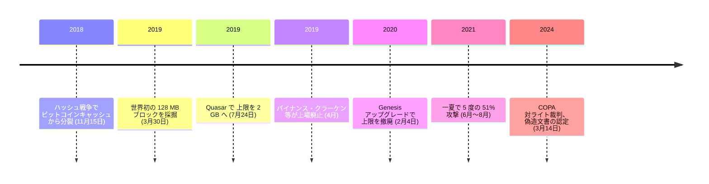

<!-- audit:quote-skip -->
> ビットコインもそろそろ大人になり、プロフェッショナル化すべき時だ。

nChain のソリューション・エンジニアリング部門ディレクター、スティーブ・シャダーズは 2018 年 11 月 23 日にそう語った。[ビットコイン SV がハッシュ戦争でビットコインキャッシュから分裂した](/BitcoinArchive/ja/entries/aftermath/2018-11-15-bitcoin-sv-fork/) 8 日後であり、nChain と CoinGeek が 1 テラバイトのブロックと毎秒 700 万件の取引処理を目指す共同プロジェクトを発表した、まさに同じ日だった。2021 年の夏、身元不明のマイナーが 15 日間で 4 回、ビットコイン SV 自身の取引履歴の一部を書き換えた。同年 8 月の 5 回目の攻撃では約 100 ブロックが再編成され、すでに確定していた 57 万件の取引が巻き戻された。2026 年 7 月下旬時点、CoinGecko が示すビットコイン SV の時価総額はおよそ 2 億 7,400 万ドル、順位は 132 位。2018 年の野心が語った規模には遠く及ばない。

このチェーンは自らの設計を「Satoshi Vision」と呼び、掲げる目的は復元だとする。ブロックサイズの上限を外し、無効化されていたオペコードを復活させ、[クレイグ・ライト](/BitcoinArchive/ja/participants/craig-wright/)と nChain が言う「本来のビットコインプロトコル」を再び動かす、というものだ。だが、その復元が実際に何を引き継いだのか、実際に誰が握っているのか、実際にどう機能してきたのかは、別々の答えを持つ三つの論点である。

## 1. 「オリジナルプロトコルの復元」という設計

nChain は 2018 年 8 月 16 日、ビットコインキャッシュ向けの新しいフルノード実装を発表した。当時 nChain の CEO だったジミー・グエンは、次のように述べている。

<!-- audit:quote-skip -->
> マイナーの要請に応え、nChain はビットコイン SV を支えるために必要な技術力を喜んで提供する。

3 か月後の 11 月 15 日のハッシュ戦争を経て稼働を始めたビットコイン SV は、まずブロックサイズ上限を 32 MB から 128 MB へ引き上げた。カルヴィン・エアの CoinGeek 採掘事業が、当初からこのプロジェクトを支えた。翌 2019 年 3 月 30 日、nChain 系列の BMG プールが世界初となる 128 MB ブロックを採掘した。上限はそこで止まらなかった。2019 年 7 月 24 日の「Quasar」アップグレードで 2 GB へ、2020 年 2 月 4 日の「Genesis」アップグレード (ブロック 620538) で上限そのものが撤廃された。

Genesis で変わったのは数値だけではない。ブロックサイズを制限する合意規則は、削除されたのではなく「マイナーが設定する可変の合意規則」に置き換えられた。取引ごとのスクリプトサイズ・スタックサイズ・非プッシュ演算数を別々に制限していた規則は「スタックメモリ使用量」という単一の規則に統合され、nLockTime と nSequence の挙動は本来の意味へ戻され、OP_RETURN はスクリプトを終了させ最終スタック項目の値で正否を決めるという元の動作に戻った。OP_MUL・OP_LSHIFT・OP_RSHIFT など、過去のビットコインコードで無効化されていたオペコードも復活した。

## 2. 供給・合意形成・初期配分 — 何を引き継いだか

発行上限は 2,100 万単位である。この数字はビットコイン SV 自身が決めたものではない。2017 年 8 月 1 日に[ビットコインから分岐したビットコインキャッシュ](/BitcoinArchive/ja/entries/aftermath/2017-08-01-bitcoin-cash-fork/)がビットコインの上限をそのまま引き継ぎ、2018 年 11 月 15 日の分裂でビットコイン SV がビットコインキャッシュの上限をそのまま引き継いだ。[ビットコインの家系図](/BitcoinArchive/ja/entries/analysis/2008-10-31-bitcoin-fork-and-altcoin-genealogy/)をたどる二度の分岐を経てなお、同じ数字が残っている。

初期配分も同じ経路をたどる。ビットコイン SV は新規に採掘を始めたわけではなく、分裂の瞬間のビットコインキャッシュの残高をそのまま引き継いだ。ビットコインキャッシュ自身も、2017 年 8 月の分裂の瞬間のビットコインの残高を引き継いでいる。プレセールも事前配分もない一方で、誰も保有していない状態から公平に始まったとも言えない。二度のスナップショットを経由した継承である。

合意形成の方式はプルーフ・オブ・ワークで、ハッシュ関数もビットコインと同じ SHA-256d である。ただし難易度調整の細部は異なる。ビットコイン SV (およびビットコインキャッシュ) は 1 回の調整で難易度が最大 100% までしか上がらず、最大 50% までしか下がらない。Bitcoin Core (BTC) は最大 400% まで上がり、最大 75% まで下がる、2016 ブロックごとの調整幅を維持している。「オリジナルプロトコルの復元」を掲げるビットコイン SV は、この一点ではビットコイン自身の難易度調整ではなく、ビットコインキャッシュ由来の規則を採用し続けている。

## 3. ノード開発を握る nChain と、繰り返された 51% 攻撃

ビットコインの参照実装である Bitcoin Core は、単一の企業にもファウンデーションにも属さない貢献者の緩やかな連合が書いている。ビットコイン SV の参照実装は違う。SV Node を書いているのは nChain 1 社であり、クレイグ・ライトはその「チーフサイエンティスト」を名乗る。業界団体の Bitcoin Association (のちの BSV Association) がジミー・グエンを初代会長として発足したが、これも実装そのものを書く主体ではない。

nChain は次世代のノード実装 Teranode で、1 テラバイトのブロックと毎秒 700 万件の取引処理を掲げていた。この記録が扱う他のどのチェーンも自称していない規模の数字である。だが、ビットコイン SV の実際のチェーンが 2021 年に記録したのは、その逆の出来事だった。同年 6 月 24 日、7 月 1 日・6 日・9 日、そして 8 月 3 日、ビットコイン SV は 51% 攻撃による連続した再編成の被害に遭った。8 月 3 日の攻撃では約 100 ブロックが再編成され、57 万件の取引が巻き戻された。その前日、ネットワークのハッシュレートはすでに半分近くまで落ち込んでいた。世界規模の企業利用に耐える処理性能を目指す設計が、自らの取引履歴を書き換えから守れずにいる。

## 4. クレイグ・ライトが語るビットコイン

2019 年 4 月、ライトは匿名の批判者 hodlonaut とポッドキャスト番組の配信者ピーター・マコーマックを、自分をサトシ・ナカモトと認めなければ提訴すると脅した。バイナンスの最高経営責任者チャンポン・ジャオが hodlonaut への支持を表明すると、バイナンス・クラーケン・ShapeShift など複数の取引所が数日のうちにビットコイン SV の上場を廃止した。

同じ月、ライトは Medium に投稿した文章で、Bitcoin Core を参照実装とする通貨 (BTC) についてこう書いている。

<!-- audit:quote-skip -->
> BTC はビットコインを騙っている。あれは偽物のエアドロップ複製だ。

ライトはこの投稿で、2017 年の分岐でルールを変えたのは Bitcoin Core の側であり、「ビットコイン」を名乗る権利を失ったのはむしろ BTC の方だと主張した。同じ論理は、2021 年から起こしていた別の訴訟の土台にもなった。nChain の持株会社 Tulip Trading を通じてライトは Bitcoin Core の開発者 12 名を提訴し、盗まれたと主張する 111,000 BTC の回復に協力しなかった責任を問おうとした。2024 年 3 月にサトシ本人であるとの主張が英国高等法院で退けられた翌月、ライトはこの訴訟を自ら取り下げた。

ライトは 2016 年にもサトシ・ナカモト本人を名乗り、[COPA 対ライトの裁判](/BitcoinArchive/ja/entries/aftermath/2024-03-14-copa-v-wright-ruling/)で偽造文書に基づく主張だと認定されている。経緯は[クレイグ・ライトの人物紹介](/BitcoinArchive/ja/participants/craig-wright/)と[正体仮説のページ](/BitcoinArchive/ja/entries/analysis/2016-05-02-craig-wright-satoshi-identity-hypothesis/)に記録されている。ここで見ているのはその主張の当否ではなく、その主張を掲げた本人が率いるチェーンの設計そのものである。

ビットコイン SV の継承した供給を、ビットコインおよび他 10 通貨と同じ指数チャートで並べる。

<!-- chart: supply-curve-comparison -->

## 5. ビットコインにとっての意味

[ビットコインの「デジタルゴールド」的な地位を支える六つの構造的特徴](/BitcoinArchive/ja/entries/analysis/2008-10-31-bitcoin-digital-gold-structural-features/)は、システムの非中央集権と、人・組織の非中央集権という二つの層に分かれる。ビットコイン SV が引き継いだのは前者の一部、すなわち 2,100 万という上限、プルーフ・オブ・ワーク、過去のオペコードであり、後者はまるごと引き継がなかった。参照実装を書くのは 1 社であり、その 1 社の科学責任者を名乗る人物は、サトシを自称して法廷で退けられた本人である。

だからビットコイン SV は、[複数のオルトコインを横並びで見る比較](/BitcoinArchive/ja/entries/analysis/2026-07-26-altcoin-count-and-design-comparison/)の中でも際立った一行になる。技術的な形をどれだけ精密に複製しても、それを動かす人と組織が単一の企業に一本化されていれば、複製できたのはビットコインに似た数字であって、ビットコインのような統治ではない。2,100 万という上限も、SHA-256d によるプルーフ・オブ・ワークも、ビットコイン SV はビットコインと同じ数字・同じ関数を持っている。持っていないのは、その数字と関数を誰も一存で変えられない、という性質そのものである。132 位という現在の順位が、その欠落だけで説明できるとまでは言えない。ただし欠落そのものは、設計文書ではなく参照実装のリポジトリの所有者欄を見れば足りる。
