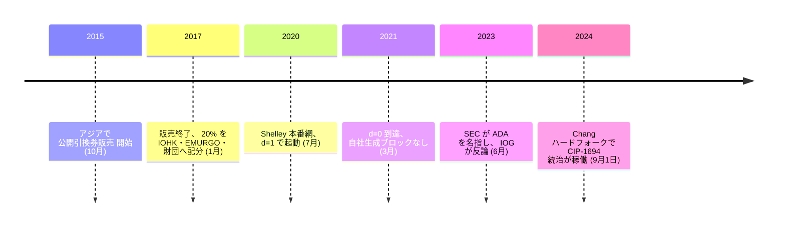

<!-- audit:quote-skip -->
> 暗号通貨にプルーフ・オブ・ステークを使うことは激しく議論される設計判断である。それでも、安全な投票の仕組みを導入でき、規模を拡大する余地が大きく、より風変わりな誘因設計を許すという理由から、我々はこれを採ることにした。

カルダノ自身の設計解説ページが、こう書いている。争いのある選択だと自ら認めたうえで、それでも採ると言い切る書き方は、暗号資産の設計文書としては珍しい。

同じ企画は 2020 年 7 月、その争いのある選択を実装した本番網を公開した。だが最初の 8 か月、ブロックを生成していたのは自社のノードだけだった。

## 設計文書が明かす、ビットコインとの分岐

この設計解説ページは、合意形成の選択に続けて、二つの分岐点も明かしている。一つは構造の分け方だ。

<!-- audit:quote-skip -->
> したがって我々は、価値の会計処理を、その価値がなぜ動いたのかという物語から切り離すという立場を選んだ。

決済層が価値を動かし、別の計算層が契約の論理を走らせる — 会計処理と、その価値が動いた理由という物語を、最初から別の層に置く発想である。

もう一つは識別子の扱いで、ビットコインとの分岐がもっとも意図的で、もっとも徹底している。

<!-- audit:quote-skip -->
> 中央の主体を匿名化し中抜きしようとする過程で、ビットコインとその同時代の設計は、商取引における安定した識別子・付帯情報・評判の必要性まで捨ててしまった。

ビットコインが安定した識別子を持たないことを、迂回すべき不備としてではなく、カルダノが最初から継がないと決めたものとして名指ししている。供給の軸では両者は一致していて、[固定供給と自動調整の比較](/BitcoinArchive/ja/entries/analysis/2008-10-31-fixed-supply-vs-adjustable-money/)はカルダノを上限ありの列、ビットコインと同じ側に置く。分かれているのは合意形成と識別子の側だ。

## 仕組みの中身:Ouroboros とくじ引きによるブロック生成

カルダノの合意形成は Ouroboros と呼ばれる一連のプロトコルの上に成り立つ。2017 年の起動当初は Ouroboros BFT — IOHK が運用する少数の中核ノードが同期的に合意する、連合型の方式だった。分散型に切り替わったのは 2020 年 7 月の Shelley 本番網公開で、ステークの重みに応じて参加者を選ぶ Ouroboros Praos に移っている。この Praos は、査読を経て EUROCRYPT 2018 で発表された学術論文が土台になっている。

仕組みは早見表ではなく、くじ引きに近い。1 秒を単位とする「スロット」が 432,000 個集まって一つの「エポック」になる — 現実の時間ではおよそ 5 日である。各エポックの冒頭、それまでのブロックが積み上げてきた乱数を種として新しい乱数が定まる。ステークプールの運営者は、この乱数と自分の秘密鍵、そして狙うスロットの番号を検証可能ランダム関数 (VRF) に入力する。出てきた値が、自分の保有ステークの割合に応じたしきい値を下回っていれば、そのスロットでブロックを作る権利を得る。ステークが多いほどしきい値も緩くなるので当選しやすくなるが、当選するスロットは事前には誰にも — 本人にすら — わからない。平均するとおよそ 20 秒に一つ、新しいブロックが生まれる。

参加を促す誘因は、もう一つの数字が握っている。「飽和点」と呼ばれる上限で、`k` というパラメーターが決める。あるステークプールが受け取れる報酬は、そのプールへの委託量がこの上限に達するまでしか増えない — 上限を超えて委託しても、報酬は薄まるだけで増えない。

| 時期 | `k` の値 | 一プールあたりの飽和点（目安） |
|---|---|---|
| 2020 年 7 月、Shelley 公開時 | 150 | 約 2 億 1,200 万 ADA |
| 2020 年 12 月 6 日以降 | 500 | 6,400 万 ADA 未満 |
| 2022 年 10 月時点、同じ `k=500` | 500 | 約 7,000 万 ADA |
| 提案中（1,000 への引き上げ） | 1,000 | 約 3,800 万 ADA |

`k` が変わっていないのに飽和点が動いている行に注目してよい。飽和点はおおむね「（供給上限 450 億枚 − 準備金の残り）÷ `k`」で決まる。ステーキング報酬は毎エポック、この準備金から支払われて流通側に回るので、準備金は `k` を動かさなくても年々目減りする。`k=500` のまま飽和点だけが 2020 年末の 6,400 万枚未満から 2022 年の約 7,000 万枚へ動いたのは、この目減りが理由である。`k` そのものを動かした 2020 年 12 月の変更（150 から 500 へ、飽和点は 3 分の 1 以下に）とは、性質の異なる変化だ。

`k` をどこに設定するかは、いまも投票で決まる。誰が投票するのかという問いへの答えが、この設計のもう一つの層になる。

## 供給・配分・統治:数字で見る変化

供給には上限がある。450 億枚で、比較の上ではビットコインと同じ「薄めない」側に立つ。だが上限までの道のりは対照的だった。

2015 年 10 月から 2017 年 1 月にかけて、カルダノはアジアで四段階の公開引換券販売を実施し、販売分の 20% にあたる 5,185,414,108 ADA を IOHK・EMURGO・カルダノ財団の三者に割り当てている。ホスキンソンは 2023 年 11 月、X 上でこう述べた。

<!-- audit:quote-skip -->
> カルダノの ICO は存在しなかった。あったのは配分に向けたエアドロップであり、その後、互いに面識のない何千人もが取引所で ADA を売買し、自分たちの企画にカルダノを使った。

「ICO ではなくエアドロップだった」という言い分の当否は言葉の定義の問題である。配分そのものは争点ではない — 企画の側が自ら公開している数字だ。

合意形成の側でも、最初の一歩は集中から始まった。Shelley 公開直後の 2020 年 7 月、分散度を表す `d` の値は 1、つまり全ブロックが IOG の中核ノードから出ていた。

<!-- audit:quote-skip -->
> d=1 のとき、すべてのブロックは IOG の中核ノードが Ouroboros ビザンチン障害耐性 (OBFT) 方式で生成する。

自社生成ブロックがゼロになる `d=0` に達したのは 2021 年 3 月、8 か月後である。

配分を受けた三者の権限は、その後も長く残った — プロトコルの更新権限そのものを、20% の配分を受けたのと同じ IOHK・EMURGO・カルダノ財団が握っていたからだ。その形が変わるのは 2024 年 9 月 1 日、CIP-1694 と呼ばれる統治の仕組みを導入した Chang ハードフォークによってである。憲法委員会・代理投票者 (dRep)・ステークプール運営者という三つの新しい主体が発足し、三団体が握っていた更新権限はチェーン上の投票へ段階的に移された。投票そのものの土台は、2020 年 9 月に始まったコミュニティ資金配分の投票実験 Project Catalyst にさかのぼる。

## 創設者が語ったビットコイン評

チャールズ・ホスキンソンは、この設計を率いた人物として、ビットコインについて十二年にわたって公の場で語り続けてきた。2018 年 11 月、Bitcoin Magazine の取材でまず出てきたのは留保なしの賛辞だった。

<!-- audit:quote-skip -->
> サトシは完全に魔法のような、素晴らしいことをやってのけた。チューリング賞に値する。驚くべきものだ。

同じ取材で、彼はそこに二つの限界も読み込んでいる。

<!-- audit:quote-skip -->
> これは貨幣ではない。商品、あるいは価値の保存手段だ。

<!-- audit:quote-skip -->
> ビットコインネットワークのハッシュレートを握っているのは、参加者の 10% にも満たない。

後者はカルダノの合意形成の選択を裏づける論点でもある — ハッシュレートが一部の主体に集まるなら、それを置き換えるのは近道ではなく是正になる、という理屈だ。

六年後、2024 年 5 月に公開された録音取材では、評価が反転していた。

<!-- audit:quote-skip -->
> 業界が生き延びるのに、もはやビットコインは必要ない。

<!-- audit:quote-skip -->
> あれは宗教であって、生態系ではない。

この反転が実際にどこまできれいな線を描くかは、[ホスキンソンの人物紹介](/BitcoinArchive/ja/participants/charles-hoskinson/)が詳しく追っている。半年後の同年 11 月、彼はビットコインをインターネットにおける価値の保存手段と呼んでおり、記録はそのまま並べて残されている。

カルダノの供給推移を、ビットコインおよび他 10 通貨と同じ指数チャートで並べる。

<!-- chart: supply-curve-comparison -->

## ビットコインにおける意義

カルダノの設計は、ビットコインが意図的に閉じている問いへの答えの集まりである。合意形成はプルーフ・オブ・ワークではなくくじ引き型のプルーフ・オブ・ステーク、識別子は匿名ではなく任意、更新権限は無名の合意ではなく名指しできる三団体から出発した。合意形成の由来もビットコインのソースコードではなく学術的なプルーフ・オブ・ステーク研究にあり、カルダノは[フォークと隣接通貨の系譜](/BitcoinArchive/ja/entries/analysis/2008-10-31-bitcoin-fork-and-altcoin-genealogy/)がたどる技術的血統の外にある。

それでも、ビットコインへの評はビットコインの歴史の一部になる。ビットコインの合意形成を「参加者の 10% にも満たない」集中と評した同じ設計文書を持つ企画が、自らの起動を `d=1` — 集中の度合いとしては最大値 — から始めている。プルーフ・オブ・ステークとチェーン上の投票が約束したのは集中からの離脱であり、その離脱に実際どれだけの年月がかかったかという記録も、比較の対象としてビットコインの歴史に残る。[六つの構造的特徴](/BitcoinArchive/ja/entries/analysis/2008-10-31-bitcoin-digital-gold-structural-features/)が置く物差しの上で、合意形成の技術とシステムの分散はカルダノも早くから満たしてきた。人と組織の分散だけが、満たすまでに数年を要した。ビットコインの設計が異例なのは、この二つの尺度を最初から同時に満たしていた点にある。
